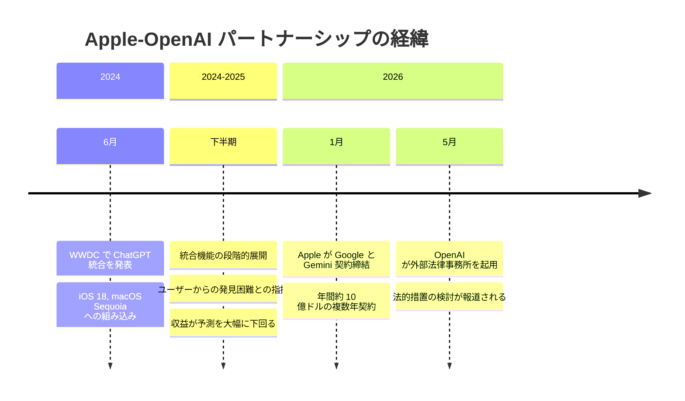

# OpenAI が Apple に対する法的措置を検討 -- ChatGPT 統合契約の不履行を巡り

## メタデータ

| 項目 | 内容 |
|------|------|
| 発表日 | 2026-05-14 |
| ソース | Bloomberg, TechCrunch |
| カテゴリ | 法務 / パートナーシップ |
| 公式リンク | N/A |

## 概要

Bloomberg の報道によると、OpenAI は Apple に対する法的措置を検討している。2024 年 6 月の WWDC で発表された ChatGPT の Apple OS 統合が、期待されたサブスクリプション成長やプラットフォーム上での目立った配置を実現できなかったことが原因である。OpenAI は外部の法律事務所を起用し、法的オプションの評価を進めている。

この動きは、OpenAI と Apple のパートナーシップが事実上破綻したことを示すものであり、2026 年 1 月に Google が Apple の AI パートナーとなった (Gemini モデルに年間約 10 億ドルを支払う複数年契約) ことで、OpenAI の立場がさらに弱体化した背景がある。

## 主な内容

### OpenAI の不満と主張

OpenAI が法的措置を検討する背景には、Apple との統合に関する複数の深刻な問題がある。

- **統合の「埋没」:** ChatGPT の機能がユーザーにとって発見しにくい場所に配置され、アクセスが困難だった
- **収益の大幅な未達:** パートナーシップから得られた収益が予測を大きく下回った
- **期待との乖離:** OpenAI は本契約により数十億ドル規模の新規サブスクリプションの獲得と、OS 上での優先的な配置を期待していた

OpenAI の幹部は Bloomberg に対し、次のように述べている。

> "They basically said, 'OpenAI needs to take a leap of faith and trust us.' It didn't work out well."

(「彼らは基本的に『OpenAI は信頼して飛び込む必要がある』と言った。結果はうまくいかなかった。」)

### 法的オプションの検討

OpenAI が検討している法的手段には以下が含まれる。

- **正式な契約違反通知の送付:** 即座の訴訟提起ではなく、まず正式な通知を送る可能性
- **訴訟提起の時期:** いかなる法的措置も、現在進行中の Elon Musk との裁判が終結した後になる可能性が高い
- **外部法律事務所の起用:** 法的オプションの評価を外部の専門家に委託済み

### Apple 側の反論と不満

Apple 側にも OpenAI に対する不満が存在する。

- **プライバシー基準への懸念:** OpenAI のプライバシー標準が Apple の基準を満たしていないとの指摘
- **ハードウェア事業への警戒:** OpenAI が元 Apple 幹部 (Jony Ive を含む) を起用してハードウェア事業を推進していることへの不満
- **競合関係の深化:** OpenAI のハードウェア参入は Apple の中核事業と直接競合する

### Apple のパートナー関係の歴史

Apple が過去にパートナーとの関係を破綻させた前例は複数存在する。

| 年 | 事例 | 内容 |
|------|------|------|
| 2010 | Adobe Flash | iOS からの Flash 排除、公開書簡で批判 |
| 2012 | Google Maps | Apple Maps への置き換え、品質問題で混乱 |
| 2024-2026 | OpenAI ChatGPT | 統合発表後、Google Gemini に切り替え |

### Google との新たな AI パートナーシップ

2026 年 1 月、Apple は Google と複数年の AI パートナーシップ契約を締結した。

- Apple が年間約 10 億ドルを支払い、Gemini モデルを採用
- OpenAI との関係が事実上終了したことを裏付ける動き
- Apple にとって、Google は検索エンジンの契約 (年間推定 200 億ドル以上) に続く重要なパートナー

### OpenAI を取り巻くその他の緊張関係

Apple との問題に加え、OpenAI は Microsoft との関係にも緊張を抱えている。

- IPO を控え、Microsoft との収益分配構造の見直しが課題
- 独立性の確保と主要パートナーとの関係維持のバランスが求められている

## Apple-OpenAI 関係のタイムライン

## 開発者への影響

### プラットフォーム戦略の不確実性

- **Apple エコシステムでの AI 統合:** OpenAI ベースの機能が Apple デバイスから段階的に削除される可能性があり、開発者は依存関係を見直す必要がある
- **Siri 統合への影響:** ChatGPT を活用した Siri の機能強化が停止または Google Gemini に置き換わる可能性
- **API 依存の見直し:** Apple プラットフォーム向けアプリで OpenAI API を利用している開発者は、ユーザー体験の一貫性を再検討すべき

### パートナーシップリスクの教訓

- **プラットフォーム依存のリスク:** 大手プラットフォーマーとの統合に過度に依存することの危険性が改めて示された
- **契約条件の重要性:** 「信頼して飛び込む」ではなく、配置やプロモーションに関する具体的な契約条件の確保が不可欠
- **マルチプラットフォーム戦略:** 単一のプラットフォームパートナーに依存しない戦略の重要性

### AI 業界の再編

- Google Gemini が Apple エコシステムの標準 AI となることで、開発者のモデル選択に影響
- OpenAI、Google、Apple 間の競争構図が明確化し、各社の API 戦略に変化の可能性

## 関連リンク

- [TechCrunch - OpenAI Exploring Legal Action Against Apple](https://techcrunch.com/)
- [Bloomberg - 原報道](https://www.bloomberg.com/)
- [OpenAI News](https://openai.com/news)
- [Apple WWDC 2024 - ChatGPT 統合発表](https://developer.apple.com/wwdc24/)

## まとめ

OpenAI が Apple に対する法的措置を検討しているという報道は、2024 年 6 月に華々しく発表された ChatGPT の Apple OS 統合が期待通りの成果を上げられなかったことを明確に示している。OpenAI は統合が「埋没」し、数十億ドル規模と見込んだサブスクリプション収益が実現しなかったと主張している。一方、Apple は OpenAI のプライバシー基準への懸念と、元 Apple 幹部を起用したハードウェア事業への不満を抱えている。

2026 年 1 月の Google Gemini 契約により OpenAI の Apple エコシステムにおける立場は事実上消滅し、法的措置は契約違反の正式通知という形をとる可能性が高い。ただし、Musk 裁判の終結を待つ見込みである。本件は、AI 業界におけるプラットフォームパートナーシップの脆弱性と、巨大テック企業間の力学の変動を象徴する出来事として、開発者コミュニティにとっても重要な教訓を含んでいる。
