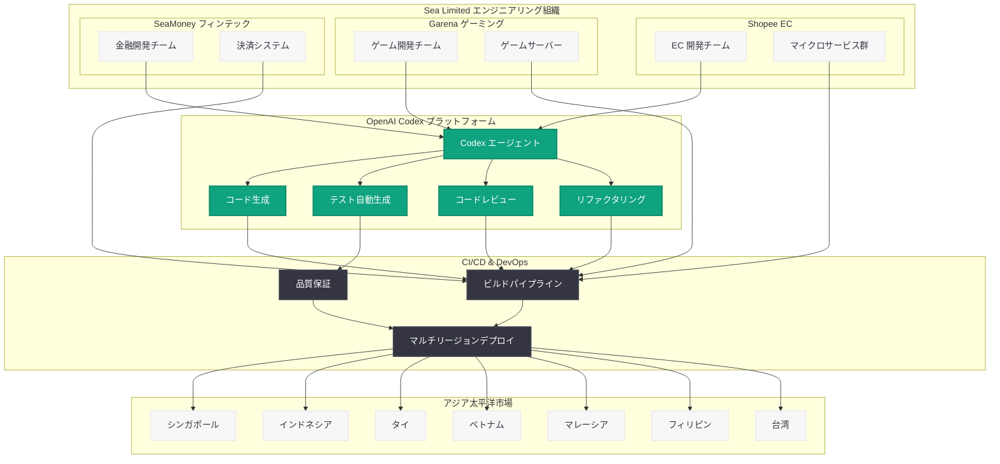

# Sea Limited が Codex でアジアにおけるエージェント型ソフトウェア開発の未来を推進

## メタデータ

| 項目 | 内容 |
|------|------|
| 発表日 | 2026-05-14 |
| ソース | OpenAI News/Blog |
| カテゴリ | Product / Customer Story |
| 公式リンク | [openai.com/index/sea-david-chen](https://openai.com/index/sea-david-chen) |

> **注記:** 本レポートは OpenAI の公式ブログ記事 (URL スラッグ「sea-david-chen」) および Sea Limited の公開情報、RSS フィードの説明文を基に作成している。公式記事ページは Cloudflare の保護により直接アクセスが制限されていたため、利用可能な情報を総合して内容を構成している。正確な詳細については公式記事を参照されたい。

## 概要

Sea Limited の CPO (Chief Product Officer) である David Chen 氏が、同社のエンジニアリングチーム全体に OpenAI の Codex を展開し、AI ネイティブなソフトウェア開発を加速させる戦略について語った。Sea Limited は東南アジア最大級のテクノロジーコングロマリットであり、EC プラットフォーム Shopee、ゲーミング Garena、デジタル金融 SeaMoney を中核事業として展開している。

同社がエンジニアリング組織全体で Codex を採用する決定は、アジア地域におけるエージェント型開発 (Agentic Development) の実践的な大規模導入事例として注目される。Codex が現在 400 万以上の WAU (週間アクティブユーザー) を達成し、グローバル企業への展開を加速させている中で、Sea Limited の事例はアジア太平洋地域におけるエンタープライズ AI 開発の方向性を示すものである。

## 主な内容

### Sea Limited の概要

Sea Limited (NYSE: SE) はシンガポールに本社を置く東南アジア最大級のインターネット企業であり、以下の 3 つの主要事業を展開している。

| 事業 | ブランド | 概要 |
|------|---------|------|
| E コマース | Shopee | 東南アジア・台湾・ブラジルで展開する EC プラットフォーム。月間アクティブユーザー数億人規模 |
| デジタルエンターテインメント | Garena | Free Fire 等のモバイルゲームを展開。世界的なゲーミングパブリッシャー |
| デジタル金融サービス | SeaMoney | モバイル決済、融資、保険等のフィンテックサービス |

Sea Limited は東南アジア 7 カ国以上で事業を展開し、数万人規模のエンジニアを擁する。多言語・多通貨・多規制環境という複雑な運営条件の中で、高速なプロダクト開発が求められるビジネスである。

### Codex 展開戦略

David Chen 氏が語る Codex の展開戦略は、単なるコード補完ツールの導入にとどまらない「エージェント型ソフトウェア開発」への移行を意味する。

**展開の重点領域:**

- **全エンジニアリングチームへの横断的導入:** Shopee、Garena、SeaMoney の各事業部門のエンジニアリングチームに Codex を展開
- **AI ネイティブ開発プロセスの確立:** 既存の開発ワークフローを AI エージェントが自然に介在する形に再設計
- **アジア市場特有の課題への対応:** 多言語対応、ローカライゼーション、地域ごとの規制対応を Codex が支援

### エンジニアリングチームへの影響

Sea Limited の規模を考えると、Codex の全社展開は以下のようなインパクトをもたらすと考えられる。

- **開発速度の向上:** Shopee の頻繁なキャンペーン (独身の日、12.12 セールなど) に対応するための機能開発サイクルを短縮
- **コード品質の統一:** 複数国のチームが関わる分散開発環境において、一貫したコード品質基準を維持
- **オンボーディングの効率化:** 急速に拡大するエンジニアリング組織において、新規参画メンバーの生産性立ち上げを加速
- **技術的負債の解消:** 大規模コードベースのリファクタリングやテスト生成を Codex が自動化

### アジアにおけるエージェント型開発のビジョン

Sea Limited の取り組みは、アジア太平洋地域における AI ネイティブ開発の先行事例として位置づけられる。

- **多言語環境での AI 活用:** 英語、中国語、タイ語、ベトナム語、インドネシア語など多言語コードベースでの Codex 活用
- **規制対応の自動化:** 各国の決済規制やデータプライバシー法への準拠コードを Codex が支援
- **エコシステム全体の AI 化:** EC、ゲーミング、フィンテックという異なるドメインを横断する AI 開発基盤の構築
- **アジアのテック人材への波及効果:** Sea Limited の成功事例が地域の他テック企業に対する導入参考モデルとなる

## 技術的な詳細

### Codex と Sea Limited の開発ワークフロー統合

Sea Limited のような大規模マルチプロダクト企業では、Codex は以下のような形で開発ワークフローに統合されると考えられる。

**1. マイクロサービスアーキテクチャでの活用:**

Shopee のような大規模 EC プラットフォームは数百のマイクロサービスで構成されている。Codex はサービス間の連携コード生成、API 仕様に基づくスタブ作成、テストケースの自動生成を担う。

**2. モバイルファースト開発の加速:**

東南アジアはモバイルファースト市場であり、Shopee や SeaMoney のモバイルアプリ開発において Codex が UI コンポーネント生成やプラットフォーム間の共通化を支援する。

**3. リアルタイムシステムの保守:**

Garena のオンラインゲームや Shopee のリアルタイム価格エンジンなど、低レイテンシーが求められるシステムの開発・保守を Codex が支援する。

### コードサンプル

```python
from openai import OpenAI

client = OpenAI()

# Sea Limited のマルチリージョン EC 開発における Codex 活用例
# Shopee の決済モジュールにおけるローカライゼーション対応
response = client.chat.completions.create(
    model="codex-1",
    messages=[
        {
            "role": "system",
            "content": (
                "You are a coding agent for a Southeast Asian e-commerce platform. "
                "Generate payment integration code that handles multiple currencies "
                "(SGD, IDR, THB, VND, MYR, PHP, TWD) and complies with local "
                "regulations for each market."
            )
        },
        {
            "role": "user",
            "content": (
                "Create a payment validation module for the Indonesian market "
                "that complies with Bank Indonesia's QRIS standard and "
                "integrates with our existing SeaMoney wallet API."
            )
        }
    ],
    temperature=0.2,
)
```

```python
# Codex タスクによる自動テスト生成の例
response = client.responses.create(
    model="codex-1",
    input="Generate comprehensive unit tests for the Shopee cart service "
          "that covers multi-seller checkout, cross-border shipping calculation, "
          "and voucher stacking logic across 7 Southeast Asian markets.",
    tools=[
        {
            "type": "codex",
            "sandbox": {
                "environment": "sea-dev-sandbox",
                "languages": ["python", "java", "go"],
            }
        }
    ],
)
```

## アーキテクチャ



## 開発者への影響

Sea Limited による Codex の全社展開は、アジアの開発者コミュニティに対して以下の影響を与える。

- **エージェント型開発の標準化:** Sea Limited クラスの大企業が Codex を標準ツールとして採用することで、アジア地域におけるエージェント型開発がデファクトスタンダードとして普及する可能性が高まる
- **多言語・多市場対応のベストプラクティス:** 東南アジア特有の多言語・多通貨環境での Codex 活用パターンが確立され、同地域の他企業が参照可能なモデルとなる
- **スキルシフトの加速:** エンジニアの役割が「コードを書く人」から「AI エージェントを指揮する人」へとシフトする流れが、アジアのテック企業全体に波及する
- **フィンテック規制対応の効率化:** SeaMoney での活用事例は、各国固有の金融規制に対応するコード生成の自動化モデルとして、アジアのフィンテック企業にとって参考になる
- **大規模 EC プラットフォーム開発の高速化:** Shopee のようなハイパースケール EC プラットフォームでの成功は、同規模の EC 企業 (Lazada、Tokopedia 等) にとっての導入判断材料となる
- **ゲーム開発における AI 活用:** Garena での Codex 活用は、リアルタイム性が求められるゲーム開発ドメインにおける AI コーディングエージェントの適用可能性を示す

## 関連リンク

- [Sea Limited CPO David Chen インタビュー (OpenAI 公式)](https://openai.com/index/sea-david-chen)
- [OpenAI Codex](https://openai.com/codex)
- [Codex のエンタープライズ展開](https://openai.com/index/scaling-codex-to-enterprises-worldwide/)
- [OpenAI API ドキュメント](https://platform.openai.com/docs)
- [Sea Limited 公式サイト](https://www.sea.com/)

## まとめ

Sea Limited の CPO David Chen 氏による本記事は、東南アジア最大級のテクノロジー企業が OpenAI Codex を全エンジニアリング組織に展開し、AI ネイティブなソフトウェア開発体制を構築する戦略を明らかにした。Shopee (EC)、Garena (ゲーミング)、SeaMoney (フィンテック) という異なるドメインの開発チームが横断的に Codex を活用することで、多言語・多市場・多規制という東南アジア特有の複雑性に対応しながら開発速度を向上させる取り組みである。

Codex が 400 万 WAU を超えてグローバル企業への浸透を加速させる中で、Sea Limited の事例はアジア太平洋地域におけるエージェント型開発の大規模実践モデルとして重要な意味を持つ。今後、同地域の他のテック企業が同様のアプローチを採用する流れが加速することが予想される。
