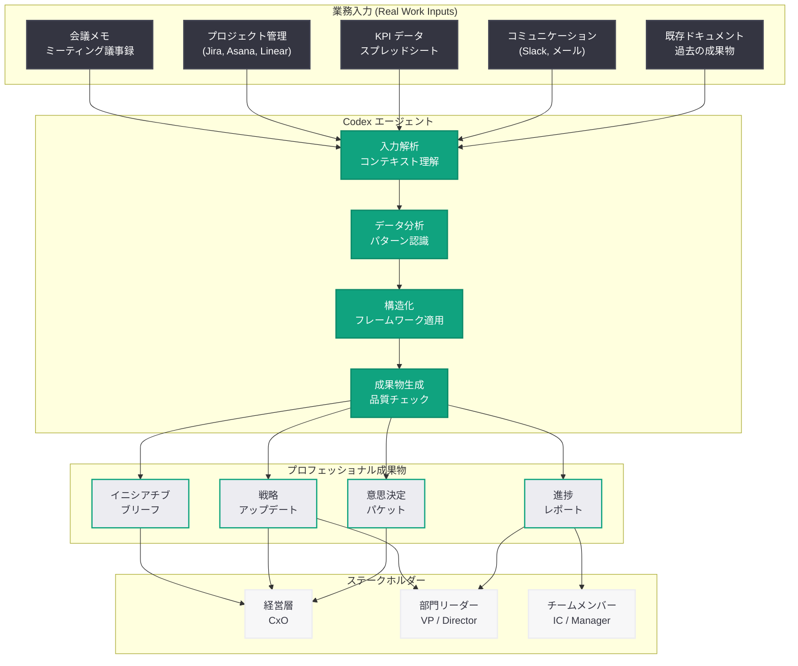

# ビジネスオペレーションチームによる Codex 活用ガイド: OpenAI Academy が実務ワークフロー変革の実践手法を公開

## メタデータ

| 項目 | 内容 |
|------|------|
| 発表日 | 2026-05-15 |
| ソース | OpenAI News |
| カテゴリ | OpenAI Academy / ビジネスオペレーション |
| 公式リンク | [openai.com/academy/codex-for-work/how-business-operations-teams-use-codex](https://openai.com/academy/codex-for-work/how-business-operations-teams-use-codex) |

## 概要

OpenAI は 2026 年 5 月 15 日、OpenAI Academy の「Codex for Work」シリーズにおいて、ビジネスオペレーションチームが Codex を活用する方法を解説する実践ガイドを公開した。本ガイドは、イニシアチブブリーフ (施策概要書) の作成、戦略アップデートの生成、リーダーシップ意思決定パケットの構築、進捗レポートの作成など、ビジネスオペレーション部門が日常的に手掛ける中核業務を Codex で効率化する具体的な方法を示している。

本ガイドの特徴は、実際の業務入力データ (会議メモ、プロジェクトデータ、KPI スプレッドシート、Slack 会話など) を Codex に与え、プロフェッショナルな成果物へと変換するワークフローを詳述している点にある。Codex がコーディングツールとしてだけでなく、ナレッジワーク全般を支援するエージェントとして活用できることを実証するガイドであり、「Codex for Work」シリーズの一環として、財務チーム向けガイド (5 月 12 日公開) に続く職種別実践シリーズとなっている。

## 主な内容

### イニシアチブブリーフ (施策概要書) の作成

ビジネスオペレーションチームがプロジェクトや施策を立ち上げる際、ステークホルダーに対して施策の目的、範囲、期待される成果を伝える「イニシアチブブリーフ」の作成は不可欠である。従来、この作業には以下のプロセスが必要であった。

- 複数の関係者からの情報収集とヒアリング
- 戦略目標との整合性の確認
- 予算・リソース見積もりの作成
- タイムラインとマイルストーンの設定
- リスク評価と緩和策の策定

Codex を活用することで、プロジェクトキックオフ会議のメモ、関連するメールスレッド、過去の類似施策のドキュメントなどの「生の業務入力」を提供するだけで、構造化されたイニシアチブブリーフを自動生成できる。具体的には以下の要素が自動的に整理される。

- **目的と背景**: ビジネス課題の簡潔な記述
- **スコープ定義**: 施策の範囲と境界の明確化
- **成功指標 (KPI)**: 定量的な目標設定
- **ステークホルダーマッピング**: 関係者とその役割
- **リソース要件**: 人員、予算、ツールの概算
- **リスクと依存関係**: 主要リスクの特定

#### プロンプト例

```
以下のキックオフ会議メモと過去の類似プロジェクトデータから、
経営陣向けのイニシアチブブリーフを作成してください。

含めるべき要素:
- エグゼクティブサマリー (3 行以内)
- 戦略的背景と課題定義
- 提案するソリューションの概要
- 期待される ROI と成功指標
- 主要マイルストーン (四半期ごと)
- リスクアセスメント (高・中・低)
- 必要リソースの概算

[会議メモ、プロジェクトデータをここに貼り付け]
```

### 戦略アップデートの生成

四半期ごとの戦略レビューや月次のステータスレポートにおいて、部門の戦略的進捗を経営層に伝える「戦略アップデート」の作成は、ビジネスオペレーションチームの主要な責務である。Codex はこのプロセスを以下のように変革する。

- **データ集約**: 複数のツール (Jira、Asana、Salesforce、Google Sheets など) から散在するデータを統合的に分析
- **ナラティブ構築**: 数値データから戦略的なストーリーラインを自動構築
- **比較分析**: 計画 vs 実績の差異を自動計算し、要因を分析
- **アクションアイテム抽出**: 次の四半期に向けた優先事項を自動提案

戦略アップデートの出力には、経営層が意思決定に必要とする以下のセクションが含まれる。

1. **エグゼクティブサマリー**: 全体状況の 3 行要約
2. **戦略目標の進捗状況**: OKR / KPI ごとの達成率
3. **主要な成果とハイライト**: 当期に達成した重要事項
4. **課題とリスク**: 未解決の問題と対応策
5. **次のステップ**: 来期の重点施策

### リーダーシップ意思決定パケットの構築

経営会議やリーダーシップチームへの意思決定資料 (Decision Packet) は、複数の選択肢をデータに基づいて比較し、推奨案を提示するための高度なドキュメントである。Codex を活用したリーダーシップ意思決定パケットの作成ワークフローは以下の通りである。

1. **課題の構造化**: 意思決定が必要な課題を明確に定義
2. **選択肢の整理**: 3-5 の選択肢を、それぞれのメリット・デメリットとともに提示
3. **データによる裏付け**: 各選択肢を支持するデータポイントの収集と分析
4. **影響分析**: 各選択肢が財務、人員、スケジュール、リスクに与える影響の比較
5. **推奨案の提示**: データに基づく推奨案と、その根拠の説明

Codex は、過去の意思決定事例、市場データ、社内パフォーマンスデータなどを入力として受け取り、経営層が 30 分以内で判断できる簡潔かつ網羅的なパケットを生成する。

#### プロンプト例

```
以下のデータと背景情報から、リーダーシップチーム向けの
意思決定パケットを作成してください。

決定事項: [具体的な意思決定テーマ]

含めるべき要素:
- 背景と緊急性
- 3 つの選択肢 (推奨、代替案 A、代替案 B)
- 各選択肢のコスト・ベネフィット分析
- リスクマトリクス
- 推奨案とその根拠
- 意思決定後の実行計画

[関連データ、調査結果、ステークホルダーフィードバックを添付]
```

### 進捗レポート (プログレスアップデート) の作成

週次・月次の進捗レポートは、プロジェクトの健全性を可視化し、早期にリスクを検知するための重要なコミュニケーションツールである。Codex による進捗レポート作成は、以下の業務入力から自動的にプロフェッショナルなレポートを生成する。

**入力データの例:**
- プロジェクト管理ツール (Jira、Linear、Asana) のタスクステータス
- チームメンバーからの Slack メッセージや週報
- スプリントのバーンダウンデータ
- ミーティングノート
- ブロッカーや課題の記録

**出力されるレポートの構成:**
- **信号灯 (RAG ステータス)**: 赤・黄・緑での全体評価
- **完了項目**: 今週達成したタスクのリスト
- **進行中の項目**: 現在取り組んでいるタスクと進捗率
- **ブロッカー**: 進行を妨げている課題と必要な対応
- **翌週の計画**: 来週のフォーカスエリアと目標
- **メトリクス**: 主要指標の推移グラフ

## 技術的な詳細

### Codex による業務入力の処理フロー

Codex がビジネスオペレーションの実務データを処理し、プロフェッショナルな成果物に変換するプロセスは、以下のステップで構成される。

1. **入力の取り込み**: 非構造化データ (会議メモ、Slack 会話、メール) と構造化データ (スプレッドシート、プロジェクト管理ツールのエクスポート) を受け取る
2. **コンテキスト理解**: 組織の戦略目標、過去のドキュメント、業界標準のフレームワークを踏まえて入力を解析
3. **構造化と整理**: 散在する情報を論理的な構造に再編成
4. **コード生成と実行**: データ分析、チャート生成、計算などを Python コードとして自動実行
5. **ドキュメント生成**: テンプレートに基づいた最終成果物の生成
6. **品質チェック**: 数値の整合性、論理の一貫性を自動検証

### ワークフローアーキテクチャ



### コードサンプル: Codex API を使用した戦略アップデートの自動生成

```python
from openai import OpenAI
from pathlib import Path

client = OpenAI()


def generate_strategy_update(
    okr_data: str,
    project_status: str,
    meeting_notes: str,
    quarter: str
) -> str:
    """Codex を使用して四半期戦略アップデートを自動生成する"""

    response = client.responses.create(
        model="codex",
        instructions="""あなたは経験豊富なビジネスオペレーションマネージャーです。
        提供されたデータから、経営陣向けの四半期戦略アップデートを作成してください。

        レポートには以下を含めること:
        - エグゼクティブサマリー (3 行以内)
        - OKR 進捗ダッシュボード (達成率をパーセンテージで)
        - 主要な成果とハイライト (Top 3)
        - 課題とリスク (RAG ステータス付き)
        - 次四半期の重点施策
        - リソース要件の変更点

        出力形式: Markdown
        トーン: プロフェッショナルかつ簡潔""",
        input=f"""対象四半期: {quarter}

OKR データ:
{okr_data}

プロジェクトステータス:
{project_status}

直近の会議メモ:
{meeting_notes}""",
        tools=[
            {
                "type": "code_interpreter"
            }
        ]
    )

    return response.output_text


def generate_decision_packet(
    topic: str,
    background_data: str,
    options: list[str],
    constraints: str
) -> str:
    """リーダーシップ意思決定パケットを自動生成する"""

    options_text = "\n".join(
        [f"- 選択肢 {i+1}: {opt}" for i, opt in enumerate(options)]
    )

    response = client.responses.create(
        model="codex",
        instructions="""あなたは戦略コンサルタントです。
        経営チームが 30 分以内に意思決定できる形式で
        Decision Packet を作成してください。

        含めるべき要素:
        1. 意思決定の背景と緊急性 (1 段落)
        2. 各選択肢の詳細分析
           - 予想コスト (概算)
           - 予想ベネフィット
           - 実行リスク (高/中/低)
           - 実行期間
        3. 比較マトリクス (表形式)
        4. 推奨案と根拠
        5. 意思決定後の実行計画 (30-60-90 日)

        出力形式: Markdown""",
        input=f"""決定事項: {topic}

背景データ:
{background_data}

検討中の選択肢:
{options_text}

制約条件:
{constraints}""",
        tools=[
            {
                "type": "code_interpreter"
            }
        ]
    )

    return response.output_text


# 使用例
if __name__ == "__main__":
    # 戦略アップデートの生成
    update = generate_strategy_update(
        okr_data="O1: 顧客満足度向上 - KR1: NPS +10pt (現在 +7pt, 70%達成)",
        project_status="プロジェクト A: 順調 / プロジェクト B: 1 週間遅延",
        meeting_notes="CTO から技術負債の解消を優先すべきとのフィードバックあり",
        quarter="2026 Q2"
    )
    Path("output/strategy_update_2026q2.md").write_text(update)

    # 意思決定パケットの生成
    packet = generate_decision_packet(
        topic="新規 CRM ツールの選定",
        background_data="現行 CRM の契約が Q3 末に満了。更新料 20% 増の通知あり。",
        options=["現行 CRM を更新", "Salesforce に移行", "HubSpot に移行"],
        constraints="予算上限 500 万円/年、移行期間 3 ヶ月以内"
    )
    Path("output/decision_packet_crm.md").write_text(packet)
```

### API パラメータの詳細

| パラメータ | 説明 | 推奨値 |
|-----------|------|--------|
| `model` | 使用するモデル | `codex` |
| `instructions` | ロールとタスクの詳細指示 | ビジネスオペレーションドメイン固有の指示を含める |
| `tools` | 使用するツール | `code_interpreter` を含める (データ分析時) |
| `input` | 入力データ | 会議メモ、KPI データ、プロジェクトステータスなど |

## 開発者への影響

### Codex のナレッジワーク領域への拡大

本ガイドは、Codex が「コーディングエージェント」から「ナレッジワーク全般を支援する AI エージェント」へと進化していることを明確に示している。ビジネスオペレーションは、コードを書くことが主たる業務ではない職種でありながら、Codex のデータ処理能力、構造化能力、コード実行能力が日常業務に直接適用できることが示された。

### BizOps ツール開発者への機会

- **SaaS プロダクトへの統合**: プロジェクト管理ツールや BizOps プラットフォームの開発者は、Codex API を統合することで、「データを入れるだけで経営レポートが自動生成される」機能をエンドユーザーに提供できる
- **カスタムワークフローの構築**: 各企業固有のレポーティングフォーマットや意思決定プロセスに合わせたカスタムスキル・プラグインの開発需要が増加する
- **自動化パイプラインの設計**: Codex Automations と組み合わせることで、週次・月次レポートの完全自動化パイプラインを構築できる

### ビジネスオペレーションチームへの直接的な影響

- **作業時間の大幅削減**: イニシアチブブリーフの作成に従来 2-3 日要していたものが数時間に、週次進捗レポートが数時間から数分に短縮される可能性がある
- **品質の均質化**: テンプレートとプロンプトの標準化により、チームメンバーの経験値に依存しない一定品質のドキュメント生成が可能になる
- **戦略的業務へのシフト**: ドキュメント作成という「手作業」から解放されることで、データの解釈、戦略立案、ステークホルダーとのコミュニケーションといった高付加価値業務に集中できる

### 「Codex for Work」シリーズの戦略的意義

本ガイドは、5 月 12 日に公開された「How finance teams use Codex」に続く職種別ガイドの第 2 弾であり、OpenAI が Codex の適用領域を体系的に拡大していることを示している。今後、人事、マーケティング、法務、カスタマーサクセスなど、さらなる職種別ガイドの公開が見込まれる。この動きは、Codex のユーザーベースをエンジニア以外のナレッジワーカーへと拡大する戦略の一環である。

## 関連リンク

- [How business operations teams use Codex (公式)](https://openai.com/academy/codex-for-work/how-business-operations-teams-use-codex)
- [How finance teams use Codex](https://openai.com/academy/how-finance-teams-use-codex)
- [OpenAI Academy トップページ](https://openai.com/academy)
- [OpenAI Codex 公式ドキュメント](https://platform.openai.com/docs/guides/codex)
- [OpenAI API リファレンス](https://platform.openai.com/docs/api-reference)
- [関連レポート: Codex で変わる経理・財務チームの業務 (2026-05-12)](2026-05-12-codex-for-finance-teams.md)
- [関連レポート: Codex Academy 包括的入門ガイド (2026-04-23)](2026-04-23-codex-academy-guides.md)
- [関連レポート: Codex が「ほぼ万能」のスーパーアプリに進化 (2026-04-16)](2026-04-16-codex-for-almost-everything.md)

## まとめ

OpenAI Academy の「Codex for Work」シリーズとして公開された本ガイドは、ビジネスオペレーションチームが Codex を活用してイニシアチブブリーフ、戦略アップデート、リーダーシップ意思決定パケット、進捗レポートを効率的に作成する方法を具体的に示している。従来、これらの業務は散在する情報の収集・整理・構造化に多大な時間を要していたが、Codex に実際の業務入力データを与えるだけでプロフェッショナルな成果物を生成できるようになることが示された。

本ガイドの最大の意義は、Codex がコーディングツールの枠を超え、ナレッジワーク全般を変革するプラットフォームとして位置づけられていることにある。ビジネスオペレーションという非エンジニア職種への適用は、Codex のユーザーベース拡大と企業における AI 活用の民主化を加速するものであり、今後の職種別ガイド拡充とあわせて、Codex エコシステムの成熟を示す重要なマイルストーンと言える。
