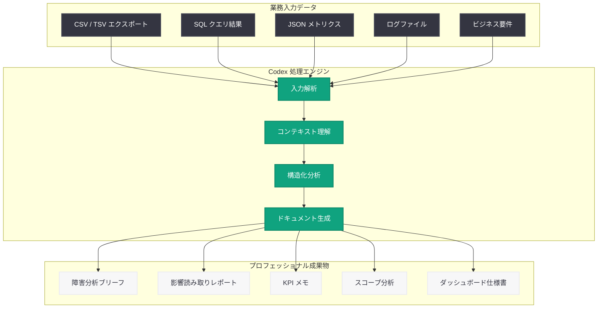

# データサイエンスチームによる Codex 活用方法

## メタデータ

| 項目 | 内容 |
|------|------|
| 発表日 | 2026-05-15 |
| ソース | OpenAI News |
| カテゴリ | OpenAI Academy / データサイエンス |
| 公式リンク | [openai.com/academy/codex-for-work/how-data-science-teams-use-codex](https://openai.com/academy/codex-for-work/how-data-science-teams-use-codex) |

## 概要

OpenAI は「Codex for Work」シリーズの一環として、データサイエンスチームが Codex を活用して業務ドキュメントや分析レポートを自動生成する方法を公開した。本ガイドでは、障害分析ブリーフ、影響読み取りレポート、KPI メモ、スコープ分析、ダッシュボード仕様書の 5 つのユースケースを、実際の業務入力データから作成する具体的なワークフローを解説している。

データサイエンスチームは日常的に、データエクスポート、SQL クエリ結果、メトリクス集計といった「生の業務入力」をプロフェッショナルな成果物に変換する作業に多くの時間を費やしている。Codex はこのプロセスを自動化し、データサイエンティストが分析そのものに集中できる環境を実現する。OpenAI Academy のガイドとして、具体的なプロンプト設計と入力形式のベストプラクティスが示されている。

## 主な内容

### 障害分析ブリーフ (Root-Cause Briefs)

障害分析ブリーフは、システム障害やパフォーマンス低下の根本原因を特定し、関係者に共有するためのドキュメントである。Codex を活用することで、以下のプロセスが自動化される。

- **入力データ**: アラートログ、メトリクスの時系列データ、デプロイメント履歴、エラーレート推移
- **出力**: 構造化された障害タイムライン、根本原因の仮説と検証結果、再発防止策の提案
- **活用シーン**: インシデント発生後のポストモーテム作成、ステークホルダーへの迅速な状況報告

Codex はログデータとメトリクスの相関関係を分析し、時系列に沿った因果関係を明確にした障害分析ブリーフを生成する。人間のデータサイエンティストが数時間かけていた分析作業を、構造化された入力から数分で完了できる。

### 影響読み取りレポート (Impact Readouts)

影響読み取りレポートは、施策やリリースの影響を定量的に評価するドキュメントである。

- **入力データ**: A/B テスト結果、前後比較のメトリクス、ユーザーセグメント別データ、統計的検定結果
- **出力**: 施策の効果サマリー、統計的有意性の評価、ビジネスインパクトの定量化、推奨アクション
- **活用シーン**: 新機能リリース後のインパクト評価、経営層への報告資料作成

Codex は統計的検定の結果を解釈し、技術的な詳細とビジネス的な意味合いの両方を含むバランスの取れたレポートを生成する。効果量、信頼区間、サンプルサイズの妥当性といった技術的側面も自動的に評価される。

### KPI メモ (KPI Memos)

KPI メモは、主要業績評価指標の状況を簡潔にまとめた定期報告ドキュメントである。

- **入力データ**: ダッシュボードのメトリクスエクスポート、目標値と実績値、トレンドデータ、前期比較データ
- **出力**: KPI の達成状況サマリー、トレンド分析、異常値の検出と解説、次期アクション項目
- **活用シーン**: 週次/月次の経営報告、チーム間の進捗共有、四半期レビュー

Codex はメトリクスデータを読み込み、目標に対する進捗状況を自動的に評価する。単なる数値の羅列ではなく、トレンドの変化点や異常値を検出し、その背景にある要因まで推察したメモを生成する。

### スコープ分析 (Scoped Analyses)

スコープ分析は、特定の問題や仮説に焦点を当てた深掘り分析ドキュメントである。

- **入力データ**: SQL クエリ結果、データフレームのエクスポート、分析対象の仮説定義、コンテキスト情報
- **出力**: 分析フレームワークの設計、データの探索的分析結果、仮説の検証結論、限界事項と次のステップ
- **活用シーン**: アドホックな分析依頼への対応、仮説検証の文書化、分析結果の再現性確保

Codex はデータの構造と分析目的を理解し、適切な分析手法を選択してスコープの明確な分析レポートを生成する。分析の前提条件、方法論、限界事項を明示することで、結果の信頼性と再現性を担保する。

### ダッシュボード仕様書 (Dashboard Specs)

ダッシュボード仕様書は、新しいダッシュボードの設計・実装に必要な要件を定義するドキュメントである。

- **入力データ**: ビジネス要件、データソース一覧、既存クエリ、ユーザーペルソナ、表示メトリクスのリスト
- **出力**: ダッシュボードレイアウト設計、データモデル定義、クエリ仕様、フィルター・ドリルダウン要件、更新頻度の定義
- **活用シーン**: 新規ダッシュボード構築プロジェクト、既存ダッシュボードのリファクタリング、データ可視化チームへの引き渡し

Codex はビジネス要件とデータソースの情報から、実装可能な粒度のダッシュボード仕様書を生成する。メトリクスの計算ロジック、データ更新頻度、パフォーマンス要件まで含めた包括的な仕様を定義する。

## 技術的な詳細

### Codex によるデータ入力の処理フロー

Codex は、データサイエンスチームが日常的に扱うさまざまな形式の入力データを受け取り、構造化されたプロフェッショナルな成果物に変換する。この変換プロセスは以下の段階で進行する。

1. **入力の解析**: CSV エクスポート、SQL クエリ結果、JSON メトリクス、ログファイルなどの生データを解析
2. **コンテキストの理解**: ビジネスコンテキスト、分析目的、対象オーディエンスを把握
3. **構造化と分析**: データのパターン、異常値、トレンドを識別し、適切な分析フレームワークを適用
4. **成果物の生成**: 対象読者に合わせた適切な粒度と形式でドキュメントを生成

### 対応する入力形式

| 入力形式 | 用途 | 出力例 |
|----------|------|--------|
| CSV / TSV エクスポート | メトリクス集計、時系列データ | KPI メモ、影響レポート |
| SQL クエリ結果 | アドホック分析、データ探索 | スコープ分析 |
| JSON メトリクス | API レスポンス、監視データ | 障害分析ブリーフ |
| ログファイル | インシデント調査 | 障害分析ブリーフ |
| ダッシュボード定義 | 可視化要件 | ダッシュボード仕様書 |

### プロンプト設計のベストプラクティス

効果的な Codex 活用のために、以下のプロンプト設計パターンが推奨される。

```
# プロンプト構造の例

## コンテキスト
- チーム: [データサイエンスチーム名]
- 対象読者: [経営層 / エンジニアリング / プロダクト]
- 目的: [分析の目的]

## 入力データ
[データエクスポート、クエリ結果、メトリクスを貼り付け]

## 出力要件
- 形式: [障害分析ブリーフ / 影響レポート / KPI メモ / スコープ分析 / ダッシュボード仕様書]
- 詳細度: [エグゼクティブサマリー / 技術詳細]
- 含めるべき要素: [統計的検定 / 可視化提案 / アクション項目]
```

## アーキテクチャ



## 開発者への影響

### データサイエンスワークフローの変革

Codex をデータサイエンスワークフローに組み込むことで、以下のような変革が期待される。

- **ドキュメント作成時間の大幅削減**: 分析結果の文書化に費やしていた時間を、分析そのものの質の向上に再配分できる
- **成果物の品質標準化**: チームメンバーのスキルレベルに依存しない、一貫した品質のドキュメントが生成される
- **分析の再現性向上**: 入力データと出力の関係が明確に定義されるため、分析プロセスの再現性が向上する
- **ステークホルダーコミュニケーションの改善**: 対象読者に合わせた適切な粒度のレポートを迅速に作成できる

### チーム構成への影響

- **ジュニアデータサイエンティストの生産性向上**: 経験が浅いメンバーでも、シニアレベルの品質を持つ分析レポートを作成可能になる
- **シニアメンバーのレバレッジ拡大**: ドキュメント作成の負担が軽減され、より高度な分析や戦略的な業務に時間を投入できる
- **クロスファンクショナルな連携強化**: エンジニアリング、プロダクト、経営層それぞれに最適化されたレポートを効率的に作成できる

### 導入時の考慮事項

- Codex が生成する分析結果は必ず人間のレビューを経てから共有すべきである
- 機密性の高いデータを入力する際は、組織のデータガバナンスポリシーに準拠する必要がある
- 生成されたレポートの統計的結論については、ドメイン専門家による妥当性確認が推奨される

## 関連リンク

- [Codex for Work シリーズ](https://openai.com/academy/codex-for-work)
- [OpenAI Academy](https://openai.com/academy)
- [OpenAI Codex](https://openai.com/codex)
- [Codex for Finance Teams](https://openai.com/academy/codex-for-work/how-finance-teams-use-codex)

## まとめ

OpenAI Academy の「Codex for Work」シリーズにおける本ガイドは、データサイエンスチームが Codex を活用して業務効率を飛躍的に向上させる具体的な方法を示している。障害分析ブリーフ、影響読み取りレポート、KPI メモ、スコープ分析、ダッシュボード仕様書という 5 つの主要な成果物について、実際の業務入力データからプロフェッショナルなドキュメントを自動生成するワークフローが解説されている。

データサイエンスチームにとって最大のメリットは、分析結果のドキュメント化という付随的な作業から解放され、データ分析そのものの質と深度の向上に集中できる点である。Codex は単なる文書生成ツールにとどまらず、データの構造を理解し、適切な分析フレームワークを適用し、対象読者に合わせた成果物を生成する包括的な分析支援エージェントとして機能する。組織全体の意思決定速度と品質の向上に貢献する実践的なガイドとして、データサイエンスチームの必読コンテンツである。
