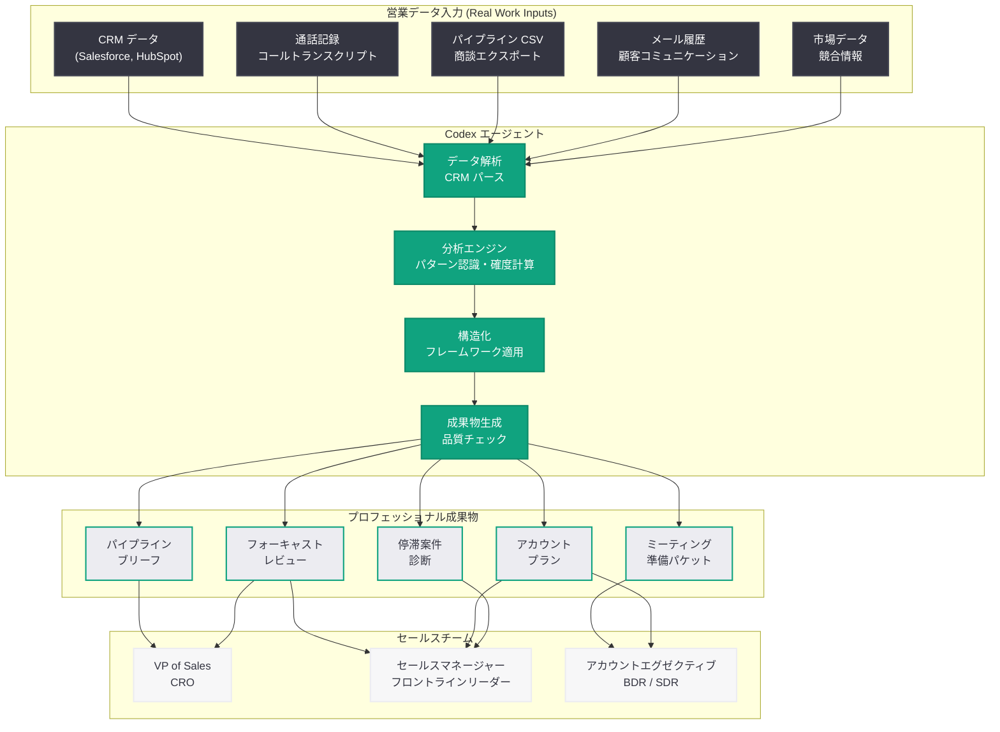

# セールスチームによる Codex 活用ガイド: OpenAI Academy が営業ワークフロー変革の実践手法を公開

## メタデータ

| 項目 | 内容 |
|------|------|
| 発表日 | 2026-05-15 |
| ソース | OpenAI News |
| カテゴリ | OpenAI Academy / セールス |
| 公式リンク | [openai.com/academy/codex-for-work/how-sales-teams-use-codex](https://openai.com/academy/codex-for-work/how-sales-teams-use-codex) |

## 概要

OpenAI は 2026 年 5 月 15 日、OpenAI Academy の「Codex for Work」シリーズにおいて、セールスチームが Codex を活用する方法を解説する実践ガイドを公開した。本ガイドは、パイプラインブリーフの作成、ミーティング準備パケットの生成、フォーキャスト・レビューの構築、アカウントプランの策定、停滞案件診断の実施という 5 つの主要ユースケースについて、実際の業務入力データ (Salesforce エクスポート、通話トランスクリプト、パイプライン CSV など) から専門的な成果物を自動生成する方法を具体的に解説している。

本ガイドの特徴は、セールスプロフェッショナルが日常的に扱う CRM データ、コールノート、商談履歴などの「生の業務入力」を Codex に与えることで、従来は数時間を要していたレポーティングや分析作業を数分に短縮できる点にある。「Codex for Work」シリーズの一環として、ファイナンスチーム向け (5 月 12 日)、ビジネスオペレーション向け (5 月 15 日)、データサイエンス向け (5 月 15 日) に続く職種別実践シリーズの重要な構成要素となっている。

## 主な内容

### パイプラインブリーフ (Pipeline Briefs) の作成

パイプラインブリーフは、営業パイプラインの現状を経営層やセールスリーダーに対して簡潔に報告するための文書である。従来、この作業には以下のプロセスが必要であった。

- Salesforce や HubSpot からの商談データエクスポート
- ステージ別の案件数・金額の集計
- 前週比・前月比の変動分析
- 注目すべき大型案件のハイライト
- パイプラインカバレッジ率の計算

Codex を活用することで、CRM からエクスポートした CSV データを入力するだけで、構造化されたパイプラインブリーフを自動生成できる。具体的には以下の要素が自動的に整理される。

- **エグゼクティブサマリー**: パイプライン全体の健全性を 3 行で要約
- **ステージ別分析**: 各営業ステージの案件数、金額、コンバージョン率
- **トップディール**: 金額上位の案件リストと進捗状況
- **リスク案件**: クローズ予定日を超過した案件や進捗が停滞している案件
- **パイプラインカバレッジ**: クォータに対するカバレッジ倍率
- **新規追加案件**: 今週新たにパイプラインに入った案件

#### プロンプト例

```
以下の Salesforce パイプラインエクスポート (CSV) から、
VP of Sales 向けの週次パイプラインブリーフを作成してください。

含めるべき要素:
- エグゼクティブサマリー (3 行以内)
- ステージ別のパイプライン内訳 (件数・金額)
- パイプラインカバレッジ率 (クォータ対比)
- トップ 5 大型案件の状況
- 今週の主要な変動 (ステージ移行、失注、新規追加)
- リスクフラグ付き案件のリスト

[Salesforce CSV データをここに貼り付け]
```

### ミーティング準備パケット (Meeting Prep Packets) の生成

重要な顧客ミーティングや商談前の準備資料は、営業成果に直結する重要な要素である。Codex によるミーティング準備パケットの自動生成は、以下の業務入力からプロフェッショナルな準備資料を作成する。

**入力データの例:**
- CRM の顧客レコード (会社概要、過去の商談履歴、コンタクト情報)
- 過去の通話録音のトランスクリプト
- メールスレッドの履歴
- 顧客企業の最新ニュースや決算情報
- 競合情報

**出力されるパケットの構成:**
- **顧客プロファイル**: 企業規模、業界、意思決定者、予算サイクル
- **商談履歴サマリー**: これまでの経緯、主要なマイルストーン
- **前回ミーティングの要点**: 合意事項、未解決課題、ネクストステップ
- **想定される質問と回答案**: 顧客からの質問を予測し、回答を準備
- **競合ポジショニング**: 競合製品との比較ポイント
- **トーキングポイント**: ミーティングで押さえるべき主要メッセージ
- **推奨アクション**: ミーティングの目標と推奨するクロージングアクション

Codex は過去の商談データとコールノートを分析し、顧客の購買シグナル、懸念事項、意思決定プロセスを把握した上で、最適なミーティング戦略を提案する。

### フォーキャスト・レビュー (Forecast Reviews) の構築

四半期のセールスフォーキャスト (売上予測) は、経営判断の根幹をなす重要なデータである。Codex を使用したフォーキャスト・レビューのワークフローは以下の通りである。

1. **データ集約**: パイプラインデータ、過去の成約率、営業担当者のコミット金額を統合
2. **確度分析**: 各案件の成約確度を、過去の類似案件データに基づいて再評価
3. **リスク調整**: 楽観的すぎる予測を検出し、リスク加重後の予測値を算出
4. **カテゴリ分類**: Commit (確約)、Best Case (最善ケース)、Pipeline (パイプライン) に分類
5. **ギャップ分析**: クォータとの差分を特定し、補填に必要な案件を提案
6. **トレンド比較**: 前四半期同時期との比較分析

Codex は CRM データと過去のフォーキャスト精度データを組み合わせることで、営業マネージャーが経営会議で使用できる精度の高いフォーキャスト・レビュー資料を自動生成する。

#### プロンプト例

```
以下のパイプラインデータと過去の成約率データから、
Q2 フォーキャスト・レビュー資料を作成してください。

含めるべき要素:
- フォーキャストサマリー (Commit / Best Case / Pipeline)
- クォータ達成率の見込み
- リスク加重後の予測金額
- 前四半期同時期との比較
- 注意が必要な案件 (スリップリスクあり)
- クォータ達成のためのギャップと補填プラン

[パイプライン CSV、過去成約率データをここに貼り付け]
```

### アカウントプラン (Account Plans) の策定

大口顧客や戦略的アカウントに対する包括的なアカウントプランの作成は、エンタープライズ営業の核心業務である。Codex はアカウントプラン策定を以下の観点で支援する。

- **アカウント概要**: 企業情報、組織構造、意思決定プロセスのマッピング
- **ホワイトスペース分析**: 未開拓の部門や製品領域の特定
- **ステークホルダーマップ**: キーパーソン、チャンピオン、ブロッカーの可視化
- **収益拡大戦略**: クロスセル・アップセルの機会特定
- **競合状況**: アカウント内での競合の浸透度と対抗策
- **タイムライン**: 90 日 / 180 日 / 1 年のマイルストーン設定
- **リスクと緩和策**: チャーンリスクの評価と予防的アクション

入力データとして、CRM の顧客データ、過去の取引履歴、コールノート、サポートチケット履歴、利用状況データなどを提供することで、網羅的かつ実行可能なアカウントプランが自動生成される。

### 停滞案件診断 (Stalled-Deal Diagnoses) の実施

パイプラインにおいて一定期間ステージが動かない「停滞案件」は、営業チームにとって大きな課題である。Codex による停滞案件診断は、以下のプロセスでボトルネックを特定し、再活性化策を提案する。

**診断のステップ:**

1. **停滞の検出**: 一定期間 (例: 30 日以上) ステージが変わっていない案件を自動抽出
2. **パターン分析**: 過去に停滞した案件のデータと照合し、共通パターンを特定
3. **原因分類**: 停滞原因をカテゴリ別に分類
   - 予算確保の遅延
   - 意思決定者の不在・変更
   - 競合との比較検討の長期化
   - 技術的要件の不一致
   - タイミングの問題 (予算サイクル、組織再編等)
4. **リスクスコアリング**: 各案件の回復確率と推定クローズ時期を算出
5. **再活性化戦略**: 案件ごとの具体的なアクションプランを提案

**出力されるレポートの構成:**
- 停滞案件の一覧 (停滞日数、金額、推定原因)
- 原因別の集計と傾向分析
- 回復可能性に基づく優先順位付け
- 各案件への推奨アクション (メール送信、エスカレーション、価格交渉等)
- パイプラインクレンジングの推奨 (回復見込みの低い案件のクローズ提案)

## 技術的な詳細

### Codex による CRM データ処理アーキテクチャ

Codex がセールスデータを処理し、プロフェッショナルな営業成果物に変換するプロセスは、以下のアーキテクチャで構成される。



### データ処理フロー

Codex がセールスデータを処理する際の内部フローは以下のステップで構成される。

1. **入力の取り込み**: CRM エクスポート (CSV/JSON)、コールトランスクリプト (テキスト)、パイプラインデータ (スプレッドシート) を受け取る
2. **データクレンジング**: 不完全なレコード、重複データ、フォーマットの不整合を検出・修正
3. **エンリッチメント**: 複数ソースのデータを顧客単位・案件単位で統合し、コンテキストを付与
4. **分析実行**: Python コードを自動生成・実行し、統計分析、確度計算、トレンド分析を実施
5. **インサイト抽出**: データからビジネスインサイトを抽出し、アクショナブルな提案を生成
6. **成果物フォーマット**: 対象ステークホルダーに応じた形式 (VP 向け / マネージャー向け / AE 向け) で出力

### コードサンプル: Codex API を使用したパイプラインブリーフの自動生成

```python
from openai import OpenAI
from pathlib import Path
import pandas as pd

client = OpenAI()


def generate_pipeline_brief(
    pipeline_csv: str,
    quota: float,
    period: str
) -> str:
    """Codex を使用して週次パイプラインブリーフを自動生成する"""

    # パイプラインデータの読み込み
    df = pd.read_csv(pipeline_csv)

    response = client.responses.create(
        model="codex",
        instructions="""あなたは経験豊富なセールスオペレーションマネージャーです。
        提供されたパイプラインデータから、VP of Sales 向けの
        週次パイプラインブリーフを作成してください。

        レポートには以下を含めること:
        - エグゼクティブサマリー (3 行以内)
        - ステージ別パイプライン内訳 (件数・金額・平均案件サイズ)
        - パイプラインカバレッジ率 (クォータ対比、3x が目安)
        - トップ 5 大型案件の進捗状況
        - 今週のステージ移行 (前進・後退)
        - リスクフラグ: 30 日以上停滞案件
        - 新規追加案件のハイライト
        - 推奨アクション

        出力形式: Markdown
        トーン: データドリブンかつ簡潔""",
        input=f"""対象期間: {period}
クォータ: {quota:,.0f} 円

パイプラインデータ:
{df.to_string()}""",
        tools=[
            {
                "type": "code_interpreter"
            }
        ]
    )

    return response.output_text


def diagnose_stalled_deals(
    pipeline_csv: str,
    stall_threshold_days: int = 30
) -> str:
    """停滞案件の診断と再活性化策を生成する"""

    df = pd.read_csv(pipeline_csv)

    response = client.responses.create(
        model="codex",
        instructions=f"""あなたはセールスコンサルタントです。
        パイプラインデータから {stall_threshold_days} 日以上
        ステージが動いていない案件を特定し、診断レポートを作成してください。

        含めるべき要素:
        1. 停滞案件一覧 (案件名、金額、停滞日数、現ステージ)
        2. 停滞原因の推定 (パターン分析に基づく)
        3. 回復可能性スコア (高/中/低)
        4. 案件ごとの再活性化アクション
        5. パイプラインクレンジング推奨
        6. 全体傾向と構造的課題の指摘

        出力形式: Markdown""",
        input=f"パイプラインデータ:\n{df.to_string()}",
        tools=[
            {
                "type": "code_interpreter"
            }
        ]
    )

    return response.output_text


def generate_meeting_prep(
    account_data: str,
    call_transcripts: str,
    meeting_objective: str
) -> str:
    """顧客ミーティング準備パケットを自動生成する"""

    response = client.responses.create(
        model="codex",
        instructions="""あなたはエンタープライズ営業のストラテジストです。
        顧客データと過去の通話記録から、次回ミーティングの準備パケットを作成してください。

        含めるべき要素:
        - 顧客プロファイル (企業概要、組織構造、キーパーソン)
        - 商談経緯のタイムライン
        - 前回ミーティングの要点と合意事項
        - 顧客の主要な懸念事項と購買シグナル
        - 想定 Q&A (5 問)
        - 競合ポジショニングメモ
        - トーキングポイント (3-5 点)
        - 推奨クロージングアクション

        出力形式: Markdown""",
        input=f"""ミーティング目的: {meeting_objective}

アカウントデータ:
{account_data}

過去の通話トランスクリプト:
{call_transcripts}""",
        tools=[
            {
                "type": "code_interpreter"
            }
        ]
    )

    return response.output_text


# 使用例
if __name__ == "__main__":
    # パイプラインブリーフの生成
    brief = generate_pipeline_brief(
        pipeline_csv="salesforce_pipeline_export.csv",
        quota=500_000_000,
        period="2026 年 Q2 Week 7"
    )
    Path("output/pipeline_brief_w7.md").write_text(brief)

    # 停滞案件診断
    diagnosis = diagnose_stalled_deals(
        pipeline_csv="salesforce_pipeline_export.csv",
        stall_threshold_days=30
    )
    Path("output/stalled_deals_diagnosis.md").write_text(diagnosis)

    # ミーティング準備パケット
    prep = generate_meeting_prep(
        account_data="企業名: ABC Corp, 従業員: 5000名, 業界: 製造業...",
        call_transcripts="2026-04-15: 予算は Q3 に確保予定と言及...",
        meeting_objective="技術 POC の承認を獲得する"
    )
    Path("output/meeting_prep_abc_corp.md").write_text(prep)
```

### API パラメータの詳細

| パラメータ | 説明 | 推奨値 |
|-----------|------|--------|
| `model` | 使用するモデル | `codex` |
| `instructions` | ロールとタスクの詳細指示 | セールスドメイン固有の指示を含める |
| `tools` | 使用するツール | `code_interpreter` を含める (データ分析時) |
| `input` | 入力データ | CRM エクスポート、コールノート、パイプライン CSV など |

## 開発者への影響

### セールステック開発者への機会

- **CRM プラグイン開発**: Salesforce や HubSpot のプラグインとして Codex API を統合し、CRM 内からワンクリックでパイプラインブリーフやフォーキャスト・レビューを生成する機能を提供できる
- **セールスイネーブルメントツール**: ミーティング準備パケットの自動生成機能を既存のセールスイネーブルメントプラットフォーム (Gong、Chorus、Outreach 等) に組み込むことで、営業担当者の生産性を大幅に向上させられる
- **レベニューインテリジェンス**: 停滞案件診断やフォーキャスト精度向上の機能を、レベニューインテリジェンスツール (Clari、Aviso 等) に統合できる

### セールスチームへの直接的な影響

- **準備時間の大幅削減**: 重要な顧客ミーティングの準備に従来 1-2 時間を要していたものが、数分に短縮される可能性がある
- **フォーキャスト精度の向上**: データに基づく客観的な確度分析により、個人の「感覚」に依存しないフォーキャストが可能になる
- **パイプライン管理の効率化**: 停滞案件の早期検出と対応策の自動提案により、パイプラインの健全性が維持される
- **営業スキルの底上げ**: 経験豊富なトップ営業が行うような顧客分析や戦略立案を、Codex が支援することで、チーム全体のパフォーマンスが均質化される

### 「Codex for Work」シリーズの文脈

本ガイドは、OpenAI Academy の「Codex for Work」シリーズとして以下のガイドと並行して公開されている。

| 公開日 | 対象チーム | 主なユースケース |
|--------|-----------|----------------|
| 2026-05-12 | ファイナンス | MBR、差異分析、財務モデルチェック |
| 2026-05-15 | ビジネスオペレーション | イニシアチブブリーフ、戦略アップデート |
| 2026-05-15 | データサイエンス | 障害分析ブリーフ、KPI メモ |
| 2026-05-15 | セールス | パイプラインブリーフ、フォーキャスト・レビュー |

このシリーズは、Codex がエンジニア向けのコーディングツールから、全社的なナレッジワーク支援プラットフォームへと進化していることを示す戦略的な取り組みである。

## 関連リンク

- [How sales teams use Codex (公式)](https://openai.com/academy/codex-for-work/how-sales-teams-use-codex)
- [How finance teams use Codex](https://openai.com/academy/codex-for-work/how-finance-teams-use-codex)
- [How business operations teams use Codex](https://openai.com/academy/codex-for-work/how-business-operations-teams-use-codex)
- [How data science teams use Codex](https://openai.com/academy/codex-for-work/how-data-science-teams-use-codex)
- [OpenAI Academy トップページ](https://openai.com/academy)
- [OpenAI Codex 公式ドキュメント](https://platform.openai.com/docs/guides/codex)
- [OpenAI API リファレンス](https://platform.openai.com/docs/api-reference)
- [関連レポート: Codex で変わる経理・財務チームの業務 (2026-05-12)](2026-05-12-codex-for-finance-teams.md)
- [関連レポート: ビジネスオペレーションチームによる Codex 活用 (2026-05-15)](2026-05-15-codex-business-operations.md)
- [関連レポート: データサイエンスチームによる Codex 活用 (2026-05-15)](2026-05-15-codex-data-science.md)

## まとめ

OpenAI Academy の「Codex for Work」シリーズとして公開された本ガイドは、セールスチームが Codex を活用してパイプラインブリーフ、ミーティング準備パケット、フォーキャスト・レビュー、アカウントプラン、停滞案件診断を効率的に作成・実施する方法を具体的に示している。従来、これらの業務は CRM データの手動エクスポート、スプレッドシートでの集計、PowerPoint での資料作成に多大な時間を要していたが、Codex に実際の営業データを与えるだけでプロフェッショナルな成果物を自動生成できるようになることが示された。

本ガイドの最大の意義は、Codex がセールスオペレーションの分析力を民主化する点にある。トップパフォーマーが直感的に行っていた顧客分析や案件診断が、Codex によって形式知化・自動化されることで、チーム全体の営業力が底上げされる。CRM データ、コールノート、パイプライン CSV という日常的に蓄積される「生の業務データ」が、即座にアクショナブルなインサイトに変換される環境は、セールスチームの働き方を根本的に変革する可能性を持っている。
