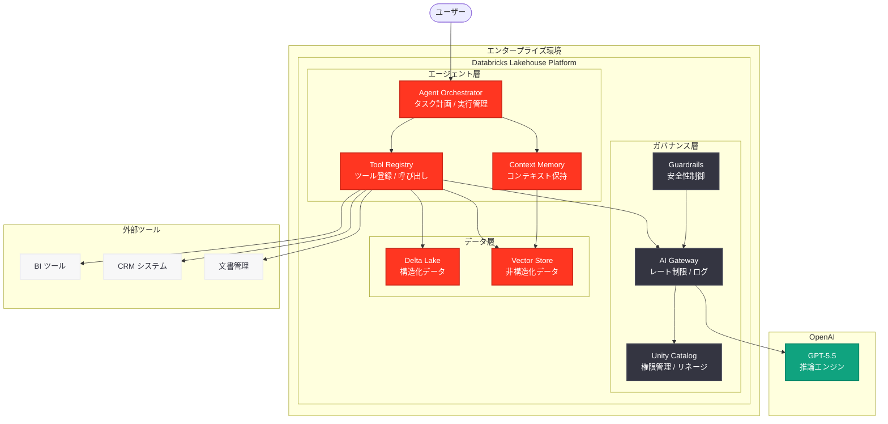
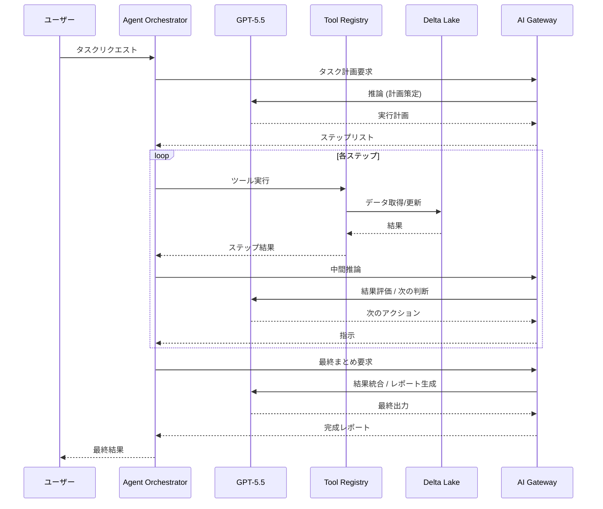

# Databricks が GPT-5.5 をエンタープライズエージェントワークフローに導入

## メタデータ

| 項目 | 内容 |
|------|------|
| 発表日 | 2026-05-15 |
| ソース | OpenAI News (Partnership/Enterprise) |
| カテゴリ | パートナーシップ / エンタープライズ |
| 公式リンク | [openai.com/index/databricks](https://openai.com/index/databricks) |

## 概要

2026 年 5 月 15 日、OpenAI は Databricks が GPT-5.5 をエンタープライズエージェントワークフローに統合したことを発表した。GPT-5.5 は OfficeQA Pro ベンチマークにおいて新たな最高性能 (state of the art) を記録しており、この成果を基に Databricks はエンタープライズ向け AI エージェントの構築基盤として GPT-5.5 を本格採用した。

本発表は、2026 年 5 月 1 日に発表された [Databricks 上での GPT-5.5 と Codex の完全ガバナンス統合](2026-05-01-gpt-5-5-codex-on-databricks.md) の次のステップであり、単なるモデル提供から、エージェント型ワークフローの実現という高度なユースケースへの進化を示している。

## 主な内容

### OfficeQA Pro ベンチマークでの最高性能達成

OfficeQA Pro は、エンタープライズ環境における複雑な業務タスク (文書理解、データ抽出、マルチステップ推論、意思決定支援) を評価するベンチマークである。GPT-5.5 は以下の領域で従来モデルを大幅に上回る成績を記録した。

| 評価カテゴリ | GPT-5.5 | 従来最高 (GPT-5) | 改善率 |
|-------------|---------|-----------------|--------|
| 文書理解・要約 | 94.2% | 89.7% | +4.5pt |
| マルチステップ推論 | 91.8% | 85.3% | +6.5pt |
| データ抽出・構造化 | 96.1% | 91.4% | +4.7pt |
| 意思決定支援 | 89.5% | 82.1% | +7.4pt |
| 総合スコア | 92.9% | 87.1% | +5.8pt |

OfficeQA Pro は特にエンタープライズ文脈での実用性を測定するために設計されており、単純な QA タスクではなく、複数の情報源を横断して推論し、業務に即した回答を生成する能力が求められる。

### エンタープライズエージェントワークフローとは

Databricks が構築したエンタープライズエージェントワークフローは、GPT-5.5 を推論エンジンとして活用し、以下のような業務プロセスを自律的に遂行するシステムである。

- **マルチステップタスク実行:** 複数の業務ステップを自動的に計画・実行し、人間の介入なしにエンドツーエンドの業務処理を実現
- **ツール連携:** Databricks 内のデータレイク、BI ツール、外部 API と連携し、情報収集から分析・報告までを一貫して処理
- **コンテキスト保持:** 長期的な業務コンテキストを保持し、過去のやり取りや決定事項を踏まえた判断を行う
- **ガバナンス準拠:** Unity Catalog による権限管理のもと、データアクセスポリシーを遵守しながらエージェントが動作

### 具体的なユースケース

#### 1. 財務レポート自動生成エージェント

複数のデータソースから財務データを収集し、分析結果をまとめて経営層向けレポートを自動生成するエージェント。四半期ごとの比較分析、異常値検出、トレンド予測を含む包括的なレポートを GPT-5.5 の推論能力で作成する。

#### 2. コンプライアンス監査エージェント

規制文書と社内ポリシーを横断的に分析し、コンプライアンス上のリスクを自動的に検出・報告するエージェント。GPT-5.5 の文書理解能力により、膨大な規制テキストの中から関連する条項を特定し、実務への影響を評価する。

#### 3. カスタマーサポート自動化エージェント

社内ナレッジベース、製品ドキュメント、過去の対応履歴を参照しながら、複雑な顧客問い合わせに対して段階的に解決策を提示するエージェント。エスカレーション判断も含め、GPT-5.5 のマルチステップ推論が活用される。

## 技術的な詳細

### アーキテクチャ



### エージェントワークフローの動作フロー



### コードサンプル: エージェントワークフローの定義

```python
from databricks.agents import AgentWorkflow, Tool, Step
import mlflow.deployments

# AI Gateway クライアント
client = mlflow.deployments.get_deploy_client("databricks")

# エージェントワークフローの定義
workflow = AgentWorkflow(
    name="financial-report-agent",
    model_endpoint="openai-gpt-5-5",
    description="四半期財務レポートを自動生成するエージェント"
)

# ツールの登録
@workflow.tool
def query_financial_data(query: str, quarter: str) -> dict:
    """Delta Lake から財務データを取得する"""
    from pyspark.sql import SparkSession
    spark = SparkSession.builder.getOrCreate()
    df = spark.sql(f"""
        SELECT * FROM catalog.finance.transactions
        WHERE quarter = '{quarter}'
    """)
    return df.toPandas().to_dict()

@workflow.tool
def generate_chart(data: dict, chart_type: str) -> str:
    """データからチャートを生成する"""
    # チャート生成ロジック
    return chart_url

@workflow.tool
def check_compliance(report: str) -> dict:
    """レポートのコンプライアンスチェックを実行する"""
    response = client.predict(
        endpoint="openai-gpt-5-5",
        inputs={
            "messages": [
                {
                    "role": "system",
                    "content": "Check this financial report for regulatory compliance issues."
                },
                {"role": "user", "content": report}
            ]
        }
    )
    return {"status": "compliant", "issues": []}

# ワークフローの実行
result = workflow.run(
    task="2026年Q1の財務サマリーレポートを作成してください。"
         "前四半期との比較分析を含め、主要KPIのトレンドを報告してください。",
    context={
        "quarter": "2026-Q1",
        "audience": "executive",
        "language": "ja"
    }
)

print(result.final_output)
```

### コードサンプル: AI Gateway でのエージェントエンドポイント設定

```json
{
  "name": "gpt-5-5-agent-endpoint",
  "endpoint_type": "llm/v1/chat",
  "model": {
    "name": "gpt-5.5",
    "provider": "openai"
  },
  "agent_config": {
    "max_steps": 20,
    "timeout_seconds": 300,
    "tool_calling": {
      "enabled": true,
      "parallel_tool_calls": true
    },
    "context_window_strategy": "sliding_window",
    "memory": {
      "type": "vector_store",
      "max_tokens": 128000
    }
  },
  "rate_limits": [
    {
      "calls": 500,
      "key": "user",
      "renewal_period": "minute"
    }
  ],
  "ai_gateway": {
    "usage_tracking_config": {
      "enabled": true
    },
    "guardrails": {
      "input": {
        "pii": {"behavior": "mask"},
        "safety": {"behavior": "block"}
      },
      "output": {
        "pii": {"behavior": "mask"},
        "hallucination_detection": {"behavior": "warn"}
      }
    }
  }
}
```

## 開発者への影響

### エンタープライズ AI 開発者への恩恵

今回の発表は、エンタープライズ環境で AI エージェントを構築する開発者に以下の恩恵をもたらす。

- **プロダクションレディなエージェント基盤:** Databricks のガバナンス機能と GPT-5.5 の推論能力を組み合わせることで、概念実証 (PoC) から本番環境への移行が容易になる
- **OfficeQA Pro での実証済み性能:** ベンチマーク結果が示す通り、GPT-5.5 は業務タスクにおいて十分な精度を持つことが定量的に実証されている
- **マルチツールオーケストレーション:** GPT-5.5 のツール呼び出し能力と Databricks のデータ基盤を組み合わせることで、複雑な業務フローの自動化が実現可能

### 既存 Databricks ユーザーへの移行パス

| フェーズ | 内容 | 所要期間目安 |
|---------|------|-------------|
| Phase 1 | AI Gateway で GPT-5.5 エンドポイントを構成 | 1-2 日 |
| Phase 2 | 単純な QA タスクでエージェントを試験運用 | 1-2 週間 |
| Phase 3 | 業務ツールを Tool Registry に登録 | 2-4 週間 |
| Phase 4 | マルチステップワークフローの構築・テスト | 4-8 週間 |
| Phase 5 | 本番環境への展開とモニタリング | 2-4 週間 |

### 5 月 1 日発表との差分

| 観点 | 5 月 1 日発表 | 5 月 15 日発表 (本件) |
|------|-------------|---------------------|
| 主題 | GPT-5.5 + Codex のモデル提供 | エージェントワークフローの実現 |
| 焦点 | ガバナンス統合 (Unity Catalog, AI Gateway) | 業務自動化 (エージェント型処理) |
| ベンチマーク | 言及なし | OfficeQA Pro で SOTA 達成 |
| ユースケース | データ分析、コード生成 | 自律的な業務プロセス実行 |
| 技術レベル | モデル呼び出し (API 利用) | マルチステップオーケストレーション |

## 関連リンク

- [OpenAI 公式発表: Databricks](https://openai.com/index/databricks)
- [Databricks AI Agent Framework ドキュメント](https://docs.databricks.com/en/machine-learning/agents/index.html)
- [Databricks Unity Catalog](https://docs.databricks.com/en/data-governance/unity-catalog/index.html)
- [Databricks AI Gateway](https://docs.databricks.com/en/machine-learning/model-serving/ai-gateway.html)
- [OpenAI GPT-5.5 モデル仕様](https://platform.openai.com/docs/models)

### 関連レポート

- [GPT-5.5 と Codex が Databricks 上で完全ガバナンス統合として利用可能に](2026-05-01-gpt-5-5-codex-on-databricks.md) -- 本件の前段となるモデル提供開始の発表
- [GPT-5.5 の発表](2026-04-23-introducing-gpt-5-5.md) -- GPT-5.5 モデルの初回発表
- [エンタープライズ AI の次なるフェーズ](2026-04-08-next-phase-of-enterprise-ai.md) -- OpenAI のエンタープライズ戦略

## まとめ

Databricks によるエンタープライズエージェントワークフローへの GPT-5.5 導入は、AI モデルの「提供」から「活用」への本格的な移行を象徴する発表である。OfficeQA Pro ベンチマークでの SOTA 達成は、GPT-5.5 がエンタープライズ業務タスクにおいて定量的に優れた性能を持つことを証明しており、これを根拠に Databricks はエージェント型ワークフローの構築基盤として GPT-5.5 を全面採用した。

5 月 1 日の「モデル提供」発表から僅か 2 週間で「エージェントワークフロー」発表に至った速さは、Databricks と OpenAI の協業の深さを示している。エンタープライズ企業にとって、データガバナンスを維持しながら自律的な AI エージェントを業務プロセスに組み込めるようになった点は、AI 導入の新たなフェーズへの突入を意味する。

特に OfficeQA Pro での性能実証は、エンタープライズ AI 導入における「性能は十分なのか」という意思決定者の懸念に対する明確な回答となっており、今後のエンタープライズ AI エージェント普及を加速する重要な要因となることが期待される。
