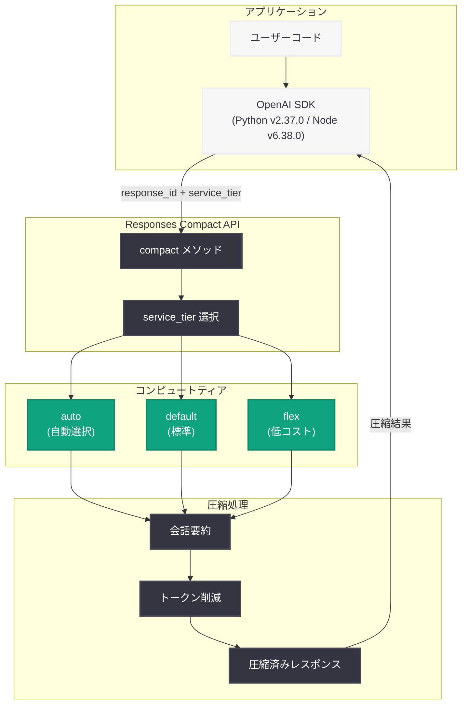
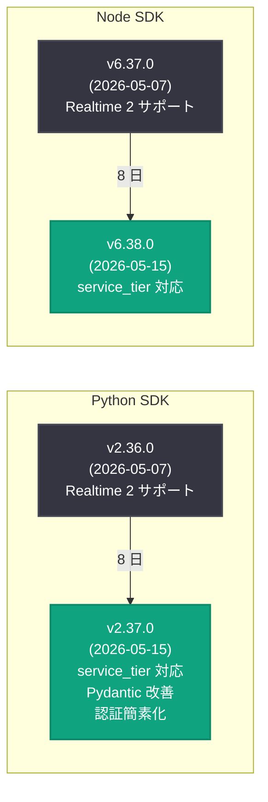

# OpenAI Python SDK v2.37.0 / Node SDK v6.38.0: Responses Compact メソッドに service_tier パラメータを追加

## メタデータ

| 項目 | 内容 |
|------|------|
| 発表日 | 2026-05-15 |
| ソース | OpenAI API Changelog (GitHub) |
| カテゴリ | API 更新 |
| 公式リンク | [Python SDK v2.37.0](https://github.com/openai/openai-python/releases/tag/v2.37.0) / [Node SDK v6.38.0](https://github.com/openai/openai-node/releases/tag/v6.38.0) |

## 概要

OpenAI は 2026 年 5 月 15 日、Python SDK v2.37.0 および Node SDK v6.38.0 を同時リリースした。両 SDK に共通する主要な変更点は、Responses API の compact メソッドに `service_tier` パラメータが追加されたことである。これにより、会話履歴の圧縮処理に使用するコンピュートティアを明示的に指定できるようになり、コスト最適化やレイテンシ制御がより柔軟に行える。

Python SDK では追加で、Pydantic イテレータの即時バリデーション対応、ワークロード ID プロバイダ認証の簡素化、ファイルタイプエラーメッセージの f-string 修正が含まれている。

## 主な内容

### Responses Compact メソッドへの service_tier パラメータ追加

Responses API の compact メソッドは、長い会話履歴を圧縮して次のリクエストに含めるトークン数を削減する機能である。今回のアップデートにより、この圧縮処理を実行する際に使用するコンピュートティアを `service_tier` パラメータで指定できるようになった。

`service_tier` は以下の値を受け付ける。

| 値 | 説明 |
|----|------|
| `"auto"` | システムが最適なティアを自動選択する。利用可能な場合はより高速なティアを使用 |
| `"default"` | 標準のコンピュートティアを使用する。予測可能なレイテンシとコスト |
| `"flex"` | バックグラウンド処理向けの低コストティア。レイテンシは高いがコストを抑えられる |

compact メソッド自体は、Responses API で蓄積された会話のレスポンスアイテムをモデルに要約させることで、コンテキストウィンドウの消費を抑制する。長時間のエージェント会話やマルチターン対話で特に有効である。

### Python SDK: Pydantic イテレータの即時バリデーション

コミット `7e527bc` により、内部型システムにおいて Pydantic イテレータの即時 (eager) バリデーションがサポートされた。これにより、ストリーミングレスポンスの各チャンクが生成された時点で型検証が行われるようになり、不正なデータの早期検出が可能になる。

### Python SDK: ワークロード ID プロバイダ認証の簡素化

コミット `c39ea8d` により、ワークロード ID プロバイダ (Workload Identity Provider) を使用した認証で不要だった `client_id` パラメータが削除された。Google Cloud や Azure などのマネージド環境でサービスアカウントを通じた認証を行う場合、設定が簡素化される。

### Python SDK: f-string バグ修正

コミット `c85ebd9` により、ファイルタイプエラーメッセージで f-string プレフィックスが欠落していたバグが修正された。これまではファイルタイプに関するエラーメッセージで変数が展開されず、デバッグ時に実際のファイルタイプが表示されない問題があった。

## 技術的な詳細

### 変更一覧

#### Python SDK v2.37.0

| 種別 | 変更内容 | コミット |
|------|---------|---------|
| 機能追加 | responses compact に service_tier パラメータを追加 | `625827c` |
| 機能追加 | Pydantic イテレータの即時バリデーション対応 | `7e527bc` |
| 機能追加 | workload identity provider 認証から不要な client_id を削除 | `c39ea8d` |
| バグ修正 | ファイルタイプエラーメッセージの f-string プレフィックス欠落修正 | `c85ebd9` |

#### Node SDK v6.38.0

| 種別 | 変更内容 | コミット |
|------|---------|---------|
| 機能追加 | responses compact に service_tier パラメータを追加 | `423e838` |

### コードサンプル

#### SDK のアップグレード

```bash
# Python SDK v2.37.0 へのアップグレード
pip install --upgrade openai

# バージョン確認
python -c "import openai; print(openai.__version__)"
# 出力: 2.37.0

# Node SDK v6.38.0 へのアップグレード
npm install openai@latest
```

#### Python: service_tier を指定した Responses Compact の使用

```python
from openai import OpenAI

client = OpenAI()

# 長い会話を実行
response = client.responses.create(
    model="gpt-4o",
    input="Explain the history of artificial intelligence in detail.",
)

# 会話履歴を圧縮 (service_tier を指定)
# "auto" - システムが最適なティアを自動選択
compact_response = client.responses.compact(
    response_id=response.id,
    service_tier="auto",
)

print(f"圧縮後のレスポンス ID: {compact_response.id}")
print(f"使用されたサービスティア: {compact_response.service_tier}")
```

#### Python: コスト最適化のため flex ティアを使用

```python
from openai import OpenAI

client = OpenAI()

# エージェントの長時間会話をバックグラウンドで圧縮
# flex ティアは低コストだがレイテンシが高い
compact_response = client.responses.compact(
    response_id="resp_abc123",
    service_tier="flex",
)

# リアルタイム性が必要な場合は default を使用
compact_response_fast = client.responses.compact(
    response_id="resp_def456",
    service_tier="default",
)
```

#### Node.js: service_tier を指定した Responses Compact の使用

```typescript
import OpenAI from "openai";

const client = new OpenAI();

// 会話を実行
const response = await client.responses.create({
  model: "gpt-4o",
  input: "Explain quantum computing in detail.",
});

// 会話履歴を圧縮 (service_tier を指定)
const compactResponse = await client.responses.compact({
  response_id: response.id,
  service_tier: "auto",
});

console.log(`Compact response ID: ${compactResponse.id}`);
console.log(`Service tier used: ${compactResponse.service_tier}`);
```

#### Python: ワークロード ID プロバイダ認証 (簡素化後)

```python
from openai import OpenAI

# v2.37.0 以降: client_id は不要
# マネージド環境 (GCP, Azure) でのサービスアカウント認証
client = OpenAI(
    # client_id は不要になった (以前は必須だった)
    # 環境のワークロード ID から自動的に認証情報を取得
)

response = client.responses.create(
    model="gpt-4o",
    input="Hello from workload identity!",
)
```

## アーキテクチャ

### Responses Compact メソッドと service_tier の関係



### SDK バージョン進化: v2.36.0 から v2.37.0 / v6.37.0 から v6.38.0



## 開発者への影響

### コスト最適化の選択肢が拡大

- **リアルタイムアプリケーション:** `"default"` または `"auto"` を使用して予測可能なレイテンシを確保しつつ、会話履歴を圧縮できる
- **バッチ処理・非同期ワークロード:** `"flex"` ティアを使用することで、レイテンシを許容しつつ圧縮コストを削減できる
- **自動最適化:** `"auto"` を指定すれば、システム側で利用可能なリソースに基づいて最適なティアが選択される

### エージェント開発への影響

長時間動作するエージェントでは、会話履歴がコンテキストウィンドウを圧迫する問題が頻繁に発生する。compact メソッドに service_tier が追加されたことで、エージェントのライフサイクルに応じた圧縮戦略を実装できる。

- アクティブな対話中: `"default"` で即時圧縮
- アイドル時のメンテナンス: `"flex"` でコスト効率の高い圧縮

### ワークロード ID 認証ユーザーへの恩恵

GCP や Azure のマネージド環境で OpenAI API を利用している開発者は、`client_id` の設定が不要になったことで、認証設定がさらにシンプルになる。特に Kubernetes ワークロードや Cloud Run で動作するサービスでの設定が簡素化される。

### アップグレード推奨

```bash
# Python
pip install openai>=2.37.0

# Node.js
npm install openai@^6.38.0
```

破壊的変更は含まれていないため、既存のコードに影響を与えることなく安全にアップグレードできる。

## 関連リンク

- [OpenAI Python SDK v2.37.0 リリースノート](https://github.com/openai/openai-python/releases/tag/v2.37.0)
- [OpenAI Node SDK v6.38.0 リリースノート](https://github.com/openai/openai-node/releases/tag/v6.38.0)
- [openai-python GitHub リポジトリ](https://github.com/openai/openai-python)
- [openai-node GitHub リポジトリ](https://github.com/openai/openai-node)
- [OpenAI Responses API ドキュメント](https://platform.openai.com/docs/api-reference/responses)
- [OpenAI API リファレンス](https://platform.openai.com/docs/api-reference)
- [OpenAI Platform Changelog](https://platform.openai.com/docs/changelog)

## まとめ

Python SDK v2.37.0 と Node SDK v6.38.0 は、Responses API の compact メソッドに `service_tier` パラメータを追加した同期リリースである。この変更により、会話履歴の圧縮処理に対して `"auto"`、`"default"`、`"flex"` の 3 つのコンピュートティアから選択できるようになり、レイテンシとコストのトレードオフを開発者が制御できるようになった。特に長時間動作するエージェントや大量のマルチターン会話を処理するアプリケーションにとって、運用コストの最適化に寄与する実用的なアップデートである。Python SDK ではさらに、Pydantic イテレータの即時バリデーション対応やワークロード ID プロバイダ認証の簡素化といった改善も含まれており、開発体験の向上が図られている。
