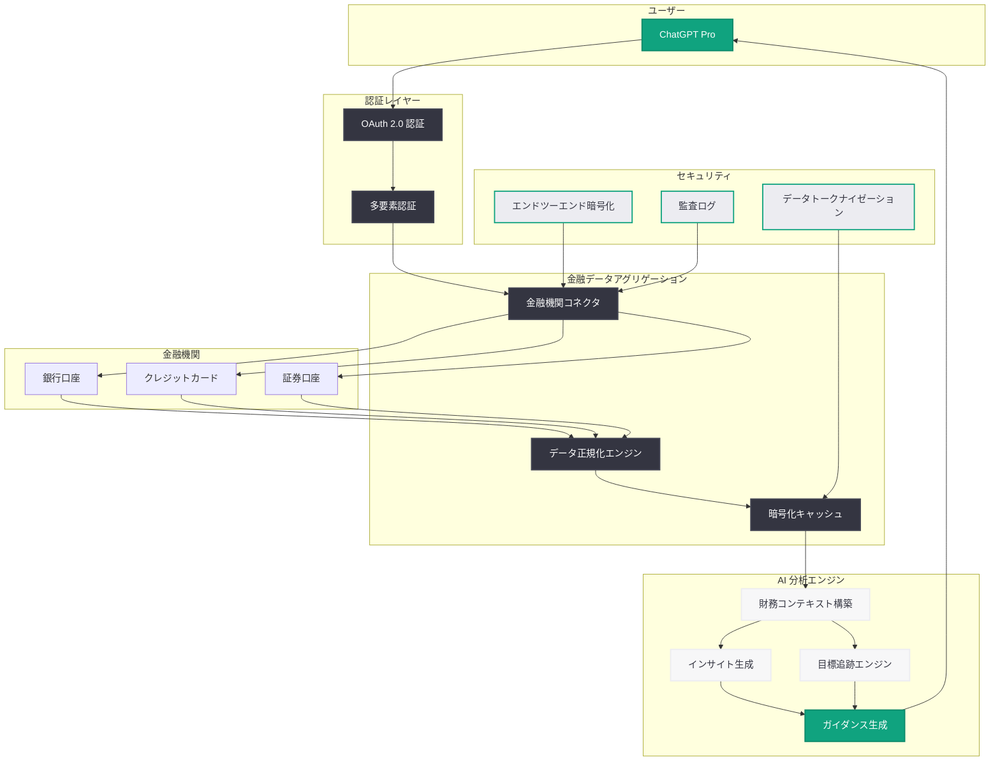

# ChatGPT に新しいパーソナルファイナンス機能が登場

## メタデータ

| 項目 | 内容 |
|------|------|
| 発表日 | 2026-05-15 |
| ソース | OpenAI News |
| カテゴリ | 新機能 |
| 公式リンク | https://openai.com/index/personal-finance-chatgpt |

## 概要

OpenAI は、ChatGPT Pro ユーザー向けに新しいパーソナルファイナンス体験のプレビューを発表した。本機能により、米国の Pro ユーザーは金融機関の口座を安全に接続し、自身の財務状況、目標、優先事項に基づいた AI による分析とガイダンスを受けることが可能になる。

この発表は、OpenAI が ChatGPT を単なる会話 AI から、ユーザーの実生活に深く統合されたパーソナルアシスタントへと進化させる戦略の一環である。2026 年 3 月の ChatGPT Commerce 戦略、4 月の Gradient Labs AI Banking との連携に続き、金融分野への本格参入を示すものとなっている。

## 主な内容

### 金融口座の接続

ユーザーは ChatGPT 内から直接、銀行口座、クレジットカード、投資口座などの金融機関アカウントを安全に接続できる。

- **対応金融機関**: 米国内の主要銀行、証券会社、クレジットカード会社
- **接続方式**: セキュアな金融データアグリゲーション基盤を通じた接続
- **データ取得範囲**: 口座残高、取引履歴、投資ポートフォリオ、支出カテゴリなど

### AI パワードインサイト

接続された金融データを基に、ChatGPT は以下のようなインサイトとガイダンスを提供する。

- **支出分析**: カテゴリ別の支出パターンの可視化と異常検出
- **予算管理**: 収入と支出に基づいたパーソナライズされた予算提案
- **貯蓄目標**: ユーザーの目標に合わせた貯蓄計画の策定と進捗追跡
- **投資インサイト**: ポートフォリオの構成分析とリスク評価
- **財務健全性スコア**: 総合的な財務状況の評価とアクションアイテムの提案

### パーソナライズされたガイダンス

従来の汎用的な金融アドバイスとは異なり、ユーザー固有の財務コンテキストに基づいたガイダンスを提供する。

- **目標ベースのアドバイス**: 住宅購入、退職資金、教育費など、個別の目標に合わせた計画
- **優先度設定**: ユーザーが設定した優先事項に基づいた最適化提案
- **シナリオ分析**: 「もし〜したら」形式での財務シミュレーション
- **定期的なレビュー**: 財務状況の変化に応じた定期的な見直しと提案

## 技術的な詳細

### アーキテクチャ

### セキュリティとプライバシー

金融データの取り扱いにおいて、OpenAI は以下のセキュリティ対策を実装している。

**データ保護:**

- **エンドツーエンド暗号化**: 金融機関と ChatGPT 間のすべての通信は TLS 1.3 以上で暗号化
- **データトークナイゼーション**: 実際の口座番号やカード番号は保存せず、トークン化されたデータのみを処理
- **最小権限の原則**: 分析に必要な最小限のデータのみを取得し、生のトランザクションデータは保持しない

**アクセス制御:**

- **OAuth 2.0 認証**: 金融機関との接続は業界標準の OAuth 2.0 フローを使用
- **多要素認証**: 口座接続時に追加の認証ステップを要求
- **セッション管理**: 一定期間のアクティビティがない場合は自動的に接続を切断

**コンプライアンス:**

- **規制準拠**: 米国の金融データ保護規制 (GLBA、CCPA 等) に準拠
- **監査ログ**: すべてのデータアクセスと操作を記録
- **データ削除**: ユーザーはいつでも接続を解除し、保存されたデータの完全削除を要求可能

### AI モデルとデータの分離

金融データの学習への利用に関して、OpenAI は明確な方針を示している。

- ユーザーの金融データは AI モデルのトレーニングには使用されない
- 分析はリアルタイムの推論時にのみ実行される
- 金融データはユーザーのセッションコンテキスト内でのみ参照される

## 開発者への影響

### 現時点での影響

本機能は現在、ChatGPT Pro ユーザー向けのコンシューマー機能としてプレビュー提供されており、API としての提供は発表されていない。ただし、以下の点で開発者エコシステムに影響を与える可能性がある。

- **金融系 ChatGPT プラグイン開発者**: 既存の金融関連プラグインとの競合が発生する可能性
- **フィンテック企業**: OpenAI との連携やデータ提供パートナーシップの機会
- **データアグリゲーション事業者**: OpenAI の金融データ接続基盤における技術パートナーとしての役割

### 今後の展望

- **API 公開の可能性**: 将来的に Assistants API や Responses API を通じた金融データ連携機能の提供
- **エンタープライズ展開**: ChatGPT Enterprise での法人向け財務分析機能
- **国際展開**: 米国外の金融機関への対応拡大

## 利用条件

| 項目 | 内容 |
|------|------|
| 対象ユーザー | ChatGPT Pro ユーザー |
| 対象地域 | 米国のみ (プレビュー) |
| 提供形態 | プレビュー版 |
| 追加費用 | Pro サブスクリプションに含まれる |

## 関連リンク

- [公式発表](https://openai.com/index/personal-finance-chatgpt)
- [ChatGPT Pro](https://openai.com/chatgpt/pricing)
- [OpenAI プライバシーポリシー](https://openai.com/policies/privacy-policy)
- [Gradient Labs AI Banking との連携](https://openai.com/index/gradient-labs-ai-banking)

## まとめ

ChatGPT のパーソナルファイナンス機能は、AI アシスタントが単なる情報提供ツールから、ユーザーの実際の財務データに基づいたパーソナライズされたガイダンスを提供するプラットフォームへと進化する重要なマイルストーンである。

セキュリティとプライバシーを最優先に設計されたこの機能は、ユーザーの金融口座を安全に接続し、支出分析、予算管理、貯蓄計画、投資インサイトといった包括的な財務サポートを提供する。現時点では米国の Pro ユーザー向けプレビューとして限定的に提供されているが、今後の正式リリースや対象地域の拡大が期待される。

金融データという極めてセンシティブな情報を扱うため、OpenAI がどの程度のセキュリティとプライバシー保護を実現できるかが、本機能の成功を左右する重要な要素となる。フィンテック業界全体にとっても、AI 大手による金融サービス参入という観点で注目に値する動向である。
