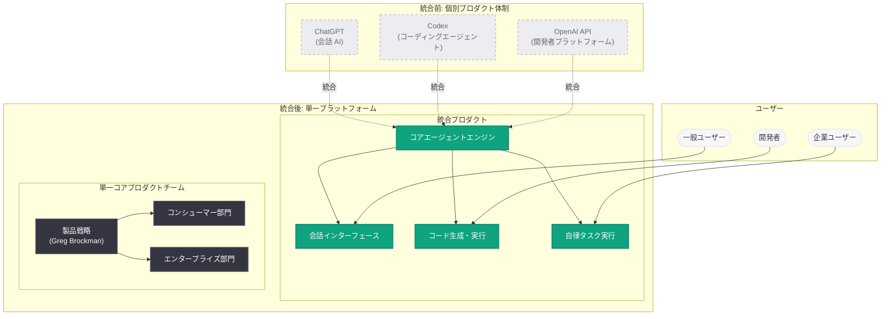

# Greg Brockman が製品戦略を統括、ChatGPT と Codex の統合プラットフォーム化を計画

## メタデータ

| 項目 | 内容 |
|------|------|
| 発表日 | 2026-05-16 |
| ソース | OpenAI News |
| カテゴリ | 組織 / 製品戦略 |
| 公式リンク | [openai.com/index/work-with-codex-from-anywhere](https://openai.com/index/work-with-codex-from-anywhere/) |

## 概要

OpenAI の共同創業者兼社長である Greg Brockman 氏が、製品戦略の責任者に正式就任した。Brockman 氏は社内メモにおいて、ChatGPT と Codex を単一の統合プラットフォームに統合する計画を示した。これは 2025 年末に CEO Sam Altman 氏が宣言した「コードレッド」方針の延長線上にあり、OpenAI が「エージェント型の未来」に向けてプロダクト体制を大幅に集約する動きである。

Brockman 氏は、AGI デプロイメント担当 CEO の Fidji Simo 氏が医療休暇に入って以降、暫定的にプロダクト運営を担っていたが、今回正式にその役割を引き継いだ。TechCrunch および Wired (Bloomberg 報道経由) が報じた。

## 主な内容

### Greg Brockman の製品戦略統括

Brockman 氏はスタッフメモにおいて、製品統合の方向性を明確に示した。

> "We're consolidating our product efforts to execute with maximum focus toward the agentic future, to win across both consumer and enterprise"

この発言は、コンシューマーとエンタープライズの両市場において、エージェント型プロダクトで勝利するために製品リソースを集中させる意図を明らかにしている。

### ChatGPT と Codex の統合計画

OpenAI は既に ChatGPT、Codex、API を単一プラットフォームに統合し、一つのコアプロダクトチームで運営する方向で議論を進めていたことを確認した。主な変更点は以下の通り。

| 項目 | 統合前 | 統合後 |
|------|--------|--------|
| プロダクト体制 | ChatGPT、Codex、API が個別チーム | 単一コアプロダクトチーム |
| ユーザー体験 | 各製品が独立したインターフェース | 一つの統合エクスペリエンス |
| 戦略方針 | 複数の並行プロジェクト | エージェント型未来への一点集中 |

### 組織的背景と経緯

この統合計画は、一連の戦略的意思決定の集大成である。

**2025 年末: Sam Altman の「コードレッド」宣言**

- コア ChatGPT 体験への再集中を呼びかけ
- 「サイドクエスト」の廃止方針を決定

**廃止されたプロジェクト:**

- **Sora:** 動画生成ツール
- **OpenAI for Science:** 科学研究向けイニシアティブ

**退任した幹部:**

- Kevin Weil 氏 (戦略的絞り込みの一環)
- Bill Peebles 氏 (同上)

### Fidji Simo との協力体制

Simo 氏は医療休暇中であるにもかかわらず、今回の変更について Brockman 氏と連携して協議を行った。これは組織変更が突発的なものではなく、計画的に進められたことを示している。

## 技術的な詳細

### 「エージェント型の未来」の意味

Brockman 氏が言及する「エージェント型の未来 (agentic future)」とは、AI が単なる質問応答やコード補完を超え、ユーザーに代わって自律的にタスクを完了する能力を指す。ChatGPT と Codex の統合により、以下のような統合エージェント体験が実現されると考えられる。

**統合後に想定される機能:**

- 会話型 AI (ChatGPT) とコーディングエージェント (Codex) のシームレスな連携
- 単一のインターフェースから自然言語での指示に基づくソフトウェア開発
- API を通じたエンタープライズワークフローとの統合
- コンシューマー向けタスク自動化とエンタープライズ向け開発支援の融合

### 想定される API 統合モデル

```python
from openai import OpenAI

client = OpenAI()

# 統合プラットフォームにおける想定されるワークフロー
# 会話型指示からエージェント型タスク実行まで一貫したインターフェース
response = client.responses.create(
    model="gpt-5",
    input="このプロジェクトのテストカバレッジを 80% まで引き上げて、"
          "不足しているユニットテストを生成してください。",
    tools=[
        {
            "type": "codex",
            "sandbox": {
                "environment": "project-workspace",
            }
        }
    ],
)

# 統合プラットフォームでは ChatGPT の会話能力と
# Codex のコード実行能力が単一のリクエストで利用可能になる
```

## アーキテクチャ



## 開発者への影響

ChatGPT と Codex の統合は、開発者に対して以下の重要な影響をもたらす。

- **API の統合・簡素化:** 現在別々に存在する ChatGPT 向けと Codex 向けのエンドポイントが統合される可能性がある。開発者は単一の API 体系でアクセスできるようになり、実装が簡素化される
- **エージェント型ワークフローの強化:** 会話型 AI とコーディングエージェントが融合することで、より高度なエージェント型アプリケーションの構築が容易になる
- **プロダクトチーム一元化による開発速度向上:** 単一チームによる開発は、機能間の整合性向上とリリースサイクルの短縮につながる
- **移行計画への注意が必要:** 既存の Codex API や ChatGPT API を利用しているアプリケーションについて、統合後の移行パスに注意が必要。OpenAI の公式アナウンスを継続的にモニタリングすべきである
- **エンタープライズ向け機能の充実:** コンシューマーとエンタープライズの両方を一つのプラットフォームで対応する方針は、エンタープライズ開発者にとってより統合されたソリューションを意味する
- **「サイドクエスト」廃止の影響:** Sora や OpenAI for Science に依存していたワークフローを持つ開発者は、代替手段を検討する必要がある

## 関連リンク

- [Codex をどこからでも利用 (OpenAI 公式)](https://openai.com/index/work-with-codex-from-anywhere/)
- [OpenAI Codex](https://openai.com/codex)
- [OpenAI API ドキュメント](https://platform.openai.com/docs)
- [OpenAI News](https://openai.com/news)

## まとめ

Greg Brockman 氏の製品戦略統括就任と ChatGPT / Codex の統合計画は、OpenAI がエージェント型 AI の未来に向けて組織とプロダクトの両面で大胆な集約を行っていることを示している。2025 年末の「コードレッド」宣言以降、Sora や OpenAI for Science の廃止、幹部の退任を経て、OpenAI は「一つのプラットフォーム、一つのチーム」という明確なビジョンのもとにリソースを集中させている。

開発者にとっては、より統合された強力なプラットフォームが提供される一方、既存の個別プロダクトに依存したワークフローの見直しが求められる可能性がある。今後の公式発表で統合のタイムラインと移行計画が明らかになることが期待される。
