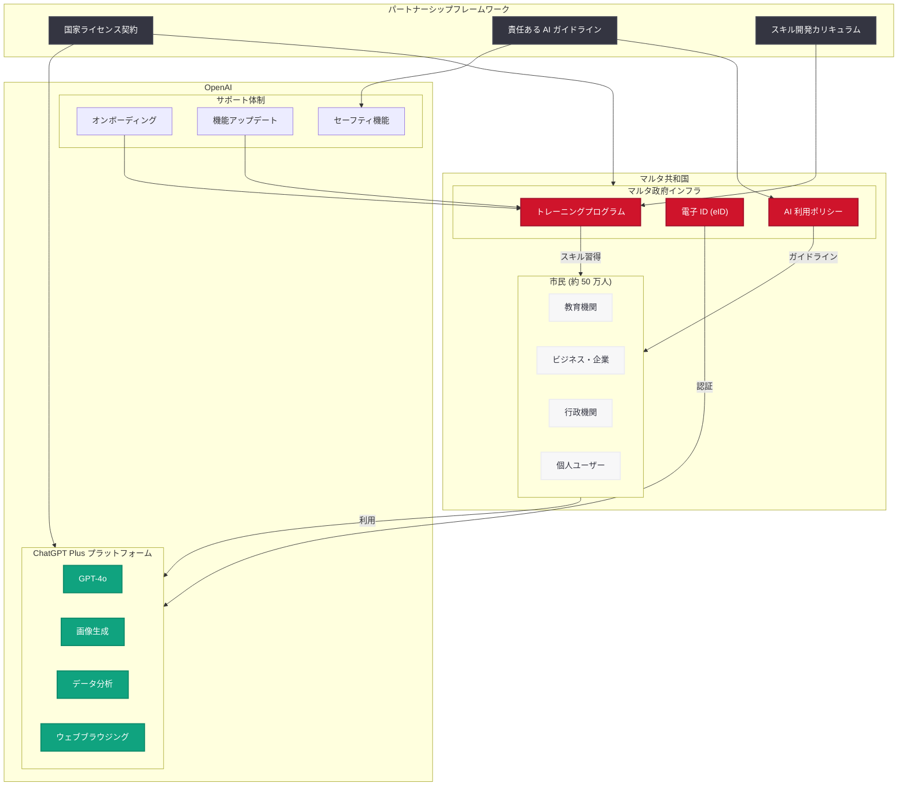

# OpenAI とマルタ政府が提携、全国民に ChatGPT Plus を提供へ

## メタデータ

| 項目 | 内容 |
|------|------|
| 発表日 | 2026-05-16 |
| ソース | OpenAI News |
| カテゴリ | グローバル・アフェアーズ |
| 公式リンク | [openai.com/index/malta-chatgpt-plus-partnership](https://openai.com/index/malta-chatgpt-plus-partnership) |

## 概要

OpenAI はマルタ共和国政府と包括的パートナーシップを締結し、マルタの全国民 (約 50 万人) に ChatGPT Plus を提供することを発表した。このパートナーシップは、AI アクセスの民主化において国家レベルで初めての取り組みであり、単なるツール提供にとどまらず、実践的な AI スキルトレーニングと責任ある AI 利用の教育を含む包括的なプログラムとなっている。

マルタは EU 加盟国の中でもデジタル化に積極的な国として知られており、今回の提携は AI テクノロジーへのアクセスを国家単位で保証する世界初のモデルケースとして注目される。他国の AI 政策にも大きな影響を与える可能性がある。

## 主な内容

### パートナーシップの全体像

OpenAI とマルタ政府の提携は、以下の 3 つの柱で構成されている。

1. **ChatGPT Plus の全国民提供:** マルタの全市民 (約 50 万人) に対して ChatGPT Plus のアクセス権を付与
2. **AI スキルトレーニングプログラム:** 市民が実践的な AI スキルを習得するための体系的な教育プログラムの実施
3. **責任ある AI 利用の推進:** AI リテラシー教育と倫理的な利用ガイドラインの策定

### ChatGPT Plus の全国民提供

マルタの約 50 万人の市民全員が ChatGPT Plus にアクセスできるようになる。ChatGPT Plus は通常月額 $20 のサブスクリプションサービスであり、GPT-4o をはじめとする最新モデルへのアクセス、優先的な応答速度、高度な機能 (画像生成、データ分析、ファイルアップロードなど) を含む。

国家規模での一括提供により、経済的な障壁なく全市民が最先端の AI ツールを活用できる環境が整備される。

### AI スキルトレーニングプログラム

本パートナーシップは単なるアカウント提供ではなく、市民が AI を効果的に活用するための実践的なスキルトレーニングを含んでいる。

- **基礎的な AI リテラシー:** AI の仕組み、できること・限界の理解
- **実践的なプロンプティング技術:** 業務や日常生活での効果的な AI 活用方法
- **専門分野別トレーニング:** 教育、医療、行政、ビジネスなど各分野での応用
- **継続的なスキルアップデート:** 新機能リリースに合わせた追加トレーニング

### 責任ある AI 利用

AI の倫理的利用と安全性に関する取り組みも重要な要素として含まれている。

- **利用ガイドラインの策定:** 市民向けの明確な AI 利用ポリシー
- **プライバシー保護:** 個人データの取り扱いに関する基準の設定
- **批判的思考の促進:** AI の出力を鵜呑みにせず検証する姿勢の醸成
- **デジタルウェルビーイング:** AI への過度な依存を防ぐ健全な利用習慣の推進

## 技術的な詳細

### 提供されるサービスの範囲

ChatGPT Plus に含まれる主要な機能。

| 機能 | 説明 |
|------|------|
| GPT-4o アクセス | 最新の大規模言語モデルへのフルアクセス |
| 画像生成 | DALL-E 統合による画像生成 |
| データ分析 | Code Interpreter によるデータ処理・可視化 |
| ファイルアップロード | ドキュメント分析、要約機能 |
| ウェブブラウジング | リアルタイム情報検索 |
| GPTs | カスタム AI アシスタントの利用・作成 |
| 優先アクセス | ピーク時でも安定した応答速度 |

### 想定される実装モデル

国家規模での ChatGPT Plus 提供には、以下のような技術的な仕組みが想定される。

- **国民認証連携:** マルタの電子 ID (eID) システムとの連携によるアカウント認証
- **一括ライセンス管理:** 政府による集中的なライセンス管理と利用状況のモニタリング
- **ローカライズ対応:** マルタ語 (Maltese) サポートの強化
- **データレジデンシー:** EU のデータ保護規制 (GDPR) に準拠したデータ管理

## アーキテクチャ

## 開発者への影響

本パートナーシップは直接的な API 変更を伴うものではないが、開発者エコシステムに対して以下の影響が想定される。

- **国家レベル B2G (Business to Government) モデルの確立:** OpenAI が政府向け大規模ライセンスの運用モデルを確立することで、今後他国でも同様の契約が増加する可能性がある。開発者にとっては、政府向け AI ソリューション開発の需要拡大が期待される
- **GPTs エコシステムの拡大:** 50 万人の新規ユーザーが ChatGPT Plus を利用開始することで、マルタ語対応の GPTs やマルタ固有のユースケースに対応するカスタム AI アプリケーションの開発機会が生まれる
- **ローカライズ需要の増加:** マルタ語サポートの強化が求められることで、多言語対応の重要性が再認識され、他の少数言語への対応も加速する可能性がある
- **教育テック分野の成長:** AI スキルトレーニングプログラムに関連して、教育コンテンツや学習プラットフォームの開発需要が高まる
- **責任ある AI 開発の標準化:** 政府レベルでの AI 利用ガイドラインが策定されることで、開発者にとっても安全性・倫理性の基準がより明確になる
- **国家単位のデプロイメント事例:** 今後、ChatGPT Enterprise や API を活用した国家インフラとの統合案件が増加する前例となる

## AI アクセス民主化への意義

### 世界初の国家レベル AI パートナーシップ

マルタと OpenAI の提携は、以下の点で AI アクセス民主化の重要なマイルストーンとなる。

| 観点 | 意義 |
|------|------|
| 経済的障壁の除去 | 所得に関係なく全市民が最先端 AI にアクセス可能 |
| デジタルデバイドの解消 | AI リテラシー教育とセットでの提供により格差を防止 |
| 国家競争力の強化 | 全国民の AI スキル底上げによる経済成長の加速 |
| 政策モデルの確立 | 他国が参考にできる具体的な実装モデルの提示 |

### 他国への波及効果

マルタの人口規模 (約 50 万人) は比較的小さいが、この取り組みが成功すれば、以下のような波及効果が期待される。

- **EU 加盟国への展開:** EU のデジタル戦略と連動した他加盟国での同様のプログラム
- **小国モデルの証明:** 人口規模が小さい国家から段階的にスケールアップするアプローチの有効性の実証
- **AI 外交の新形態:** テクノロジー企業と国家間の新しい協力関係のモデルケース
- **公共サービスとしての AI:** AI を公共財として位置づける政策議論の活性化

## 関連リンク

- [OpenAI and Malta partner to bring ChatGPT Plus to all citizens](https://openai.com/index/malta-chatgpt-plus-partnership)
- [OpenAI Global Affairs](https://openai.com/global-affairs)
- [ChatGPT Plus](https://openai.com/chatgpt/pricing)
- [OpenAI News](https://openai.com/news)

## まとめ

OpenAI とマルタ政府のパートナーシップは、AI アクセスの民主化において画期的な一歩である。全国民約 50 万人に ChatGPT Plus を提供するだけでなく、実践的な AI スキルトレーニングと責任ある AI 利用の教育を組み合わせた包括的なアプローチは、テクノロジーの恩恵を社会全体に行き渡らせるための模範的なモデルケースとなる。

マルタの比較的小さな人口規模は、このような国家単位の取り組みを試行するには理想的であり、その成果は今後、より大きな国家や地域での AI アクセス拡大施策に重要な知見を提供するだろう。開発者にとっては、政府向け AI ソリューションや教育テック分野での新たなビジネス機会の到来を意味し、AI 産業全体の成長を後押しする可能性がある。
