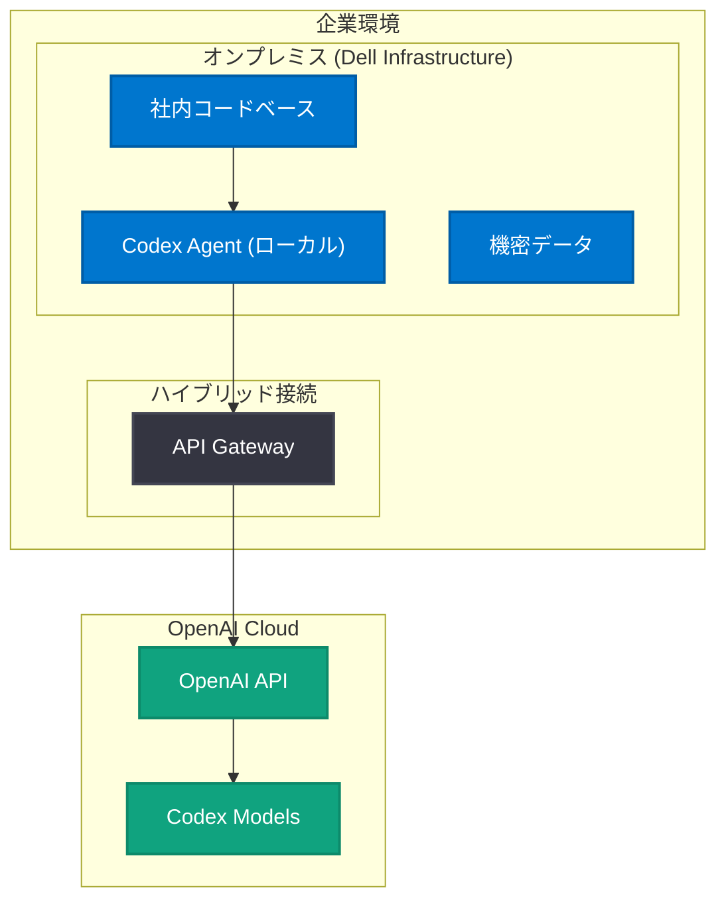

# OpenAI と Dell が Codex のハイブリッド / オンプレミス企業環境展開で提携

## メタデータ

| 項目 | 内容 |
|------|------|
| 発表日 | 2026-05-18 |
| ソース | OpenAI News |
| カテゴリ | パートナーシップ / エンタープライズ |
| 公式リンク | [openai.com/index/dell-codex-enterprise-partnership](https://openai.com/index/dell-codex-enterprise-partnership) |

## 概要

OpenAI と Dell Technologies が提携し、Codex (AI コーディングエージェント) をハイブリッドおよびオンプレミス環境に展開する。この提携により、企業は自社データセンターやプライベートクラウド環境で、セキュアに AI コーディングエージェントを活用できるようになる。

データの主権やセキュリティ規制が厳しいエンタープライズ顧客に対して、クラウドネイティブな AI ツールをローカル環境でも利用可能にすることで、Codex の採用範囲を大幅に拡大する戦略的な動きである。

## 主な内容

### パートナーシップの概要

OpenAI と Dell が協力して、Codex をハイブリッドおよびオンプレミスの企業環境に対応させる。これにより、以下が実現される。

- **データ主権の確保**: 機密コードや知的財産がクラウドに送信されることなく、社内環境で AI コーディング支援を受けられる
- **セキュアなデプロイメント**: Dell のエンタープライズインフラストラクチャ上で Codex を安全に運用
- **ワークフロー統合**: 既存の開発ワークフローやデータパイプラインとシームレスに統合

### エンタープライズ向け Codex の進化

OpenAI は 2026 年に入り、Codex のエンタープライズ展開を加速させている。

| 時期 | 展開 |
|------|------|
| 2026-04-16 | Codex for Almost Everything (全業務向け拡大) |
| 2026-04-21 | Scaling Codex Enterprises |
| 2026-04-22 | Codex Remote Connections |
| 2026-04-28 | OpenAI Models & Codex on AWS |
| 2026-05-13 | Codex Enterprise Free (無料枠提供) |
| 2026-05-13 | Codex Windows Sandbox |
| 2026-05-18 | Dell パートナーシップ (オンプレミス対応) |

### Dell Technologies の役割

Dell は以下のインフラストラクチャ / サービスを提供すると推測される。

- **Dell PowerEdge サーバー**: AI ワークロード向け GPU サーバー
- **Dell APEX**: ハイブリッドクラウドプラットフォーム
- **Dell Data Protection**: セキュリティおよびコンプライアンスレイヤー

## 技術的な詳細

### ハイブリッドアーキテクチャ

## 開発者への影響

- **規制産業での採用拡大**: 金融、医療、政府機関など、クラウド利用に制限がある組織で Codex が利用可能に
- **データセキュリティ向上**: コードや機密情報がオンプレミスに留まるため、データ漏洩リスクが低減
- **ハイブリッド開発ワークフロー**: クラウドとオンプレミスを組み合わせた柔軟な開発環境の構築が可能
- **エンタープライズ IT 管理**: Dell の既存インフラ管理ツールとの統合により、IT 部門の運用負荷を軽減

## 関連リンク

- [OpenAI Codex](https://openai.com/codex)
- [Dell Technologies AI Solutions](https://www.dell.com/ai)
- [OpenAI Enterprise](https://openai.com/enterprise)
- [Codex Enterprise Free](https://openai.com/index/codex-enterprise-free)
- [OpenAI Models on AWS](https://openai.com/index/openai-models-codex-managed-agents-aws)

## まとめ

OpenAI と Dell の提携は、AI コーディングエージェント Codex のエンタープライズ展開における重要なマイルストーンである。クラウドファーストだった OpenAI が、Dell のエンタープライズインフラストラクチャと組み合わせることで、データ主権を重視する大企業や規制産業にもリーチを広げる。AWS 上での Codex 展開 (4 月) に続き、Dell との提携によりオンプレミス / ハイブリッド環境もカバーし、あらゆる企業環境で AI コーディングエージェントを利用できる世界を目指している。
