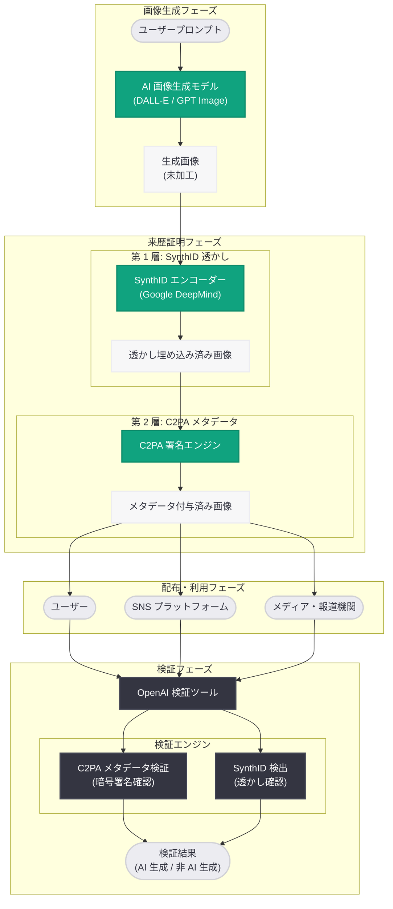
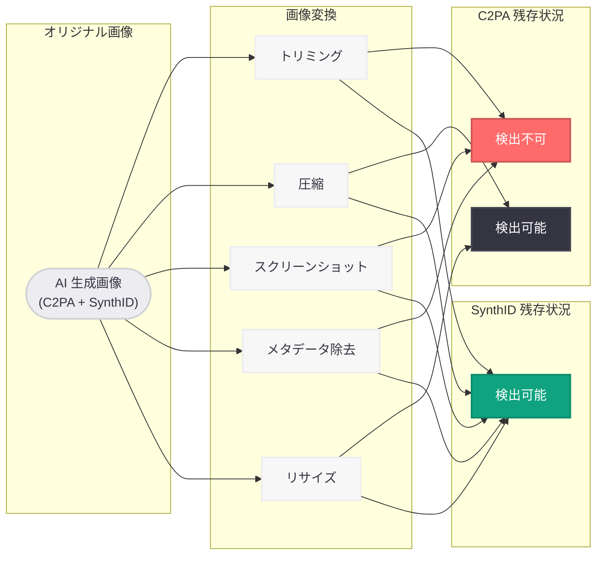

# AI コンテンツの来歴証明を推進: より安全で透明性の高い AI エコシステムに向けて

## メタデータ

| 項目 | 内容 |
|------|------|
| 発表日 | 2026-05-19 |
| ソース | OpenAI News |
| カテゴリ | セキュリティ / コンテンツ認証 |
| 公式リンク | [openai.com/index/advancing-content-provenance](https://openai.com/index/advancing-content-provenance/) |

## 概要

OpenAI は 2026 年 5 月 19 日、「Advancing content provenance for a safer, more transparent AI ecosystem (より安全で透明性の高い AI エコシステムのためのコンテンツ来歴証明の推進)」と題する発表を行った。本発表において、OpenAI は Google が開発した SynthID 透かし技術を AI 生成画像に採用し、既存の C2PA メタデータと組み合わせた二層構造のコンテンツ検出システムを構築したことを明らかにした。

この取り組みは、AI 生成コンテンツの急速な普及に伴い、偽情報やディープフェイクの拡散リスクが高まる中で、コンテンツの出所と真正性を技術的に証明するための業界横断的な協力の一環である。OpenAI はまた、画像が OpenAI のシステムによって生成されたものかどうかを確認できる検証ツールも公開し、コンテンツの透明性向上に向けた具体的な手段を提供している。

## 主な内容

### SynthID 透かし技術の採用

OpenAI は Google DeepMind が開発した SynthID 技術を採用し、AI 生成画像に不可視の電子透かし (ウォーターマーク) を埋め込む仕組みを導入した。SynthID は以下の特徴を持つ。

| 特性 | 説明 |
|------|------|
| 不可視性 | 人間の目では知覚できない透かしを画像に埋め込む |
| 堅牢性 | トリミング、圧縮、リサイズなどの一般的な画像変換に耐性を持つ |
| 検出可能性 | 専用の検出器により透かしの有無を判定できる |
| 非破壊性 | 画像の視覚的品質を損なわない |

SynthID は画像のピクセルデータ自体に情報を埋め込むため、ファイルのメタデータが削除されたり、画像が SNS にアップロードされて再圧縮された場合でも、透かしが残存する点が最大の強みである。

### C2PA メタデータとの二層構造

OpenAI は従来から C2PA (Coalition for Content Provenance and Authenticity) 標準に基づくメタデータを AI 生成画像に付与してきた。今回の SynthID 採用により、以下の二層構造が実現された。

**第 1 層: C2PA メタデータ (可視的来歴情報)**

- 画像ファイルに埋め込まれた構造化メタデータ
- 生成元 (OpenAI)、生成日時、使用モデルなどの情報を含む
- 改ざん検出機能 (tamper-evident) を備える
- 標準化された形式により、対応するビューアーやプラットフォームで閲覧可能

**第 2 層: SynthID 透かし (不可視的ウォーターマーク)**

- 画像のピクセルレベルに埋め込まれた不可視情報
- メタデータが削除されても残存する
- 画像の切り抜き、圧縮、形式変換後も検出可能
- 画像の視覚的品質に影響を与えない

この二層構造により、いずれか一方の検出手段が無効化された場合でも、もう一方によってコンテンツの来歴を証明できる冗長性が確保される。

### OpenAI 画像検証ツールの公開

OpenAI は、画像が自社の AI システムによって生成されたものかどうかを確認できる検証ツールを公開した。

- **URL:** [openai.com/index/verify-openai-generated-images](https://openai.com/index/verify-openai-generated-images/)
- **機能:** アップロードされた画像に対して、C2PA メタデータおよび SynthID 透かしの両方を検査
- **対象:** DALL-E、ChatGPT の画像生成機能、GPT Image など OpenAI の画像生成システムで作成された画像
- **利用者:** ジャーナリスト、ファクトチェッカー、プラットフォーム運営者、一般ユーザー

### 業界横断的な協力体制

本発表は OpenAI 単独の取り組みではなく、AI 業界全体でのコンテンツ来歴証明に向けた協力の一環として位置づけられる。

| 企業・団体 | 役割 |
|-----------|------|
| OpenAI | SynthID の採用、C2PA メタデータの付与、検証ツールの提供 |
| Google (DeepMind) | SynthID 透かし技術の開発・提供 |
| NVIDIA | コンテンツ来歴技術への参画 |
| C2PA (団体) | コンテンツ来歴メタデータの標準規格策定 |

## 技術的な詳細

### C2PA メタデータの構造

C2PA は、デジタルコンテンツの出所と編集履歴を記録するためのオープン標準である。画像ファイルに埋め込まれる情報には以下が含まれる。

```json
{
  "claim": {
    "claim_generator": "OpenAI DALL-E / GPT Image",
    "title": "AI Generated Image",
    "assertions": [
      {
        "label": "c2pa.actions",
        "data": {
          "actions": [
            {
              "action": "c2pa.created",
              "softwareAgent": "OpenAI",
              "digitalSourceType": "trainedAlgorithmicMedia"
            }
          ]
        }
      }
    ],
    "signature": {
      "algorithm": "ES256",
      "issuer": "OpenAI Content Credentials"
    }
  }
}
```

C2PA メタデータは暗号署名により改ざんを検出できる仕組みを持つ。ただし、画像がスクリーンショットとして保存されたり、メタデータを除去するツールで処理された場合には失われる。

### SynthID の動作原理

SynthID は、画像生成プロセスの最終段階でピクセルデータに微細な変更を加えることで透かしを埋め込む。

```
[画像生成パイプライン]

プロンプト入力
    ↓
AI モデルによる画像生成
    ↓
SynthID 透かし埋め込み (ピクセルレベル)
    ↓
C2PA メタデータ付与 (ファイルレベル)
    ↓
最終出力画像
```

**SynthID の技術的特性:**

| 項目 | 詳細 |
|------|------|
| 埋め込み方式 | 画像の周波数領域への情報埋め込み |
| 耐性 (トリミング) | 画像の一部が切り取られても検出可能 |
| 耐性 (圧縮) | JPEG 圧縮 (品質 50% 以上) で検出可能 |
| 耐性 (リサイズ) | 解像度変更後も検出可能 |
| 耐性 (形式変換) | PNG → JPEG 等の変換後も検出可能 |
| 誤検出率 | 極めて低い (非 AI 生成画像を誤って検出する確率が低い) |

### 検証フロー

画像の検証は以下のフローで実施される。

```
[検証プロセス]

画像アップロード
    ↓
┌─────────────────┐   ┌──────────────────┐
│ C2PA メタデータ  │   │ SynthID 透かし    │
│ 検査             │   │ 検出              │
└────────┬────────┘   └────────┬─────────┘
         │                      │
         ├──────────┬───────────┤
         ↓          ↓           ↓
    両方検出    片方のみ検出   いずれも
   (高信頼度)   (中信頼度)    検出なし
```

## アーキテクチャ

### 二層コンテンツ来歴証明システム



### 耐性比較: C2PA vs SynthID



## 開発者への影響

- **画像生成 API の出力変更:** OpenAI の画像生成 API (DALL-E、GPT Image) から出力される画像には、SynthID 透かしと C2PA メタデータの両方が自動的に付与されるようになる。開発者側での追加作業は不要である
- **検証 API の活用:** 画像が AI 生成かどうかを判定する検証ツールが公開されたことで、ユーザー投稿コンテンツのモデレーションやファクトチェック機能への統合が可能になる
- **C2PA 対応の推奨:** アプリケーションで AI 生成画像を表示する際に、C2PA メタデータを読み取って来歴情報を表示する機能の実装が推奨される
- **透かし除去の禁止:** SynthID 透かしを意図的に除去する行為は、OpenAI の利用規約に違反する可能性がある。開発者は画像加工パイプラインにおいて透かしの保持に留意すべきである
- **プラットフォーム事業者への示唆:** UGC (User Generated Content) プラットフォームを運営する開発者は、OpenAI の検証ツールを活用して AI 生成コンテンツの識別とラベリングを行う仕組みの構築を検討できる
- **業界標準への準拠:** C2PA と SynthID の組み合わせが業界標準として定着する可能性が高く、コンテンツ来歴に関する対応を早期に進めることが推奨される

## 関連リンク

- [Advancing content provenance - OpenAI 公式](https://openai.com/index/advancing-content-provenance/)
- [Verify OpenAI Generated Images - 検証ツール](https://openai.com/index/verify-openai-generated-images/)
- [C2PA (Coalition for Content Provenance and Authenticity)](https://c2pa.org/)
- [Google SynthID](https://deepmind.google/technologies/synthid/)
- [ZDNet 報道](https://www.zdnet.com/)
- [Ars Technica 報道](https://arstechnica.com/)
- [OpenAI News](https://openai.com/news)

## まとめ

OpenAI が発表した「Advancing content provenance」は、AI 生成画像の来歴証明を二層構造で強化する重要な取り組みである。第 1 層の C2PA メタデータは暗号署名による改ざん検出機能を提供し、第 2 層の SynthID 透かしはトリミング、圧縮、スクリーンショット、メタデータ除去などの画像変換後も残存する堅牢な検出手段を提供する。この二重の保護により、AI 生成コンテンツの追跡可能性が大幅に向上する。

Google、NVIDIA との業界横断的な協力体制のもとで実現された本取り組みは、AI の信頼性と透明性を技術的に担保するための具体的な進展である。OpenAI が公開した検証ツールにより、ジャーナリスト、ファクトチェッカー、プラットフォーム運営者、一般ユーザーが AI 生成画像を識別できる手段が広く提供されたことは、偽情報対策において重要な一歩となる。開発者にとっては、画像生成 API の出力に自動的に来歴情報が付与されるため追加作業は不要である一方、検証ツールの活用やC2PA メタデータの表示対応を検討することで、より信頼性の高いアプリケーションの構築が可能になる。
