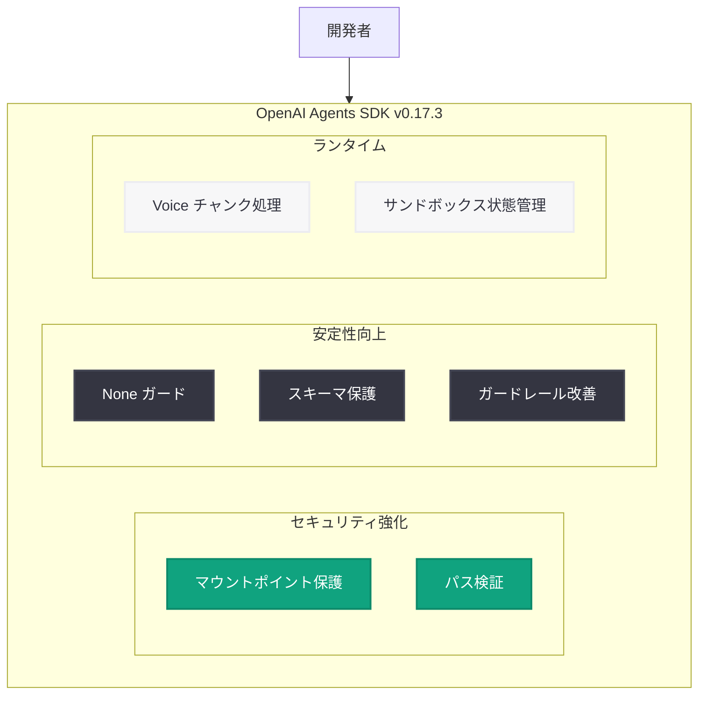

# OpenAI Agents SDK v0.17.3: サンドボックスセキュリティと安定性の向上

## メタデータ

| 項目 | 内容 |
|------|------|
| 発表日 | 2026-05-19 |
| ソース | OpenAI API Changelog / GitHub |
| カテゴリ | SDK アップデート / バグ修正 |
| 公式リンク | [GitHub Release v0.17.3](https://github.com/openai/openai-agents-python/releases/tag/v0.17.3) |

## 概要

OpenAI Agents SDK v0.17.3 がリリースされた。本リリースはバグ修正に重点を置いたメンテナンスリリースで、14 件の修正と複数のドキュメント改善を含む。特にサンドボックスのセキュリティ強化 (マウントポイント認証情報の漏洩防止)、メモリ依存関係のインポートエラー統一、出力ガードレールのカウント追加など、エージェントの安全性と安定性を向上させる重要な修正が含まれている。

## 主な内容

### セキュリティ関連の修正

#### マウントポイント認証情報の保護

```python
# 修正前: サンドボックスコマンドに認証情報が露出する可能性
# 修正後: 認証情報がサンドボックスコマンドから除外される
```

- **PR #3429**: `keep mountpoint credentials out of sandbox commands` - サンドボックス実行時にマウントポイントの認証情報がコマンドに含まれないよう修正
- **PR #3422**: `reject relative sandbox workspace roots` - 相対パスによるサンドボックスワークスペースルートを拒否し、パストラバーサル攻撃を防止

### 安定性の向上

| PR | 修正内容 | 影響 |
|----|----------|------|
| #3375 | `None` テキストの `text_message_output` でのガード | NoneType エラーの防止 |
| #3382 | `FunctionTool` の `params_json_schema` ミューテーション防止 | スキーマ破壊の防止 |
| #3385 | Codex 出力スキーマ入力のミューテーション防止 | データ整合性の確保 |
| #3358 | `Literal` 型の出力スキーマ名修正 | 型情報の正確性向上 |
| #3394 | `ItemHelpers.extract_last_content` での `None` テキストガード | ランタイムエラー防止 |
| #3411 | 出力ガードレール例外のログ記録 | デバッグ可能性の向上 |

### Realtime / Voice 関連

- **PR #3364**: カスタム音声スプリッターの短いチャンクを正しく処理 - `honor short custom voice splitter chunks`
- **PR #3451**: ランタイムハンドリングの更新

### サンドボックス関連

- **PR #3410**: Vercel サンドボックスがターミナル状態の場合に `wait_for_status` をスキップ
- **PR #3424**: 公開ポートクエリの先頭疑問符を正規化

### その他の修正

- **PR #3389**: メモリオプション依存関係のインポートエラーを統一
- **PR #3386**: `remove_all_tools` ハンドオフフィルターで `hosted_tool_call` タイプをフィルタリング
- **PR #3375**: `RunErrorDetails` に出力ガードレールカウントを追加

## ドキュメント改善

- SDK レビューガイダンスの追加
- `Agent.instructions` をオプションとしてマーク
- `auto_previous_response_id` のドキュメント化
- LiteLLM API リファレンスリダイレクトの修正
- 新しい設定を使用した全ページ翻訳

## 技術的な詳細

### インストール / アップグレード

```bash
pip install --upgrade openai-agents==0.17.3
```

### 主要な修正の詳細

#### 出力ガードレールの改善

```python
from agents import Agent, OutputGuardrail, RunErrorDetails

# v0.17.3 以降: ガードレール例外がログに記録される
# v0.17.3 以降: RunErrorDetails に output_guardrail_count が含まれる
agent = Agent(
    name="my_agent",
    output_guardrails=[my_guardrail],  # 例外時もログが残る
)
```

#### サンドボックスセキュリティ

```python
from agents.sandbox import SandboxConfig

# v0.17.3 以降: 相対パスは拒否される
config = SandboxConfig(
    workspace_root="/absolute/path/only"  # 相対パスは ValueError
)
```

## アーキテクチャ



## 開発者への影響

- **セキュリティ強化**: サンドボックス環境での認証情報漏洩リスクが低減。特にマウントポイントを使用する環境で重要
- **安定性向上**: `None` 値の適切なハンドリングにより、本番環境でのランタイムエラーが減少
- **デバッグ改善**: 出力ガードレール例外のログ記録により、問題の特定が容易に
- **Voice エージェント**: カスタム音声スプリッターの短いチャンク処理が正しく動作するように
- **Vercel 統合**: サンドボックスの状態管理改善により、不要な待機を回避

## 新規コントリビューター

- @zhoufengen
- @hintz-openai
- @cty-ut
- @ynachiket
- @LeSingh1
- @adrianbravo-oai

## 関連リンク

- [GitHub Release v0.17.3](https://github.com/openai/openai-agents-python/releases/tag/v0.17.3)
- [OpenAI Agents SDK ドキュメント](https://openai.github.io/openai-agents-python/)
- [前バージョン v0.17.2 リリースノート](https://github.com/openai/openai-agents-python/releases/tag/v0.17.2)
- [OpenAI Agents SDK v0.17.0 (メジャーアップデート)](https://github.com/openai/openai-agents-python/releases/tag/v0.17.0)

## まとめ

OpenAI Agents SDK v0.17.3 は、セキュリティと安定性に焦点を当てたメンテナンスリリースである。14 件のバグ修正の中で、特にサンドボックスのマウントポイント認証情報保護と相対パス拒否は、エージェントをプロダクション環境で安全に運用するために重要な修正である。また、`None` 値のガード処理やスキーマのミューテーション防止は、ランタイムの安定性を大幅に向上させる。エージェント開発者は早急にアップグレードすることが推奨される。
