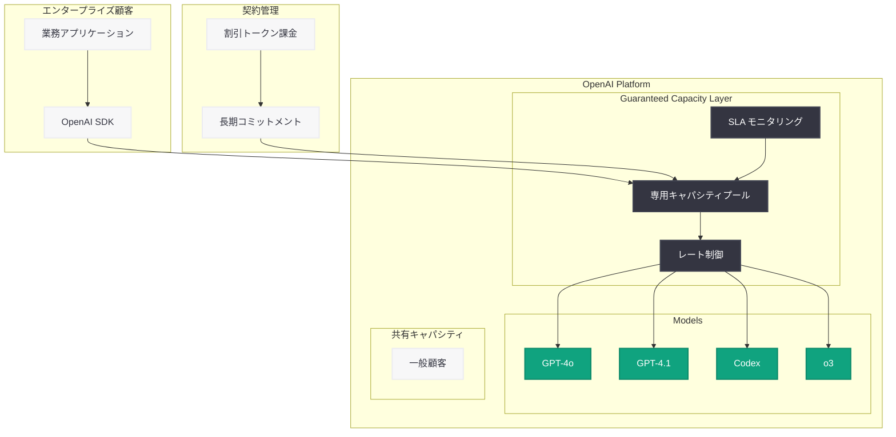

# OpenAI が「Guaranteed Capacity」を発表 - エンタープライズ向け専用コンピュートキャパシティ確保プログラム

## メタデータ

| 項目 | 内容 |
|------|------|
| 発表日 | 2026-05-19 |
| ソース | OpenAI News |
| カテゴリ | エンタープライズ / 料金プラン |
| 公式リンク | [openai.com/business/guaranteed-capacity](https://openai.com/business/guaranteed-capacity/) |

## 概要

OpenAI は 2026 年 5 月 19 日、エンタープライズ顧客向けの新サービス「Guaranteed Capacity」を発表した。このプログラムでは、長期コミットメント契約を通じて専用の API コンピュートキャパシティを確保でき、予測可能なアクセスと割引トークン価格が提供される。

大規模な API 利用を行うエンタープライズ顧客にとって、ピーク時のレート制限やキャパシティ不足は深刻な課題であった。Guaranteed Capacity はこの問題を解消し、複数年契約による大幅なディスカウントを提供することで、企業の AI 投資計画を長期的に支援する仕組みとなっている。

## 主な内容

### 専用キャパシティの確保

Guaranteed Capacity は、契約企業に対して OpenAI の API インフラストラクチャ上で専用のコンピュートリソースを割り当てるサービスである。

- **専用コンピュートリソース**: 他の顧客の利用状況に影響されない、保証されたスループット
- **レート制限の緩和**: 通常の共有キャパシティよりも高いリクエストレートを確保
- **SLA 保証**: エンタープライズグレードの可用性とレスポンスタイム保証

### 長期コミットメントと料金体系

複数年の契約コミットメントに応じて、段階的なディスカウントが適用される。

| コミットメント期間 | メリット |
|-------------------|---------|
| 1 年契約 | 予測可能な API アクセス、基本ディスカウント |
| 複数年契約 | 大幅なトークン価格割引、優先サポート |
| カスタム契約 | 個別ニーズに応じたキャパシティ設計 |

割引トークン価格は、Chat Completions API、Assistants API、Codex など主要サービス全体に適用される。Codex 利用に関するレートカードも提供されており、コーディングエージェントの大規模展開を計画する企業にとって有利な条件が設定されている。

### エンタープライズ戦略との連携

Guaranteed Capacity は、OpenAI のエンタープライズ戦略における一連の取り組みの延長線上にある。

- **FedRAMP 認証**: 米国政府機関向けコンプライアンス対応
- **AWS Bedrock 統合**: AWS 上での OpenAI モデル提供
- **Dell パートナーシップ**: オンプレミス / ハイブリッド環境対応
- **Guaranteed Capacity**: 専用リソースと長期価格の確定

## 技術的な詳細

### キャパシティモデル

Guaranteed Capacity の技術的な仕組みは以下の通りである。

- **専用スループット**: 契約で定められた TPM (Tokens Per Minute) が保証される
- **バースト対応**: 基本キャパシティを超えるスパイクにも一定の余裕を確保
- **モデル対応**: GPT-4o、GPT-4.1、Codex、o3 など最新モデルに適用可能
- **API 互換性**: 既存の API エンドポイントをそのまま利用可能。コード変更不要

### 申し込みプロセス

1. [公式リクエストフォーム](https://openai.com/business/guaranteed-capacity/) から申し込み
2. OpenAI エンタープライズチームによる利用要件のヒアリング
3. カスタムキャパシティプランの設計と見積もり
4. 契約締結後、専用キャパシティの割り当て開始

## アーキテクチャ

## 開発者への影響

- **安定した API アクセス**: ピーク時のレート制限や 429 エラーを回避し、ミッションクリティカルなワークロードを安定稼働させられる
- **コスト予測の向上**: 長期契約による固定的なトークン単価により、AI 関連コストの予算策定が容易になる
- **スケーリング計画の確実性**: 事前にキャパシティが確保されているため、ユーザー増加や新機能リリース時のスケーリングが保証される
- **Codex 大規模展開**: レートカードの提供により、AI コーディングエージェントを組織全体に展開する際のコスト計算が明確になる
- **マルチモデル戦略**: 専用キャパシティ内で複数モデルを利用でき、ユースケースに応じた最適なモデル選択が可能

## 関連リンク

- [OpenAI Guaranteed Capacity 申し込み](https://openai.com/business/guaranteed-capacity/)
- [OpenAI Enterprise](https://openai.com/enterprise)
- [OpenAI API Platform](https://platform.openai.com/)
- [OpenAI Models on AWS](https://openai.com/index/openai-models-codex-managed-agents-aws)
- [Dell Codex Enterprise Partnership](https://openai.com/index/dell-codex-enterprise-partnership)

## まとめ

OpenAI の Guaranteed Capacity は、エンタープライズ顧客が AI API の利用を本番環境で確実に拡大するための基盤となるサービスである。長期コミットメントに対する割引トークン価格と専用キャパシティの保証により、企業は AI 投資のリスクを低減しながら、予測可能なコストで大規模な AI ワークロードを運用できる。FedRAMP、AWS Bedrock、Dell パートナーシップに続くこの発表は、OpenAI がクラウド AI プロバイダーからエンタープライズ AI プラットフォームへと進化を遂げていることを示している。
