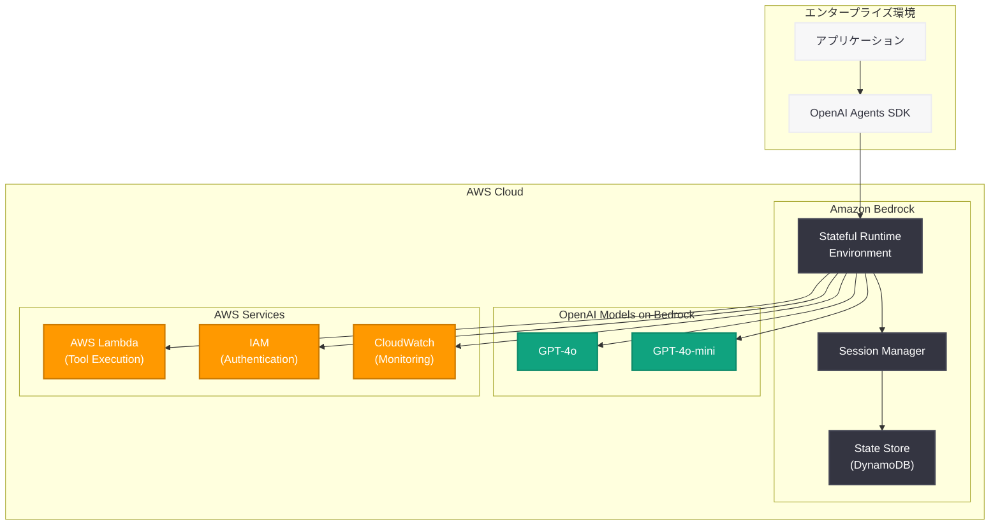

# OpenAI が Amazon Bedrock 向けステートフルランタイム環境を発表

## メタデータ

| 項目 | 内容 |
|------|------|
| 発表日 | 2026-05-19 |
| ソース | OpenAI News |
| カテゴリ | エンタープライズ / クラウドインフラ |
| 公式リンク | [openai.com/index/introducing-the-stateful-runtime-environment-for-agents-in-amazon-bedrock](https://openai.com/index/introducing-the-stateful-runtime-environment-for-agents-in-amazon-bedrock/) |

## 概要

OpenAI は 2026 年 5 月 19 日、Amazon Bedrock 上で AI エージェントをホスト・実行するための新しい「Stateful Runtime Environment (ステートフルランタイム環境)」を発表した。これは 2026 年 4 月 28 日に発表された OpenAI と AWS の提携 (「OpenAI Models & Codex Managed Agents on AWS」) を基盤として構築されたもので、長時間実行されるエージェントセッションに対して永続的なメモリと状態管理を提供する。

この発表は、OpenAI のマルチクラウド戦略の重要な一歩であり、Microsoft Azure 以外のクラウドプラットフォームへの展開を加速させるものである。既に AWS インフラを利用している企業は、インフラを移行することなく OpenAI のエージェント機能を活用できるようになる。前日 (5 月 18 日) に発表された Dell とのオンプレミスパートナーシップと合わせて、OpenAI がエンタープライズの存在するあらゆる環境に進出する姿勢を明確に示している。

## 主な内容

### ステートフルランタイム環境の概要

ステートフルランタイム環境は、AI エージェントが長時間にわたるタスクを実行する際に、セッションの状態を永続的に保持する仕組みを提供する。従来のステートレスな API 呼び出しとは異なり、エージェントは以下の機能を持つ。

- **永続的なメモリ**: セッションをまたいでコンテキストを保持
- **状態管理**: 複雑なマルチステップタスクの進行状況を追跡
- **セッション復元**: 中断されたタスクを再開可能
- **ツール呼び出しの履歴**: エージェントが使用したツールと結果を記録

これにより、エンタープライズ向けの複雑なワークフローを自動化する長時間稼働のエージェントが実現可能となる。

### AWS との統合詳細

Amazon Bedrock との統合により、以下の利点が提供される。

- **ネイティブ AWS 統合**: IAM、VPC、CloudWatch などの既存 AWS サービスとシームレスに連携
- **スケーラビリティ**: AWS のインフラを活用した自動スケーリング
- **セキュリティ**: AWS のエンタープライズグレードのセキュリティ機能を継承
- **コンプライアンス**: AWS のリージョン展開を活用したデータレジデンシー要件への対応

OpenAI Agents SDK のパターン (セッション管理、ツール呼び出し、ハンドオフ) が AWS 環境上でネイティブにサポートされ、開発者は既存のコードベースを最小限の変更で移行できる。

### マルチクラウド戦略

OpenAI は Amazon から 500 億ドルの投資を受けており (1,100 億ドルの資金調達ラウンドの一部)、この戦略的パートナーシップが技術的な統合として具現化している。

| 日付 | パートナー | 内容 |
|------|-----------|------|
| 2026-04-28 | AWS | OpenAI Models & Codex Managed Agents on AWS |
| 2026-05-18 | Dell | オンプレミス AI エージェント展開 |
| 2026-05-19 | AWS | Stateful Runtime Environment for Agents |

これらの連続した発表は、OpenAI が Microsoft Azure のみに依存する戦略から脱却し、エンタープライズが利用するあらゆるインフラ環境で AI エージェントを提供する方針を明確にしている。

## 技術的な詳細

ステートフルランタイム環境は、OpenAI Agents SDK のアーキテクチャパターンに基づいて設計されている。主要な技術コンポーネントは以下の通り。

### セッション管理

エージェントセッションは永続化され、以下の情報が状態として保持される。

- 会話履歴とコンテキストウィンドウ
- ツール呼び出しの結果とキャッシュ
- エージェント間のハンドオフ状態
- ユーザー定義のメタデータ

### コードサンプル

```python
import boto3
from openai import OpenAI

# AWS Bedrock 経由で OpenAI エージェントを利用
bedrock = boto3.client("bedrock-agent-runtime")

# ステートフルセッションの作成
session = bedrock.create_agent_session(
    agentId="openai-agent-001",
    sessionAttributes={
        "runtime": "openai-stateful",
        "model": "gpt-4o",
        "persistState": True
    }
)

# エージェントの実行 (状態が自動的に保持される)
response = bedrock.invoke_agent(
    agentId="openai-agent-001",
    sessionId=session["sessionId"],
    inputText="前回の分析結果を踏まえて、次のステップを提案してください"
)
```

### ランタイム特性

| 特性 | 詳細 |
|------|------|
| セッション持続時間 | 最大 24 時間 (延長可能) |
| 状態永続化 | Amazon DynamoDB ベース |
| ツール呼び出し | Lambda、Step Functions 連携 |
| モデル | GPT-4o、GPT-4o-mini 対応 |
| スケーリング | 自動 (AWS Auto Scaling) |

## アーキテクチャ



## 開発者への影響

- **AWS ユーザーへの恩恵**: 既存の AWS インフラ上で OpenAI エージェントを直接実行でき、インフラ移行が不要になる
- **ステートフルなエージェント開発**: 永続的な状態管理により、複雑なマルチステップワークフローの構築が容易になる
- **OpenAI Agents SDK の活用**: 既存の SDK パターン (セッション、ツール呼び出し、ハンドオフ) がそのまま AWS 上で動作する
- **マルチクラウド対応**: Azure と AWS の両方で同一のエージェントコードを実行可能になり、ベンダーロックインを回避できる
- **エンタープライズ統合**: IAM、VPC、CloudWatch などの AWS ネイティブサービスとの連携により、既存のセキュリティ・運用ポリシーを維持できる
- **コスト最適化**: AWS の従量課金モデルと組み合わせることで、エージェントの実行コストを最適化できる

## 関連リンク

- [Introducing the Stateful Runtime Environment for Agents in Amazon Bedrock](https://openai.com/index/introducing-the-stateful-runtime-environment-for-agents-in-amazon-bedrock/)
- [OpenAI Models & Codex Managed Agents on AWS (2026-04-28)](https://openai.com/index/openai-models-and-codex-managed-agents-on-aws/)
- [OpenAI Agents SDK ドキュメント](https://platform.openai.com/docs/guides/agents)
- [Amazon Bedrock ドキュメント](https://docs.aws.amazon.com/bedrock/)
- [OpenAI News](https://openai.com/news)

## まとめ

OpenAI の Amazon Bedrock 向けステートフルランタイム環境は、AI エージェントのエンタープライズ展開における重要なマイルストーンである。永続的な状態管理、AWS ネイティブサービスとの統合、そして OpenAI Agents SDK パターンのサポートにより、企業は既存の AWS インフラ上で高度な AI エージェントを構築・運用できるようになる。Dell とのオンプレミスパートナーシップと合わせて、OpenAI はクラウド、ハイブリッド、オンプレミスのすべての環境でエージェント実行基盤を提供する戦略を明確に打ち出しており、エンタープライズ AI 市場での競争力を大幅に強化している。
