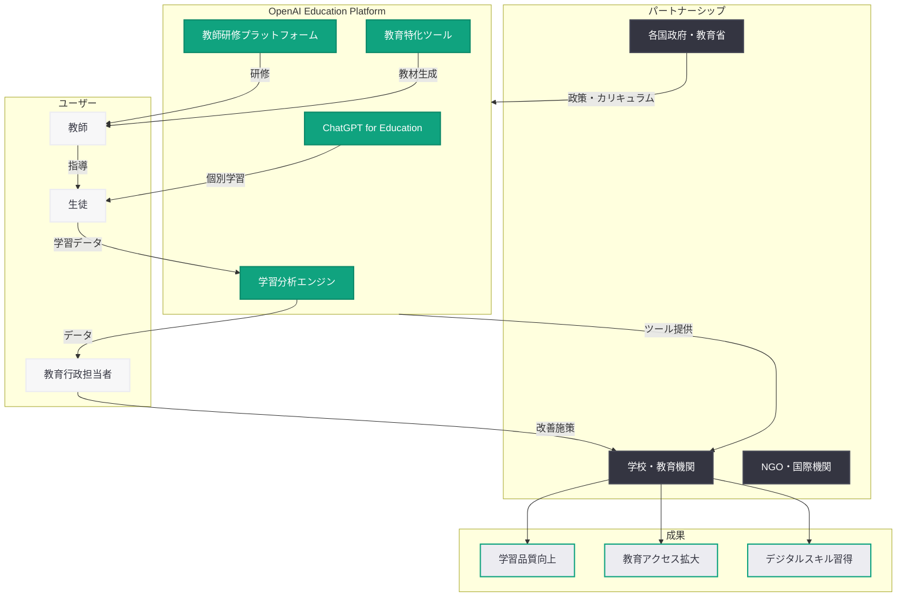

# OpenAI「Education for Countries」プログラムが次のフェーズへ: 新パートナーシップと教師研修で世界の教育変革を加速

## メタデータ

| 項目 | 内容 |
|------|------|
| 発表日 | 2026-05-20 |
| ソース | OpenAI News |
| カテゴリ | Global Affairs / 教育 |
| 公式リンク | [The next phase of OpenAI's Education for Countries](https://openai.com/index/the-next-phase-of-education-for-countries) |

## 概要

OpenAI は 2026 年 5 月 20 日、同社の教育プログラム「Education for Countries」の次のフェーズを発表した。このプログラムは、世界各国の学校における AI 導入を加速させるもので、新たなパートナーシップの締結、教師向けトレーニングの拡充、学習成果を向上させるためのツール提供を柱としている。

Education for Countries は、AI 技術を活用してグローバルな教育格差を縮小し、すべての学習者に質の高い教育機会を提供することを目指す OpenAI の包括的な取り組みである。今回の拡張フェーズでは、より多くの国々への展開と実践的な教育現場での AI 活用が重点化されている。

## 主な内容

### Education for Countries プログラムとは

Education for Countries は、OpenAI が各国政府や教育機関と連携し、AI テクノロジーを教育システムに統合するために設計されたグローバルプログラムである。このプログラムの主な目的は以下の通り。

- **教育アクセスの民主化:** 地理的・経済的障壁を超えて質の高い教育を提供
- **教師の能力強化:** AI ツールを活用した授業設計・個別指導の支援
- **学習成果の向上:** データ駆動型のアプローチで生徒一人ひとりの学習進捗を最適化
- **教育インフラの近代化:** 各国の教育システムに AI を安全かつ効果的に組み込む

### 新パートナーシップの発表

今回の次フェーズでは、複数の国々との新たなパートナーシップが発表された。OpenAI はこれまでにも各国政府や教育省との連携を進めてきたが、今回の拡張により対象地域が大幅に広がることになる。

パートナーシップの構造は以下の要素を含む。

| 要素 | 内容 |
|------|------|
| 政府間協定 | 各国教育省との正式な協力関係の構築 |
| 技術提供 | ChatGPT をはじめとする AI ツールの教育機関向け提供 |
| カリキュラム開発 | AI を活用した教材・カリキュラムの共同開発 |
| 評価フレームワーク | AI 導入の効果を測定するための指標策定 |

### 教師研修イニシアティブ

プログラムの中核をなす教師研修イニシアティブは、教育現場で AI を効果的に活用するための包括的なトレーニング体系を提供する。

**研修の主要領域:**

1. **AI リテラシーの基礎:** AI の仕組みと可能性、限界についての理解
2. **授業への AI 統合:** ChatGPT やその他の AI ツールを授業計画や教材作成に活用する実践的スキル
3. **個別最適化学習の設計:** AI を活用して生徒一人ひとりの学習ペースやスタイルに合わせた指導を実現する方法
4. **倫理的な AI 活用:** AI の安全な利用、プライバシー保護、学術的誠実性の確保

**研修の提供形態:**

- オンラインコースとワークショップの組み合わせ
- 現地パートナーによるローカライズされたトレーニング
- ピアメンタリングとコミュニティ形成
- 継続的なサポートとリソース提供

### 学校向け AI ツールの提供

OpenAI は教育機関向けに特化した AI ツールセットを提供し、教室での日常的な活用を支援する。

**提供されるツールと機能:**

- **AI チューター:** 生徒の理解度に応じた個別指導を提供するカスタマイズされた AI アシスタント
- **教材生成ツール:** 各国のカリキュラムに準拠した教材・問題・評価課題の自動生成
- **多言語サポート:** 現地語での学習コンテンツ提供と翻訳支援
- **学習分析ダッシュボード:** 生徒の進捗状況を可視化し、教師の意思決定を支援
- **安全機能:** 教育環境に適したコンテンツフィルタリングとプライバシー保護

### グローバルな学習成果への影響

Education for Countries プログラムは、以下の学習成果指標の改善を目指している。

- **基礎学力の向上:** 読解力・数学力・科学リテラシーの底上げ
- **学習格差の縮小:** 都市部と農村部、先進国と途上国間の教育品質差の低減
- **ドロップアウト率の低下:** 個別最適化された学習体験による学習意欲の維持
- **デジタルスキルの習得:** AI 時代に必要な基礎的デジタルリテラシーの普及
- **教師の業務効率化:** 管理業務の自動化による授業準備・生徒対応時間の確保

### 参加国の拡大

Education for Countries の次フェーズでは、アフリカ、東南アジア、ラテンアメリカ、中東を含む多様な地域への展開が計画されている。OpenAI はこれまでにも複数の国々でパイロットプログラムを実施しており、今回の拡張はその成果に基づくスケールアップである。

展開地域の特徴。

- **アフリカ:** 急速に成長する若年人口に対する教育需要への対応
- **東南アジア:** 多言語・多文化環境での AI 教育ツールの適応
- **ラテンアメリカ:** 農村部を含む広域な教育アクセスの改善
- **中東:** デジタルトランスフォーメーションを推進する各国政府との連携

## アーキテクチャ

## 教育関係者への影響

- **教師:** AI ツールにより授業準備や採点の効率が向上し、生徒との対話やメンタリングにより多くの時間を充てられるようになる
- **生徒:** 個別最適化された学習体験により、自分のペースで理解を深められる環境が整う
- **教育行政:** データに基づいた政策立案と教育リソースの最適配分が可能になる
- **開発者:** 教育向け AI アプリケーションの開発機会が拡大し、各国の教育 API やプラットフォームとの連携需要が増加する
- **EdTech 企業:** OpenAI のエコシステムとの統合により、既存の教育テクノロジーの価値が向上する
- **国際教育機関:** AI を活用した教育支援の新たなモデルケースとして、他の取り組みへの応用が期待される

## 関連リンク

- [The next phase of OpenAI's Education for Countries](https://openai.com/index/the-next-phase-of-education-for-countries)
- [OpenAI Global Affairs](https://openai.com/global-affairs)
- [OpenAI Academy](https://openai.com/index/openai-academy-launch/)
- [OpenAI News](https://openai.com/news)

## まとめ

OpenAI の「Education for Countries」プログラムの次フェーズは、AI テクノロジーを通じたグローバルな教育変革を加速させる重要な取り組みである。新パートナーシップの締結、教師研修の拡充、教育特化ツールの提供を三本柱とし、世界各地の学校での AI 導入を促進する。

特に、教師のエンパワーメントを重視したアプローチは、AI が教師を代替するのではなく、教師の能力を拡張するという OpenAI の教育哲学を反映している。多言語対応やローカライズされたコンテンツの提供により、文化的・言語的多様性を尊重しながら、すべての学習者に質の高い教育機会を届けることを目指している。
