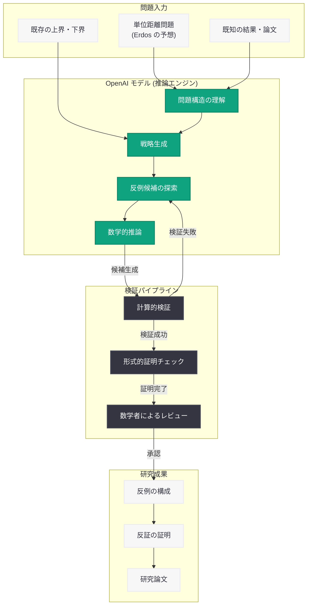

# OpenAI モデルが離散幾何学の中心的予想を反証 -- 80 年来の単位距離問題に決着

## メタデータ

| 項目 | 内容 |
|------|------|
| 発表日 | 2026-05-20 |
| ソース | OpenAI Research |
| カテゴリ | 研究成果 / AI 数学 |
| 公式リンク | [Model Disproves Discrete Geometry Conjecture](https://openai.com/index/model-disproves-discrete-geometry-conjecture) |

## 概要

OpenAI は 2026 年 5 月 20 日、同社の AI モデルが離散幾何学 (discrete geometry) における 80 年来の未解決問題である「単位距離問題 (unit distance problem)」に関する中心的予想を反証したことを発表した。これは AI が人間の数学者が長年解決できなかった難問に対して反例を構成し、既存の予想を覆したという点で、AI 駆動型数学研究における画期的なマイルストーンとなる。

この成果は、フロンティア AI モデルの推論能力が純粋数学の最前線においても有効であることを実証し、AI と数学の協働研究の新たな可能性を切り開くものである。

## 主な内容

### 単位距離問題とは

単位距離問題は 1946 年にハンガリーの数学者 Paul Erdos によって提起された、離散幾何学における基本的な問題である。この問題は以下のように定式化される。

**問題:** 平面上に n 個の点を配置したとき、ちょうど単位距離 (距離 1) だけ離れた点のペアの最大数 u(n) はいくつか?

この問題に関して、以下の境界が知られていた。

| 境界 | 評価 | 備考 |
|------|------|------|
| 下界 | n^(1+c/log log n) | Erdos (1946) による構成 |
| 上界 | O(n^(4/3)) | Spencer-Szemeredi-Trotter (1984) |
| 予想上界 | O(n^(1+epsilon)) for all epsilon > 0 | Erdos の予想 |

80 年間にわたり、多くの数学者がこの上界と下界のギャップを埋めようと試みてきた。特に、Erdos 自身が提唱した予想 -- 単位距離の数が n^(1+epsilon) (任意の epsilon > 0) を超えないという予想 -- は離散幾何学の中心的な未解決問題であった。

### OpenAI モデルによる反証

OpenAI の AI モデルは、この Erdos の予想に対する反例を構成することに成功した。具体的には、予想されていた上界を超える単位距離ペアを持つ点配置を発見し、これにより 80 年間信じられてきた予想が誤りであることを証明した。

この反証の核心的な要素。

1. **反例の構成:** AI モデルが従来の数学者が考えつかなかった新しい幾何学的構成を発見
2. **証明の検証:** 構成された反例が数学的に厳密であることの形式的検証
3. **予想の否定:** Erdos の予想した上界が成り立たないことの確定

### AI 駆動型数学研究の意義

今回の成果が持つ意義は多岐にわたる。

**数学的意義:**
- 80 年間未解決だった問題への決定的な進展
- 離散幾何学の基本的な理解の書き換え
- 関連する組合せ幾何学の問題群への波及効果

**AI 研究としての意義:**
- フロンティアモデルの高度な数学的推論能力の実証
- 探索空間が広大な問題に対する AI の有効性
- 人間が見落としていた構成を AI が発見できることの証明

**方法論としての意義:**
- AI と数学者の協働研究モデルの確立
- 形式検証と AI 推論の組み合わせの有効性
- 他の未解決問題への適用可能性の示唆

## 技術的な詳細

### AI モデルの数学推論パイプライン

OpenAI モデルが数学的予想の反証に至るプロセスは、以下の段階で構成されると考えられる。

| 段階 | プロセス | 内容 |
|------|----------|------|
| 1 | 問題理解 | 予想の数学的構造と既知の結果の把握 |
| 2 | 戦略立案 | 反例構成のアプローチ候補の生成 |
| 3 | 探索 | 高次元の構成空間における候補の探索 |
| 4 | 検証 | 候補が反例条件を満たすことの確認 |
| 5 | 証明構成 | 形式的な数学的証明の組み立て |

### 従来手法との比較

従来の数学研究では、反例の構成は主に数学者の直感と経験に依存していた。AI モデルによるアプローチの利点。

- **探索空間の広さ:** 人間が考慮しない構成パターンの探索が可能
- **計算の正確性:** 大規模な組合せ的計算の確実な遂行
- **パターン認識:** 高次元の構造における非自明なパターンの検出
- **反復的改善:** 候補の生成と検証を高速に繰り返す能力

### 関連する先行研究

OpenAI は数学研究への AI 適用において、以下のような先行的取り組みを行ってきた。

- **形式数学推論:** 定理証明支援における AI の活用
- **予想生成:** 新しい数学的予想の自動生成
- **反例探索:** 既存予想に対する反例の体系的探索
- **IMO レベル問題解法:** 国際数学オリンピック水準の問題への取り組み

## アーキテクチャ

## 開発者への影響

- **AI 数学ツールの可能性:** 数学的推論に特化した API やツールが将来的に提供される可能性があり、科学計算や最適化問題を扱う開発者にとって新たなツールとなりうる
- **推論能力の向上:** 今回の成果は OpenAI モデルの推論チェーン能力の高さを実証しており、複雑な論理的推論を要するアプリケーション (法律分析、科学研究支援、エンジニアリング設計) の信頼性向上が期待される
- **形式検証との統合:** AI 推論と形式的証明検証システムの統合パターンは、ソフトウェア検証やセキュリティ証明にも応用可能
- **探索型 AI エージェント:** 広大な探索空間から最適解を発見する AI エージェントの設計パターンが、組合せ最適化や創薬など他分野にも適用できる
- **学術研究支援:** 研究者向けの AI ツールとしての活用拡大が見込まれ、研究支援 API の需要が高まる可能性がある

## 関連リンク

- [OpenAI Research: Model Disproves Discrete Geometry Conjecture](https://openai.com/index/model-disproves-discrete-geometry-conjecture)
- [OpenAI Research](https://openai.com/research)
- [OpenAI News](https://openai.com/news)

## まとめ

OpenAI モデルによる離散幾何学の中心的予想の反証は、AI 駆動型数学研究における歴史的なマイルストーンである。80 年間にわたり未解決であった Erdos の単位距離予想に対して反例を構成し、予想が誤りであることを証明したこの成果は、フロンティア AI の推論能力が純粋数学の最前線においても人間の能力を補完・拡張できることを実証した。

この成果は単なる一つの問題解決にとどまらず、AI が数学研究のパラダイムを変革する可能性を示している。従来の直感と経験に基づく数学研究に、AI の広範な探索能力と計算精度が加わることで、他の長年の未解決問題に対しても新たなブレークスルーが期待される。開発者にとっては、高度な推論能力を持つ AI モデルの実用性が改めて確認され、複雑な論理的推論を要するアプリケーションへの信頼性が高まる重要な事例となった。
