# OpenAI がシンガポールに初の海外応用 AI ラボを設立、3 億シンガポールドル超を投資

## メタデータ

| 項目 | 内容 |
|------|------|
| 発表日 | 2026-05-20 |
| ソース | OpenAI News |
| カテゴリ | 企業戦略 / 国際展開 |
| 公式リンク | [Bloomberg 報道](https://www.bloomberg.com/news/articles/2026-05-20/openai-commits-234-million-for-new-ai-lab-in-singapore) |

## 概要

OpenAI は 2026 年 5 月 20 日、シンガポールに米国外初となる「応用 AI ラボ (Applied AI Lab)」を設立することを発表した。この取り組みには 3 億シンガポールドル (約 2 億 3,400 万米ドル) 以上の投資が伴い、シンガポール政府との複数年にわたるパートナーシップとして推進される。

OpenAI は 2024 年にアジア第 2 の拠点としてシンガポールオフィスを開設しており、今回の発表はその既存プレゼンスの大幅な拡大を意味する。同社は今後数年間でシンガポール拠点の技術チームを 200 名以上に拡大する計画であり、応用 AI 研究を通じてシンガポールの AI 国家戦略を支援する方針を示している。

## 主な内容

### 投資規模とパートナーシップの構造

OpenAI が今回コミットした投資額は 3 億シンガポールドル (S$300M) 超、米ドル換算で約 2 億 3,400 万ドルに上る。これはシンガポール政府との複数年にわたる正式なパートナーシップ契約に基づくものであり、以下の要素を含む。

- **施設整備:** 応用 AI ラボの物理的な研究施設の設立
- **人材採用:** 技術チームの 200 名以上への拡大
- **研究活動:** シンガポールの AI 目標に沿った応用研究の推進
- **エコシステム構築:** 地域の AI コミュニティとの連携強化

### 米国外初の応用 AI ラボ

今回設立される「応用 AI ラボ」は、OpenAI にとって米国外で初めてとなる研究開発拠点である。「応用 (Applied)」という名称が示す通り、基礎研究よりも実用的な AI 技術の開発と社会実装に重点を置く施設となる。

この戦略的判断の背景には以下の要因がある。

1. **地理的多様性:** 研究開発能力の地理的分散によるリスク軽減と多様な視点の獲得
2. **アジア市場への近接性:** 急成長するアジア太平洋地域での AI 需要に直接対応
3. **政府との連携:** シンガポール政府の積極的な AI 推進政策との相乗効果
4. **人材獲得:** アジア太平洋地域の優秀な AI 人材へのアクセス

### シンガポールの AI 国家戦略との連動

シンガポールは AI 先進国としての地位を確立するため、複数のテクノロジー企業とパートナーシップを進めている。Google とも AI 能力の強化に関する合意を締結しており、OpenAI のラボ設立はこうした国家レベルの AI 戦略の一環として位置づけられる。

シンガポール政府が AI ハブとしての魅力を高めている要因。

- **規制環境:** AI イノベーションに友好的かつ責任ある規制フレームワーク
- **インフラ:** 高度なデジタルインフラと通信環境
- **人材プール:** 多言語・多文化な高度人材の集積
- **地政学的位置:** 東南アジアの中心に位置するハブとしての役割

## 技術的な詳細

### 応用 AI ラボの想定される研究領域

「応用 AI ラボ」の名称から推測される研究開発の焦点分野。

| 分野 | 内容 |
|------|------|
| 多言語 AI | 東南アジア言語への対応強化と多言語処理の高度化 |
| 産業応用 | 製造業、金融、物流など地域産業への AI 適用 |
| 公共セクター AI | 政府サービス、都市計画、教育への AI 導入 |
| AI セーフティ | 地域の文化・法制度に適合した安全性研究 |
| エッジ AI | 低レイテンシが求められるアジア地域向けの最適化 |

### チーム構成の見通し

200 名以上の技術チーム構成として想定される人員配分。

- **研究者 (Researchers):** 応用 AI 研究の遂行
- **エンジニア (Engineers):** モデルの最適化とシステム開発
- **プロダクトマネージャー (Product Managers):** 地域ニーズに基づく製品開発
- **ポリシー専門家 (Policy Experts):** 規制対応と政府連携
- **オペレーション (Operations):** ラボ運営とパートナーシップ管理

## アーキテクチャ

```mermaid
flowchart TD
    subgraph Global["OpenAI グローバル拠点"]
        subgraph US["米国本社 (サンフランシスコ)"]
            Research["基礎研究"]
            CoreEng["コアエンジニアリング"]
            Safety["AI セーフティ"]
        end
        subgraph SG["シンガポール応用 AI ラボ (新設)"]
            Applied["応用 AI 研究"]
            Regional["地域展開チーム"]
            GovPartner["政府連携"]
        end
        subgraph Other["その他グローバル拠点"]
            London["ロンドン"]
            Dublin["ダブリン"]
            Tokyo["東京"]
        end
    end

    subgraph SGGov["シンガポール政府"]
        NationalAI["国家 AI 戦略"]
        Funding["S$300M+ 投資"]
        Ecosystem["AI エコシステム"]
    end

    subgraph Partners["地域パートナー"]
        Enterprise["企業パートナー"]
        Academia["学術機関"]
        Startups["スタートアップ"]
    end

    Research -->|技術移転| Applied
    CoreEng -->|基盤技術| Applied
    Safety -->|安全性基準| Applied

    NationalAI -->|方針| GovPartner
    Funding -->|資金| SG
    Ecosystem -->|連携| Regional

    Applied -->|研究成果| Enterprise
    Applied -->|共同研究| Academia
    Regional -->|支援| Startups

    classDef openai fill:#10A37F,stroke:#0D8A6A,stroke-width:2px,color:white
    classDef dark fill:#343541,stroke:#444654,stroke-width:2px,color:white
    classDef light fill:#F7F7F8,stroke:#ECECF1,stroke-width:2px,color:#343541
    classDef sg fill:#EF3340,stroke:#C4202C,stroke-width:2px,color:white

    class Research,CoreEng,Safety,Applied,Regional,GovPartner openai
    class London,Dublin,Tokyo dark
    class Enterprise,Academia,Startups light
    class NationalAI,Funding,Ecosystem sg
```

## 開発者への影響

- **アジア太平洋地域での API パフォーマンス向上:** シンガポール拠点の拡大により、将来的にアジア地域向けの推論インフラが強化され、レイテンシの改善が期待される
- **多言語モデルの改善:** 東南アジア言語 (マレー語、タミル語、タイ語、ベトナム語など) への対応が強化される可能性があり、多言語アプリケーション開発者にとって追い風となる
- **地域特化の API 機能:** シンガポールおよび東南アジア市場に特化した機能やモデルが提供される可能性
- **パートナーシップ機会:** シンガポールを拠点とする開発者やスタートアップにとって、OpenAI との直接的な協業機会が増加する
- **採用機会の拡大:** アジア太平洋地域の AI エンジニアにとって、OpenAI での就業機会が 200 名以上分新たに創出される
- **政府向け AI ソリューション開発:** 公共セクターでの AI 活用事例が増加することで、GovTech 分野での開発需要が高まる
- **国際展開のモデルケース:** OpenAI の海外ラボ設立モデルが他地域にも展開される可能性があり、グローバルなエコシステム拡大が見込まれる

## 関連リンク

- [OpenAI Singapore Applied AI Lab (公式発表)](https://openai.com/index/openai-singapore-applied-ai-lab/)
- [Bloomberg: OpenAI Commits $234 Million for New AI Lab in Singapore](https://www.bloomberg.com/news/articles/2026-05-20/openai-commits-234-million-for-new-ai-lab-in-singapore)
- [Reuters: OpenAI to invest over S$300 million in Singapore AI lab](https://www.reuters.com/technology/)
- [CNBC: OpenAI opens first applied AI lab outside the US in Singapore](https://www.cnbc.com/technology/)
- [OpenAI Global Affairs](https://openai.com/global-affairs)
- [OpenAI News](https://openai.com/news)

## まとめ

OpenAI のシンガポール応用 AI ラボ設立は、同社の国際展開戦略における重要なマイルストーンである。3 億シンガポールドル超の投資と 200 名以上の技術チーム構築により、米国外で初めての本格的な研究開発拠点が誕生する。

シンガポール政府との複数年パートナーシップは、AI テクノロジー企業と国家戦略が連動する新たなモデルを提示しており、Google など他社の動きと合わせて、シンガポールがアジアの AI ハブとしての地位をさらに強化することが予想される。開発者にとっては、アジア太平洋地域での AI インフラ強化、多言語対応の進展、そして新たな協業・採用機会の拡大が期待される。
