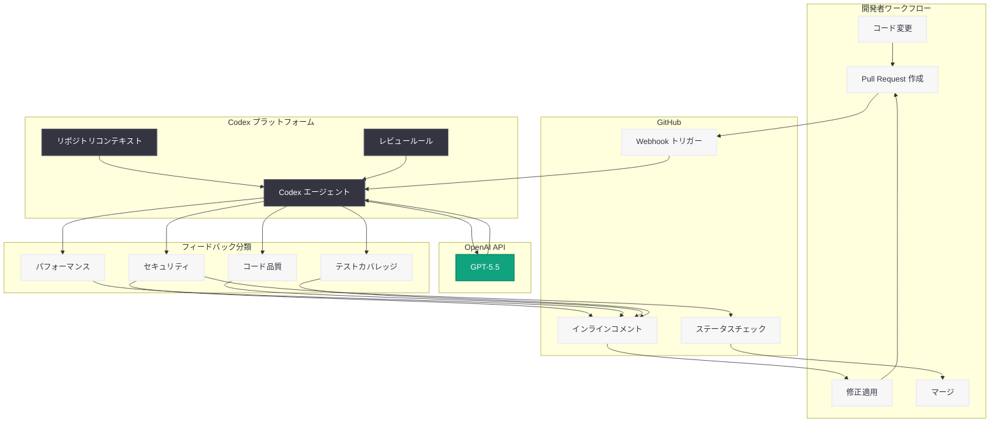

# Ramp のエンジニアが Codex でコードレビューを加速させる方法

## メタデータ

| 項目 | 内容 |
|------|------|
| 発表日 | 2026-05-20 |
| ソース | OpenAI News/Blog |
| カテゴリ | Customer Story / Engineering |
| 公式リンク | [openai.com/index/ramp](https://openai.com/index/ramp) |

## 概要

フィンテック企業 Ramp のエンジニアチームが、OpenAI の Codex と GPT-5.5 を活用してコードレビュープロセスを革新した事例が公開された。従来は数時間かかっていた実質的なフィードバックの取得を、わずか数分で完了できるようになり、開発サイクルの大幅な短縮を実現している。

本事例は、AI を活用したコードレビューが単なる構文チェックを超え、コード品質、セキュリティ、パフォーマンスに関する包括的なフィードバックを提供できることを示しており、ソフトウェア開発の効率化における新たなベンチマークとなっている。

## 主な内容

### Ramp について

Ramp は法人向け支出管理プラットフォームを提供するフィンテック企業である。企業の経費管理、請求書処理、支払い業務を自動化し、財務チームの効率化を支援している。急速な成長を続ける同社では、エンジニアリングチームの生産性向上が事業拡大の鍵となっており、コードレビューのボトルネック解消が重要な課題であった。

金融サービスを扱う性質上、コードの品質とセキュリティに対する要求水準は極めて高く、レビュープロセスには以下の課題が存在していた。

- シニアエンジニアへのレビュー依存による待ち時間の長期化
- セキュリティ上の懸念事項の見落としリスク
- コードベースの急速な拡大に伴うレビュー負荷の増大
- タイムゾーンをまたぐ分散チームでのレビュー遅延

### Codex と GPT-5.5 によるコードレビュー

Ramp は OpenAI の Codex プラットフォームに GPT-5.5 モデルを組み合わせることで、AI によるコードレビューシステムを構築した。このシステムは、Pull Request (PR) が作成された際に自動的にトリガーされ、包括的なフィードバックを生成する。

GPT-5.5 の高度なコード理解能力により、以下の種類のフィードバックが提供される。

- **コード品質:** 設計パターンの改善提案、リファクタリングの推奨、可読性向上のためのアドバイス
- **セキュリティ:** SQL インジェクション、認証・認可の脆弱性、データ漏洩リスクの検出
- **パフォーマンス:** N+1 クエリ問題、不要なメモリ割り当て、アルゴリズムの非効率性の指摘
- **テストカバレッジ:** テストが不足している箇所の特定と、テストケースの提案
- **ベストプラクティス:** チーム固有のコーディング規約や業界標準への準拠確認

### 時間短縮の効果

導入前のコードレビューでは、エンジニアが PR を提出してから実質的なフィードバックを受け取るまでに平均数時間を要していた。特に複雑な変更や、専門知識を持つレビュアーが限られている分野では、1 日以上待つケースも珍しくなかった。

Codex の導入により、PR 作成から数分以内に詳細なフィードバックが得られるようになった。これにより以下の効果が実現されている。

- エンジニアのコンテキストスイッチの削減
- 修正の即時反映による開発サイクルの高速化
- 人間のレビュアーがより戦略的な設計判断に集中可能
- ジュニアエンジニアの学習機会の増加

### 開発ワークフローへの統合

Ramp の Codex コードレビューシステムは、既存の開発ワークフローにシームレスに統合されている。

1. **PR 作成時の自動トリガー:** GitHub で PR が作成または更新されると、Codex が自動的にレビューを開始
2. **インラインコメント:** フィードバックは PR のコード差分に対してインラインコメントとして追加
3. **CI/CD パイプラインとの連携:** セキュリティ上の重大な問題が検出された場合、マージをブロック
4. **優先度の分類:** フィードバックを重要度別に分類し、必須対応と推奨事項を区別
5. **学習フィードバックループ:** エンジニアが「役に立った」「不要」と評価することで、レビューの精度が向上

## 技術的な詳細

### Codex の活用構成

Ramp のシステムは、OpenAI の Codex プラットフォームを通じて GPT-5.5 モデルにアクセスし、コードレビューを実行している。Codex はコード特化型の AI エージェントとして、リポジトリのコンテキストを理解した上で高精度なフィードバックを生成する。

### ワークフロー自動化の実装例

```python
from openai import OpenAI

client = OpenAI()

# Codex を活用したコードレビューリクエストの例
response = client.chat.completions.create(
    model="gpt-5.5",
    messages=[
        {
            "role": "system",
            "content": (
                "You are an expert code reviewer for a fintech company. "
                "Review the following code diff for security vulnerabilities, "
                "performance issues, code quality, and adherence to best practices. "
                "Prioritize findings by severity: critical, warning, suggestion."
            )
        },
        {
            "role": "user",
            "content": "Review this PR diff:\n\n```diff\n+ ...\n```"
        }
    ],
    temperature=0.1,  # 一貫性のある分析のため低い temperature を使用
    response_format={"type": "json_object"}
)
```

### CI/CD 統合の例

```yaml
# GitHub Actions ワークフロー例
name: AI Code Review
on:
  pull_request:
    types: [opened, synchronize]

jobs:
  codex-review:
    runs-on: ubuntu-latest
    steps:
      - uses: actions/checkout@v4
      - name: Run Codex Code Review
        env:
          OPENAI_API_KEY: ${{ secrets.OPENAI_API_KEY }}
        run: |
          python scripts/codex_review.py \
            --pr-number ${{ github.event.pull_request.number }} \
            --severity-threshold warning
```

## アーキテクチャ



## 開発者への影響

Ramp の事例は、AI を活用したコードレビューの実践的な導入方法と効果を示しており、ソフトウェア開発チームに対して以下の示唆を提供している。

- **レビューの民主化:** シニアエンジニアの負担を軽減し、全てのエンジニアが迅速にフィードバックを得られる環境を構築できる
- **セキュリティの強化:** 金融業界のように高いセキュリティ基準が求められる分野では、AI による一貫したセキュリティレビューが人間のレビュアーを補完する
- **開発速度の向上:** 「数時間から数分」への短縮は、特にアジャイル開発やデプロイ頻度の高いチームにとって大きなメリットとなる
- **Codex プラットフォームの活用:** OpenAI の Codex はコード特化型 AI エージェントとして、単純な API コールを超えたリポジトリレベルの理解に基づくフィードバックを提供する
- **段階的導入:** まずは「提案」レベルのフィードバックから開始し、信頼性を確認した上でマージブロックなどの強制力を持たせる段階的アプローチが有効である

## 関連リンク

- [OpenAI Codex](https://openai.com/codex)
- [OpenAI API ドキュメント](https://platform.openai.com/docs)
- [OpenAI GPT-5.5 モデル](https://platform.openai.com/docs/models)
- [Ramp 公式サイト](https://ramp.com/)
- [OpenAI News](https://openai.com/news)

## まとめ

Ramp のエンジニアリングチームは、OpenAI の Codex と GPT-5.5 を活用することで、コードレビューの所要時間を数時間から数分に短縮することに成功した。AI によるレビューは、コード品質、セキュリティ、パフォーマンス、テストカバレッジの 4 つの観点から包括的なフィードバックを提供し、人間のレビュアーがより戦略的な設計判断に集中できる環境を実現している。

この事例は、AI がコードレビューという開発プロセスの中核的なボトルネックを解消できることを実証しており、特にセキュリティ要件の高いフィンテック業界での成功は、他の業界での導入を後押しする重要な先行事例となるだろう。Codex プラットフォームと GPT-5.5 の組み合わせは、コードの文脈を深く理解した高精度なフィードバックを可能にしており、AI 支援型コードレビューの新たな標準を示している。
