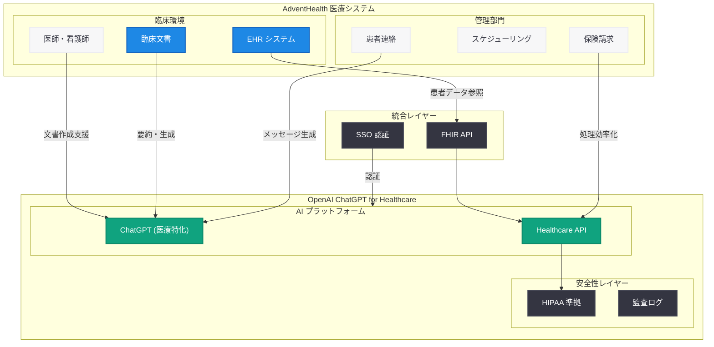

# AdventHealth が OpenAI と連携し、ホールパーソンケアを推進

## メタデータ

| 項目 | 内容 |
|------|------|
| 発表日 | 2026-05-21 |
| ソース | OpenAI News/Blog |
| カテゴリ | Customer Story / Healthcare |
| 公式リンク | [openai.com/index/adventhealth](https://openai.com/index/adventhealth) |

## 概要

AdventHealth は、OpenAI の「ChatGPT for Healthcare」を導入し、臨床および管理業務のワークフローを効率化している。この取り組みにより、医療従事者の事務負担を軽減し、患者ケアにより多くの時間を割けるようにすることを目指している。

AdventHealth は全米に約 50 の病院施設を展開する大規模ヘルスケアシステムであり、「ホールパーソンケア」(身体・精神・社会的側面を包括的にケアするアプローチ) を理念に掲げている。OpenAI の医療特化型 AI ソリューションを採用した大規模医療機関の事例として、ChatGPT for Healthcare のエンタープライズヘルスケア市場での普及を示す重要な発表である。

## 主な内容

### ChatGPT for Healthcare とは

ChatGPT for Healthcare は、OpenAI が医療機関向けに提供する専用製品である。一般向け ChatGPT とは異なり、以下の特徴を持つ。

- **HIPAA 準拠:** 米国の医療情報プライバシー法 (HIPAA) に対応したセキュアな環境
- **医療特化型ワークフロー:** 臨床文書作成、患者コミュニケーション、事務処理に最適化
- **EHR 統合:** 電子健康記録 (Electronic Health Record) システムとの連携機能
- **医療用語・知識への対応:** 医療専門用語や臨床プロトコルに精通したモデル動作

### AdventHealth での活用領域

AdventHealth は ChatGPT for Healthcare を以下の領域で活用している。

| 活用領域 | 内容 |
|----------|------|
| 臨床文書作成 | 診察記録、退院サマリー、紹介状の自動生成支援 |
| 事務処理効率化 | 事前承認、保険請求処理のワークフロー改善 |
| 患者コミュニケーション | 患者向けメッセージの下書き作成、フォローアップ連絡 |
| ワークフロー最適化 | スケジューリング、タスク管理の効率化 |

### 医療従事者の負担軽減

医療現場では、医師が診療時間の最大 50% を文書作成などの事務作業に費やしているという課題がある。ChatGPT for Healthcare の導入により、以下の効果が期待される。

- **文書作成時間の短縮:** AI による下書き生成で記録作業を大幅に効率化
- **バーンアウト防止:** 事務負担の軽減により医療従事者の燃え尽き症候群を予防
- **患者対面時間の増加:** 削減された事務時間を直接的な患者ケアに転換
- **ケアの質向上:** より多くの時間を患者との対話や治療計画に充当

## 技術的な詳細

### 想定されるシステム統合

ChatGPT for Healthcare と医療システムの統合には、以下の技術要素が含まれると考えられる。

- **EHR 連携 API:** Epic、Cerner などの主要 EHR システムとの API ベースの統合
- **FHIR 標準対応:** HL7 FHIR (Fast Healthcare Interoperability Resources) 規格に準拠したデータ交換
- **シングルサインオン (SSO):** 既存の医療機関認証基盤との統合
- **監査ログ:** コンプライアンス要件を満たす詳細な利用記録の保持
- **データレジデンシー:** 患者データの所在地管理と暗号化

### セキュリティとコンプライアンス

| 要件 | 対応 |
|------|------|
| HIPAA | BAA (Business Associate Agreement) 締結によるデータ保護 |
| データ暗号化 | 転送時および保存時の暗号化 |
| アクセス制御 | ロールベースのアクセス管理 (RBAC) |
| 監査証跡 | 全操作の記録と追跡可能性の確保 |

## アーキテクチャ

## 開発者への影響

- **Healthcare AI 市場の拡大:** OpenAI が医療特化製品で大規模医療機関を獲得したことで、ヘルスケア AI ソリューションの開発需要が加速する
- **EHR 統合開発の機会:** ChatGPT for Healthcare と各種 EHR システムを橋渡しするインテグレーション開発の需要増加が見込まれる
- **FHIR/HL7 スキルの重要性:** 医療データ標準規格に精通した開発者の需要が高まる
- **コンプライアンス対応の標準化:** HIPAA 準拠の AI アプリケーション開発のベストプラクティスが確立されつつある
- **医療ワークフロー自動化:** 臨床文書作成、患者コミュニケーション、事務処理の自動化ツール開発が新たなビジネス領域として成長する

## 関連リンク

- [AdventHealth advances whole-person care with OpenAI](https://openai.com/index/adventhealth)
- [OpenAI for Healthcare](https://openai.com/healthcare)
- [OpenAI Enterprise](https://openai.com/enterprise)
- [OpenAI News](https://openai.com/news)

## まとめ

AdventHealth による ChatGPT for Healthcare の採用は、OpenAI の医療特化型 AI 製品がエンタープライズヘルスケア市場で本格的に普及し始めていることを示す重要な事例である。全米規模の大規模医療システムが AI を導入し、臨床文書作成や事務処理の効率化を通じて医療従事者の負担を軽減するというアプローチは、医療業界全体の AI 活用トレンドを加速させるだろう。

ホールパーソンケアという理念のもと、AI による業務効率化で生まれた時間を患者との対話やケアの質向上に振り向けるという戦略は、AI が人間の仕事を置き換えるのではなく、人間がより本質的な業務に集中できるよう支援するという好例である。今後、他の大規模医療機関でも同様の導入が進むことが予想される。
