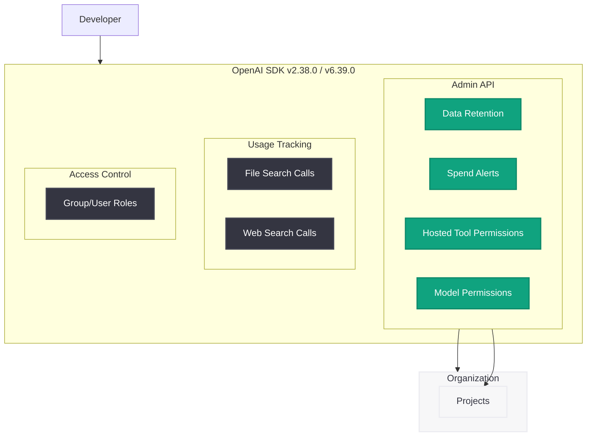

# OpenAI Python SDK v2.38.0 / Node SDK v6.39.0: Admin API の大幅拡張とガバナンス機能の追加

## メタデータ

| 項目 | 内容 |
|------|------|
| 発表日 | 2026-05-21 |
| ソース | OpenAI API Changelog (GitHub Releases) |
| カテゴリ | API 更新 / SDK リリース |
| 公式リンク | [Python SDK v2.38.0](https://github.com/openai/openai-python/releases/tag/v2.38.0) / [Node SDK v6.39.0](https://github.com/openai/openai-node/releases/tag/v6.39.0) |

## 概要

OpenAI Python SDK v2.38.0 および Node SDK v6.39.0 が 2026 年 5 月 21 日にリリースされた。本リリースは Admin API の大幅な拡張を含み、データ保持管理、支出アラート、ホストツール権限、モデル権限、新しい使用量追跡エンドポイントなど、エンタープライズ向けのガバナンス機能が多数追加された。組織やプロジェクト単位でのきめ細かいアクセス制御とコスト管理を SDK から直接操作できるようになり、大規模組織での OpenAI API 運用が大幅に効率化される。

## 主な内容

### データ保持管理 (Data Retention Management)

組織およびプロジェクトレベルでデータ保持ポリシーを管理する新しいエンドポイントが追加された。

| エンドポイント | メソッド | 説明 |
|--------------|---------|------|
| `/organization/data_retention` | GET | 現在の保持設定を取得 |
| `/organization/data_retention` | POST | 保持設定を更新 |

利用可能な保持タイプ:

- `zero_data_retention`: データを一切保持しない
- `modified_abuse_monitoring`: 不正利用監視を維持しつつデータ保持を制限
- `enhanced_zero_data_retention`: 強化版ゼロデータ保持
- `enhanced_modified_abuse_monitoring`: 強化版不正利用監視付き制限保持

### 支出アラート (Spend Alerts)

組織およびプロジェクトレベルで支出アラートを設定可能になった。月次の支出が閾値を超えた際にメール通知を受け取ることができる。

| 機能 | 詳細 |
|------|------|
| 通貨 | USD |
| 間隔 | month (月次) |
| 通知チャネル | email |
| 閾値単位 | セント (cents) |

### ホストツール権限 (Hosted Tool Permissions)

プロジェクト単位で利用可能なホストツールを制御する機能が追加された。

| ツール | 説明 |
|--------|------|
| `code_interpreter` | コードインタープリター |
| `file_search` | ファイル検索 |
| `image_generation` | 画像生成 |
| `mcp` | Model Context Protocol |
| `web_search` | Web 検索 |

### モデル権限 (Model Permissions)

プロジェクト単位で利用可能なモデルを制御する機能が追加された。`allow_list` (許可リスト) または `deny_list` (拒否リスト) モードでモデルアクセスを管理できる。

### 使用量追跡の新エンドポイント

- `usage_file_search_calls`: ファイル検索の使用量を追跡
- `usage_web_search_calls`: Web 検索の使用量を追跡

### グループ / ユーザーロール取得

グループおよびユーザーレベルでのロール取得機能が新たに追加された。

## 技術的な詳細

### インストール / アップグレード

```bash
# Python SDK
pip install --upgrade openai==2.38.0

# Node SDK
npm install openai@6.39.0
```

### コードサンプル

#### データ保持管理

```python
from openai import OpenAI

client = OpenAI()

# 現在のデータ保持設定を取得
retention = client.admin.organization.data_retention.retrieve()

# データ保持ポリシーを更新
client.admin.organization.data_retention.update(
    retention_type="enhanced_zero_data_retention"
)
```

#### 支出アラートの作成

```python
# 月次 $1000 の支出アラートを作成
alert = client.admin.organization.spend_alerts.create(
    currency="USD",
    interval="month",
    threshold_amount=100000,  # $1000 (セント単位)
    notification_channel={
        "type": "email",
        "recipients": ["admin@company.com"],
        "subject_prefix": "[OpenAI Spend Alert]"
    }
)
```

#### ホストツール権限の設定

```python
# プロジェクトごとのツール利用権限を設定
client.admin.organization.projects.hosted_tool_permissions.update(
    project_id="proj_xxx",
    code_interpreter={"enabled": True},
    file_search={"enabled": True},
    image_generation={"enabled": False},
    mcp={"enabled": True},
    web_search={"enabled": True}
)
```

#### モデル権限の設定

```python
# 許可リストモードでモデルアクセスを制限
client.admin.organization.projects.model_permissions.update(
    project_id="proj_xxx",
    mode="allow_list",
    model_ids=["gpt-5.5", "gpt-5.4", "gpt-4o"]
)
```

### Node SDK 固有の修正

- **TypeScript 互換性修正**: Node 26 サポートのために `tsc-multi` をアップグレード
- **ランタイム fetch オプション**: 型定義でランタイム fetch オプションを許可
- **テストの整理**: 冗長な `File` インポートを削除

### Python SDK の構造

新機能のすべてに対して `TypedDict` ベースのパラメータ定義が追加され、完全な型安全性が確保されている。

## アーキテクチャ



## 開発者への影響

- **エンタープライズガバナンス強化**: 組織管理者がデータ保持ポリシー、支出上限、ツールアクセスを SDK から直接管理可能に
- **コスト管理の自動化**: 支出アラートにより、予期しないコスト超過を事前に検知可能
- **セキュリティ強化**: プロジェクト単位でモデルやツールの利用を制限し、最小権限の原則を適用可能
- **Node 26 対応**: TypeScript コンパイラのアップグレードにより、最新の Node.js 環境での開発がスムーズに
- **使用量の可視化**: ファイル検索と Web 検索の使用量を個別に追跡可能になり、コスト最適化の判断材料に

## 関連リンク

- [Python SDK v2.38.0 リリースノート](https://github.com/openai/openai-python/releases/tag/v2.38.0)
- [Node SDK v6.39.0 リリースノート](https://github.com/openai/openai-node/releases/tag/v6.39.0)
- [OpenAI API リファレンス](https://platform.openai.com/docs/api-reference)
- [OpenAI Admin API ドキュメント](https://platform.openai.com/docs/api-reference/administration)
- [OpenAI Platform Changelog](https://platform.openai.com/docs/changelog)

## まとめ

OpenAI Python SDK v2.38.0 / Node SDK v6.39.0 は、エンタープライズ向けの管理機能を大幅に拡張するリリースである。データ保持管理、支出アラート、ホストツール権限、モデル権限の 4 つの主要な Admin API が追加され、大規模組織での OpenAI API 利用におけるガバナンス、コンプライアンス、コスト管理が SDK レベルで完結できるようになった。特に GDPR やデータ主権の要件が厳しい組織にとって、データ保持ポリシーのプログラマティックな管理は重要な進歩である。すべての管理者は早急にアップグレードし、組織のポリシーに合わせた設定を行うことが推奨される。
