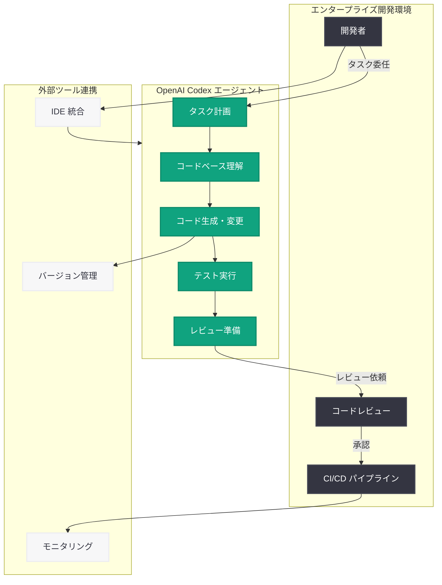

# OpenAI が Gartner 2026 年エンタープライズ AI コーディングエージェント分野でリーダーに選出

## メタデータ

| 項目 | 内容 |
|------|------|
| 発表日 | 2026-05-22 |
| ソース | OpenAI News/Blog |
| カテゴリ | AI Adoption |
| 公式リンク | https://openai.com/index/gartner-2026-agentic-coding-leader |

## 概要

OpenAI が 2026 年の Gartner Magic Quadrant for Enterprise AI Coding Agents においてリーダーに選出された。この評価は、Codex エージェントのイノベーションとエンタープライズ規模でのデプロイメント能力が高く評価された結果である。Gartner は 12 社のベンダーを「実行能力」と「ビジョンの完全性」の 2 軸で評価し、OpenAI をリーダー象限に位置づけた。

この認定は、OpenAI がコード補完ツールの提供者から、エンタープライズ規模の AI コーディングエージェントプラットフォームへと進化したことを示す重要なマイルストーンである。週間 400 万人以上のアクティブユーザーを抱える Codex は、開発者の生産性向上における業界標準としての地位を確立しつつある。

## 主な内容

### Gartner Magic Quadrant での評価

Gartner は 12 社のベンダーを対象に、エンタープライズ AI コーディングエージェント分野における包括的な評価を実施した。評価軸は以下の 2 つである:

- **実行能力 (Ability to Execute)**: 製品の品質、市場での実績、顧客体験、運用能力
- **ビジョンの完全性 (Completeness of Vision)**: 市場理解、マーケティング戦略、イノベーション、地理的戦略

OpenAI はこの両軸において高い評価を獲得し、リーダー象限に位置づけられた。なお、GitHub も同レポートにおいて 3 年連続でリーダーに選出されている。

### Codex の主要機能と実績

Codex は単なるコード補完ツールを超え、以下の能力を備えたエージェント型コーディングアシスタントとして認められている:

- **大規模コードベースの理解**: プロジェクト全体のコンテキストを把握し、適切な変更を提案
- **ツールの活用**: 外部ツールやサービスと連携した開発ワークフローの自動化
- **コード変更の実行**: 複数ファイルにまたがる変更の実施
- **テストの実行**: 自動テストの作成と実行による品質保証
- **ヒューマンレビューの準備**: 人間によるレビューに適した形での成果物の整理

### エンタープライズ導入状況

Codex は以下の主要テクノロジー企業で採用されており、エンタープライズ市場での信頼性を実証している:

- **Cisco**: ネットワーク機器のファームウェア開発
- **Datadog**: 監視プラットフォームの開発効率化
- **Dell**: ハードウェア・ソフトウェア統合開発
- **NVIDIA**: GPU ドライバーおよび AI フレームワーク開発

## 技術的な詳細

Codex エージェントは、従来のオートコンプリート型のコード補完から大きく進化し、複雑なタスクの委任が可能なエージェント型アーキテクチャを採用している。

### エージェント型ワークフローの特徴

1. **タスク分解**: 複雑な開発タスクを管理可能なサブタスクに分解
2. **コンテキスト認識**: リポジトリ全体の構造、依存関係、コーディング規約を理解
3. **自律実行**: ツール呼び出し、ファイル操作、テスト実行を自律的に実施
4. **品質保証**: 変更後の自動テスト実行とレビュー準備

### エンタープライズ機能

- セキュリティポリシーに準拠したコード生成
- プライベートリポジトリ内での安全な動作
- チーム全体のコーディング規約への適合
- 監査ログとコンプライアンス対応

## アーキテクチャ

## 開発者への影響

- **開発パラダイムの転換**: オートコンプリートから複雑なタスク委任へと開発スタイルが変化し、開発者はより高次の設計・アーキテクチャ決定に集中可能になる
- **エンタープライズ導入の加速**: Gartner のリーダー認定により、組織内での AI コーディングツール導入の意思決定が容易になる
- **ベンダー選定の指針**: このレポートにより、企業は各ベンダーの能力を客観的に比較し、開発者の生産性向上と ROI 最大化に最適なソリューションを選択できる
- **エージェント型ワークフローの標準化**: 単純なコード補完ではなく、エージェント型のワークフローがエンタープライズ開発の新たな標準となりつつある
- **週間 400 万ユーザーの実績**: 大規模な利用実績に裏打ちされた信頼性により、個人開発者からチーム全体での採用へと展開が進む

## 関連リンク

- [OpenAI 公式発表](https://openai.com/index/gartner-2026-agentic-coding-leader)
- [Gartner Magic Quadrant について](https://www.gartner.com/en/research/methodologies/magic-quadrants-research)
- [OpenAI Codex](https://openai.com/codex)
- [OpenAI News](https://openai.com/news)

## まとめ

OpenAI が 2026 年 Gartner Magic Quadrant for Enterprise AI Coding Agents でリーダーに選出されたことは、Codex エージェントがエンタープライズ市場において確固たる地位を築いたことを示している。週間 400 万ユーザー、Cisco・Datadog・Dell・NVIDIA といった大手企業での採用実績、そして大規模コードベースの理解からテスト実行、レビュー準備までを自律的に行うエージェント能力が高く評価された。開発者にとっては、AI コーディングツールがオートコンプリートの時代を超え、複雑なタスクを委任できるエージェントへと進化したことを意味し、今後のソフトウェア開発のあり方に大きな影響を与える転換点となる。
