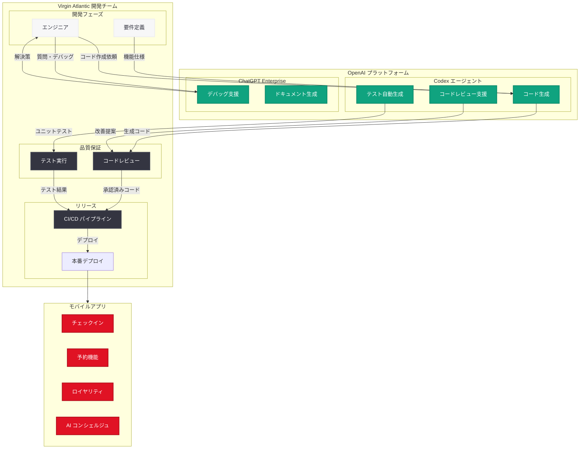

# Virgin Atlantic が Codex を活用してモバイルアプリの高速リリースを実現

## メタデータ

| 項目 | 内容 |
|------|------|
| 発表日 | 2026-05-22 |
| ソース | OpenAI News/Blog |
| カテゴリ | Customer Story / Aviation |
| 公式リンク | [openai.com/index/virgin-atlantic](https://openai.com/index/virgin-atlantic) |

## 概要

Virgin Atlantic は、OpenAI の Codex を活用して、クリスマスの繁忙期という動かせない期日に間に合わせる形でモバイルアプリを全面リニューアルし、リリースに成功した。通常であれば機能を削減せざるを得ないような厳しいスケジュールの中、Codex によるコード生成とテスト自動化により、ほぼ 100% のユニットテストカバレッジとゼロ P1 障害という品質を達成した。

この事例は、航空業界という高い信頼性が求められる分野で、AI コーディングエージェントがエンタープライズ規模のソフトウェア開発を加速させた実証として注目される。Richard Masters 氏と Neil Letchford 氏が主導したこのプロジェクトは、Codex が純粋なエンジニア向けツールを超え、組織全体の生産性向上ツールへと進化していることを示している。

## 主な内容

### クリスマス繁忙期に向けたモバイルアプリの全面刷新

Virgin Atlantic は、ホリデーシーズンの旅行ラッシュという「通常であれば機能削減を余儀なくされるような動かせない期日」に向けて、モバイルアプリの全面刷新プロジェクトに取り組んだ。対象となった機能は以下の通りである。

| 対象領域 | 内容 |
|----------|------|
| モバイルアプリ全般 | UI/UX の全面リニューアル |
| チェックイン機能 | モバイルチェックインフローの改善 |
| ロイヤリティ機能 | Flying Club 会員向け機能の強化 |
| 予約プラットフォーム | ブッキングフローの最適化 |

### Codex と ChatGPT Enterprise による開発加速

Virgin Atlantic は Codex と ChatGPT Enterprise を組み合わせて使用し、以下の成果を達成した。

- **開発サイクルの短縮:** コード生成とテスト作成の自動化により、開発サイクルタイムを大幅に短縮
- **ほぼ 100% のユニットテストカバレッジ:** Codex がテストコードを自動生成し、手動では達成困難な網羅率を実現
- **ゼロ P1 障害:** 本番リリース後に重大障害 (Priority 1 defects) がゼロという高品質を維持
- **機能削減なし:** 厳しい期日にもかかわらず、予定していた機能を全て搭載してリリース

### AI コンシェルジュによるパーソナライズド体験

Virgin Atlantic は OpenAI および Tomoro と提携し、予約プラットフォーム全体でマルチモーダル AI アシスタント (AI コンシェルジュ) も展開している。この AI コンシェルジュは、旅行者にパーソナライズされた旅行計画を提供する。

## 技術的な詳細

### Codex の活用方法

Virgin Atlantic のエンジニアリングチームは、Codex を以下のフェーズで活用した。

| フェーズ | Codex の役割 |
|----------|-------------|
| コード生成 | モバイルアプリの新機能コードの生成・提案 |
| ユニットテスト作成 | テストケースの自動生成による網羅的なカバレッジ |
| コードレビュー | 生成コードの品質チェックと改善提案 |
| リファクタリング | 既存コードの改善と最適化 |

### テスト戦略

Codex を活用したテスト戦略の特徴は以下の通りである。

- **ユニットテストの自動生成:** Codex がコードの変更に応じてテストケースを自動作成
- **エッジケースの網羅:** AI がパターン認識に基づき、人間が見落としがちなエッジケースのテストを生成
- **回帰テストの充実:** 既存機能への影響を検出する回帰テストを自動的に補完
- **CI/CD パイプラインへの統合:** 自動生成されたテストを継続的インテグレーションに組み込み

### ChatGPT Enterprise の活用

- **コードの説明と文書化:** 複雑なロジックのドキュメント自動生成
- **デバッグ支援:** エラーの原因分析と修正案の提示
- **アーキテクチャ議論:** 設計上の意思決定を支援するインタラクティブな対話

## アーキテクチャ

## 開発者への影響

- **厳しい期日を持つプロジェクトでの AI 活用モデル:** Codex を使うことで、通常はトレードオフが発生する「スピード vs 品質」の二律背反を解消できることが実証された。固定された期日に向けたプロジェクトでも、機能削減を強いられない開発体制が可能である
- **テストカバレッジの革新:** 手動でのテスト作成ではコスト的に達成困難だった高カバレッジを、AI によるテスト自動生成で実現できる。これは品質保証プロセスのパラダイムシフトとなる
- **エンジニア以外への展開可能性:** Richard Masters 氏の「Codex の将来像は純粋なエンジニアを超え、全員のためのツールになること」という発言は、プロダクトマネージャーやデザイナーなど非エンジニア職種にも AI コーディングツールが浸透する方向性を示唆している
- **航空業界の高信頼性要件での実績:** P1 障害ゼロという結果は、ミッションクリティカルなアプリケーションでも Codex を安心して導入できるという信頼性の証拠となる
- **CI/CD パイプラインへの AI 統合:** AI によるコード生成・テスト生成を既存の CI/CD ワークフローにシームレスに統合するアーキテクチャパターンが確立されつつある

## 関連リンク

- [How Virgin Atlantic ships faster with Codex](https://openai.com/index/virgin-atlantic)
- [OpenAI Codex](https://openai.com/codex)
- [ChatGPT Enterprise](https://openai.com/enterprise)
- [OpenAI News](https://openai.com/news)

## まとめ

Virgin Atlantic の事例は、AI コーディングエージェント Codex がエンタープライズ規模のモバイルアプリ開発を実際に加速させ、品質と速度の両立を実現できることを示す説得力のある実証である。クリスマス繁忙期という動かせない期日に対して、機能削減なし、ほぼ 100% のテストカバレッジ、ゼロ P1 障害という成果は、従来の開発手法では達成困難だったものである。

「Codex は純粋なエンジニアを超え、全員のためのツールになる」という展望は、AI コーディングツールの適用範囲が今後さらに拡大することを予見させる。航空業界のように安全性と信頼性が最重要視される分野での成功事例は、他のエンタープライズ組織にとっても Codex 導入の説得力のある参考事例となるだろう。
