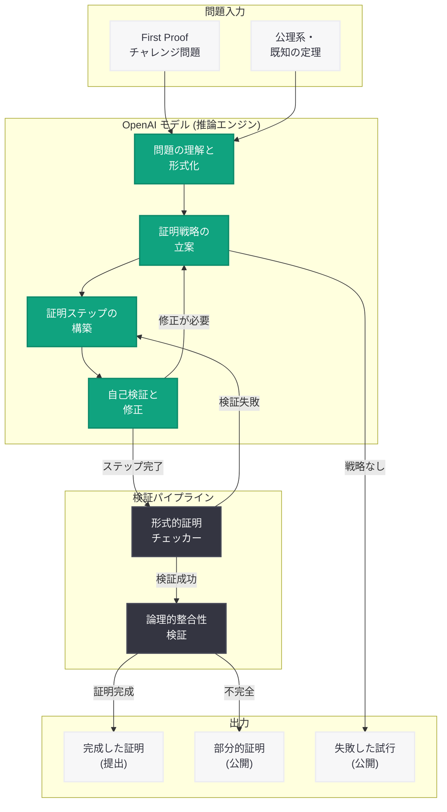

# OpenAI が First Proof 数学チャレンジへの証明提出を公開 -- 研究レベル推論の透明性ある評価

## メタデータ

| 項目 | 内容 |
|------|------|
| 発表日 | 2026-05-24 |
| ソース | OpenAI Research |
| カテゴリ | 研究成果 / AI 数学 |
| 公式リンク | [Our First Proof submissions](https://openai.com/index/first-proof-submissions/) |

## 概要

OpenAI は 2026 年 5 月 24 日、外部の数学チャレンジである「First Proof」に対する AI モデルの証明試行結果を公開した。First Proof は、競技数学を超えた専門家レベルの数学問題に対して形式的証明の構築能力を評価するチャレンジであり、研究レベルの推論能力 (research-grade reasoning) を試すものである。

この公開は、成功した証明のみならず失敗した試行も含めて共有するという透明性の高いアプローチを取っており、フロンティア AI モデルの定理証明能力と限界を正直に示す姿勢が特徴的である。5 月 20 日に発表された離散幾何学予想の反証に続き、AI が数学研究に本格的に貢献し始めている流れを加速する成果である。

## 主な内容

### First Proof チャレンジとは

First Proof は、AI システムの形式的数学証明能力を評価するための外部チャレンジである。従来の数学オリンピック (IMO) レベルの問題とは異なり、以下の特徴を持つ。

| 特徴 | 内容 |
|------|------|
| 難易度 | プロの数学者レベルの問題 |
| 形式 | 形式的証明 (formal proof) の構築を要求 |
| 目的 | 研究レベルの推論能力のベンチマーク |
| 対象 | 定理証明、予想の検証、反例構成など |

一般的な数学コンペティションが「答えを出す」ことに重点を置くのに対し、First Proof は「厳密な証明を構築する」能力を問う点で、より高度な数学的推論を必要とする。

### OpenAI のアプローチ

OpenAI は自社のフロンティアモデルを用いて First Proof チャレンジの問題に取り組んだ。このアプローチの特徴は以下の通りである。

1. **研究レベル推論の適用:** 競技数学向けのパターンマッチングではなく、新規の数学的洞察を要する問題に対して推論チェーンを構築
2. **形式的証明の生成:** 自然言語での解答ではなく、検証可能な形式的証明を出力
3. **反復的改善:** 証明の各ステップを検証しながら、誤りを検出して修正するプロセス
4. **複数戦略の探索:** 一つの問題に対して複数の証明戦略を並行して探索

### 結果と試行の公開

OpenAI は今回、成功した証明だけでなく失敗した試行も含めて公開するという透明性の高いアプローチを採用した。これにより以下が明らかになる。

- **成功事例:** AI モデルが正しく形式的証明を構築できた問題
- **部分的成功:** 証明の方向性は正しいが完全な証明に至らなかったケース
- **失敗事例:** 誤ったアプローチや行き詰まりが発生したケース
- **モデルの限界:** 現在のフロンティアモデルがまだ対処できない問題の種類

### AI 定理証明の意義

この取り組みは、AI が数学研究に貢献する以下の経路を示している。

**短期的な意義:**
- フロンティアモデルの数学的推論能力の定量的評価
- 形式検証システムとの連携による証明の信頼性確保
- AI の強みと弱みの明確化

**長期的な意義:**
- 人間の数学者と AI の協働による未解決問題への挑戦
- 自動定理証明技術の実用化促進
- 数学的発見の加速

## 技術的な詳細

### 形式的証明システム

形式的証明とは、数学的命題の正しさを公理系から出発して論理規則のみで導出する証明であり、機械的に検証可能という特性を持つ。AI モデルが形式的証明を生成するためには、以下の能力が必要となる。

| 能力 | 説明 |
|------|------|
| 論理的推論 | 公理と推論規則の正確な適用 |
| 戦略的思考 | 証明の全体構造の設計 |
| 知識活用 | 既知の定理や補題の適切な引用 |
| 検証統合 | 各ステップの正当性の自己チェック |

### 推論アプローチ

OpenAI のモデルが形式的証明を生成する際のアプローチは、以下の要素で構成されると考えられる。

1. **問題の形式化:** 自然言語で記述された問題を形式的な数学言語に変換
2. **証明戦略の選択:** トップダウン (目標からの逆推論) とボトムダウン (仮定からの前進推論) の組み合わせ
3. **補題の発見:** 証明を完成させるために必要な中間的命題の特定と証明
4. **タクティクの適用:** 形式証明システムにおける証明ステップの具体的実行
5. **バックトラッキング:** 行き詰まった場合の別戦略への切り替え

### 評価基準

First Proof チャレンジにおける証明の評価は、以下の基準に基づくと考えられる。

- **正確性 (Correctness):** 証明の各ステップが論理的に妥当か
- **完全性 (Completeness):** 証明が目標命題を完全に導出しているか
- **形式性 (Formality):** 証明が形式検証ツールで機械的に検証可能か
- **効率性 (Efficiency):** 証明の長さと複雑さの適切さ

## アーキテクチャ

## 開発者への影響

- **形式検証ツールとの統合:** AI による形式的証明生成の進展は、ソフトウェアの形式検証やスマートコントラクトの安全性証明など、開発者が直面する検証課題への応用が期待される
- **推論能力の進化指標:** First Proof での成果は、モデルの論理的推論能力のベンチマークとして機能し、将来の API を通じた推論タスクの品質予測に役立つ
- **数学ライブラリの自動証明:** コード内の数学的アルゴリズムの正当性を AI が形式的に証明する機能が、将来的に開発ワークフローに組み込まれる可能性がある
- **透明性のモデル:** 失敗も含めた公開は、AI システムの信頼性評価の手法として開発者コミュニティにとって参考になる
- **長い推論チェーンの信頼性:** 数学証明のような長い推論チェーンが求められるタスクにおいて、モデルの能力と限界を理解するための重要なデータポイントとなる

## 関連リンク

- [Our First Proof submissions](https://openai.com/index/first-proof-submissions/) - 本記事の公式ページ
- [OpenAI モデルが離散幾何学の中心的予想を反証](./2026-05-20-openai-model-disproves-geometry-conjecture.md) - 関連する AI 数学研究成果 (2026-05-20)
- [OpenAI Research](https://openai.com/research)

## まとめ

OpenAI による First Proof チャレンジへの証明提出の公開は、AI の数学的推論能力を外部の厳格な評価基準で測定し、その結果を透明性をもって共有する意義深い取り組みである。成功と失敗の両方を開示するこのアプローチは、AI の能力を過大評価も過小評価もせず、正確に理解するために不可欠である。

5 月 20 日の離散幾何学予想の反証と合わせ、OpenAI は AI が研究レベルの数学において実質的な貢献を行える段階に到達しつつあることを示している。形式的証明の自動生成は数学研究の加速だけでなく、ソフトウェア検証やセキュリティ証明など、開発者にとって実用的な応用にもつながる技術である。今後、First Proof のような外部ベンチマークを通じて AI の定理証明能力が継続的に評価されることで、この分野の進歩が加速することが期待される。
