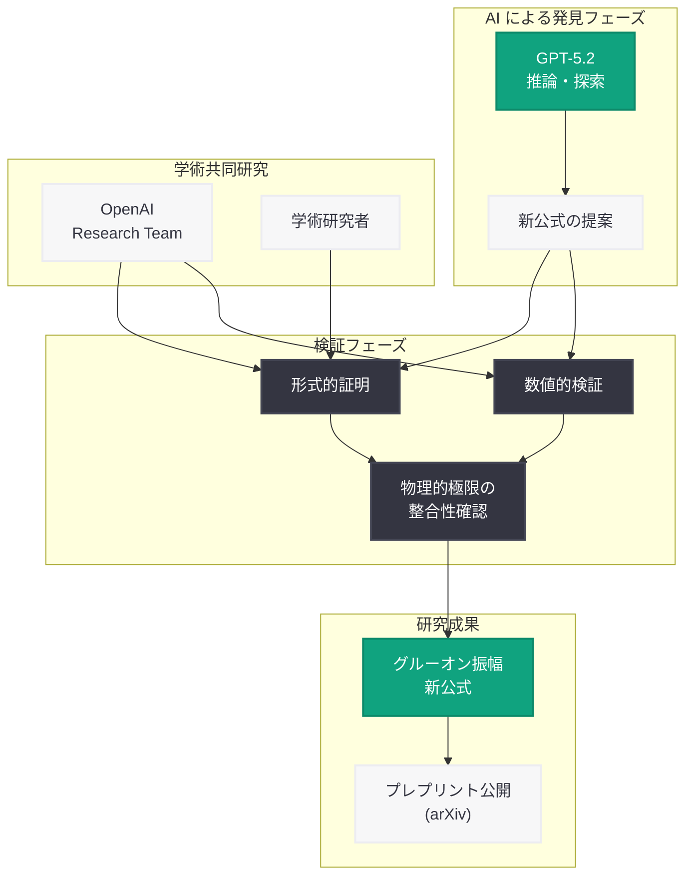

# GPT-5.2 がグルーオン振幅の新公式を導出 -- AI による理論物理学の独創的成果

## メタデータ

| 項目 | 内容 |
|------|------|
| 発表日 | 2026-05-24 |
| ソース | OpenAI Research |
| カテゴリ | 研究成果 / 理論物理学 |
| 公式リンク | [GPT-5.2 derives a new result in theoretical physics](https://openai.com/index/new-result-theoretical-physics/) |

## 概要

OpenAI は 2026 年 5 月 24 日、GPT-5.2 が理論物理学において独創的な新結果を導出したことを発表した。具体的には、GPT-5.2 がグルーオン散乱振幅 (gluon scattering amplitude) に関する新しい数学的公式を提案し、その後 OpenAI と学術研究者の共同作業によって正式に証明・検証されたことが報告されている。この成果はプレプリントとして公開されている。

本研究は、AI が単なる計算支援ツールとしてではなく、理論物理学における独創的な結果を提案する「発見者」としての役割を果たした画期的な事例である。2026 年 3 月に発表された重力子振幅 (graviton amplitude) に関する研究の延長線上にある成果であり、AI による基礎物理学への貢献が着実に進展していることを示している。

## 主な内容

### グルーオン散乱振幅とは

グルーオン (gluon) は、量子色力学 (QCD: Quantum Chromodynamics) における強い核力を媒介するゲージ粒子である。クォーク間の相互作用を担い、原子核を結びつける基本的な力の担い手として機能する。

散乱振幅 (scattering amplitude) は、粒子が相互作用する確率を記述する数学的な量であり、素粒子物理学の実験予測と理論計算を結ぶ中心的な概念である。グルーオン散乱振幅の計算は、LHC (大型ハドロン衝突型加速器) などの実験結果を理論的に予測するために不可欠であるが、グルーオンの自己相互作用 (非アーベル的な性質) により、計算が極めて複雑になることが知られている。

### GPT-5.2 による新公式の発見

本研究の核心的な成果は、GPT-5.2 がグルーオン振幅に対する新しい数学的公式を提案したことにある。従来の手法では導出が困難であった特定の振幅構造について、GPT-5.2 が独自に新しい表現形式を見出した。

- **独創的な提案:** GPT-5.2 は既知の結果を再導出したのではなく、これまで知られていなかった新しい公式を提案した
- **数学的な厳密性:** 提案された公式は、後に人間の研究者によって形式的に証明された
- **物理的整合性:** 導出された結果は、既知の物理的制約やソフト極限、共線極限などとの整合性が確認された

### 検証プロセス

GPT-5.2 が提案した公式は、以下のプロセスを経て検証された。

1. **AI による初期提案:** GPT-5.2 がグルーオン振幅に関する新しい数学的関係式を提案
2. **形式的証明:** OpenAI の研究チームと学術研究者が、提案された公式の厳密な数学的証明を構築
3. **独立検証:** 複数の手法 (数値的検証、解析的手法、既知の極限との比較) による結果の確認
4. **プレプリント公開:** 検証済みの成果を学術プレプリントとして公開

### 研究の意義

本研究は以下の点で理論物理学コミュニティに大きなインパクトを与える。

- **AI の独創性の実証:** AI モデルが人間の研究者が見落としていた数学的構造を発見できることが示された
- **人間-AI 協働の新モデル:** AI が仮説を提案し、人間が検証するという新しい研究パラダイムの有効性が確認された
- **QCD 研究の加速:** グルーオン振幅の理解が深まることで、素粒子物理学の予測精度向上に貢献する可能性がある

## 技術的な詳細

### QCD と散乱振幅の背景

量子色力学 (QCD) は、強い相互作用を記述するゲージ理論であり、SU(3) 群を対称性として持つ。グルーオンはこの対称性に対応する 8 種類のゲージボソンであり、クォークと結合するだけでなく、自己結合 (3 点頂点および 4 点頂点) を持つ。

散乱振幅の計算手法としては以下が広く用いられる。

- **スピノールヘリシティ形式:** 質量ゼロ粒子の運動量をスピノールで表現し、振幅の構造を簡潔に記述する手法
- **色分解 (color decomposition):** 振幅をカラー因子と色序列振幅 (color-ordered amplitude) に分解する手法
- **BCFW 再帰関係式:** オンシェル条件を利用した再帰的な振幅計算手法
- **一般化ユニタリティ:** ループ振幅をカット条件から再構成する手法

### GPT-5.2 が発見した結果の位置づけ

グルーオン振幅には、Parke-Taylor 公式 (MHV 振幅) に代表される簡潔で美しい構造が知られている。GPT-5.2 が発見した新公式は、このような振幅の「隠れた構造」に関する新たな数学的関係式であり、散乱振幅の理解をさらに深めるものである。

### 重力子振幅研究との関連

2026 年 3 月に発表された重力子振幅研究では、GPT-5.2 Pro が single-minus 振幅の重力子への拡張において計算支援と検証を担当した。今回のグルーオン振幅研究では、AI の役割がさらに進化し、「支援者」から「提案者」へとステップアップしている点が重要である。

- **2026 年 3 月 (重力子):** GPT-5.2 Pro が導出の支援と検証を担当
- **2026 年 5 月 (グルーオン):** GPT-5.2 が新公式を独自に提案し、人間が証明

## アーキテクチャ

## 開発者への影響

- **AI による科学的発見の現実化:** LLM が独創的な数学的結果を生成できることが実証され、AI を活用した研究開発ツールの需要が加速する
- **推論能力の重要性:** 本成果は GPT-5.2 の高度な数学的推論能力に依存しており、推論特化型 AI モデルの開発・活用が今後さらに重要になる
- **検証フレームワークの必要性:** AI が提案した結果を効率的に検証するためのツールやワークフローの整備が求められる
- **学際的コラボレーション:** AI 開発者と理論物理学者の協働が新たな標準となる可能性があり、分野横断的なスキルセットが重要になる
- **API 活用の新領域:** OpenAI API を活用した科学研究支援アプリケーションの開発が、新たなユースケースとして注目される

## 関連リンク

- [GPT-5.2 derives a new result in theoretical physics](https://openai.com/index/new-result-theoretical-physics/) - 公式発表
- [OpenAI Research](https://openai.com/research) - OpenAI 研究ページ
- [Single-Minus 振幅の重力子への拡張 (2026-03-04)](./2026-03-04-graviton-amplitudes-research.md) - 関連する重力子振幅研究レポート

## まとめ

GPT-5.2 がグルーオン散乱振幅に対する新しい数学的公式を独自に提案し、OpenAI と学術研究者の共同作業によって正式に証明・検証されたことは、AI による科学的発見の新たなマイルストーンである。2026 年 3 月の重力子振幅研究では AI が「計算支援者」として機能したのに対し、今回は「独創的な発見の提案者」として役割が大きく進化している。プレプリントとして公開されたこの成果は、AI が理論物理学の最前線において人間の研究者と対等に貢献できる時代の到来を示唆しており、基礎科学研究のあり方に根本的な変革をもたらす可能性を秘めている。
