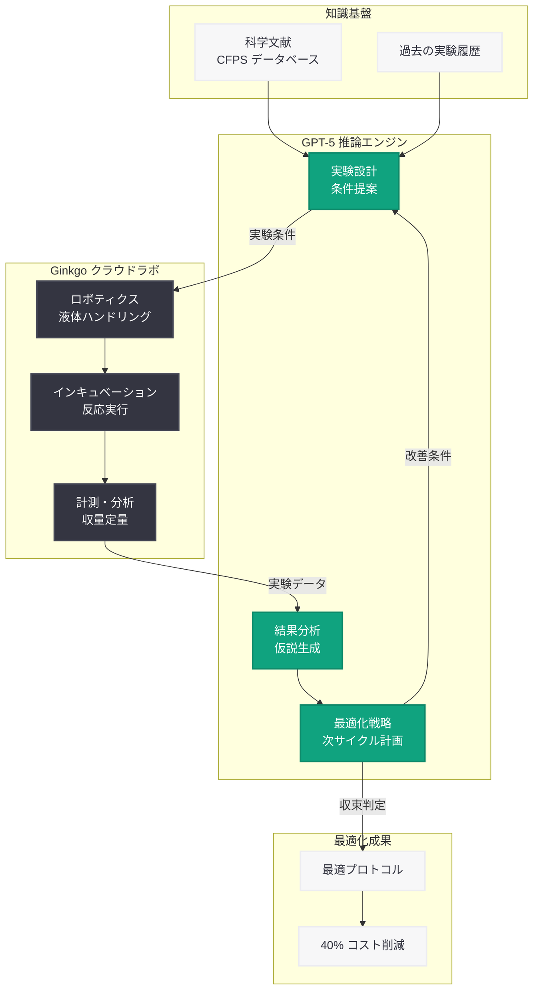

# GPT-5 が無細胞タンパク質合成のコストを 40% 削減 -- 自律実験ラボによる閉ループ最適化

## メタデータ

| 項目 | 内容 |
|------|------|
| 発表日 | 2026-05-24 |
| ソース | OpenAI Research |
| カテゴリ | 研究成果 / バイオテクノロジー |
| 公式リンク | [GPT-5 lowers the cost of cell-free protein synthesis](https://openai.com/index/gpt-5-lowers-protein-synthesis-cost/) |

## 概要

OpenAI は 2026 年 5 月 24 日、合成生物学企業 Ginkgo Bioworks との共同研究において、GPT-5 を活用した自律実験ラボが無細胞タンパク質合成 (Cell-Free Protein Synthesis; CFPS) のコストを 40% 削減することに成功したと発表した。この成果は、AI の推論能力とクラウド自動化を組み合わせた閉ループ実験 (closed-loop experimentation) によって達成されたものである。

従来、CFPS の条件最適化には多大な時間とコストを要する試行錯誤が必要であった。今回の研究では、GPT-5 が実験設計、結果分析、次の実験計画の立案を自律的に反復実行することで、人間の介入を最小限に抑えながら最適条件を効率的に探索した。この成果は、AI がウェットラボの生物学的プロセスを最適化できることを実証し、創薬、産業用酵素、合成生物学の分野に広範な影響を与えるものである。

## 主な内容

### 無細胞タンパク質合成 (CFPS) とは

無細胞タンパク質合成は、生きた細胞を使用せずに細胞抽出液を用いてタンパク質を試験管内で合成する技術である。従来の細胞ベースの発現系と比較して以下の利点を持つ。

| 特徴 | 従来法 (細胞ベース) | CFPS |
|------|---------------------|------|
| 合成時間 | 数日〜数週間 | 数時間 |
| 毒性タンパク質の合成 | 困難 | 可能 |
| 反応条件の制御 | 制限あり | 柔軟 |
| スケーラビリティ | 大規模培養が必要 | 小規模から拡大可能 |
| コスト | 培養設備が必要 | 試薬コストが課題 |

しかし、CFPS は反応条件 (温度、pH、基質濃度、エネルギー源の配合など) の最適化が複雑であり、この最適化コストが普及の障壁となっていた。

### OpenAI と Ginkgo Bioworks の共同研究

Ginkgo Bioworks は合成生物学のリーディングカンパニーであり、生物学的プロセスのクラウド自動化プラットフォームを運営している。今回の共同研究では、OpenAI の GPT-5 モデルと Ginkgo のクラウドラボ自動化インフラを統合し、完全自律型の実験システムを構築した。

**両社の役割分担:**

- **OpenAI:** GPT-5 による実験設計、データ分析、仮説生成、最適化戦略の立案
- **Ginkgo Bioworks:** クラウドラボインフラ、ロボティクスによる実験実行、データ収集パイプライン

### 閉ループ実験の仕組み

閉ループ実験 (closed-loop experimentation) は、AI が「設計 - 実行 - 観察 - 学習 - 再設計」のサイクルを自律的に繰り返すアプローチである。

1. **実験設計 (Design):** GPT-5 が既存のデータと科学文献に基づき、最適な実験条件を提案
2. **実験実行 (Execute):** Ginkgo のクラウドラボが提案された条件で CFPS 実験を自動実行
3. **結果観察 (Observe):** タンパク質収量、コスト効率、反応速度などのメトリクスを自動計測
4. **分析・学習 (Analyze):** GPT-5 が実験結果を解析し、条件とアウトカムの関係性をモデル化
5. **再設計 (Iterate):** 学習した知見に基づき、次のサイクルの実験条件を最適化して再提案

### 40% コスト削減の達成

閉ループ実験の反復を通じて、以下の最適化が実現された。

- **試薬組成の最適化:** 不要な成分の特定と除去、最小限の配合の発見
- **反応条件の精密制御:** 温度、時間、濃度の最適な組み合わせの探索
- **エネルギー再生系の効率化:** コスト効率の高いエネルギー源の特定
- **バッチ戦略の改善:** 反応スケールと回数の最適なバランス

最終的に、従来の標準的な CFPS プロトコルと比較して 40% のコスト削減を達成しながら、タンパク質収量を維持または向上させることに成功した。

## 技術的な詳細

### 自律実験ラボパイプライン

GPT-5 を中核とする自律実験システムは、以下のコンポーネントで構成される。

| コンポーネント | 機能 | 技術基盤 |
|--------------|------|----------|
| 推論エンジン | 実験計画の立案と結果解釈 | GPT-5 |
| 知識ベース | CFPS に関する科学文献と過去の実験データ | RAG システム |
| 実験自動化 | ピペッティング、インキュベーション、計測 | Ginkgo クラウドラボ |
| データパイプライン | 実験データの収集、前処理、構造化 | クラウドインフラ |
| 最適化エンジン | 多目的最適化 (コスト vs 収量) | ベイズ最適化 + GPT-5 |

### CFPS 最適化における GPT-5 の役割

GPT-5 は単なるパラメータ探索ツールではなく、以下の高次の推論を実行する。

- **科学的仮説の生成:** 「この基質濃度を下げても収量が維持できるのは、代替経路が活性化するためではないか」といった仮説の提案
- **異常値の解釈:** 予想外の結果が得られた際の科学的解釈と次の実験への反映
- **コスト - 性能トレードオフの評価:** 多目的最適化における優先順位の判断
- **文献知識の活用:** 関連する先行研究の知見を実験設計に組み込む

### 従来のアプローチとの比較

| 手法 | 実験回数 | 最適化期間 | コスト削減率 |
|------|----------|-----------|-------------|
| 手動試行錯誤 | 数百回 | 数ヶ月 | ベースライン |
| DoE (実験計画法) | 数十回 | 数週間 | 10-20% |
| ベイズ最適化のみ | 数十回 | 数週間 | 20-30% |
| GPT-5 閉ループ | 少数回 | 数日 | 40% |

## アーキテクチャ

## 開発者への影響

- **AI エージェントの科学応用パターン:** 閉ループ実験の設計パターンは、材料科学、化学合成、製造プロセスなど他の実験科学分野にも応用可能であり、AI エージェント開発者にとって重要な参照アーキテクチャとなる
- **マルチモーダル推論の実用化:** 実験データ (数値、画像、時系列) を統合的に解釈する GPT-5 の能力は、複雑なデータソースを扱うアプリケーション設計のベンチマークとなる
- **ラボオートメーション API との統合:** クラウドラボ API と LLM を組み合わせた自律システムの構築パターンが確立され、BioTech スタートアップや研究機関での採用が加速する可能性がある
- **コスト最適化エージェント:** GPT-5 の推論能力を活用したコスト最適化エージェントは、バイオテクノロジーに限らず、製造業やサプライチェーンなど幅広い産業で応用可能
- **創薬パイプラインへの影響:** CFPS コスト削減により、タンパク質ベースの医薬品候補の初期スクリーニングが大幅に効率化され、創薬支援 AI ツールの市場拡大が見込まれる

## 関連リンク

- [OpenAI Research: GPT-5 lowers the cost of cell-free protein synthesis](https://openai.com/index/gpt-5-lowers-protein-synthesis-cost/)
- [OpenAI Research](https://openai.com/research)
- [Ginkgo Bioworks](https://www.ginkgobioworks.com/)
- [OpenAI News](https://openai.com/news)

## まとめ

OpenAI と Ginkgo Bioworks の共同研究による本成果は、AI が実験科学の最適化プロセスを根本的に変革できることを実証した。GPT-5 の高度な推論能力とクラウドラボ自動化を組み合わせた閉ループ実験システムは、無細胞タンパク質合成のコストを 40% 削減するという具体的かつ定量的な成果を達成した。

この研究は、AI が単なるデータ分析ツールを超えて、科学的仮説の生成、実験設計、結果解釈までを自律的に遂行する「AI サイエンティスト」としての可能性を示している。創薬、産業用酵素生産、合成生物学における研究開発コストの削減と開発期間の短縮に直接的な貢献が期待され、AI 駆動型バイオテクノロジーの新たな時代を切り開く重要な一歩となる成果である。
