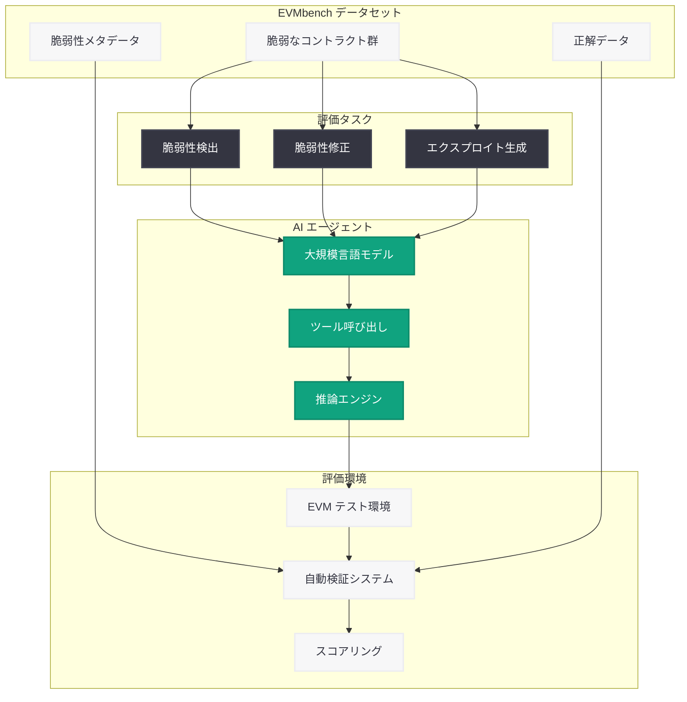

# OpenAI と Paradigm がスマートコントラクト脆弱性検出 AI ベンチマーク「EVMbench」を発表

## メタデータ

| 項目 | 内容 |
|------|------|
| 発表日 | 2026-05-24 |
| ソース | OpenAI Research |
| カテゴリ | 研究成果 / セキュリティ |
| 公式リンク | [Introducing EVMbench](https://openai.com/index/introducing-evmbench/) |

## 概要

OpenAI と暗号資産 / Web3 投資企業 Paradigm が共同で、AI エージェントのスマートコントラクトセキュリティ能力を評価するためのベンチマーク「EVMbench」を発表した。EVMbench は、Ethereum Virtual Machine (EVM) 上のスマートコントラクトに存在する重大な脆弱性を AI がどの程度正確に検出、修正、およびエクスプロイトできるかを体系的に測定するものである。

このベンチマークは、ブロックチェーン / DeFi 領域におけるセキュリティ課題に対して AI がどこまで貢献できるかを定量的に評価する初の包括的フレームワークとなる。スマートコントラクト監査の自動化、脆弱性発見の高速化、そしてセキュリティ人材不足への対応として、業界に大きなインパクトを与える研究成果である。

## 主な内容

### EVMbench の概要と目的

EVMbench は、AI エージェントがスマートコントラクトのセキュリティタスクをどの程度遂行できるかを評価するために設計されたベンチマークである。従来のスマートコントラクト監査は人間の専門家に大きく依存しており、コストが高く時間もかかる。EVMbench は AI による自動化の可能性を定量的に測定し、セキュリティ監査の民主化を目指している。

主な評価対象は以下の 3 つのタスクである:

1. **脆弱性検出 (Detection)**: コントラクトコードから重大な脆弱性を発見する能力
2. **脆弱性修正 (Patching)**: 発見された脆弱性に対して適切なパッチを作成する能力
3. **脆弱性エクスプロイト (Exploitation)**: 脆弱性を実際に悪用するエクスプロイトコードを生成する能力

### OpenAI と Paradigm の協業

本ベンチマークは OpenAI の AI 研究能力と Paradigm のブロックチェーンセキュリティに関する深い専門知識を組み合わせた共同研究の成果である。Paradigm は DeFi プロトコルへの投資を通じて蓄積したセキュリティ監査の知見を提供し、OpenAI はモデル評価とベンチマーク設計の方法論を担当している。

この協業により、実際の DeFi プロトコルで発生した脆弱性に基づいた現実的なデータセットが構築された。

### 対象となる脆弱性の種類

EVMbench が対象とするのは、高重大度 (High Severity) のスマートコントラクト脆弱性である。具体的には以下のような脆弱性カテゴリが含まれる:

- **再入攻撃 (Reentrancy)**: 外部呼び出しを通じてコントラクトの状態を不正に操作する攻撃
- **整数オーバーフロー / アンダーフロー**: 算術演算の境界値を悪用する攻撃
- **アクセス制御の不備**: 権限チェックの欠如による不正操作
- **フラッシュローン攻撃**: 瞬時の借入を利用した価格操作
- **オラクル操作**: 外部データフィードの操作による不正利益取得
- **ロジックエラー**: ビジネスロジックの実装ミスによる資産流出

### DeFi セキュリティへの意義

DeFi (分散型金融) エコシステムでは、スマートコントラクトの脆弱性による被害額が年間数十億ドルに達している。EVMbench は以下の点で DeFi セキュリティの向上に貢献する:

- 監査プロセスの効率化と自動化の促進
- セキュリティ専門家の不足に対する AI 補完の可能性評価
- 新規プロトコルのデプロイ前チェックの強化
- 既存プロトコルの継続的モニタリングへの応用

## 技術的な詳細

### ベンチマーク構成

EVMbench は以下の構成要素から成り立っている:

| 要素 | 説明 |
|------|------|
| データセット | 実際に発生した高重大度の脆弱性を含むスマートコントラクト群 |
| タスク定義 | 検出・修正・エクスプロイトの 3 タスク |
| 評価指標 | タスクごとの成功率、精度、再現率 |
| 実行環境 | EVM 互換のテスト環境 (フォークされたメインネット状態) |

### 評価タスクの詳細

#### 1. 脆弱性検出タスク

AI エージェントにスマートコントラクトのソースコードを提示し、存在する脆弱性を特定させる。評価基準は:

- 脆弱性の存在箇所の正確な特定
- 脆弱性の種類の正確な分類
- 偽陽性 (False Positive) の抑制

#### 2. 脆弱性修正タスク

特定された脆弱性に対して、機能を維持しながらセキュリティ上の問題を解消するパッチコードを生成する。評価基準は:

- パッチ適用後に脆弱性が解消されているか
- 既存の機能が正常に動作するか (回帰テスト)
- パッチの品質と保守性

#### 3. エクスプロイト生成タスク

脆弱性を実際に悪用する Proof of Concept (PoC) コードを生成する。評価基準は:

- エクスプロイトが実際に成功するか (テスト環境での実行)
- 攻撃シナリオの現実性
- 資産抽出の完全性

### 評価環境

```solidity
// EVMbench 評価対象の脆弱性例 (再入攻撃)
contract VulnerableVault {
    mapping(address => uint256) public balances;

    function withdraw(uint256 amount) external {
        require(balances[msg.sender] >= amount, "Insufficient balance");
        // 脆弱性: 状態更新前の外部呼び出し
        (bool success, ) = msg.sender.call{value: amount}("");
        require(success, "Transfer failed");
        balances[msg.sender] -= amount;
    }
}
```

```solidity
// AI が生成すべきパッチ例
contract SecureVault {
    mapping(address => uint256) public balances;

    function withdraw(uint256 amount) external {
        require(balances[msg.sender] >= amount, "Insufficient balance");
        // 修正: Checks-Effects-Interactions パターンの適用
        balances[msg.sender] -= amount;
        (bool success, ) = msg.sender.call{value: amount}("");
        require(success, "Transfer failed");
    }
}
```

## アーキテクチャ



## 開発者への影響

- **スマートコントラクト監査の効率化**: AI エージェントを活用した自動監査ツールの開発が加速し、監査コストの削減と所要時間の短縮が期待される
- **セキュリティツールの標準化**: EVMbench が業界標準のベンチマークとして定着すれば、AI セキュリティツールの比較評価が容易になり、ツール選定の指針となる
- **DeFi プロトコル開発者の恩恵**: デプロイ前のセキュリティチェックが AI により自動化されることで、開発サイクルの高速化とセキュリティ品質の向上が両立できる
- **セキュリティ研究者のワークフロー変革**: AI をアシスタントとして活用し、脆弱性発見の初期スクリーニングを自動化することで、専門家はより複雑な攻撃ベクトルの分析に集中できる
- **新たなキャリア機会**: AI セキュリティとブロックチェーンの両方に精通した人材への需要が高まり、スマートコントラクトセキュリティ × AI の専門分野が確立される
- **オープンソースエコシステムへの貢献**: ベンチマークの公開により、コミュニティ主導でのセキュリティツール開発と改善が促進される

## 関連リンク

- [EVMbench 公式発表](https://openai.com/index/introducing-evmbench/)
- [OpenAI Research](https://openai.com/research)
- [Paradigm](https://www.paradigm.xyz/)
- [Ethereum スマートコントラクトセキュリティベストプラクティス](https://consensys.github.io/smart-contract-best-practices/)
- [OpenAI News](https://openai.com/news)

## まとめ

OpenAI と Paradigm が共同開発した EVMbench は、AI エージェントのスマートコントラクトセキュリティ能力を検出・修正・エクスプロイトの 3 軸で体系的に評価する初の包括的ベンチマークである。DeFi エコシステムにおける脆弱性被害が深刻化する中、AI による自動監査の可能性を定量的に測定できるフレームワークの登場は極めて重要な意味を持つ。このベンチマークにより、スマートコントラクト監査の自動化、セキュリティツールの標準化、そして AI を活用した次世代セキュリティソリューションの開発が加速することが期待される。ブロックチェーンセキュリティと AI の融合は、DeFi の安全性向上における新たなフロンティアを切り拓くものである。
