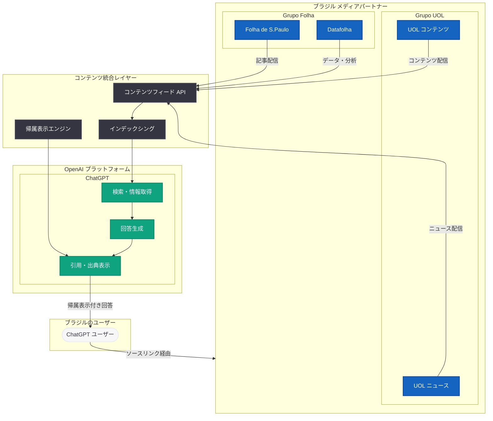

# OpenAI、Grupo Folha および Grupo UOL と戦略的コンテンツパートナーシップを締結

## メタデータ

| 項目 | 内容 |
|------|------|
| 発表日 | 2026-05-25 |
| ソース | OpenAI News/Blog |
| カテゴリ | Global Affairs / Content Partnership |
| 公式リンク | [openai.com/index/grupo-folha-grupo-uol-partnership](https://openai.com/index/grupo-folha-grupo-uol-partnership) |

## 概要

OpenAI は、ブラジル最大級のメディアグループである Grupo Folha および Grupo UOL との戦略的コンテンツパートナーシップを発表した。この提携により、信頼性の高いブラジルのジャーナリズムコンテンツが ChatGPT に統合され、ブラジルのユーザーに対して帰属表示と透明性を確保した形でニュースへのアクセスが拡大される。

本パートナーシップは、OpenAI が世界各国の主要メディア組織と連携し、信頼できるジャーナリズムを ChatGPT に組み込むグローバル戦略の一環である。ブラジルはラテンアメリカ最大のインターネット市場であり、同国を代表する 2 つのメディアグループとの提携は、OpenAI の中南米市場における存在感を大きく高めるものとなる。

## 主な内容

### Grupo Folha について

Grupo Folha は、ブラジルで最も影響力のあるメディアグループの一つである。主要な資産として以下を保有している。

- **Folha de S.Paulo:** ブラジルで最も発行部数の多い高品質日刊紙の一つ。1921 年創刊で、100 年以上の歴史を持つ
- **UOL (ポータルサイト):** ブラジル最大級のインターネットポータル
- **Datafolha:** ブラジルを代表する世論調査機関

Folha de S.Paulo は、政治・経済・社会に関する調査報道で知られ、ブラジルの民主主義と報道の自由において重要な役割を果たしてきた。

### Grupo UOL について

Grupo UOL は、ブラジル最大のオンラインコンテンツおよびサービス企業の一つである。

- **多様なコンテンツ:** ニュース、エンターテインメント、スポーツ、経済など幅広い分野をカバー
- **デジタルサービス:** 電子決済 (PagSeguro)、ホスティング、e コマースなど多角的な事業展開
- **巨大なリーチ:** 月間数千万のユニークユーザーを持つブラジル有数のデジタルプラットフォーム

### パートナーシップの内容

本提携により、以下が実現される。

| 項目 | 内容 |
|------|------|
| コンテンツ統合 | Grupo Folha と Grupo UOL の記事・報道が ChatGPT の回答に統合 |
| 帰属表示 | ソース元の明確な表示による報道機関への適切なクレジット付与 |
| 透明性 | 情報源の追跡可能性と出典の明示 |
| アクセス拡大 | ブラジルのユーザーが ChatGPT を通じて信頼性の高いニュースにアクセス可能に |

### OpenAI のグローバルメディアパートナーシップ戦略

OpenAI は、世界各地の主要メディア組織と積極的にパートナーシップを構築している。これまでの主な提携先には以下が含まれる。

- **米国:** Associated Press、Axel Springer、News Corp
- **欧州:** Le Monde (フランス)、Prisa Media (スペイン)
- **アジア:** 各国メディアとの連携拡大

今回の Grupo Folha および Grupo UOL との提携は、ラテンアメリカ市場における重要な一歩であり、ポルトガル語圏での ChatGPT の情報信頼性を大幅に向上させるものである。

## 技術的な詳細

### コンテンツ統合メカニズム

ChatGPT へのメディアコンテンツ統合には、以下の技術的要素が含まれると想定される。

- **リアルタイムコンテンツフィード:** メディアパートナーからの最新記事をリアルタイムまたは準リアルタイムで取得
- **コンテンツインデックシング:** 記事のメタデータ、カテゴリ、公開日時に基づく効率的な検索・取得
- **言語処理:** ポルトガル語コンテンツの適切な理解と引用

### 帰属表示 (Attribution) の仕組み

信頼性と透明性を確保するため、以下の帰属表示メカニズムが実装される。

- **インライン引用:** ChatGPT の回答内に情報源へのリンクを明示
- **ソースカード:** 記事タイトル、発行元、公開日時を含む視覚的な出典表示
- **トラフィック還元:** ユーザーがソースリンクをクリックすることで、元の報道機関にトラフィックを還元

### 透明性 (Transparency) の確保

- **情報の鮮度表示:** コンテンツの公開・更新日時の明示
- **編集方針の尊重:** メディアパートナーの編集独立性の保証
- **コンテンツ使用範囲の明確化:** どのコンテンツがどのように使用されるかの透明な開示

## アーキテクチャ

## 業界への影響

- **ブラジル市場での信頼性向上:** 国内最大級のメディアグループとの提携により、ChatGPT のポルトガル語回答の情報信頼性が大幅に向上する
- **メディア業界の AI 対応加速:** ブラジルの他のメディア企業も AI プラットフォームとの連携を検討する契機となる
- **持続可能なジャーナリズムモデル:** コンテンツ使用に対する適切な対価とトラフィック還元により、デジタルジャーナリズムの新たな収益モデルが確立される
- **ラテンアメリカでの AI 普及:** ブラジルを起点として、中南米全域での ChatGPT の利用拡大と現地コンテンツの充実が期待される
- **情報の民主化:** 質の高いジャーナリズムへのアクセス障壁が低下し、より多くのユーザーが信頼性の高い情報に到達可能になる

## 関連リンク

- [OpenAI, Grupo Folha and Grupo UOL announce strategic content partnership](https://openai.com/index/grupo-folha-grupo-uol-partnership)
- [OpenAI News](https://openai.com/news)
- [Folha de S.Paulo](https://www.folha.uol.com.br/)
- [UOL](https://www.uol.com.br/)

## まとめ

OpenAI と Grupo Folha および Grupo UOL との戦略的パートナーシップは、ブラジルという巨大市場において ChatGPT の情報品質と信頼性を飛躍的に向上させる重要な取り組みである。ブラジルを代表する 2 大メディアグループのコンテンツが、帰属表示と透明性を確保した形で ChatGPT に統合されることで、ユーザーは信頼できるジャーナリズムに基づいた回答を得られるようになる。

本提携は、OpenAI のグローバルメディアパートナーシップ戦略におけるラテンアメリカ展開の重要なマイルストーンであり、AI プラットフォームと報道機関の共存共栄モデルを示す事例でもある。コンテンツの適切な対価支払いとトラフィック還元を通じて、デジタルジャーナリズムの持続可能性に貢献しつつ、AI を活用した情報アクセスの拡大を実現する点で、業界全体にとって意義深い発表である。
