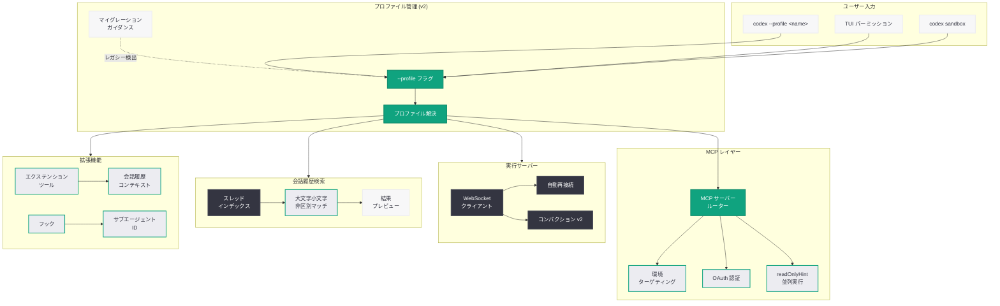

# Codex CLI v0.134.0: ローカル会話履歴検索とプロファイル管理の刷新

## メタデータ

| 項目 | 内容 |
|------|------|
| 発表日 | 2026-05-26 |
| ソース | OpenAI API Changelog / GitHub Release |
| カテゴリ | SDK Update / Developer Tools |
| 公式リンク | [GitHub Release](https://github.com/openai/codex/releases/tag/rust-v0.134.0) |

## 概要

OpenAI は Codex CLI v0.134.0 をリリースした。本バージョンでは、ローカル会話履歴に対する全文検索機能の追加、`--profile` フラグによるプロファイル選択の統一、MCP セットアップの改善、読み取り専用 MCP ツールの並列実行対応など、開発者の生産性を高める多数の機能強化が含まれている。

前バージョン v0.133.0 から数日後のリリースであり、64 コミット、25 名のコントリビューターによる変更が含まれる。プロファイル管理においてはレガシー v1 設定の完全な廃止が行われ、マイグレーションガイダンスが提供されている。リモート接続の信頼性向上や Windows TUI のレンダリング修正など、安定性に関する改善も重要なポイントである。

## 主な内容

### ローカル会話履歴検索

Codex CLI にローカルの会話スレッドを横断して検索する機能が追加された。大文字・小文字を区別しないコンテンツマッチングと、結果プレビュー表示をサポートする。これにより、過去のやり取りの中から特定のコードスニペットや議論内容を素早く見つけ出すことが可能になった。

- 大文字・小文字を区別しない検索 (case-insensitive)
- 結果のプレビュー表示による迅速な内容確認
- ロールアウトに基づくスレッドコンテンツ検索の実装

### `--profile` による統一プロファイル管理

`--profile` フラグが CLI、TUI パーミッション、サンドボックスフローを横断する唯一のプロファイル選択手段として確立された。レガシーな v1 プロファイル設定は完全に廃止され、使用時にはマイグレーションガイダンスが表示される。

主な変更点:

- レガシー v1 プロファイルのプランビング、解決パス、書き込みパス、テレメトリを全て削除
- TUI でのパーミッションプロファイル選択の統合
- `codex sandbox` コマンドでの `--profile` サポート
- App-Server からのレガシープロファイル設定サーフェスの削除
- マイグレーションドキュメントへのリンクをエラーメッセージに追加

### MCP セットアップの改善

MCP (Model Context Protocol) サーバーの設定に、サーバーごとの環境ターゲティングと OAuth オプションが追加された。ストリーマブル HTTP サーバーに対する OAuth 認証フローがサポートされ、エンタープライズ環境での MCP サーバー統合がより柔軟になった。

- 明示的な環境指定による MCP サーバールーティング
- `codex mcp add` コマンドでの OAuth オプションサポート

### コネクタツールスキーマの信頼性向上

ツール入力スキーマにおけるローカルな `$ref` / `$defs` 構造の保持が実装された。また、過度に大きなスキーマはモデルに公開する前にベストエフォートで圧縮され、トークン使用量の削減とスキーマ解釈の信頼性が向上した。

### 読み取り専用 MCP ツールの並列実行

`readOnlyHint` アノテーションを持つ MCP ツールが並列に実行できるようになった。読み取り専用の操作を同時に実行することで、情報収集フェーズのレイテンシが大幅に削減される。

### 拡張機能とフックコンテキストの強化

- エクステンションツールに会話履歴が公開され、コンテキストを活用した処理が可能に
- フック入力にサブエージェントのアイデンティティ情報が含まれるようになり、フックがどのエージェントから呼び出されたかを判別可能に

## 技術的な詳細

### プロファイルマイグレーション

v0.134.0 ではレガシー v1 プロファイル設定が完全に廃止された。旧形式の設定を使用している場合、明確なエラーメッセージとマイグレーションドキュメントへのリンクが表示される。

### MCP サーバー環境ルーティング

MCP サーバーは明示的な環境ターゲティングにより、異なるサーバーを異なるコンテキスト (開発、ステージング、本番) で使い分けることが可能になった。

### リモート接続の信頼性

リモート実行における WebSocket 接続の安定性が大幅に向上した:

- exec-server の WebSocket クライアントが切断された場合の自動再接続
- 認証回復後のリモートコントロールの即時リトライ
- リモートコンパクション v2 ストリームのリトライ処理

### コードサンプル

以下は v0.134.0 で追加・改善された機能の使用例である。

```bash
# ローカル会話履歴の検索
codex search "API endpoint implementation"

# プロファイルを指定して起動
codex --profile production chat

# プロファイルを指定してサンドボックスを起動
codex sandbox --profile staging

# MCP サーバーの追加 (OAuth オプション付き)
codex mcp add my-server \
  --url https://mcp.example.com/stream \
  --env production \
  --oauth-client-id "client_abc123" \
  --oauth-scope "read write"

# 特定のプロファイルで TUI を起動
codex --profile dev tui
```

```bash
# 開発者向け: テストの実行 (推奨方法が変更)
# 旧: cargo test
# 新: just test (リポジトリローカルのテスト実行に推奨)
just test

# curl によるインストール (新しくドキュメント化)
curl -fsSL https://codex.openai.com/install.sh | sh

# PowerShell によるインストール (Windows)
irm https://codex.openai.com/install.ps1 | iex
```

## アーキテクチャ

以下の図は、Codex CLI v0.134.0 のプロファイル管理と MCP サーバー連携のアーキテクチャを示している。



## 開発者への影響

### 会話履歴の活用が容易に

- ローカル検索機能により、過去のセッションで議論したコードや解決策を素早く再利用可能
- プロジェクトをまたいだナレッジの蓄積と検索が CLI 上で完結する

### プロファイル管理の移行が必須

- レガシー v1 プロファイル設定を使用している開発者は、v2 形式への移行が必要
- `--profile` フラグが唯一のプロファイル選択手段となったため、スクリプトやワークフローの更新が求められる
- マイグレーションガイダンスが提供されているため、移行は比較的スムーズに行える

### MCP サーバー統合の柔軟性向上

- 環境ごとの MCP サーバー設定が可能になり、開発・本番環境の分離が容易に
- OAuth サポートにより、エンタープライズ環境でのセキュアな MCP サーバー接続が実現
- `readOnlyHint` による並列実行は、複数の情報ソースからのデータ収集を高速化

### リモート開発の信頼性向上

- WebSocket 再接続の自動化により、ネットワーク不安定な環境でもリモートセッションが維持される
- 認証回復後の即時リトライにより、トークン期限切れ時のダウンタイムが最小化

### Windows 開発者への改善

- TUI レンダリングの修正により、Windows Terminal での表示崩れが解消
- ローリングファイルによるサンドボックスログ管理の改善

## 関連リンク

- [Codex CLI v0.134.0 リリースノート](https://github.com/openai/codex/releases/tag/rust-v0.134.0)
- [完全な変更履歴 (v0.133.0 との差分)](https://github.com/openai/codex/compare/rust-v0.133.0...rust-v0.134.0)
- [OpenAI Codex](https://openai.com/codex)
- [Codex GitHub リポジトリ](https://github.com/openai/codex)
- [OpenAI API リファレンス](https://platform.openai.com/docs/api-reference)
- [OpenAI API Changelog](https://platform.openai.com/docs/changelog)

## まとめ

Codex CLI v0.134.0 は、開発者ワークフローの効率化と運用基盤の安定化を両立させたリリースである。ローカル会話履歴検索により過去のセッションを横断的に活用でき、`--profile` フラグの統一はプロファイル管理の複雑さを解消する。MCP サーバーの環境ターゲティングと OAuth サポートはエンタープライズ利用を加速し、`readOnlyHint` による並列実行は情報収集の高速化に寄与する。リモート WebSocket 接続の自動再接続や Windows TUI の修正など、安定性の改善も見逃せない。レガシー v1 プロファイルの完全廃止に伴い、既存ユーザーはマイグレーションが必要となるが、提供されるガイダンスにより円滑な移行が可能である。25 名のコントリビューターによる 64 コミットの成果として、Codex CLI のプラットフォームとしての成熟度がさらに高まったリリースと言える。
