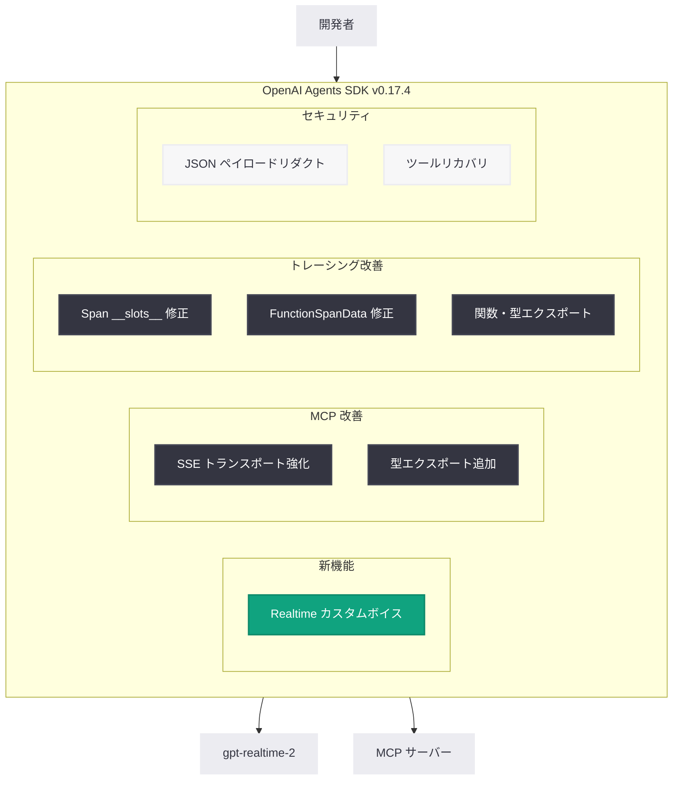

# OpenAI Agents SDK v0.17.4: Realtime カスタムボイス対応とトレーシング・MCP 安定性の向上

## メタデータ

| 項目 | 内容 |
|------|------|
| 発表日 | 2026-05-26 |
| ソース | OpenAI API Changelog / GitHub Release |
| カテゴリ | SDK アップデート / API Changelog |
| 公式リンク | [GitHub Release v0.17.4](https://github.com/openai/openai-agents-python/releases/tag/v0.17.4) |

## 概要

OpenAI Agents SDK v0.17.4 がリリースされた。本リリースでは、Realtime エージェントにおけるカスタムボイスオブジェクトのサポートが新機能として追加されたほか、MCP SSE トランスポートの HTTP クライアントセキュリティ強化、トレーシング関連の型エクスポート改善、エラーハンドリングの堅牢化など 7 件のバグ修正が含まれている。v0.17.0 で導入された `gpt-realtime-2` モデルのエコシステムがさらに拡充され、マルチエージェントアプリケーションの開発体験が向上するリリースとなっている。

## 主な内容

### 新機能: Realtime カスタムボイスオブジェクト対応

**PR #3473** (by @lionel-oai)

v0.17.0 で `gpt-realtime-2` がデフォルトモデルとして導入された RealtimeAgent に対し、カスタムボイスオブジェクトのサポートが追加された。これにより、開発者は事前定義された音声だけでなく、カスタム音声設定をオブジェクトとして渡すことが可能になる。

### バグ修正: MCP SSE トランスポートのセキュリティ強化

**PR #3466** (by @ioleksiuk)

MCP (Model Context Protocol) の SSE (Server-Sent Events) トランスポートに対して、強化された HTTP クライアントのデフォルト設定が適用されるようになった。これにより、タイムアウト、リトライ、接続プーリングなどのセキュリティおよび信頼性に関する設定が MCP 通信にも一貫して適用される。

### バグ修正: 欠損ファンクションツールのオプトインリカバリ

**PR #3461** (by @seratch)

Issue #3459 への対応として、エージェント実行時に参照されるファンクションツールが見つからない場合に、オプトインでリカバリ処理を行う機能が追加された。これにより、ツール定義の変更やデプロイのタイミングに起因するエラーを緩和できる。

### バグ修正: トレーシングとスパン関連の改善

複数の修正により、トレーシング機能の安定性と利便性が向上した。

| PR | 修正内容 | 影響 |
|----|----------|------|
| #3475 | `FunctionSpanData` の output に `None` でない値を使用 | スパンデータの正確性向上 |
| #3483 | span の `__slots__` に不足エントリを追加 | メモリ効率とアトリビュートエラー防止 |
| #3489 | トレーシング関連の関数・型を `agents` からエクスポート | 開発者が直接インポート可能に |
| #3490 | `MCPListToolsItem`、`ToolSearchCallItem`、`ToolSearchOutputItem` をエクスポート | MCP ツール関連型の利用性向上 |

### バグ修正: セキュリティ関連

**PR #3485** (by @LeSingh1)

`ModelBehaviorError` のデータに含まれる無効な JSON ペイロードが自動的にリダクト (墨消し) されるようになった。これにより、エラーログやトレースに機密情報が誤って含まれるリスクが低減される。

## 技術的な詳細

### インストール / アップグレード

```bash
pip install --upgrade openai-agents==0.17.4
```

### コードサンプル

#### Realtime カスタムボイスオブジェクトの使用

```python
from agents.realtime import RealtimeAgent, RealtimeSession

# v0.17.4 以降: カスタムボイスオブジェクトを直接指定可能
agent = RealtimeAgent(
    name="voice_assistant",
    model="gpt-realtime-2",
    voice={
        "id": "custom-voice-id",
        "settings": {
            "pitch": 1.0,
            "speed": 1.0,
        }
    },
    instructions="You are a helpful voice assistant.",
)

async with RealtimeSession(agent) as session:
    await session.start()
```

#### 欠損ファンクションツールのオプトインリカバリ

```python
from agents import Agent, Runner, RunConfig

# v0.17.4 以降: 欠損ツールのリカバリをオプトインで有効化
agent = Agent(
    name="my_agent",
    tools=[my_tool],
)

# ツールが見つからない場合でもエラーではなくリカバリを試行
config = RunConfig(
    recover_missing_function_tools=True  # オプトイン
)

result = await Runner.run(agent, "タスクを実行してください", run_config=config)
```

#### トレーシング関連型の直接インポート

```python
# v0.17.4 以降: agents パッケージから直接インポート可能
from agents import (
    MCPListToolsItem,
    ToolSearchCallItem,
    ToolSearchOutputItem,
)

# トレーシング関連の関数・型も直接利用可能
from agents import (
    trace,
    get_current_span,
    FunctionSpanData,
)
```

## アーキテクチャ



## 開発者への影響

- **Realtime エージェント開発者**: カスタムボイスオブジェクトの直接サポートにより、音声エージェントのカスタマイズ性が大幅に向上。音声のピッチや速度を細かく制御可能に
- **MCP 統合利用者**: SSE トランスポートのセキュリティがデフォルトで強化され、追加設定なしに堅牢な HTTP 通信が実現。また、`MCPListToolsItem` 等の型が直接インポート可能になり、TypeScript 的な型安全な開発が容易に
- **トレーシング利用者**: スパン関連の修正により、メモリ効率が改善し、`None` 値によるランタイムエラーが防止される。また、トレーシング関連の関数・型が `agents` パッケージから直接インポート可能になり、インポートパスが簡潔に
- **本番環境運用者**: `ModelBehaviorError` での JSON ペイロードリダクトにより、エラーログに機密情報が含まれるリスクが低減。欠損ツールのリカバリ機能により、デプロイ時の一時的なツール不整合への耐障害性が向上
- **後方互換性**: 全ての変更は後方互換であり、既存コードの修正は不要。欠損ツールリカバリはオプトイン方式のため、明示的に有効化しない限り既存の動作に影響しない

## 新規コントリビューター

- **@rmotgi1227**: 初コントリビューション (PR #3475) 以降、4 件のトレーシング関連修正を提供

## 関連リンク

- [GitHub Release v0.17.4](https://github.com/openai/openai-agents-python/releases/tag/v0.17.4)
- [Full Changelog: v0.17.3...v0.17.4](https://github.com/openai/openai-agents-python/compare/v0.17.3...v0.17.4)
- [OpenAI Agents SDK ドキュメント](https://openai.github.io/openai-agents-python/)
- [前バージョン v0.17.3 リリースノート](https://github.com/openai/openai-agents-python/releases/tag/v0.17.3)
- [Issue #3459: Missing function tools](https://github.com/openai/openai-agents-python/issues/3459)
- [OpenAI Agents SDK v0.17.0 (Realtime メジャーアップデート)](https://github.com/openai/openai-agents-python/releases/tag/v0.17.0)

## まとめ

OpenAI Agents SDK v0.17.4 は、v0.17.0 で導入された Realtime エージェント機能の拡充と、SDK 全体のトレーシング・MCP 統合の安定性向上に焦点を当てたリリースである。カスタムボイスオブジェクトのサポートにより音声エージェントの柔軟性が高まり、MCP SSE トランスポートの HTTP クライアント強化やエラー時の JSON リダクトによりセキュリティが向上している。また、トレーシング関連型のエクスポート改善は、SDK の利便性を日常的に改善する地道な品質向上である。v0.17.x シリーズの安定性が着実に成熟しており、プロダクション環境での利用に向けた信頼性が高まっている。
