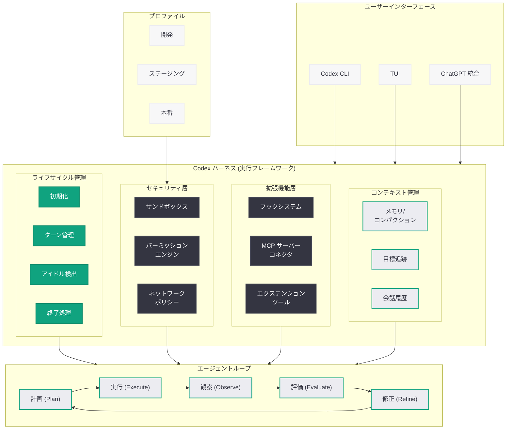

# Codex ハーネスの全貌を解き明かす: エージェント実行フレームワークの拡張と活用

## メタデータ

| 項目 | 内容 |
|------|------|
| 発表日 | 2026-05-26 |
| ソース | OpenAI Engineering Blog |
| カテゴリ | エンジニアリング / Codex |
| 公式リンク | [openai.com/index/unlocking-the-codex-harness](https://openai.com/index/unlocking-the-codex-harness/) |

> **注:** 本レポートは OpenAI エンジニアリングブログのサイトマップ情報とタイトルに基づいて作成しています。記事本文へのアクセスは Cloudflare の保護により制限されたため、タイトル、URL、関連記事の文脈、および Codex の公開情報に基づいて内容を構成しています。正確な詳細については公式記事を参照してください。

## 概要

OpenAI は 2026 年 5 月 26 日、エンジニアリングブログにて「Unlocking the Codex Harness」と題した技術記事を公開した。本記事は、Codex エージェントの実行フレームワークである「ハーネス」(Harness) の内部設計、カスタマイズ手法、および高度な活用パターンについて解説するものと推察される。

「ハーネス」とは、Codex エージェントのライフサイクル全体を管理する実行フレームワークであり、サンドボックス化、ツールアクセス制御、パーミッション境界、エクステンション連携、フック実行などの機構を統合的に提供する基盤である。タイトルの "Unlocking" (解放する) は、このハーネスの潜在的な拡張性を開発者が最大限に引き出すための方法論を示すことを意味していると考えられる。本記事は、2026 年 3 月の「Unrolling the Codex Agent Loop」(エージェントループの内部展開)、同年 3 月の「Codex Hooks」(ライフサイクルフック)、5 月の「Running Codex Safely」(安全な運用) に続く、Codex のアーキテクチャ深掘りシリーズの最新エントリである。

## 主な内容

### Codex ハーネスとは

Codex ハーネスは、エージェントの実行ライフサイクル全体を管理する統合フレームワークである。エージェントループ (Plan - Execute - Observe - Evaluate - Refine) の外側に位置し、エージェントが安全かつ効率的に動作するための環境制御を担う。

ハーネスの主要な責務は以下の通りである。

- **実行環境の構築と管理:** サンドボックスの起動、ファイルシステムのマウント、ネットワークポリシーの適用
- **パーミッション境界の強制:** ツール呼び出しの認可、ファイルアクセスの制御、コマンド実行の許可・拒否判定
- **ライフサイクルイベントの発行:** エージェントの開始、ターン完了、アイドル状態、終了などのイベントをフックに通知
- **コンテキスト管理:** メモリの圧縮 (コンパクション)、目標追跡、会話履歴の管理
- **拡張機能の統合:** MCP サーバー、エクステンションツール、カスタムエージェントの接続

### ハーネスの "Unlocking" - 拡張可能性の解放

"Unlocking" の概念は、ハーネスが提供するカスタマイズポイントを開発者が活用し、Codex の動作を自社のワークフローに最適化することを指すと考えられる。主な拡張ポイントは以下である。

**フックによるカスタムロジックの注入:**

- `on-thread-idle`: エージェントがアイドル状態になった際のカスタム処理
- `on-turn-start` / `on-turn-end`: ターンの開始・終了時のイベントハンドリング
- `on-tool-call`: ツール呼び出し前後のインターセプト
- サブエージェントのアイデンティティ情報へのアクセス (v0.134.0 以降)

**MCP サーバーによるツール拡張:**

- 環境ターゲティングによるサーバーの使い分け
- OAuth 認証フローによるセキュアな接続
- `readOnlyHint` アノテーションによる並列実行の最適化

**プロファイルによる環境管理:**

- `--profile` フラグによる設定の切り替え
- 開発・ステージング・本番環境ごとの異なるポリシー適用
- パーミッション設定のプロファイル単位での管理

### セキュリティモデルとサンドボックス

ハーネスのセキュリティモデルは多層防御の原則に基づいている。

- **デフォルト拒否ポリシー:** 明示的に許可されていないアクションは全てブロック
- **コンテナ隔離:** 各エージェントインスタンスが独立した実行環境で動作
- **ネットワーク制御:** ホワイトリスト方式による外部アクセスの制限
- **読み取り専用ベースイメージ:** システムレベルの改竄を防止
- **リソースクォータ:** CPU、メモリ、ディスク I/O の使用量制限

### エンタープライズ向けハーネス構成

エンタープライズ環境では、ハーネスの構成をより精密に制御する必要がある。

- **リモート接続の信頼性:** WebSocket の自動再接続、認証回復後の即時リトライ
- **テレメトリとオブザーバビリティ:** アクション単位のトレーシング、異常検知、監査ログ
- **コンプライアンス統合:** 承認ワークフロー、変更影響分析、監査証跡の保持
- **マルチプロファイル管理:** チーム・プロジェクト・環境ごとの設定分離

## 技術的な詳細

### ハーネス構成の概念モデル

以下は、Codex ハーネスの構成要素とその関係を示す概念的なモデルである。

```yaml
# codex-harness-config.yaml (概念的な構成例)
harness:
  sandbox:
    type: container
    read_only_root: true
    network_policy: whitelist
    resource_limits:
      cpu: "4"
      memory: "8Gi"
      disk_io: "100Mi/s"

  permissions:
    file_access:
      - path: "/workspace/**"
        mode: read-write
      - path: "/system/**"
        mode: read-only
    commands:
      allow:
        - "git *"
        - "npm *"
        - "cargo *"
      deny:
        - "rm -rf /"
        - "curl * | sh"

  hooks:
    on-turn-start:
      command: "python /hooks/validate_context.py"
      timeout: 10
    on-thread-idle:
      command: "python /hooks/cleanup_temp.py"
      timeout: 30
    on-tool-call:
      command: "python /hooks/audit_tool_use.py"
      timeout: 5

  extensions:
    mcp_servers:
      - name: "internal-docs"
        url: "https://mcp.company.com/docs"
        env: production
        oauth:
          client_id: "codex_client"
          scope: "read"
      - name: "test-runner"
        url: "https://mcp.company.com/tests"
        env: staging
        read_only_hint: true

  profiles:
    development:
      sandbox:
        network_policy: permissive
      permissions:
        commands:
          allow: ["*"]
    production:
      sandbox:
        network_policy: strict
      hooks:
        on-turn-end:
          command: "python /hooks/compliance_check.py"
```

### コードサンプル

以下は、ハーネスのカスタマイズに関連する使用例である。

```bash
# プロファイルを指定してハーネスを起動
codex --profile production chat

# ハーネスの診断情報を確認
codex doctor --verbose

# MCP サーバーをハーネスに追加
codex mcp add internal-docs \
  --url https://mcp.company.com/docs \
  --env production \
  --oauth-client-id "codex_client" \
  --oauth-scope "read"

# フックの設定を検証
codex hooks validate

# サンドボックスのパーミッション設定を確認
codex sandbox --profile production --dry-run
```

```python
# フックスクリプトの例: ツール呼び出しの監査ログ
# /hooks/audit_tool_use.py
import json
import sys
from datetime import datetime

def audit_tool_call():
    """ツール呼び出しを監査ログに記録"""
    hook_input = json.loads(sys.stdin.read())

    tool_name = hook_input.get("tool_name")
    subagent_id = hook_input.get("subagent_identity")
    arguments = hook_input.get("arguments", {})

    log_entry = {
        "timestamp": datetime.utcnow().isoformat(),
        "tool": tool_name,
        "subagent": subagent_id,
        "arguments_hash": hash(json.dumps(arguments, sort_keys=True)),
        "action": "allowed"
    }

    # 監査ログに書き込み
    with open("/var/log/codex/audit.jsonl", "a") as f:
        f.write(json.dumps(log_entry) + "\n")

    # 正常終了 (ツール呼び出しを許可)
    sys.exit(0)

if __name__ == "__main__":
    audit_tool_call()
```

## アーキテクチャ

以下の図は、Codex ハーネスのアーキテクチャと各コンポーネントの関係を示している。



## 開発者への影響

### ハーネスのカスタマイズによるワークフロー最適化

- フックシステムを活用することで、エージェントの各ライフサイクルイベントにカスタムロジックを注入可能
- CI/CD パイプライン、セキュリティスキャン、コンプライアンスチェックとの統合が容易に
- サブエージェント識別情報へのアクセスにより、エージェント種別ごとの細粒度制御が実現

### プロファイルベースの環境管理

- 開発・ステージング・本番環境ごとに異なるハーネス構成を適用可能
- `--profile` フラグ一つで、パーミッション、ネットワークポリシー、フック設定を一括切り替え
- チーム共有の構成テンプレートによる、組織横断的なベストプラクティスの適用

### MCP サーバーによるツールエコシステムの拡張

- 社内ドキュメント検索、テスト実行基盤、デプロイパイプラインなどを MCP サーバーとして統合
- OAuth 認証による安全なエンタープライズシステムとの接続
- `readOnlyHint` による並列実行でデータ収集フェーズの高速化

### セキュリティと信頼性の向上

- デフォルト拒否ポリシーに基づく安全な実行環境の構築
- 監査ログとテレメトリによるエージェント動作の完全な可視化
- リモート接続の自動再接続による運用の安定化

### 診断とデバッグの改善

- `codex doctor` コマンドによるハーネス構成の診断
- フック実行結果のデバッグ出力
- パーミッション拒否時の詳細なエラーメッセージ

## 関連リンク

- [Unlocking the Codex Harness (公式記事)](https://openai.com/index/unlocking-the-codex-harness/)
- [Unrolling the Codex Agent Loop](https://openai.com/index/unrolling-the-codex-agent-loop/) - エージェントループの内部構造解説
- [Running Codex Safely](https://openai.com/index/running-codex-safely) - Codex の安全な運用方法
- [Codex Hooks ドキュメント](https://platform.openai.com/docs/codex/hooks) - ライフサイクルフックの公式ドキュメント
- [Codex CLI v0.134.0 リリースノート](https://github.com/openai/codex/releases/tag/rust-v0.134.0) - 最新版でのフック・プロファイル強化
- [OpenAI Codex](https://openai.com/codex) - Codex 製品ページ
- [OpenAI API リファレンス](https://platform.openai.com/docs/api-reference)

## まとめ

「Unlocking the Codex Harness」は、Codex エージェントの実行フレームワークであるハーネスの全体像とカスタマイズ手法を解説する技術記事である。ハーネスは、サンドボックス、パーミッション制御、ライフサイクルフック、MCP サーバー統合、コンテキスト管理を統合的に提供する基盤であり、エージェントループの外側からエージェントの動作環境を制御する。

本記事は「Unrolling the Codex Agent Loop」(エージェントループの内部構造)、「Codex Hooks」(ライフサイクルフック)、「Running Codex Safely」(安全な運用) に続くシリーズとして位置付けられ、これまで個別に紹介されてきた機構が「ハーネス」という統合的なフレームワークとしてどのように連携するかを示すものと推察される。プロファイルベースの環境管理、MCP サーバーによるツール拡張、フックによるカスタムロジック注入を組み合わせることで、開発者は Codex を自社のワークフローに深く統合し、セキュリティとカスタマイズ性を両立させることが可能になる。Codex CLI v0.134.0 でのプロファイル管理の刷新やフックコンテキストの強化は、このハーネス設計思想の具体的な実装例と言える。
