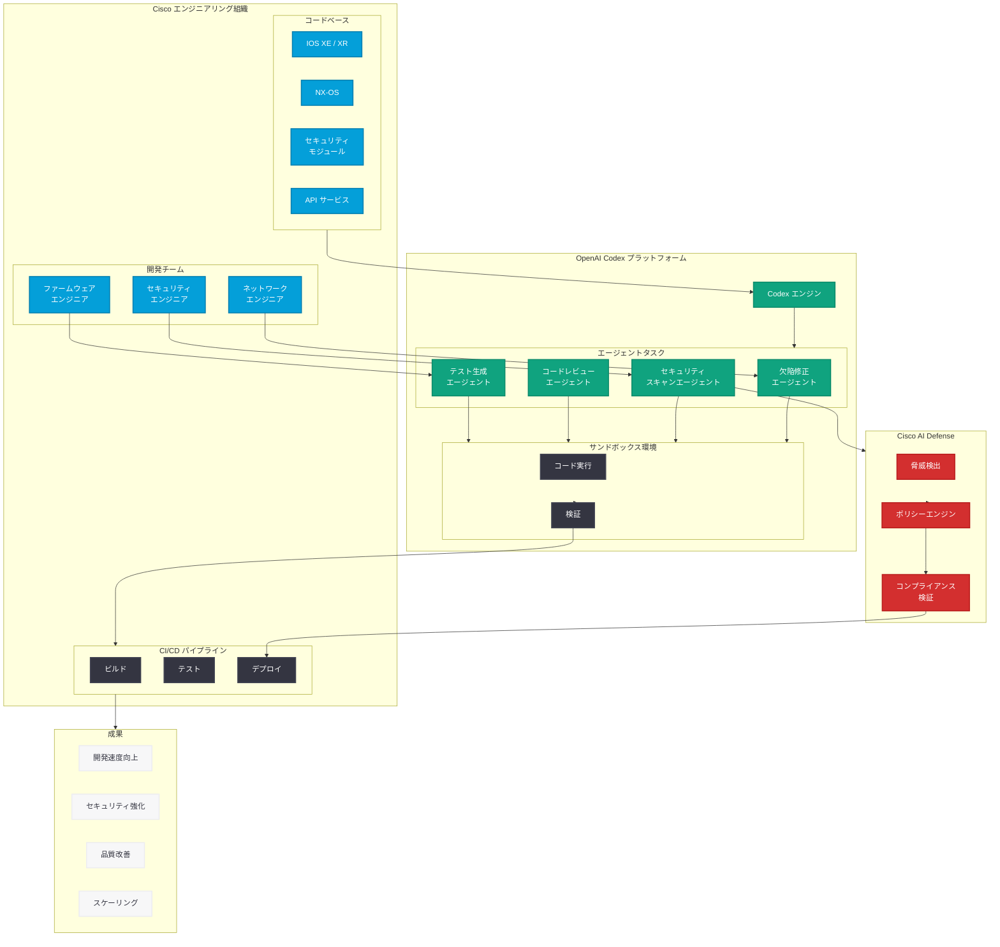

# Cisco と OpenAI が Codex でエンタープライズエンジニアリングを再定義

## メタデータ

| 項目 | 内容 |
|------|------|
| 発表日 | 2026-05-27 |
| ソース | OpenAI News/Blog |
| カテゴリ | エンタープライズ / Codex / パートナーシップ |
| 公式リンク | [openai.com/index/cisco](https://openai.com/index/cisco) |

> **注:** 本レポートは OpenAI ブログのサイトマップ情報とタイトルに基づいて作成しています。記事本文へのアクセスは Cloudflare の保護により制限されたため、タイトル、URL、および公開情報から内容を構成しています。正確な詳細については公式記事を参照してください。

## 概要

OpenAI は 2026 年 5 月 27 日、Cisco との戦略的パートナーシップに関する記事「Cisco and OpenAI redefine enterprise engineering with Codex」を公開した。本パートナーシップにおいて、Cisco は OpenAI の Codex プラットフォームを活用し、AI ネイティブ開発のスケーリング、AI Defense 関連作業の加速、および欠陥修正の自動化を推進している。

Cisco はネットワーキング、セキュリティ、コラボレーション分野で世界最大級のテクノロジー企業であり、数万人のエンジニアが大規模なコードベースを維持・進化させている。このような大規模エンタープライズ環境において、Codex のエージェンティックなソフトウェア開発能力を活用することで、開発生産性の大幅な向上とセキュリティ品質の強化を実現するものと考えられる。

## 主な内容

### AI ネイティブ開発のスケーリング

Cisco のような大規模エンタープライズでは、数千のマイクロサービス、数百万行のコードベース、そして複雑な依存関係グラフを管理する必要がある。Codex を活用した AI ネイティブ開発のスケーリングには、以下の要素が含まれると考えられる。

| 側面 | 内容 |
|------|------|
| コード生成の効率化 | ネットワークプロトコル実装、API エンドポイント、テストコードの自動生成 |
| レガシーコードのモダナイゼーション | 既存の C/C++ ネットワークコードの分析と段階的なリファクタリング |
| ドキュメント自動生成 | API 仕様書、内部技術文書の自動生成・更新 |
| コードレビュー支援 | 大量の Pull Request に対するセキュリティ観点でのレビュー自動化 |
| テスト自動生成 | ネットワーク機器のファームウェアに対する網羅的なテストケース生成 |

Codex のサンドボックス環境により、これらの作業を安全に並列実行し、大規模な開発組織全体で一貫した品質基準を維持することが可能になる。

### AI Defense 作業の加速

Cisco AI Defense は、AI アプリケーションのセキュリティを確保するための Cisco のソリューションであり、Codex との統合により以下の効果が期待される。

- **脆弱性スキャンの高速化:** Codex がコードベース全体をスキャンし、セキュリティ脆弱性パターンを検出
- **セキュリティパッチの自動生成:** 検出された脆弱性に対する修正パッチの自動提案と適用
- **脅威モデリングの支援:** 新機能追加時のセキュリティリスク評価を自動実行
- **コンプライアンスチェック:** セキュリティポリシーへの準拠を継続的に検証
- **インシデント対応の効率化:** セキュリティインシデント発生時の影響範囲分析とパッチ展開

AI Defense の文脈では、ネットワークセキュリティの専門知識と Codex のコード理解能力を組み合わせることで、従来は数日を要していたセキュリティ対応を数時間レベルに短縮できる可能性がある。

### 欠陥修正 (Defect Remediation) の自動化

エンタープライズ規模のソフトウェア開発において、バグの検出から修正までのサイクルタイムは生産性に直結する。Codex による欠陥修正の自動化は、以下のプロセスで実現されると考えられる。

1. **バグレポートの解析:** 自然言語で記述されたバグレポートから技術的な問題の本質を理解
2. **根本原因の特定:** コードベースを探索し、バグの原因となるコード箇所を特定
3. **修正コードの生成:** 原因に対する適切な修正コードを生成
4. **回帰テストの実行:** 修正が他の機能に影響を与えないことをテストで確認
5. **Pull Request の作成:** レビュー可能な形で修正を提出

### エンタープライズエンジニアリングの変革

Cisco と OpenAI のパートナーシップは、大規模組織がエージェンティック開発を導入する際のモデルケースとなる。エンタープライズ固有の課題とその解決アプローチを以下に示す。

| エンタープライズの課題 | Codex による解決アプローチ |
|----------------------|--------------------------|
| 大規模コードベースの把握困難 | コード全体のコンテキスト理解とナビゲーション支援 |
| 人材の採用・育成コスト | AI による開発支援で生産性を向上、学習曲線を短縮 |
| セキュリティ要件の厳格さ | 自動セキュリティスキャンとポリシー準拠の検証 |
| レガシーシステムとの統合 | 既存コードの分析・変換・モダナイゼーション |
| 開発サイクルの長期化 | 並列タスク実行と自動テストによるサイクル短縮 |
| 知識の属人化 | コードの文脈理解とドキュメント自動生成 |

## 技術的な詳細

### Codex エンタープライズ統合パターン

Cisco のような大規模組織が Codex を導入する際の想定される統合パターンを以下に示す。

```python
from openai import OpenAI

client = OpenAI()

# エンタープライズ向け欠陥修正自動化の例
def automated_defect_remediation(bug_report: dict, codebase_context: str) -> dict:
    """
    バグレポートを入力として、Codex による自動修正を実行する。
    エンタープライズ環境での使用を想定。
    """
    # Step 1: バグレポートの技術的分析
    analysis_task = f"""
    以下のバグレポートを分析し、根本原因を特定してください:

    バグ ID: {bug_report['id']}
    タイトル: {bug_report['title']}
    説明: {bug_report['description']}
    再現手順: {bug_report['steps_to_reproduce']}
    影響を受けるコンポーネント: {bug_report['component']}

    コードベースコンテキスト:
    {codebase_context}

    以下を出力してください:
    1. 根本原因の特定
    2. 影響範囲の分析
    3. 修正方針の提案
    """

    # Codex でタスクを実行
    response = client.responses.create(
        model="codex-1",
        input=analysis_task,
        tools=[
            {"type": "code_interpreter"},
            {"type": "file_search"}
        ]
    )

    return {
        "analysis": response.output_text,
        "bug_id": bug_report['id'],
        "status": "analyzed"
    }


def generate_security_patch(vulnerability: dict) -> dict:
    """
    セキュリティ脆弱性に対するパッチを自動生成する。
    Cisco AI Defense との統合を想定。
    """
    patch_task = f"""
    以下のセキュリティ脆弱性に対するパッチを生成してください:

    CVE: {vulnerability['cve_id']}
    深刻度: {vulnerability['severity']}
    影響箇所: {vulnerability['affected_code']}
    脆弱性タイプ: {vulnerability['type']}

    要件:
    - 後方互換性を維持すること
    - パフォーマンスへの影響を最小化すること
    - 既存のテストスイートが全て通過すること
    - Cisco セキュリティポリシーに準拠すること
    """

    response = client.responses.create(
        model="codex-1",
        input=patch_task,
        tools=[
            {"type": "code_interpreter"},
            {"type": "file_search"}
        ]
    )

    return {
        "patch": response.output_text,
        "cve_id": vulnerability['cve_id'],
        "status": "patch_generated"
    }


# バッチ処理: 複数の欠陥を並列に修正
def batch_defect_remediation(bug_reports: list) -> list:
    """
    複数のバグレポートに対して並列に修正を実行する。
    エンタープライズ規模でのスケーリングを想定。
    """
    results = []
    for report in bug_reports:
        result = automated_defect_remediation(
            bug_report=report,
            codebase_context=get_relevant_context(report['component'])
        )
        results.append(result)
    return results
```

### ネットワーク機器向け欠陥検出パターン

```python
# Cisco ネットワーク機器のファームウェアにおける
# 典型的な欠陥検出・修正パターン

defect_patterns = {
    "buffer_overflow": {
        "detection": "配列境界チェックの欠如を検出",
        "remediation": "境界チェックの自動挿入",
        "priority": "critical"
    },
    "memory_leak": {
        "detection": "リソース解放漏れのパス分析",
        "remediation": "RAII パターンの適用またはデストラクタ追加",
        "priority": "high"
    },
    "race_condition": {
        "detection": "共有リソースへの非同期アクセスの検出",
        "remediation": "適切なロック機構の挿入",
        "priority": "high"
    },
    "null_dereference": {
        "detection": "NULL チェック欠如のポインタ参照を検出",
        "remediation": "ガード節の自動生成",
        "priority": "medium"
    },
    "configuration_drift": {
        "detection": "設定ファイルの不整合を検出",
        "remediation": "正規化と整合性チェックの自動修正",
        "priority": "medium"
    }
}
```

### CI/CD パイプラインとの統合

```yaml
# Codex を組み込んだ CI/CD パイプラインの例
# (Cisco エンタープライズ環境を想定)

name: codex-defect-remediation
on:
  issues:
    types: [opened, labeled]

jobs:
  auto-remediate:
    if: contains(github.event.issue.labels.*.name, 'auto-fix-candidate')
    runs-on: ubuntu-latest
    steps:
      - name: Checkout
        uses: actions/checkout@v4

      - name: Analyze and Fix with Codex
        env:
          OPENAI_API_KEY: ${{ secrets.OPENAI_API_KEY }}
        run: |
          python scripts/codex_remediation.py \
            --issue-id ${{ github.event.issue.number }} \
            --severity ${{ github.event.issue.labels }} \
            --run-tests \
            --security-scan

      - name: Run Security Validation
        run: |
          # Cisco AI Defense integration
          python scripts/ai_defense_scan.py \
            --check-patch \
            --policy enterprise-standard

      - name: Create Pull Request
        if: success()
        uses: peter-evans/create-pull-request@v5
        with:
          title: "fix: Auto-remediation for #${{ github.event.issue.number }}"
          body: |
            Automated fix generated by Codex.
            Related issue: #${{ github.event.issue.number }}
            Security scan: Passed
```

## アーキテクチャ



## 開発者への影響

- **エンタープライズ規模のエージェンティック開発の実証:** Cisco のような数万人規模のエンジニアリング組織で Codex が活用されることで、大規模組織でのエージェンティック開発の実現可能性が実証された。他の大企業での導入判断に大きな影響を与える
- **セキュリティファーストの AI 開発パターン:** Cisco AI Defense と Codex の統合は、セキュリティを最優先としたエージェンティック開発のリファレンスアーキテクチャを提供する。特にネットワークインフラストラクチャのように高いセキュリティ要件が求められる領域での指針となる
- **自動欠陥修正のベストプラクティス:** バグレポートから修正 Pull Request まで自動化するワークフローが確立されることで、開発者はより創造的な作業に集中できるようになる。欠陥修正のスループットが大幅に向上する可能性がある
- **レガシーコードベースへの AI 適用:** Cisco の IOS や NX-OS のような大規模レガシーコードベースに対して Codex を適用する手法が確立されることで、同様の課題を持つエンタープライズにとって貴重な参考事例となる
- **AI ネイティブ開発文化の浸透:** 従来のウォーターフォールやアジャイルに加え、AI エージェントと協働する開発スタイルがエンタープライズ標準として認知される契機となる。開発者のスキルセットにもエージェント活用能力が求められるようになる

## 関連リンク

- [Cisco and OpenAI redefine enterprise engineering with Codex (公式)](https://openai.com/index/cisco)
- [OpenAI Codex](https://openai.com/codex)
- [Cisco AI Defense](https://www.cisco.com/site/us/en/solutions/security/ai-defense/index.html)
- [Building Self-Improving Tax Agents with Codex](https://openai.com/index/building-self-improving-tax-agents-with-codex/)
- [Unlocking the Codex Harness](https://openai.com/index/unlocking-the-codex-harness/)
- [OpenAI Platform Documentation](https://platform.openai.com/docs)

## まとめ

Cisco と OpenAI のパートナーシップは、エンタープライズ規模でのエージェンティックソフトウェア開発の大きな転換点を示している。Codex を活用することで、Cisco は AI ネイティブ開発のスケーリング、AI Defense との連携によるセキュリティ作業の加速、そして欠陥修正の自動化という 3 つの柱で開発組織の変革を推進している。

特に重要なのは、ネットワークインフラストラクチャという高い信頼性とセキュリティが要求されるドメインで AI エージェントが活用されている点である。これは、Codex がミッションクリティカルなエンタープライズ環境でも信頼に足る品質を提供できることの証左であり、他の大規模組織にとっても AI エージェント導入の強力なリファレンスケースとなる。今後、同様のパートナーシップが他の業界リーダーにも拡大していくことが予想される。
