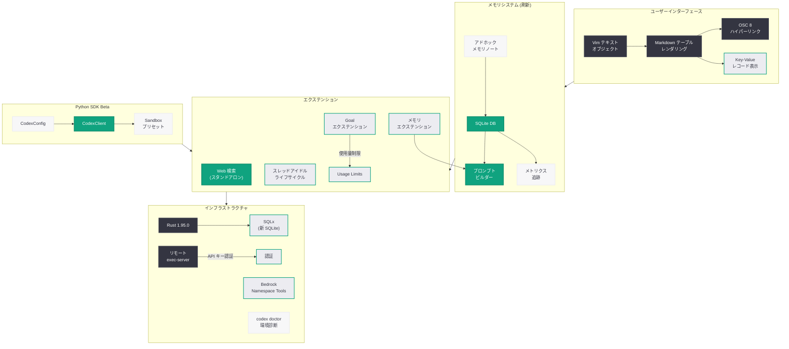

# Codex CLI v0.135.0-alpha: Python SDK Beta、メモリシステム刷新、Vim テキストオブジェクト対応

## メタデータ

| 項目 | 内容 |
|------|------|
| 発表日 | 2026-05-27 |
| ソース | OpenAI API Changelog / GitHub Release |
| カテゴリ | SDK Update / Developer Tools |
| 公式リンク | [GitHub Release](https://github.com/openai/codex/releases/tag/rust-v0.135.0-alpha.2) |

## 概要

OpenAI は 2026 年 5 月 27 日に Codex CLI v0.135.0-alpha を 2 段階でリリースした (alpha.1 および alpha.2)。前バージョン v0.134.0 からの 95 コミットを含む大規模なアルファリリースであり、Python SDK の独立ベータリリース、メモリシステムの SQLite データベースへの移行、完全な Vim テキストオブジェクトバインディング、Markdown テーブルレンダリング、OSC 8 ハイパーリンク対応など、多数の主要機能が追加されている。

本リリースはアルファ版であるため、安定版の利用者には即座に影響しないが、Codex CLI の次世代アーキテクチャの方向性を示す重要なマイルストーンである。特に Python SDK の独立リリースは、Rust ベースの CLI から Python エコシステムへの拡張を意味し、より広い開発者コミュニティへのアクセスを可能にする。

## 主な内容

### Python SDK Beta リリース

Codex CLI の Python SDK が独立したベータリリースとして公開された。これまで Rust 実装に限定されていた Codex CLI の機能が、Python パッケージとして利用可能になる。

主な特徴:

- **独立パッケージメタデータ**: PyPI 配布に向けたパッケージ構成
- **フレンドリーなサンドボックスプリセット**: Python 開発者向けに最適化されたサンドボックス設定
- **CodexConfig リネーミング**: API の一貫性向上のための設定クラス名変更
- **ドキュメント整備**: Python SDK 固有のドキュメントとクイックスタートガイド

### メモリシステムの全面刷新

Codex CLI のメモリ管理が根本的に再設計された。従来のファイルベースの記憶から、専用 SQLite データベースへの移行が行われ、スケーラビリティと信頼性が大幅に向上している。

主な変更:

- **SQLite DB への移行**: メモリ状態を専用データベースで管理
- **アドホックメモリノートツール**: ユーザーが任意のタイミングでメモリノートを追加可能
- **メモリプロンプトビルダーのエクステンション化**: メモリプロンプト生成ロジックをエクステンションに移動
- **設定によるメモリツールのゲーティング**: 専用メモリツールの有効/無効を設定で制御
- **メモリツールコールメトリクス**: メモリ操作の使用状況を追跡
- **冗長な SQLite 動的ツールストレージの削除**: 旧来の重複ストレージを廃止
- **orphaned codex memories MCP crate の削除**: 不要になった MCP クレートを整理

### Vim テキストオブジェクトバインディング

TUI (Terminal User Interface) に完全な Vim テキストオブジェクトバインディングが実装された。Vim ユーザーにとって自然な操作感が実現される。

- **フルテキストオブジェクト対応**: `iw`, `aw`, `i"`, `a(` などの Vim テキストオブジェクト操作
- **word-end / line-end 動作の補完**: `e`, `$` などの移動コマンドの正確な実装
- **設定可能なターン中断キーバインド**: カスタマイズ可能な中断操作

### Markdown テーブルレンダリング

ターミナル内での Markdown テーブル表示が大幅に改善された。

- **アプリスタイルのテーブルレンダリング**: 罫線付きの美しいテーブル表示
- **狭小テーブルのキーバリューレコード変換**: 幅が狭い場合に自動的にキーバリュー形式で表示
- **ハイパーリンク対応キーバリューテーブル**: テーブル内のリンクがクリック可能

### OSC 8 Web リンク

リッチコンテンツにクリック可能なハイパーリンク (OSC 8 標準) が追加された。対応ターミナルエミュレータで URL をクリックして直接ブラウザで開くことが可能になる。

### スタンドアロン Web 検索エクステンション

Web 検索機能が独立したエクステンションとして切り出された。これにより、Web 検索の有効/無効をより柔軟に制御でき、他のエクステンションとの干渉を避けられる。

### スレッドアイドルライフサイクルフック

新しいライフサイクルフックとして「スレッドアイドル」イベントが追加された。スレッドが一定時間アイドル状態になった際にカスタム処理を実行可能になり、自動保存やリソース解放などのユースケースに対応する。

### Goal Usage Limits

Goal エクステンションにおける使用量制限のハンドリングが実装された。タスクの実行コストを制御し、予期せぬリソース消費を防止する。

### 環境診断機能 (`codex doctor`)

`codex doctor` コマンドに環境診断機能が追加された。システム環境の問題を自動検出し、トラブルシューティングを支援する。

### Bedrock Namespace Tools

AWS Bedrock 向けのネームスペースツールが有効化された。Bedrock 経由で Codex を利用する際のツール統合が改善されている。

## 技術的な詳細

### メモリシステムアーキテクチャの変更

v0.135.0-alpha では、メモリの永続化レイヤーが完全に再構築された。

**変更前 (v0.134.0)**:
- ファイルベースのメモリ管理
- MCP crate による分散ストレージ
- 動的ツールストレージとの冗長性

**変更後 (v0.135.0-alpha)**:
- 専用 SQLite データベースによる一元管理
- エクステンションベースのプロンプトビルダー
- メトリクス追跡によるオブザーバビリティ

### Rust ツールチェインの更新

Rust ツールチェインが 1.95.0 にアップグレードされ、最新の言語機能とパフォーマンス改善が活用されている。また、SQLx が新しいバンドル SQLite に対応するようバージョンアップされた。

### リモート実行の信頼性強化

- **リモートコントロール再接続バックオフの上限設定**: 過度な再接続試行を防止
- **WebSocket タスクストールの可視化**: 接続停滞を検知して報告
- **API キー認証によるリモート exec-server 登録**: セキュリティの強化
- **スタンドアロンアップデートの非対話型実行**: CI/CD 環境での自動更新に対応

### TUI の改善

- **macOS stderr 破損の防止**: Composer 使用時の出力破損を解消
- **tmux 互換性**: 不明な tmux フォーマットに対する modifyOtherKeys の回避
- **Zellij 対応**: Zellij 環境で raw 出力を Composer の上に維持
- **Linux サンドボックス**: 中断時のシェルクリーンアップを保持

### コードサンプル

```bash
# Codex CLI v0.135.0-alpha.2 のインストール (アルファ版)
# 注意: アルファ版は実験的な機能を含み、本番環境での使用は推奨されない

# 環境診断の実行
codex doctor

# メモリノートの追加 (新機能)
# セッション中にアドホックなメモリノートを記録
codex memory add "プロジェクト X の API エンドポイントは /v2/resources"

# Goal 使用量制限の設定
codex config set goal.usage_limit 1000

# リモート接続ステータスの確認
codex /status
```

```python
# Python SDK Beta の使用例 (概念的)
from codex import CodexConfig, CodexClient

# 設定の初期化 (CodexConfig にリネーム済み)
config = CodexConfig(
    sandbox_preset="friendly",  # フレンドリーなサンドボックスプリセット
    memory_enabled=True,
)

# クライアントの作成
client = CodexClient(config=config)

# タスクの実行
result = client.run("Refactor the authentication module")
print(result.output)
```

## アーキテクチャ

以下の図は、Codex CLI v0.135.0-alpha のメモリシステム刷新と新機能アーキテクチャを示している。



## 開発者への影響

### Python 開発者への新たな選択肢

- Python SDK Beta により、Rust ツールチェインなしで Codex CLI の機能を Python プロジェクトに統合可能
- フレンドリーなサンドボックスプリセットにより、Python 環境でのセットアップが簡素化
- 将来的に PyPI からのインストールが可能になる見込み

### メモリ管理の再設計による影響

- SQLite への移行に伴い、既存のメモリデータのマイグレーションが必要になる可能性
- アドホックメモリノートにより、セッション中の知識蓄積がより明示的かつ制御可能に
- メトリクス追跡により、メモリ使用パターンの可視化と最適化が可能に

### Vim ユーザーの生産性向上

- フルテキストオブジェクトバインディングにより、Vim ユーザーが慣れた操作体系で TUI を利用可能
- 設定可能なキーバインドにより、個人の好みに合わせたカスタマイズが容易

### ターミナル表示の改善

- Markdown テーブルの美しいレンダリングにより、構造化データの視認性が向上
- OSC 8 ハイパーリンクにより、出力内の URL をワンクリックでブラウザ表示可能
- 狭いターミナルでもキーバリュー形式で情報が見やすく表示

### インフラストラクチャの近代化

- Rust 1.95.0 への更新は、依存クレートとの互換性に影響する可能性
- API キー認証によるリモート exec-server の登録はセキュリティを強化するが、既存のリモート接続設定の更新が必要になる場合がある
- Bedrock Namespace Tools の有効化により、AWS 環境での Codex 利用がより統合的に

### アルファ版利用時の注意点

- 本リリースはアルファ版であり、API の破壊的変更が発生する可能性がある
- 本番環境での使用は推奨されない
- フィードバックは GitHub Issues で受け付けている

## 関連リンク

- [Codex CLI v0.135.0-alpha.2 リリースノート](https://github.com/openai/codex/releases/tag/rust-v0.135.0-alpha.2)
- [Codex CLI v0.135.0-alpha.1 リリースノート](https://github.com/openai/codex/releases/tag/rust-v0.135.0-alpha.1)
- [完全な変更履歴 (v0.134.0 との差分)](https://github.com/openai/codex/compare/rust-v0.134.0...rust-v0.135.0-alpha.2)
- [OpenAI Codex](https://openai.com/codex)
- [Codex GitHub リポジトリ](https://github.com/openai/codex)
- [OpenAI API Changelog](https://platform.openai.com/docs/changelog)

## まとめ

Codex CLI v0.135.0-alpha は、95 コミットを含む大規模なアルファリリースであり、Codex CLI の次世代アーキテクチャへの移行を示す重要なマイルストーンである。Python SDK Beta は Codex の利用可能範囲を Python エコシステムに拡大し、SQLite ベースの新メモリシステムはスケーラビリティと信頼性を根本的に改善する。Vim テキストオブジェクト対応と Markdown テーブルレンダリングは TUI の操作性と表示品質を大幅に向上させ、OSC 8 ハイパーリンクは現代的なターミナル体験を提供する。スタンドアロン Web 検索エクステンション、スレッドアイドルフック、Goal 使用量制限など、エクステンションシステムの充実も注目に値する。アルファ版としてのリリースであるため即座の本番適用は推奨されないが、安定版 v0.135.0 のリリースに向けて積極的なフィードバックが期待される。
