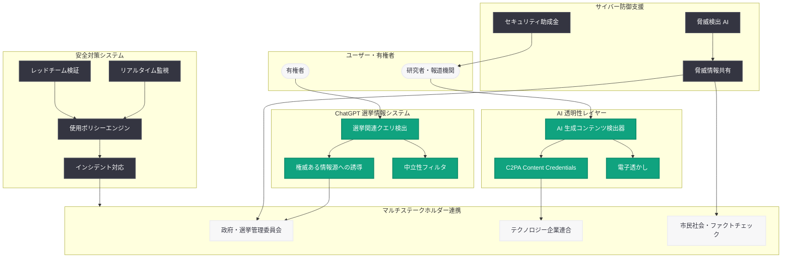

# 2026 年選挙における情報提供と安全対策

> 本レポートは OpenAI ブログのサイトマップ情報とタイトルに基づいて作成しています。記事本文へのアクセスは Cloudflare の保護により制限されたため、タイトル、URL、および公開情報から内容を構成しています。

## メタデータ

| 項目 | 内容 |
|------|------|
| 発表日 | 2026-05-27 |
| ソース | OpenAI News/Blog |
| カテゴリ | Global Affairs / Safety / Elections |
| 公式リンク | [openai.com](https://openai.com/index/election-safeguards-2026) |

## 概要

OpenAI は 2026 年 5 月 27 日、世界各地で実施される選挙に先立ち、選挙の公正性を守るための包括的な安全対策を発表した。本記事は「Election information and safeguards in 2026」と題され、有権者が正確な情報にアクセスできる環境の整備、サイバー防御者への支援、そして AI の透明性向上という 3 つの柱を中心に、OpenAI の取り組みを詳述している。

2026 年は世界的な選挙イヤーであり、各国で重要な選挙が予定されている。AI 技術の急速な進化に伴い、ディープフェイクや AI 生成コンテンツによる選挙干渉リスクが高まる中、OpenAI は 2024 年の選挙サイクルで培った経験を基盤として、より強化された保護措置を講じている。

## 主な内容

### 有権者への正確な情報提供

OpenAI は ChatGPT を通じて、有権者が信頼できる選挙情報にアクセスできるよう取り組んでいる。

- **選挙情報への誘導:** ChatGPT が選挙に関する質問を受けた際、権威ある情報源 (各国の選挙管理委員会、公的機関) への誘導を行う仕組みを実装
- **投票方法の案内:** 投票所の場所、投票時間、有権者登録方法などの実用的な情報を正確に提供
- **中立性の維持:** 特定の候補者や政党を支持・推薦することを避け、中立的な立場からの情報提供を徹底
- **多言語対応:** 各国の言語に対応した選挙情報の提供により、幅広い有権者層にリーチ

### サイバー防御者への支援

選挙インフラを狙うサイバー脅威に対抗するため、OpenAI はサイバーセキュリティの専門家やチームを支援する施策を展開している。

- **脅威検出の強化:** AI を活用した選挙関連のサイバー脅威 (フィッシング攻撃、偽情報キャンペーン、インフラ攻撃) の早期検出
- **セキュリティツールの提供:** 選挙管理機関やセキュリティ研究者向けに、脅威分析や対策支援のためのツールを提供
- **情報共有体制:** 選挙に対する脅威情報を関連機関と迅速に共有する仕組みの構築
- **Cybersecurity Grant Program:** サイバーセキュリティ分野の研究者や防御者への資金提供プログラムの継続・拡大

### AI 透明性の向上

AI 生成コンテンツの識別を容易にするための技術的措置を強化している。

- **Content Credentials (C2PA) の実装:** DALL-E および ChatGPT で生成された画像に対して、C2PA 標準に基づくメタデータを埋め込み、AI 生成であることを明示
- **電子透かし技術:** AI 生成コンテンツに不可視の透かしを挿入し、拡散後も出所を追跡可能にする技術の展開
- **来歴情報の保持:** コンテンツの生成元、生成日時、使用されたモデルなどの情報を追跡可能な形で記録
- **検出ツールの公開:** AI 生成コンテンツを識別するためのツールを報道機関や研究者に提供

### 選挙関連の不正利用防止ポリシー

OpenAI は選挙に関連した AI の不正利用を防止するための明確なポリシーを策定している。

- **ディープフェイクの禁止:** 候補者や政治家の偽の映像・音声を作成する行為の明確な禁止
- **選挙操作の防止:** 有権者を欺くための偽情報生成、投票抑制を目的としたコンテンツ作成の禁止
- **なりすまし防止:** 選挙管理機関や候補者になりすましたコンテンツの生成を制限
- **大規模操作の検出:** 組織的な偽情報キャンペーンや coordinated inauthentic behavior の検出・対処
- **使用ポリシーの強化:** 選挙期間中における API 利用の監視強化と違反アカウントへの迅速な対応

### マルチステークホルダー連携

選挙の安全性確保は単一組織では達成できないため、OpenAI は幅広いパートナーシップを構築している。

- **政府機関との連携:** 各国の選挙管理委員会、サイバーセキュリティ機関との情報共有
- **テクノロジー企業間の協力:** C2PA 連合をはじめとする業界横断的な取り組みへの参加
- **市民社会との協働:** ファクトチェック団体、メディア・リテラシー教育機関との連携
- **学術研究機関との連携:** AI と選挙に関する研究の支援と知見の共有
- **国際機関との対話:** 国際的な選挙監視団体や民主主義支援機関との協力体制

## 技術的な詳細

### Content Credentials の技術実装

OpenAI は C2PA (Coalition for Content Provenance and Authenticity) 標準に準拠した技術を実装している。C2PA は Adobe、Microsoft、Intel、BBC などと共同で策定されたオープン標準であり、デジタルコンテンツの来歴を証明する仕組みを提供する。

- **暗号署名:** 生成されたコンテンツに暗号化された署名を付与し、改ざんを検出可能にする
- **メタデータ埋め込み:** 画像ファイルの EXIF データ内に C2PA マニフェストを埋め込み、生成元情報を保持
- **検証チェーン:** コンテンツの生成から配信までの各段階で来歴情報を維持する検証チェーンの構築

### AI 生成コンテンツ検出システム

OpenAI は AI 生成テキストおよび画像を検出するための内部分類器を開発・運用している。

- **テキスト分類器:** AI 生成テキストを統計的手法により高精度で識別
- **画像分類器:** DALL-E 生成画像を検出する専用モデルの運用
- **音声分析:** AI 合成音声を検出するための音声分析技術の導入

### 監視・対応システム

選挙期間中の不正利用を検出・対処するためのリアルタイム監視体制を構築している。

- **異常検出:** API 利用パターンの異常 (大量の政治コンテンツ生成など) を自動検出
- **エスカレーション体制:** 検出された問題に対する迅速なレビューと対応の仕組み
- **レッドチーム:** 選挙関連の攻撃シナリオを事前に検証する専門チームの運用

## アーキテクチャ

## 2024 年選挙対策との比較

2024 年は 40 カ国以上で選挙が実施された歴史的な選挙イヤーであり、OpenAI はその経験を通じて多くの知見を蓄積した。2026 年の対策は以下の点で進化している。

| 項目 | 2024 年の対策 | 2026 年の対策 |
|------|--------------|--------------|
| 情報提供 | ChatGPT での基本的な投票情報誘導 | 多言語対応の強化と各国選挙制度への対応拡大 |
| コンテンツ識別 | C2PA 対応の初期実装 | Content Credentials の全製品統合と検出精度向上 |
| サイバー防御 | Cybersecurity Grant Program の開始 | プログラムの拡大とリアルタイム脅威共有体制の構築 |
| ポリシー | 選挙関連の基本的な使用制限 | より詳細なガイドラインと自動検出の高度化 |
| パートナーシップ | 個別機関との連携 | 体系的なマルチステークホルダー連携体制の確立 |
| 透明性レポート | 事後的な報告 | 選挙期間中のリアルタイム透明性レポートの提供 |

## 開発者への影響

- **API 利用ポリシーの強化:** 選挙期間中は政治関連コンテンツの大量生成に対する追加的な監視が適用される可能性がある。開発者は使用ポリシーの最新版を確認する必要がある
- **Content Credentials の統合:** API を通じて生成された画像には自動的に C2PA メタデータが付与されるため、下流のアプリケーションでこのメタデータを適切に保持・表示する設計が推奨される
- **モデレーション API の強化:** 選挙関連の不正コンテンツを検出するためのモデレーション機能が強化されており、開発者はこれを活用して自社サービスの安全性を高めることができる
- **透明性ツールの活用:** AI 生成コンテンツ検出 API やツールを活用し、プラットフォーム上の偽情報対策を強化できる
- **コンプライアンス対応:** 各国の選挙法規制への準拠を確保するため、地域別のガイドラインを確認し適切な実装を行うことが重要

## 関連リンク

- [Election information and safeguards in 2026 (公式記事)](https://openai.com/index/election-safeguards-2026)
- [Cybersecurity in the Intelligence Age](https://openai.com/index/cybersecurity-in-the-intelligence-age)
- [OpenAI Usage Policies](https://openai.com/policies/usage-policies)
- [C2PA (Coalition for Content Provenance and Authenticity)](https://c2pa.org/)
- [OpenAI News - Global Affairs](https://openai.com/news/global-affairs/)

## まとめ

OpenAI の 2026 年選挙安全対策は、2024 年の経験を踏まえて大幅に進化した包括的な取り組みである。有権者への正確な情報提供、サイバー防御支援、AI 透明性の向上という 3 つの柱を中心に、技術的措置 (C2PA、電子透かし、検出ツール) とポリシー的措置 (不正利用禁止、リアルタイム監視) を組み合わせた多層防御アプローチを採用している。特にマルチステークホルダー連携の強化により、政府機関、テクノロジー企業、市民社会が一体となって選挙の公正性を守る体制が構築されている点が、2024 年からの最も重要な進化といえる。
