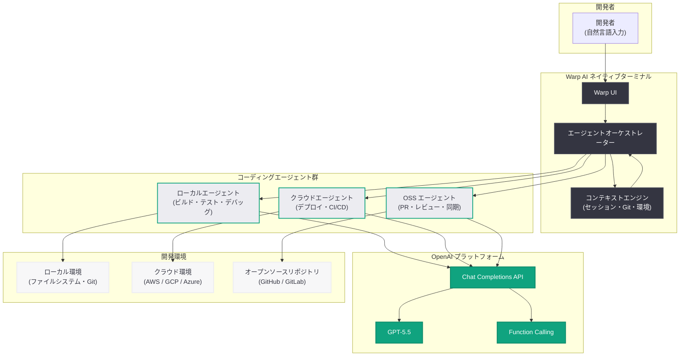

# Warp、GPT-5.5 を活用しオープンソース開発に大規模投資: コーディングエージェントの新たな挑戦

> **注記:** 本レポートは OpenAI ブログのサイトマップ情報とタイトルに基づいて作成しています。記事本文へのアクセスは Cloudflare の保護により制限されたため、タイトル、URL、および公開情報から内容を構成しています。

## メタデータ

| 項目 | 内容 |
|------|------|
| 発表日 | 2026-05-27 |
| ソース | OpenAI News/Blog (Startup) |
| カテゴリ | Startup / Codex / Open Source |
| 公式リンク | [openai.com/index/warp](https://openai.com/index/warp) |

## 概要

OpenAI は 2026 年 5 月 27 日、AI ネイティブターミナル企業 Warp が GPT-5.5 および OpenAI モデルを活用し、ローカル、クラウド、オープンソースの各開発ワークフローにまたがるコーディングエージェントの連携を実現していることを紹介した。Warp は「オープンソース開発を AI で根本的に変革する」という大規模な賭け (big bet) に出ており、GPT-5.5 の高度な推論能力とコード生成能力を基盤として、複数環境にまたがる開発ワークフローの自動化と効率化を推進している。

Warp は従来のターミナルエミュレータを再定義し、AI ファーストのインターフェースとして再構築してきた企業である。今回の取り組みでは、GPT-5.5 をコーディングエージェントの中核エンジンとして採用し、個人開発者からオープンソースコミュニティ全体に至るまで、AI 支援による開発体験の統一を目指している。特にオープンソースプロジェクトにおいて、コントリビューターやメンテナーが直面する複雑なマルチ環境ワークフローを、インテリジェントなエージェント連携によって簡素化する点が注目される。

## 主な内容

### GPT-5.5 によるコーディングエージェントの連携

Warp のコーディングエージェントは、GPT-5.5 の高度な推論能力を活用し、開発タスクを自律的に分解・実行する。従来の単一コマンド補完とは異なり、複数のステップにまたがる開発ワークフロー全体を理解し、適切なアクションを連携して実行できる点が特徴である。

- **タスク分解と計画立案:** GPT-5.5 の長文コンテキスト理解を活用し、複雑な開発タスクを実行可能なサブタスクに分解
- **マルチエージェント連携:** ローカル環境、クラウド環境、オープンソースリポジトリそれぞれに特化したエージェントが連携して動作
- **コンテキスト保持:** ターミナルセッション全体のコンテキストを維持し、過去の操作履歴を踏まえた提案を生成
- **自然言語インターフェース:** 開発者が自然言語で意図を伝えるだけで、適切なコマンドやコード変更を生成・実行

### マルチ環境ワークフロー (ローカル・クラウド・オープンソース)

Warp の GPT-5.5 統合は、3 つの異なる開発環境をシームレスに橋渡しする。

#### ローカル開発環境

- ローカルリポジトリの変更検出と自動テスト実行
- 依存関係の解決とビルドエラーの自動修正
- ブランチ管理とコンフリクト解消の AI 支援

#### クラウド開発環境

- リモートサーバーへのデプロイワークフローの自動化
- クラウドリソースのプロビジョニングと設定管理
- CI/CD パイプラインとの統合とモニタリング

#### オープンソース開発ワークフロー

- アップストリームリポジトリとの同期と変更追跡
- プルリクエスト作成時のコード品質チェックとドキュメント生成
- コントリビューションガイドラインへの準拠確認
- イシューの分析とバグ再現環境の自動構築

### オープンソース開発への AI 支援

Warp がオープンソース開発に「大規模な賭け」をしている背景には、オープンソースコミュニティが抱える構造的な課題がある。

- **コントリビューターの参入障壁低減:** 新規コントリビューターが複雑なビルド環境のセットアップやコーディング規約の理解に苦労する問題を、AI エージェントが支援
- **メンテナーの負担軽減:** 大量のプルリクエストのレビュー、イシューのトリアージ、リリース管理といった反復作業を自動化
- **コード品質の均一化:** プロジェクト固有のスタイルガイドやベストプラクティスを AI が学習し、すべてのコントリビューションに一貫した品質基準を適用
- **ドキュメンテーションの自動生成:** コード変更に伴うドキュメント更新を AI が検出・提案

## 技術的な詳細

### Warp のエージェントアーキテクチャ

Warp のコーディングエージェントは、GPT-5.5 の Chat Completions API をバックエンドとして使用し、ターミナル環境に特化したツール呼び出し (function calling) を活用している。エージェントはターミナルのコンテキスト (現在のディレクトリ、環境変数、直前のコマンド出力) を自動的に収集し、最適なアクションを決定する。

### コードサンプル

以下は、Warp のようなターミナル AI エージェントが GPT-5.5 を活用してマルチ環境ワークフローを連携させる実装の概念例である。

```python
from openai import OpenAI

client = OpenAI()

# ターミナルエージェントのツール定義
tools = [
    {
        "type": "function",
        "function": {
            "name": "execute_command",
            "description": "ターミナルでコマンドを実行する",
            "parameters": {
                "type": "object",
                "properties": {
                    "command": {"type": "string", "description": "実行するシェルコマンド"},
                    "environment": {
                        "type": "string",
                        "enum": ["local", "cloud", "container"],
                        "description": "コマンドを実行する環境",
                    },
                },
                "required": ["command", "environment"],
            },
        },
    },
    {
        "type": "function",
        "function": {
            "name": "manage_git_workflow",
            "description": "Git ワークフローを管理する (ブランチ、PR、マージ)",
            "parameters": {
                "type": "object",
                "properties": {
                    "action": {
                        "type": "string",
                        "enum": ["create_branch", "commit", "push", "create_pr", "sync_upstream"],
                    },
                    "repository": {"type": "string", "description": "リポジトリパス"},
                    "message": {"type": "string", "description": "コミット/PR メッセージ"},
                },
                "required": ["action", "repository"],
            },
        },
    },
    {
        "type": "function",
        "function": {
            "name": "analyze_codebase",
            "description": "コードベースを分析し改善を提案する",
            "parameters": {
                "type": "object",
                "properties": {
                    "path": {"type": "string", "description": "分析対象のパス"},
                    "analysis_type": {
                        "type": "string",
                        "enum": ["style_check", "security_scan", "dependency_audit", "test_coverage"],
                    },
                },
                "required": ["path", "analysis_type"],
            },
        },
    },
]


def run_coding_agent(user_intent: str, terminal_context: dict) -> str:
    """
    ユーザーの意図とターミナルコンテキストを基に
    GPT-5.5 コーディングエージェントを実行する
    """
    system_prompt = """あなたは AI ネイティブターミナルに統合されたコーディングエージェントです。
ユーザーの開発意図を理解し、ローカル・クラウド・オープンソースの各環境で
適切なアクションを実行してください。

コンテキスト情報:
- 現在のディレクトリ、Git 状態、環境変数を考慮
- オープンソースプロジェクトのコントリビューションガイドラインを遵守
- マルチ環境間の整合性を保持"""

    messages = [
        {"role": "system", "content": system_prompt},
        {
            "role": "user",
            "content": f"## ターミナルコンテキスト\n"
            f"ディレクトリ: {terminal_context['cwd']}\n"
            f"Git ブランチ: {terminal_context['branch']}\n"
            f"直前の出力: {terminal_context['last_output']}\n\n"
            f"## リクエスト\n{user_intent}",
        },
    ]

    response = client.chat.completions.create(
        model="gpt-5.5",
        messages=messages,
        tools=tools,
        tool_choice="auto",
    )

    return response.choices[0].message


# 使用例: オープンソースプロジェクトへのコントリビューション
context = {
    "cwd": "/home/dev/oss-project",
    "branch": "feature/add-streaming-support",
    "last_output": "Tests passed: 42/42",
}

result = run_coding_agent(
    "テストが通ったので、アップストリームに PR を作成して。"
    "コントリビューションガイドラインに沿ったコミットメッセージにして。",
    context,
)
```

以下は、Warp ターミナルでの AI 支援オープンソースワークフローの実行イメージである。

```bash
# Warp ターミナルでの AI 支援コントリビューションワークフロー

# 1. AI エージェントがフォークとクローンを自動設定
$ warp agent "vllm プロジェクトに新機能を追加したい"
# → リポジトリのフォーク、クローン、開発環境セットアップを自動実行

# 2. AI がコードベースを分析し、変更箇所を提案
$ warp agent "バッチ推論のパフォーマンスを改善するコードを書いて"
# → 関連ファイルの分析、改善コードの生成、テストの作成を実行

# 3. マルチ環境でのテスト実行
$ warp agent "ローカルとクラウド GPU の両方でベンチマークを実行"
# → ローカルテスト実行後、クラウド環境にデプロイしてベンチマーク

# 4. PR 作成とコントリビューションガイドライン準拠チェック
$ warp agent "変更内容を PR にまとめて提出"
# → コミット整理、PR テンプレート記入、CI 通過確認まで自動実行
```

> **注:** 上記のコード例は GPT-5.5 API の利用イメージを示すものであり、Warp の実際の内部実装とは異なる場合があります。

## アーキテクチャ



## 開発者への影響

Warp の GPT-5.5 統合によるオープンソース開発への AI 支援は、開発者エコシステム全体に以下の影響を及ぼす可能性がある。

- **ターミナル体験の根本的変革:** 従来のコマンドライン操作から、自然言語による意図駆動型の開発体験への移行が加速する。開発者はコマンドの記憶や構文の正確性よりも、達成したいゴールの明確化に集中できるようになる
- **オープンソースコントリビューションの民主化:** 複雑なビルド環境のセットアップやプロジェクト固有の慣習への適応を AI が支援することで、新規コントリビューターの参入障壁が大幅に低下する
- **マルチ環境開発の統一:** ローカル開発、クラウドデプロイ、オープンソースコントリビューションという異なるコンテキストを、単一のインテリジェントインターフェースから操作できるようになる
- **AI エージェント連携の設計パターン確立:** Warp のマルチエージェントアーキテクチャは、他のツールやプラットフォームにおけるエージェント設計のリファレンスとなりうる
- **GPT-5.5 の実用性の実証:** スタートアップが GPT-5.5 を核とした製品を構築できることの実証は、他の開発ツール企業にとっても GPT-5.5 採用の参考事例となる

## 関連リンク

- [Warp's big bet on building open source with GPT-5.5 (OpenAI Blog)](https://openai.com/index/warp)
- [Warp 公式サイト](https://www.warp.dev/)
- [OpenAI GPT-5.5 モデル情報](https://platform.openai.com/docs/models)
- [OpenAI Function Calling ドキュメント](https://platform.openai.com/docs/guides/function-calling)
- [Codex for Open Source レポート](2026-03-07-codex-for-open-source.md)

## まとめ

Warp の GPT-5.5 を活用したオープンソース開発への大規模投資は、AI ネイティブな開発ツールがオープンソースエコシステムの課題解決に本格的に取り組む転換点を示している。GPT-5.5 の高度な推論能力とコード生成能力を基盤とし、ローカル・クラウド・オープンソースの 3 環境にまたがるコーディングエージェントの連携を実現するアーキテクチャは、今後のターミナルツールおよび開発環境の方向性を示唆している。特にオープンソースコミュニティにとっては、コントリビューターの参入障壁低減とメンテナーの負担軽減という両面での恩恵が期待される。Warp の事例は、GPT-5.5 がスタートアップの製品差別化と価値創出の核となりうることを実証するものであり、OpenAI のモデルエコシステムの拡大にとっても重要なマイルストーンである。
