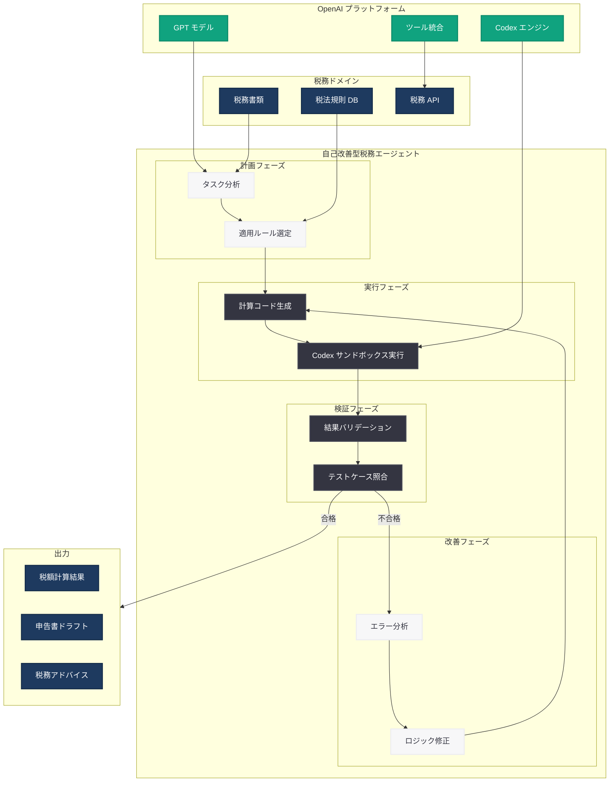

# Codex で自己改善型の税務エージェントを構築する

## メタデータ

| 項目 | 内容 |
|------|------|
| 発表日 | 2026-05-28 |
| ソース | OpenAI Engineering Blog |
| カテゴリ | エンジニアリング / Codex / エージェント |
| 公式リンク | [openai.com/index/building-self-improving-tax-agents-with-codex](https://openai.com/index/building-self-improving-tax-agents-with-codex/) |

> **注:** 本レポートは OpenAI エンジニアリングブログのサイトマップ情報とタイトルに基づいて作成しています。記事本文へのアクセスは Cloudflare の保護により制限されたため、タイトル、URL、および Codex の公開情報から内容を構成しています。正確な詳細については公式記事を参照してください。

## 概要

OpenAI は 2026 年 5 月 28 日、エンジニアリングブログにて「Building Self-Improving Tax Agents with Codex」と題した記事を公開した。本記事は、Codex を活用して税務ドメインに特化した AI エージェントを構築し、そのエージェントが実行結果からフィードバックを得て自律的に改善するアーキテクチャパターンを解説するものと推察される。

税務領域は、複雑な法規制、管轄区域ごとの異なるルール、高い精度要件、およびコンプライアンス遵守の必要性から、AI エージェントの構築において特に困難なドメインである。Codex のサンドボックス環境とエージェンティックな開発パターンを組み合わせることで、こうした課題に対応する自己改善型エージェントの実現が可能になる。

## 主な内容

### 自己改善メカニズムの概念

「Self-Improving」(自己改善型) というキーワードは、エージェントが単に指示を実行するだけでなく、実行結果を評価し、次回の処理を改善するフィードバックループを内蔵していることを示唆する。税務エージェントにおける自己改善の仕組みとして、以下のパターンが考えられる。

| 改善メカニズム | 概要 |
|---------------|------|
| テストケース駆動の改善 | 税務計算の結果を既知の正解と照合し、エラーパターンを学習 |
| バリデーションフィードバック | 計算結果の整合性チェックにより不一致を検出し修正 |
| 反復的プロンプト改善 | 実行ログから最適な指示パターンを自動的に調整 |
| ルールベースの検証 | 税法規則に基づくルールエンジンとの照合による正確性向上 |

### 税務ドメイン特有の課題

税務エージェントの構築には、以下のような固有の課題が存在する。

- **法規制の複雑性:** 各国、各州、各自治体で異なる税率、控除、免除ルールが存在する
- **頻繁な法改正:** 税法は毎年改正されるため、エージェントの知識を継続的に更新する必要がある
- **高精度要件:** 金額計算において小数点以下の精度が求められ、概算では不十分である
- **コンプライアンス:** 申告期限、書類要件、報告義務など厳格な遵守事項がある
- **文書解析:** W-2、1099、請求書など多様な書類からの正確なデータ抽出が必要である

### Codex によるエージェント構築パターン

Codex は、エージェンティックな開発をサポートするプラットフォームとして、以下の機能を税務エージェントに活用できる。

- **サンドボックス環境:** 安全に税務計算ロジックを実行・検証できる隔離環境
- **カスタムツール統合:** 税務 API、計算エンジン、ドキュメントパーサーとの連携
- **反復実行:** 計算結果が正確になるまでコードを反復的に改善
- **バージョン管理:** 税法改正に対応したロジックの世代管理

### 計画・実行・検証のエージェントパターン

自己改善型税務エージェントは、以下の 3 段階のパターンで動作すると考えられる。

1. **計画 (Planning):** 税務タスクを分析し、必要な計算ステップと参照すべき規則を特定
2. **実行 (Execution):** Codex サンドボックス内で税務計算コードを生成・実行
3. **検証 (Verification):** 計算結果を既知のルールやテストケースと照合し、精度を評価
4. **改善 (Improvement):** 検証で発見されたエラーに基づきロジックを修正し、再実行

## 技術的な詳細

### 想定されるアーキテクチャ構成

税務エージェントは、以下のコンポーネントで構成されると推察される。

| コンポーネント | 役割 |
|---------------|------|
| Tax Knowledge Base | 税法規則、税率テーブル、控除ルールの知識ベース |
| Document Parser | 税務書類 (W-2、1099 等) からのデータ抽出 |
| Calculation Engine | 税額計算、控除適用、還付額算出のロジック |
| Validation Suite | テストケースとルールベースの検証セット |
| Improvement Loop | エラー分析と自動修正のフィードバック機構 |

### コードサンプル (推定)

Codex を活用した税務エージェントの基本的な自己改善ループの例。

```python
from openai import OpenAI

client = OpenAI()

def build_tax_agent_task(tax_scenario: dict) -> str:
    """税務シナリオに基づいてエージェントタスクを構成する"""
    return f"""
    以下の税務シナリオに対して正確な計算を実行してください:
    - 年収: {tax_scenario['income']}
    - 申告ステータス: {tax_scenario['filing_status']}
    - 控除項目: {tax_scenario['deductions']}
    - 管轄区域: {tax_scenario['jurisdiction']}

    計算結果をテストケースと照合し、不一致がある場合は
    ロジックを修正して再計算してください。
    """

def run_self_improving_loop(task: str, max_iterations: int = 5):
    """自己改善ループを実行する"""
    for iteration in range(max_iterations):
        # Codex でタスクを実行
        response = client.responses.create(
            model="codex-1",
            input=task,
            tools=[
                {"type": "code_interpreter"},
                {"type": "file_search"}
            ]
        )

        # 結果を検証
        result = response.output_text
        validation = validate_tax_calculation(result)

        if validation["passed"]:
            return {"result": result, "iterations": iteration + 1}

        # フィードバックを基にタスクを改善
        task = refine_task_with_feedback(task, validation["errors"])

    return {"result": result, "iterations": max_iterations, "status": "max_iterations_reached"}

def validate_tax_calculation(result: str) -> dict:
    """税務計算結果をバリデーションルールと照合する"""
    # 税率の整合性、控除上限、計算の論理的整合性をチェック
    errors = []
    # ... バリデーションロジック
    return {"passed": len(errors) == 0, "errors": errors}

def refine_task_with_feedback(original_task: str, errors: list) -> str:
    """エラーフィードバックに基づきタスクを改善する"""
    error_context = "\n".join([f"- {e}" for e in errors])
    return f"""
    {original_task}

    前回の実行で以下のエラーが検出されました:
    {error_context}

    これらのエラーを修正した上で再計算してください。
    """
```

### テストケースによる品質保証

```python
# 税務計算のテストケース例
test_cases = [
    {
        "scenario": {
            "income": 85000,
            "filing_status": "single",
            "deductions": {"standard": True},
            "jurisdiction": "US-CA"
        },
        "expected": {
            "federal_tax": 13234,
            "state_tax": 4312,
            "effective_rate": 0.2064
        }
    },
    {
        "scenario": {
            "income": 150000,
            "filing_status": "married_joint",
            "deductions": {"itemized": ["mortgage_interest", "state_local_tax"]},
            "jurisdiction": "US-NY"
        },
        "expected": {
            "federal_tax": 22418,
            "state_tax": 8750,
            "effective_rate": 0.2078
        }
    }
]
```

## アーキテクチャ



## 開発者への影響

- **ドメイン特化エージェント設計の参考:** 税務のように高精度が求められる専門ドメインで、Codex を活用したエージェント構築の具体的なアーキテクチャパターンが示された。金融、法務、医療など他の規制産業にも応用可能な設計思想である
- **自己改善ループの実装手法:** エージェントが単発の回答ではなく、反復的に結果を改善する仕組みの実装パターンが明示された。テスト駆動開発の考え方をエージェント開発に応用する手法として参考になる
- **Codex サンドボックスの活用拡大:** 計算の正確性が最重要視される領域で、サンドボックス内でのコード実行と検証を組み合わせるパターンの有効性が示された
- **コンプライアンス対応エージェントの設計:** 規制要件に対応するためのバリデーション層の設計パターンが、他の規制ドメインでのエージェント構築にも転用可能である
- **テストケース駆動のエージェント品質保証:** エージェントの出力品質を定量的に測定し、継続的に改善するための QA フレームワークの考え方が提供された

## 関連リンク

- [Building Self-Improving Tax Agents with Codex (公式)](https://openai.com/index/building-self-improving-tax-agents-with-codex/)
- [OpenAI Codex](https://openai.com/codex)
- [Codex for Finance Teams](https://openai.com/index/codex-for-finance-teams/)
- [Codex for Business Operations](https://openai.com/index/codex-business-operations/)
- [Running Codex Safely](https://openai.com/index/running-codex-safely/)
- [OpenAI Platform Documentation](https://platform.openai.com/docs)

## まとめ

本記事は、Codex を活用して税務ドメインに特化した自己改善型 AI エージェントを構築する手法を解説するものである。税務領域は複雑な法規制、高精度要件、頻繁な法改正への対応が求められる困難なドメインだが、Codex のサンドボックス環境と反復実行パターンを活用することで、計算の正確性を自律的に向上させるエージェントの構築が可能になる。

計画・実行・検証・改善の 4 段階ループによる自己改善メカニズムは、税務に限らず、金融、法務、医療など高い正確性とコンプライアンスが求められるあらゆるドメインでのエージェント構築に応用可能な汎用的なパターンである。テストケース駆動の品質保証とフィードバックループの組み合わせにより、AI エージェントの信頼性を段階的に向上させるアプローチは、エンタープライズ向けエージェント開発の標準的な手法となりつつある。
