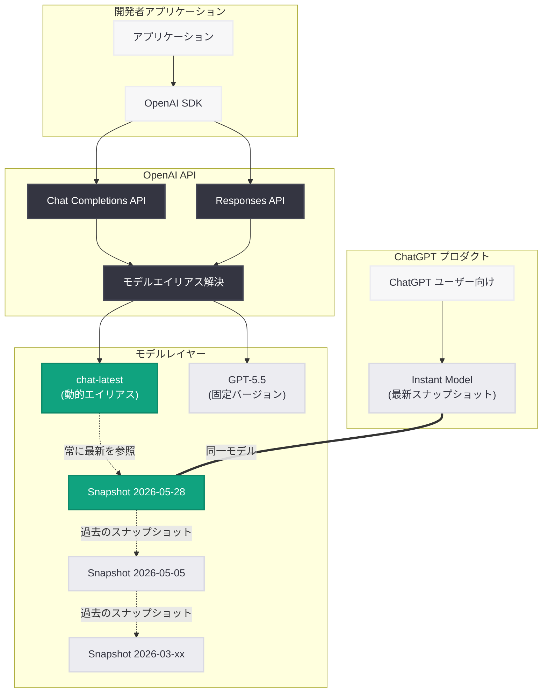

# chat-latest スナップショットリリース

## メタデータ

| 項目 | 内容 |
|------|------|
| 発表日 | 2026-05-28 |
| ソース | OpenAI API Changelog |
| カテゴリ | API 更新 |
| 公式リンク | https://platform.openai.com/docs/changelog |

## 概要

OpenAI は 2026 年 5 月 28 日、`chat-latest` スナップショットの新しいリリースを発表した。`chat-latest` は、ChatGPT で現在使用されている最新の Instant モデルを指す動的エイリアスであり、基盤となるモデルスナップショットは定期的に更新される。開発者はこのエイリアスを使用することで、常に ChatGPT と同じモデルの挙動を API 経由で利用できる。

本リリースは、ChatGPT の消費者向けプロダクトで採用されているモデルの進化を、API ユーザーが追跡するための仕組みを提供するものである。OpenAI は本番環境では GPT-5.5 の使用を推奨しつつ、チャットユースケースの最新改善をテストする目的で `chat-latest` の利用を推奨している。

## 主な内容

### chat-latest とは何か

`chat-latest` は、固定されたモデルバージョンではなく、ChatGPT で稼働している最新の Instant モデルを常に参照する動的エイリアスである。従来の固定バージョン指定 (例: `gpt-5.5-20260501`) とは異なり、OpenAI がモデルを更新するたびに自動的に最新のスナップショットを参照するようになる。

この仕組みにより、開発者はコードを変更することなく、ChatGPT で使われている最新の改善を自動的に取り込むことができる。

### 固定バージョンとの違い

| 特性 | chat-latest | 固定バージョン (例: gpt-5.5) |
|------|-------------|-------------------------------|
| モデルの更新 | 自動的に最新に追従 | 明示的に変更が必要 |
| 再現性 | 低い (スナップショットが変わる) | 高い (同一バージョンを維持) |
| 最新性 | 常に最新 | リリース時点で固定 |
| 本番利用 | 非推奨 | 推奨 |
| テスト・実験 | 推奨 | 用途に応じて選択 |

### ChatGPT との関係

`chat-latest` は ChatGPT の会話体験を駆動するモデルと直接連動している。ChatGPT に新しい Instant モデルがデプロイされると、`chat-latest` エイリアスも同じスナップショットを参照するように更新される。これにより、API ユーザーは ChatGPT ユーザーと同じ品質のレスポンスを得ることができる。

### 更新の履歴

`chat-latest` スナップショットの更新は定期的に行われている。

- **2026 年 3 月**: `gpt-5.3-chat-latest` として初期リリース
- **2026 年 5 月 5 日**: GPT-5.5 Instant ベースのスナップショットに更新
- **2026 年 5 月 28 日**: 最新スナップショットへの更新 (今回のリリース)

## 技術的な詳細

### モデル仕様

| 仕様 | 値 |
|------|-----|
| コンテキストウィンドウ | 400,000 トークン |
| 最大出力トークン | 128,000 トークン |
| 知識カットオフ | 2025 年 8 月 31 日 |
| インテリジェンス | High |
| スピード | Medium |

### 料金 (100 万トークンあたり)

| 種別 | 料金 |
|------|------|
| 入力 | $5.00 |
| キャッシュ入力 | $0.50 |
| 出力 | $30.00 |

### 対応モダリティ

- **テキスト**: 入出力対応
- **画像**: 入力のみ対応
- **音声**: 非対応
- **動画**: 非対応

### 対応エンドポイント

- Chat Completions (`v1/chat/completions`)
- Responses (`v1/responses`)
- Realtime (`v1/realtime`)
- Assistants (`v1/assistants`)
- Batch (`v1/batch`)

### 対応機能

| 機能 | 対応状況 |
|------|----------|
| ストリーミング | 対応 |
| Function calling | 対応 |
| Structured outputs | 対応 |
| ファインチューニング | 非対応 |
| Predicted outputs | 非対応 |

### Responses API ツール対応

- **対応**: Web search、File search、Image generation、Code interpreter、MCP
- **非対応**: Hosted shell、Computer use、Tool search

### コードサンプル

#### 基本的な使用例

```python
from openai import OpenAI

client = OpenAI()

# chat-latest を使用して ChatGPT と同じモデルで推論
response = client.chat.completions.create(
    model="chat-latest",
    messages=[
        {
            "role": "system",
            "content": "あなたは親切なアシスタントです。"
        },
        {
            "role": "user",
            "content": "量子コンピューティングの基礎を説明してください。"
        }
    ],
    max_tokens=1024
)

print(response.choices[0].message.content)
print(f"使用モデル: {response.model}")  # 実際のスナップショット名が返される
```

#### ストリーミングでの使用

```python
from openai import OpenAI

client = OpenAI()

# ストリーミングで chat-latest を使用
stream = client.chat.completions.create(
    model="chat-latest",
    messages=[
        {"role": "user", "content": "Python でウェブスクレイパーを作成してください。"}
    ],
    stream=True
)

for chunk in stream:
    if chunk.choices[0].delta.content is not None:
        print(chunk.choices[0].delta.content, end="")
```

#### Responses API での使用

```python
from openai import OpenAI

client = OpenAI()

# Responses API で chat-latest を使用
response = client.responses.create(
    model="chat-latest",
    input="最新のAI技術トレンドについて教えてください。",
    tools=[{"type": "web_search"}]
)

print(response.output_text)
```

#### Function Calling での使用

```python
from openai import OpenAI
import json

client = OpenAI()

tools = [
    {
        "type": "function",
        "function": {
            "name": "get_weather",
            "description": "指定された都市の天気を取得",
            "parameters": {
                "type": "object",
                "properties": {
                    "city": {
                        "type": "string",
                        "description": "都市名"
                    }
                },
                "required": ["city"]
            }
        }
    }
]

response = client.chat.completions.create(
    model="chat-latest",
    messages=[
        {"role": "user", "content": "東京の天気を教えてください"}
    ],
    tools=tools,
    tool_choice="auto"
)

# Function call の結果を確認
message = response.choices[0].message
if message.tool_calls:
    print(f"関数呼び出し: {message.tool_calls[0].function.name}")
    print(f"引数: {message.tool_calls[0].function.arguments}")
```

## アーキテクチャ



## 開発者への影響

### メリット

- **ChatGPT 追従**: ChatGPT と同じモデルの挙動を API 経由で利用可能。ChatGPT の改善がリアルタイムで反映される
- **コード変更不要**: モデルバージョンの手動更新が不要。`chat-latest` を指定するだけで自動追従
- **最新改善の即座な利用**: OpenAI が ChatGPT に適用する品質改善、安全性向上、新機能を自動的に享受
- **テスト効率化**: 本番デプロイ前に最新モデルの挙動を手軽に検証可能

### 注意事項

- **本番環境での使用は非推奨**: OpenAI は本番環境では GPT-5.5 などの固定バージョンを推奨している。`chat-latest` はスナップショットが予告なく変更される可能性がある
- **再現性の課題**: 同じプロンプトでも、スナップショットの更新前後で異なる結果が返される可能性がある。テスト結果のスナップショット間比較が困難
- **回帰リスク**: モデル更新に伴い、特定のユースケースで意図しない挙動の変化が発生する可能性がある
- **レート制限**: Tier によってリクエスト数制限が異なる (Free Tier では利用不可)

### ユースケース

1. **プロトタイピング**: 新機能の開発時に最新モデルの能力を活用した迅速なプロトタイプ構築
2. **ChatGPT 互換テスト**: ChatGPT プラグインやインテグレーションの動作確認
3. **モデル比較**: 固定バージョンと最新スナップショットの出力品質比較
4. **研究・実験**: 最新モデルの能力評価や新しいプロンプト手法の検証

### 推奨される使い分け

| シナリオ | 推奨モデル |
|----------|-----------|
| 本番 API サービス | GPT-5.5 (固定バージョン) |
| 開発・テスト環境 | chat-latest |
| ChatGPT 挙動の再現 | chat-latest |
| 安定性重視のバッチ処理 | GPT-5.5 (固定バージョン) |
| 最新機能の実験 | chat-latest |

## 関連リンク

- [OpenAI API Changelog](https://platform.openai.com/docs/changelog)
- [chat-latest モデルドキュメント](https://platform.openai.com/docs/models/chat-latest)
- [Chat Completions API リファレンス](https://platform.openai.com/docs/api-reference/chat)
- [Responses API リファレンス](https://platform.openai.com/docs/api-reference/responses)
- [OpenAI モデル一覧](https://platform.openai.com/docs/models)
- [GPT-5.5 ドキュメント](https://platform.openai.com/docs/models/gpt-5-5)

## まとめ

`chat-latest` スナップショットリリースは、ChatGPT で使用されている最新 Instant モデルを API 経由で利用可能にする動的エイリアスの更新である。主なポイントは以下の通り。

- **動的エイリアス**: `chat-latest` は固定バージョンではなく、ChatGPT の最新モデルスナップショットを常に参照する
- **自動追従**: 基盤モデルは定期的に更新され、開発者のコード変更は不要
- **テスト用途に最適**: OpenAI は本番利用には GPT-5.5 を推奨し、`chat-latest` はテスト・実験用途として位置付けている
- **高いスペック**: 400,000 トークンのコンテキストウィンドウ、128,000 トークンの最大出力、Function calling や Structured outputs に対応
- **安定性 vs 最新性のトレードオフ**: 常に最新を追従する利便性と、スナップショット変更に伴う再現性の低下というトレードオフが存在する

開発者は、プロジェクトの要件に応じて `chat-latest` (最新性重視) と固定バージョン (安定性重視) を使い分けることが推奨される。
