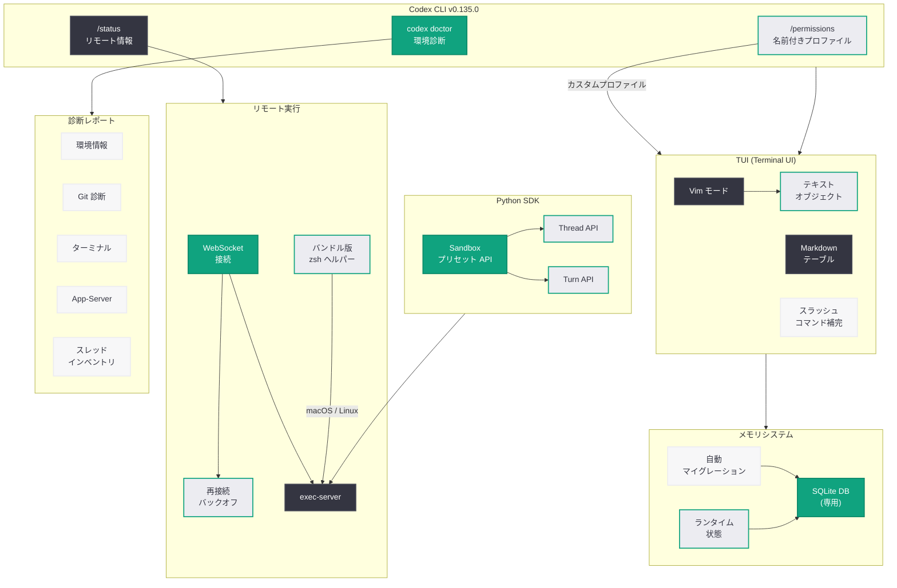

# Codex CLI v0.135.0 安定版リリース: 環境診断強化、Vim テキストオブジェクト、Python SDK Sandbox プリセット

## メタデータ

| 項目 | 内容 |
|------|------|
| 発表日 | 2026-05-28 |
| ソース | OpenAI API Changelog / GitHub Release |
| カテゴリ | SDK Update / Developer Tools |
| 公式リンク | [GitHub Release](https://github.com/openai/codex/releases/tag/rust-v0.135.0) |

## 概要

OpenAI は 2026 年 5 月 28 日に Codex CLI v0.135.0 の安定版をリリースした。5 月 27 日にリリースされたアルファ版 (alpha.1、alpha.2) を経て、76 件の PR と 23 名のコントリビューターによる変更が安定版として正式に公開された形である。v0.134.0 からの主要な進化として、`codex doctor` の環境診断機能の大幅強化、`/status` コマンドによるリモート接続情報の表示、Vim モードへのテキストオブジェクト編集の追加、`/permissions` の名前付きプロファイル対応、バンドル版 zsh ヘルパーの自動検出、Python SDK の `Sandbox` プリセット API が含まれる。

アルファ版からの安定版への昇格により、これらの機能は本番環境での使用が推奨される品質基準を満たしたことを意味する。特にメモリランタイム状態の専用 SQLite データベースへの移行は、内部アーキテクチャの根本的な改善であり、今後の機能拡張の基盤となる重要な変更である。TUI の安定性に関するバグ修正も多数含まれており、macOS や Zellij 環境での出力破損問題が解消された。

## 主な内容

### `codex doctor` 環境診断の強化

`codex doctor` コマンドがサポートケース向けに大幅に拡張され、より詳細な診断情報を報告するようになった。従来の基本的な環境チェックに加え、以下の診断カテゴリが追加されている。

- **環境情報**: OS バージョン、シェル環境、パス設定の包括的なレポート
- **Git 診断**: Git バージョン、設定状態、リポジトリヘルスの検証
- **ターミナル診断**: ターミナルエミュレータの互換性チェック、カラーサポート検出
- **App-Server 診断**: バックグラウンドサーバーの稼働状態と接続性の確認
- **スレッドインベントリ**: アクティブなスレッドの一覧と状態の報告

これらの診断結果により、サポートチームが問題を迅速に特定し、解決策を提供できるようになる。

### `/status` リモート接続情報の表示

TUI がリモートトランスポート経由で接続されている場合、`/status` コマンドがリモート接続の詳細情報とサーバーバージョンを表示するようになった。リモート開発環境を利用する開発者にとって、接続状態の可視化は問題診断と安定性確認に不可欠な機能である。

表示される情報:

- リモートサーバーのホスト名と接続プロトコル
- サーバーバージョン
- 接続のレイテンシと安定性メトリクス
- トランスポート種別 (WebSocket、HTTP など)

### Vim モードのテキストオブジェクト対応

TUI の Vim モードに完全なテキストオブジェクト編集が実装された。これにより、Vim ユーザーは慣れ親しんだ操作体系で効率的にテキスト編集を行える。

追加されたバインディング:

- **内部テキストオブジェクト**: `iw` (内部単語)、`i"` (引用符内)、`i(` (括弧内)、`i{` (波括弧内)
- **外部テキストオブジェクト**: `aw` (単語+スペース)、`a"` (引用符+引用符)、`a(` (括弧+括弧)
- **word-end 動作の改善**: `e` コマンドによる単語末尾への移動の正確な実装
- **line-end 動作の改善**: `$` コマンドによる行末への移動の修正
- **設定可能な中断キーバインド**: ターン中断のキーバインドをユーザーがカスタマイズ可能

### `/permissions` 名前付きパーミッションプロファイル

`/permissions` コマンドが名前付きパーミッションプロファイルを理解し、設定済みのカスタムプロファイルを表示するようになった。v0.134.0 で導入された `--profile` フラグによるプロファイル管理の統一を補完する機能である。

- 複数のパーミッションプロファイルの定義と切り替え
- カスタムプロファイルの一覧表示
- プロジェクトごとのパーミッション設定の可視化

### バンドル版 zsh ヘルパーの自動検出

パッケージされた Codex ビルドが、バンドルされたパッチ済み zsh ヘルパーをサポートされた macOS および Linux ターゲットで自動的に検出し使用するようになった。これにより、システムに zsh がインストールされていない環境や、古いバージョンの zsh を使用している環境でも、Codex CLI のシェル統合が正しく動作する。

### Python SDK Sandbox プリセット

Python SDK に `Sandbox` プリセット API が追加された。スレッド API とターン API で利用可能なフレンドリーなサンドボックスプリセットにより、Python 開発者はセキュアな実行環境を簡単に構成できる。

## 技術的な詳細

### アルファ版から安定版への変更点

v0.135.0-alpha (5 月 27 日) から安定版 (5 月 28 日) への主要な差分は以下の通りである。

| 項目 | alpha 版 | 安定版 |
|------|----------|--------|
| 品質基準 | 実験的、本番非推奨 | 本番環境対応 |
| API 安定性 | 破壊的変更の可能性あり | セマンティックバージョニング準拠 |
| テスト網羅率 | 機能テスト中心 | 回帰テスト + 統合テスト完了 |
| ドキュメント | 暫定版 | 正式版に更新済み |
| レガシー設定 | 削除処理進行中 | 完全削除完了 |

### メモリシステムの SQLite 移行

メモリランタイム状態が専用の SQLite データベースに移行された。これは v0.135.0 の最も重要なアーキテクチャ変更の一つである。

**変更前 (v0.134.0)**:
- ファイルベースのメモリ管理
- インメモリ状態と永続化の分離が不明確
- スケーラビリティの制約

**変更後 (v0.135.0)**:
- 専用 SQLite データベースによる一元管理
- トランザクション保証による一貫性の確保
- クエリベースのメモリ検索が可能に
- マイグレーションによる自動アップグレード

### レガシー設定の完全削除

残存していたレガシーコンフィグパスが全て削除され、TUI の設定/プラグイン状態が app-server 所有の API を経由するようルーティングが変更された。

### Rust ツールチェインの更新

- Rust ツールチェインが 1.95.0 にピン留め
- SQLx および SQLite 依存関係のアップデート
- Responses リトライハンドリングの一元化
- MCP ツール命名ロジックの重複排除

### コードサンプル

```bash
# Codex CLI v0.135.0 安定版のインストール
curl -fsSL https://codex.openai.com/install.sh | sh

# 環境診断の実行 (強化されたレポート出力)
codex doctor

# 出力例:
# === Environment ===
# OS: macOS 15.4 (arm64)
# Shell: /bin/zsh 5.9
# Codex CLI: v0.135.0
# Rust: 1.95.0
#
# === Git ===
# Version: 2.45.0
# Config: OK
# Repository: healthy
#
# === Terminal ===
# Emulator: iTerm2 3.5.0
# Color support: truecolor
# Keyboard protocol: kitty
#
# === App-Server ===
# Status: running (pid 12345)
# Uptime: 2h 15m
# Connections: 1 active
#
# === Thread Inventory ===
# Active: 3
# Cached: 12
# Total memory: 45MB

# リモート接続状態の確認
/status
# Remote: connected to codex-server.example.com:8443
# Server version: v0.135.0
# Transport: WebSocket (TLS)
# Latency: 12ms

# 名前付きパーミッションプロファイルの表示
/permissions
# Current profile: production
# Available profiles:
#   - default
#   - development (custom)
#   - production (custom)
#   - restricted (custom)
```

```bash
# Vim テキストオブジェクトの使用例 (TUI 内)
# ci" - 引用符内のテキストを変更
# da( - 括弧を含めて削除
# viw - 内部単語を選択
# ya{ - 波括弧を含めてヤンク

# 中断キーバインドの設定
codex config set vim.interrupt_binding "ctrl-c"
```

```python
# Python SDK Sandbox プリセットの使用例
from codex_sdk import CodexClient, Sandbox

# クライアントの初期化
client = CodexClient()

# Sandbox プリセットを使用してスレッドを作成
thread = client.threads.create(
    sandbox=Sandbox.STANDARD,  # フレンドリーなプリセット
)

# ターン API でもプリセットを使用可能
response = client.threads.turns.create(
    thread_id=thread.id,
    message="Refactor the authentication module",
    sandbox=Sandbox.RESTRICTED,  # 制限付きサンドボックス
)

# 利用可能なプリセット
# Sandbox.STANDARD - 標準的な開発用サンドボックス
# Sandbox.RESTRICTED - ネットワークアクセスなし
# Sandbox.PERMISSIVE - 高信頼環境向け
```

## アーキテクチャ

以下の図は、Codex CLI v0.135.0 安定版の主要コンポーネントと新機能の関係を示している。



## 開発者への影響

### 安定版としての本番利用が可能に

- アルファ版で試験的に提供されていた全機能が安定版品質で利用可能
- セマンティックバージョニングに準拠し、パッチリリースでの破壊的変更は発生しない
- CI/CD パイプラインへの組み込みが安全に行える

### 環境診断によるトラブルシューティングの迅速化

- `codex doctor` の強化された診断レポートにより、問題報告時に必要な情報が自動収集される
- サポートチームとのコミュニケーションコストが削減され、問題解決が加速する
- 自己診断により、ユーザー自身で設定の問題を発見できるケースが増加する

### Vim ユーザーの生産性向上

- テキストオブジェクトバインディングにより、Vim ユーザーが筋肉記憶を活かしたまま TUI を操作可能
- カスタマイズ可能な中断キーバインドにより、ワークフローに合わせた設定が可能

### Python 開発者向け SDK の充実

- `Sandbox` プリセット API により、セキュリティレベルを明示的に指定してスレッドを作成可能
- ドキュメントとサンプルノートブックが更新され、学習コストが低減
- Thread API と Turn API の両方でプリセットが利用可能

### メモリシステムの信頼性向上

- SQLite への移行により、メモリデータの整合性とパフォーマンスが改善
- 既存のメモリデータは自動マイグレーションされるため、手動作業は不要
- 将来のメモリ機能拡張 (検索、フィルタリング) の基盤が整備された

## 関連リンク

- [Codex CLI v0.135.0 リリースノート](https://github.com/openai/codex/releases/tag/rust-v0.135.0)
- [完全な変更履歴 (v0.134.0 との差分)](https://github.com/openai/codex/compare/rust-v0.134.0...rust-v0.135.0)
- [Codex CLI v0.135.0-alpha.2 リリースノート](https://github.com/openai/codex/releases/tag/rust-v0.135.0-alpha.2)
- [OpenAI Codex](https://openai.com/codex)
- [Codex GitHub リポジトリ](https://github.com/openai/codex)
- [OpenAI API Changelog](https://platform.openai.com/docs/changelog)

## まとめ

Codex CLI v0.135.0 は、前日のアルファ版を経て安定版としてリリースされた重要なマイルストーンである。76 件の PR と 23 名のコントリビューターによる変更を含み、`codex doctor` の包括的な環境診断、`/status` によるリモート接続可視化、Vim テキストオブジェクト対応、`/permissions` の名前付きプロファイル、バンドル版 zsh ヘルパーの自動検出、Python SDK の `Sandbox` プリセット API という 6 つの主要新機能を提供する。メモリランタイム状態の専用 SQLite データベースへの移行は内部アーキテクチャの根本的な改善であり、TUI の安定性修正 (macOS、Zellij 対応) は日常的な開発体験を向上させる。レガシー設定パスの完全削除と Rust 1.95.0 への更新により、コードベースの近代化も着実に進んでいる。安定版としてのリリースにより、全ての機能が本番環境で安心して利用可能な品質基準を満たしたことが保証されている。
