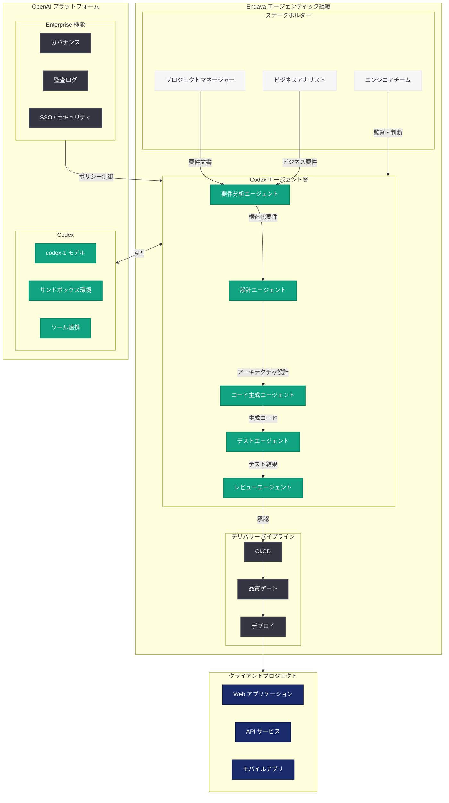
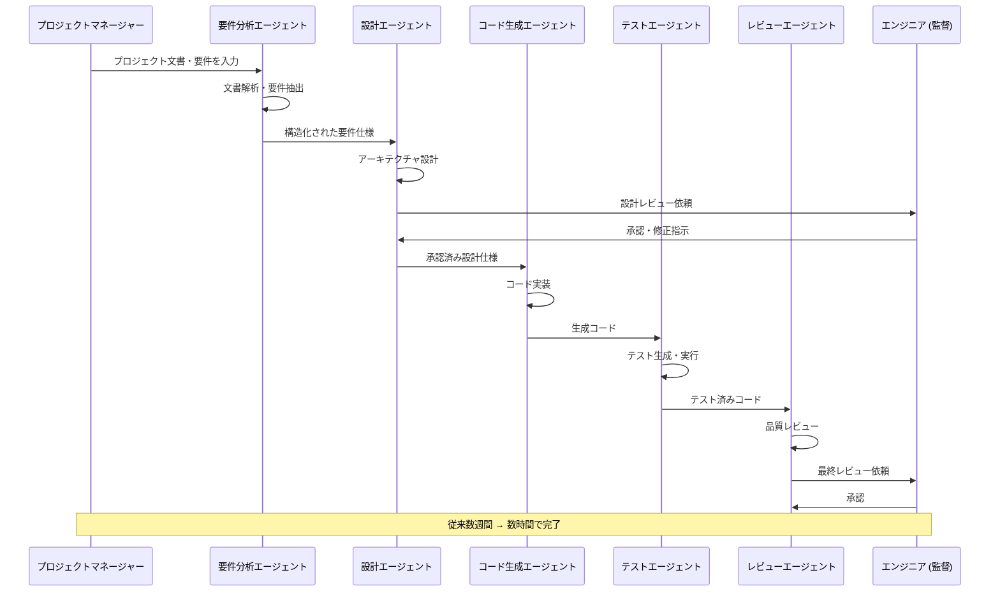

# Endava が Codex でエージェンティック組織を構築する方法

## メタデータ

| 項目 | 内容 |
|------|------|
| 発表日 | 2026-05-28 |
| ソース | OpenAI News/Blog |
| カテゴリ | AI Adoption / Codex / Enterprise |
| 公式リンク | [openai.com/index/endava](https://openai.com/index/endava) |

> **注:** 本レポートは OpenAI ブログのサイトマップ情報とタイトルに基づいて作成しています。記事本文へのアクセスは Cloudflare の保護により制限されたため、タイトル、URL、および公開情報から内容を構成しています。

## 概要

グローバルテクノロジーサービス企業である Endava は、OpenAI の Codex を活用して「エージェンティック組織」(Agentic Organization) への変革を推進している。従来、数週間を要していた要件分析プロセスを数時間に短縮し、ソフトウェアデリバリー全体を大幅に加速させることに成功した。

この事例は、AI エージェントが個々の開発者ツールにとどまらず、組織全体の業務プロセスを変革する「エージェンティック組織」という新しいエンタープライズ AI 導入パターンを示すものである。Endava は約 12,000 人のエンジニアを擁するグローバル企業であり、その規模での Codex 導入は、大規模テクノロジーサービス企業における AI 変革のモデルケースとなる。

## 主な内容

### エージェンティック組織とは

「エージェンティック組織」とは、AI エージェントが組織のワークフロー全体に組み込まれ、人間とエージェントが協調して業務を遂行する組織形態を指す。従来の「ツールとしての AI」とは異なり、AI エージェントが自律的にタスクを実行し、意思決定を支援し、プロセスを最適化する役割を担う。

| 従来の AI 活用 | エージェンティック組織 |
|---------------|---------------------|
| 個別ツールとしての補助 | 組織ワークフローへの統合 |
| 人間がすべてを指示 | エージェントが自律的に実行 |
| コード生成に限定 | 要件分析からデリバリーまで包括 |
| 開発者のみが利用 | 組織全体が恩恵を受ける |
| 単発のタスク支援 | 継続的なプロセス最適化 |

### 要件分析の劇的な短縮: 数週間から数時間へ

Endava の最も顕著な成果は、要件分析フェーズの大幅な短縮である。従来のソフトウェア開発プロジェクトにおいて、要件分析は以下のプロセスを含む。

| フェーズ | 従来の所要時間 | Codex 導入後 |
|---------|--------------|-------------|
| ステークホルダーインタビュー | 1-2 週間 | 数時間 (AI による文書解析と要約) |
| 既存システム分析 | 1-2 週間 | 数時間 (コードベース自動解析) |
| 要件文書作成 | 1 週間 | 数時間 (自動生成とレビュー) |
| 整合性チェック | 数日 | リアルタイム (自動検証) |
| 合計 | 3-5 週間 | 数時間-1 日 |

Codex がコードベースの自動解析、既存ドキュメントの理解、技術的な制約の抽出を自律的に実行することで、エンジニアは要件の検証と意思決定に集中できるようになった。

### ソフトウェアデリバリーの加速

Endava は Codex を開発ライフサイクル全体に統合し、以下の領域でデリバリーを加速させている。

- **設計フェーズ:** Codex がアーキテクチャ提案と技術選定の根拠を自動生成
- **実装フェーズ:** コード生成、テスト作成、コードレビューを AI エージェントが並列実行
- **テストフェーズ:** テストケースの自動生成と実行、カバレッジの自動最適化
- **デプロイフェーズ:** CI/CD パイプラインの設定と最適化を支援
- **保守フェーズ:** バグの自動検出、修正提案、ドキュメント更新

### エンタープライズ規模での AI 導入戦略

Endava の導入アプローチには、大規模組織での AI 展開に必要な以下の要素が含まれると考えられる。

1. **段階的ロールアウト:** パイロットチームから全組織への段階的展開
2. **ガバナンスフレームワーク:** AI エージェントの権限と責任の明確な定義
3. **品質保証体制:** AI 生成物のレビュープロセスと品質基準の設定
4. **トレーニングプログラム:** エンジニアへの Codex 活用トレーニング
5. **成果測定:** KPI に基づく効果測定とフィードバックループ

## 技術的な詳細

### Codex のエンタープライズ統合パターン

Endava のようなテクノロジーサービス企業が Codex を組織全体に統合する際の技術的なアーキテクチャパターンを以下に示す。

#### 要件分析の自動化

```python
# Codex を活用した要件分析の自動化パターン (概念例)
from openai import OpenAI

client = OpenAI()

def analyze_requirements(project_context: str, stakeholder_docs: list[str]) -> dict:
    """
    Codex エージェントによる要件分析の自動化。
    ステークホルダー文書とプロジェクトコンテキストから
    構造化された要件を抽出する。
    """
    combined_docs = "\n---\n".join(stakeholder_docs)

    response = client.responses.create(
        model="codex-1",
        instructions="""あなたは要件分析のエキスパートエージェントです。
提供されたプロジェクトコンテキストとステークホルダー文書から、
構造化された要件仕様を生成してください。

出力形式:
- 機能要件 (優先度付き)
- 非機能要件 (パフォーマンス、セキュリティ、スケーラビリティ)
- 技術的制約
- 依存関係とリスク
- 受け入れ基準""",
        input=f"""プロジェクトコンテキスト:
{project_context}

ステークホルダー文書:
{combined_docs}""",
    )

    return parse_requirements(response.output_text)
```

#### エージェンティックなコードレビューパイプライン

```python
# Codex を活用したエージェンティックなコードレビュー (概念例)
from openai import OpenAI

client = OpenAI()

def agentic_code_review(
    pull_request_diff: str,
    project_standards: str,
    architecture_docs: str,
) -> dict:
    """
    Codex エージェントが自律的にコードレビューを実行し、
    改善提案を生成する。
    """
    response = client.responses.create(
        model="codex-1",
        instructions=f"""あなたはシニアコードレビューエージェントです。
以下のプロジェクト基準とアーキテクチャに基づいて、
提出されたコード差分をレビューしてください。

プロジェクト基準:
{project_standards}

アーキテクチャドキュメント:
{architecture_docs}

レビュー観点:
1. コード品質とベストプラクティス
2. アーキテクチャ整合性
3. セキュリティ脆弱性
4. パフォーマンスへの影響
5. テストカバレッジの十分性""",
        input=f"Pull Request Diff:\n{pull_request_diff}",
    )

    return {
        "review_comments": response.output_text,
        "approval_status": determine_approval(response.output_text),
    }
```

#### マルチエージェント開発ワークフロー

```python
# エージェンティック組織におけるマルチエージェント協調 (概念例)
from openai import OpenAI

client = OpenAI()

class AgenticDevelopmentPipeline:
    """
    複数の Codex エージェントが協調して
    開発ライフサイクルを自律的に推進するパイプライン。
    """

    def __init__(self):
        self.client = OpenAI()

    def run_pipeline(self, task_description: str, codebase_context: str):
        """エージェンティックパイプラインを実行する。"""

        # Phase 1: 要件エージェントによるタスク分解
        requirements = self._analyze_task(task_description)

        # Phase 2: アーキテクチャエージェントによる設計
        design = self._design_solution(requirements, codebase_context)

        # Phase 3: 実装エージェントによるコード生成
        implementation = self._implement(design, codebase_context)

        # Phase 4: テストエージェントによる検証
        test_results = self._verify(implementation, requirements)

        # Phase 5: レビューエージェントによる品質確認
        review = self._review(implementation, design)

        return {
            "requirements": requirements,
            "design": design,
            "implementation": implementation,
            "test_results": test_results,
            "review": review,
        }

    def _analyze_task(self, task_description: str) -> dict:
        """要件分析エージェント。"""
        response = self.client.responses.create(
            model="codex-1",
            instructions="タスクを分析し、実装に必要な要件を構造化して出力してください。",
            input=task_description,
        )
        return {"analysis": response.output_text}

    def _design_solution(self, requirements: dict, context: str) -> dict:
        """設計エージェント。"""
        response = self.client.responses.create(
            model="codex-1",
            instructions="要件に基づいて技術設計を作成してください。",
            input=f"要件: {requirements}\nコンテキスト: {context}",
        )
        return {"design": response.output_text}

    def _implement(self, design: dict, context: str) -> dict:
        """実装エージェント。"""
        response = self.client.responses.create(
            model="codex-1",
            instructions="設計に基づいてコードを実装してください。",
            input=f"設計: {design}\nコンテキスト: {context}",
        )
        return {"code": response.output_text}

    def _verify(self, implementation: dict, requirements: dict) -> dict:
        """テストエージェント。"""
        response = self.client.responses.create(
            model="codex-1",
            instructions="実装が要件を満たしているか検証するテストを作成・実行してください。",
            input=f"実装: {implementation}\n要件: {requirements}",
        )
        return {"tests": response.output_text}

    def _review(self, implementation: dict, design: dict) -> dict:
        """レビューエージェント。"""
        response = self.client.responses.create(
            model="codex-1",
            instructions="実装が設計に準拠しているかレビューしてください。",
            input=f"実装: {implementation}\n設計: {design}",
        )
        return {"review": response.output_text}
```

### エンタープライズ環境での Codex 設定

```yaml
# エンタープライズ向け Codex 環境設定 (概念例)
# codex-config.yaml

organization:
  name: "Endava"
  plan: "enterprise"

agents:
  requirements_analyst:
    model: "codex-1"
    permissions:
      - read_documentation
      - analyze_codebase
      - generate_reports
    sandbox: true

  code_generator:
    model: "codex-1"
    permissions:
      - read_codebase
      - write_code
      - run_tests
    sandbox: true
    review_required: true

  test_engineer:
    model: "codex-1"
    permissions:
      - read_codebase
      - write_tests
      - execute_tests
    sandbox: true

  code_reviewer:
    model: "codex-1"
    permissions:
      - read_codebase
      - comment_on_pr
      - approve_pr
    sandbox: true

governance:
  human_approval_required:
    - production_deployment
    - architecture_changes
    - security_sensitive_code
  audit_logging: true
  compliance_checks: true
```

## アーキテクチャ



### エージェンティック開発フローの詳細



## 開発者への影響

- **エージェンティック開発の標準化:** Endava の事例は、AI エージェントを開発ライフサイクル全体に統合する「エージェンティック組織」パターンを確立し、テクノロジーサービス業界全体に影響を与える可能性がある。個々のツール導入ではなく、組織設計レベルでの AI 統合が新しい標準となる
- **要件分析プロセスの革新:** 数週間から数時間への短縮は、プロジェクト初期フェーズにおける AI の価値を実証している。ウォーターフォール型プロジェクトでもアジャイル型でも、要件定義の速度が劇的に改善されることで、プロジェクト全体のリードタイムが短縮される
- **テクノロジーサービス企業のビジネスモデル変革:** 従来の「人月」ベースのビジネスモデルから、AI エージェントとの協調による「価値ベース」のデリバリーモデルへの移行が加速する。デリバリー速度の向上は、より多くのプロジェクトを並行して遂行する能力につながる
- **マルチエージェント協調パターンの実践:** 要件分析、設計、実装、テスト、レビューの各フェーズに特化したエージェントが協調するアーキテクチャは、複雑なエンタープライズ開発プロジェクトにおける新しい設計パターンとなる
- **ガバナンスとコンプライアンスの両立:** エンタープライズ規模での AI エージェント導入において、品質管理、監査、セキュリティを担保するガバナンスフレームワークの重要性が明確になった。人間による監督 (Human-in-the-Loop) と AI の自律性のバランスが鍵となる

## 関連リンク

- [How Endava builds an agentic organization with Codex](https://openai.com/index/endava)
- [OpenAI Codex](https://openai.com/codex)
- [Codex for Enterprise](https://openai.com/enterprise)
- [How Virgin Atlantic ships faster with Codex](https://openai.com/index/virgin-atlantic)
- [Building Self-Improving Tax Agents with Codex](https://openai.com/index/building-self-improving-tax-agents-with-codex/)
- [Endava 公式サイト](https://www.endava.com/)
- [OpenAI News](https://openai.com/news)

## まとめ

Endava の事例は、Codex が単なるコード生成ツールを超え、組織全体のソフトウェアデリバリーを変革する「エージェンティック組織」の実現を可能にすることを示している。要件分析の劇的な短縮 (数週間から数時間) は、AI エージェントがソフトウェア開発の最も時間のかかるフェーズの一つを根本的に変革できることの証左である。

約 12,000 人規模のグローバルテクノロジーサービス企業での成功は、エンタープライズ AI 導入の新しい段階を示している。個々の開発者がツールとして AI を使う段階から、組織全体が AI エージェントと協調する「エージェンティック組織」への進化は、テクノロジーサービス業界のビジネスモデルそのものを変革する可能性を持つ。人間の判断力と AI の実行速度を組み合わせたこのモデルは、今後のエンタープライズ開発の方向性を示す重要な指標となるだろう。
