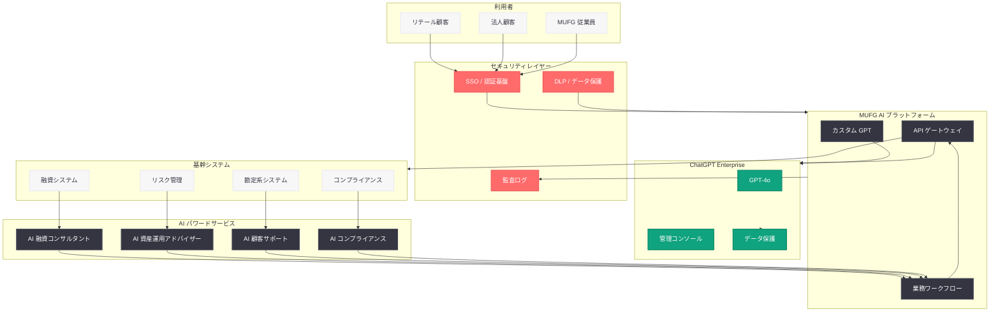

# MUFG が OpenAI と共に AI ネイティブ組織を目指す

## メタデータ

| 項目 | 内容 |
|------|------|
| 発表日 | 2026-05-28 |
| ソース | OpenAI News |
| カテゴリ | カスタマーストーリー |
| 公式リンク | [openai.com/index/mufg](https://openai.com/index/mufg) |

## 概要

三菱 UFJ フィナンシャル・グループ (MUFG) は、日本最大の金融機関として ChatGPT Enterprise を全社的に導入し、AI ネイティブ組織への変革を推進している。MUFG は約 12 万人の従業員を擁するメガバンクグループであり、銀行業務、証券、信託、資産運用など幅広い金融サービスを提供している。

本事例は、日本の金融業界における AI 活用の先進的な取り組みとして注目される。MUFG は ChatGPT Enterprise の導入を通じて、従業員の業務効率化だけでなく、顧客向けの新たな AI パワード金融サービスの開発にも取り組んでおり、金融機関が AI ネイティブ組織へと進化するためのロードマップを示している。

## 主な内容

### AI ネイティブ組織への戦略

MUFG が掲げる「AI ネイティブ」とは、単に AI ツールを導入するだけでなく、組織の文化、業務プロセス、意思決定の在り方そのものを AI を前提として再設計するアプローチである。具体的には以下の柱で構成されている。

- **全社的な AI リテラシーの向上:** 全従業員が AI を日常的に活用できる環境の整備
- **業務プロセスの AI ファースト設計:** 既存業務を AI 前提で再構築
- **AI パワード金融サービスの開発:** 顧客体験を根本から変革する新サービスの創出
- **AI ガバナンスの確立:** 金融規制に準拠した安全な AI 活用フレームワークの構築

### ChatGPT Enterprise の大規模展開

MUFG は ChatGPT Enterprise を全グループで展開し、以下の業務領域で活用している。

- **リテールバンキング:** 顧客対応の品質向上、問い合わせ対応の効率化、パーソナライズされた金融アドバイスの提供
- **コーポレートバンキング:** 融資審査レポートの作成支援、企業分析、リスク評価の効率化
- **コンプライアンス:** 規制文書の解析、コンプライアンスチェックの自動化、AML (マネーロンダリング防止) 関連業務の支援
- **バックオフィス:** 社内文書の作成、会議の議事録要約、データ分析レポートの自動生成

### AI パワード金融サービス

MUFG は ChatGPT Enterprise を基盤として、以下のような新しい金融サービスの開発を進めている。

- **AI 資産運用アドバイザー:** 顧客のリスク許容度や投資目標に基づいた、パーソナライズされた資産運用提案
- **自然言語による取引照会:** 顧客が自然な日本語で口座情報や取引履歴を照会できるインターフェース
- **AI 融資コンサルタント:** 中小企業向けの融資相談で、事業計画の分析と最適な融資商品の提案を支援
- **リアルタイムリスクアラート:** 市場変動やポートフォリオリスクに関する即座のインサイト提供

### コンプライアンスと規制対応

金融機関として最も重要な課題の一つが、AI 活用における規制対応である。MUFG は以下のフレームワークを構築している。

- **データプライバシー:** ChatGPT Enterprise のデータ保護機能を活用し、顧客情報が学習データとして使用されないことを保証
- **金融規制準拠:** 金融庁のガイドラインに沿った AI 利用ポリシーの策定
- **監査証跡:** AI が関与した意思決定プロセスの記録と追跡可能性の確保
- **モデルリスク管理:** AI 出力の精度検証と人間によるオーバーサイトの維持
- **情報セキュリティ:** エンタープライズグレードのセキュリティ基準への準拠

## 技術的な詳細

### ChatGPT Enterprise の金融機関向け構成

MUFG が ChatGPT Enterprise を導入するにあたり、以下の技術的要件を満たす構成を採用している。

- **SSO 統合:** 既存の認証基盤 (Active Directory / SAML) との統合による従業員アクセス管理
- **データ境界:** 日本国内のデータレジデンシー要件への対応
- **カスタム GPT:** 業務ドメインに特化したカスタム GPT の構築 (融資審査、コンプライアンス、顧客対応)
- **API 統合:** 既存の基幹システムとの API 連携による業務自動化
- **アクセス制御:** ロールベースのアクセス管理による情報区分の制御

### コードサンプル

以下は、MUFG のような金融機関が ChatGPT Enterprise API を活用する際の実装パターンを示す。

```python
from openai import OpenAI

client = OpenAI()


def analyze_loan_application(application_data: dict) -> dict:
    """融資申請の初期分析を AI で支援する"""
    response = client.chat.completions.create(
        model="gpt-4o",
        messages=[
            {
                "role": "system",
                "content": (
                    "あなたは大手銀行の融資審査担当者です。"
                    "提供された企業情報と財務データに基づいて、"
                    "融資申請の初期評価を行ってください。"
                    "リスク要因、強み、追加調査が必要な項目を明確に示してください。"
                    "最終判断は人間の審査担当者が行います。"
                ),
            },
            {
                "role": "user",
                "content": f"以下の融資申請データを分析してください:\n{application_data}",
            },
        ],
        temperature=0.1,  # 一貫性のある分析結果を確保
        response_format={"type": "json_object"},
    )
    return response.choices[0].message.content


def generate_compliance_report(transaction_data: list) -> dict:
    """取引データのコンプライアンスチェックレポートを生成する"""
    response = client.chat.completions.create(
        model="gpt-4o",
        messages=[
            {
                "role": "system",
                "content": (
                    "あなたは金融コンプライアンスの専門家です。"
                    "提供された取引データについて、AML/CFT の観点から"
                    "疑わしい取引パターンがないか分析してください。"
                    "検出したリスクにはスコアを付け、根拠を明示してください。"
                ),
            },
            {
                "role": "user",
                "content": f"以下の取引データを分析してください:\n{transaction_data}",
            },
        ],
        temperature=0.0,
        response_format={"type": "json_object"},
    )
    return response.choices[0].message.content


def customer_inquiry_assistant(customer_query: str, account_context: dict) -> str:
    """顧客からの問い合わせに AI が回答を生成する"""
    response = client.chat.completions.create(
        model="gpt-4o",
        messages=[
            {
                "role": "system",
                "content": (
                    "あなたは MUFG の顧客サポート担当者です。"
                    "丁寧で正確な回答を心がけてください。"
                    "不明な点がある場合は、専門担当者への引き継ぎを提案してください。"
                    "投資アドバイスや具体的な金融商品の推奨は行わないでください。"
                ),
            },
            {
                "role": "user",
                "content": (
                    f"顧客情報: {account_context}\n\n"
                    f"顧客の質問: {customer_query}"
                ),
            },
        ],
        temperature=0.3,
    )
    return response.choices[0].message.content
```

### セキュリティアーキテクチャ

金融機関における AI 活用では、多層的なセキュリティが不可欠である。

```python
from openai import OpenAI
import logging

# 監査ログの設定
audit_logger = logging.getLogger("ai_audit")


class SecureAIClient:
    """金融機関向けセキュアな AI クライアント"""

    def __init__(self):
        self.client = OpenAI()
        self.restricted_topics = [
            "個人情報の直接出力",
            "具体的な投資推奨",
            "未公開情報の言及",
        ]

    def query_with_audit(
        self, messages: list, user_id: str, department: str
    ) -> dict:
        """監査証跡付きの AI クエリ実行"""
        # 入力データのサニタイズ
        sanitized_messages = self._sanitize_input(messages)

        # AI クエリ実行
        response = self.client.chat.completions.create(
            model="gpt-4o",
            messages=sanitized_messages,
            temperature=0.2,
        )

        # 監査ログの記録
        audit_logger.info(
            "AI query executed",
            extra={
                "user_id": user_id,
                "department": department,
                "model": "gpt-4o",
                "token_usage": response.usage.total_tokens,
                "timestamp": response.created,
            },
        )

        # 出力のコンプライアンスチェック
        output = response.choices[0].message.content
        self._validate_output(output)

        return {
            "response": output,
            "audit_id": f"audit-{response.id}",
            "usage": response.usage.model_dump(),
        }

    def _sanitize_input(self, messages: list) -> list:
        """入力データから機密情報をマスクする"""
        # PII (個人識別情報) のマスキング処理
        return messages

    def _validate_output(self, output: str) -> None:
        """出力がコンプライアンス基準を満たすか検証する"""
        # 禁止トピックのチェック
        pass
```

## アーキテクチャ



## 開発者への影響

MUFG の事例は、日本の金融業界における AI 導入のベストプラクティスとして、フィンテック開発者に多くの示唆を与えている。

- **エンタープライズ AI の設計パターン:** ChatGPT Enterprise の API を基幹システムと統合する際のアーキテクチャパターンが確立された。SSO 統合、API ゲートウェイ、監査ログの三層構造が金融機関における標準的な設計として参考になる

- **日本語対応の重要性:** 金融機関のユースケースでは、日本語での高精度な自然言語処理が求められる。プロンプトエンジニアリングにおいて、日本語固有の表現やビジネス慣習を考慮した設計が必要である

- **コンプライアンス・バイ・デザイン:** AI システムの設計段階から金融規制 (金融庁ガイドライン、個人情報保護法、犯罪収益移転防止法) への準拠を組み込むアプローチが示された

- **段階的な展開戦略:** 全社 12 万人規模での導入は一度に行われるのではなく、パイロット部門での検証を経て段階的に拡大するアプローチが採用されている。開発者は同様の段階的ロールアウト戦略を計画する際の参考にできる

- **カスタム GPT の活用:** 業務ドメインに特化したカスタム GPT を構築することで、汎用モデルの能力を特定の業務コンテキストに最適化する手法が有効であることが実証された

- **人間によるオーバーサイトの維持:** AI は意思決定の支援ツールとして位置付けられ、最終判断は必ず人間が行う設計原則が貫かれている。特に融資審査やコンプライアンス判断において重要である

## 関連リンク

- [OpenAI ChatGPT Enterprise](https://openai.com/chatgpt/enterprise)
- [OpenAI API ドキュメント](https://platform.openai.com/docs)
- [OpenAI セキュリティとプライバシー](https://openai.com/security)
- [MUFG 公式サイト](https://www.mufg.jp/)
- [金融庁 AI ガイドライン](https://www.fsa.go.jp/)
- [OpenAI News](https://openai.com/news)

## まとめ

MUFG による ChatGPT Enterprise の全社導入は、日本最大の金融機関が AI ネイティブ組織への変革に本格的に乗り出した画期的な事例である。約 12 万人の従業員に AI ツールを展開し、融資審査、コンプライアンス、顧客対応、資産運用アドバイスなど多岐にわたる業務で活用を進めている。

特に注目すべきは、金融規制への準拠とセキュリティを最優先しながらも、顧客体験の向上と業務効率化を両立させるアプローチである。ChatGPT Enterprise のデータ保護機能、SSO 統合、管理コンソールによるガバナンスが、金融機関特有の厳格な要件を満たす基盤として機能している。

この事例は、日本の金融業界全体における AI 活用の方向性を示すものであり、他のメガバンクや地方銀行、証券会社にとっても AI 導入の参考となるモデルケースである。フィンテック開発者にとっては、エンタープライズ規模での AI システム設計、コンプライアンス対応、セキュリティアーキテクチャの構築に関する実践的な指針が得られる重要な事例といえる。
