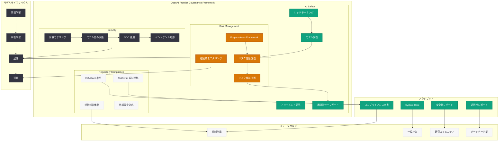

# OpenAI、フロンティアガバナンスフレームワークを公開 — EU AI Act および California 規制との整合性を明示

## メタデータ

| 項目 | 内容 |
|------|------|
| 発表日 | 2026-05-28 |
| ソース | OpenAI News/Blog (Safety) |
| カテゴリ | Safety / Policy / Governance |
| 公式リンク | [openai.com/index/openai-frontier-governance-framework](https://openai.com/index/openai-frontier-governance-framework) |

> **注:** 本レポートは OpenAI ブログのサイトマップ情報とタイトルに基づいて作成しています。記事本文へのアクセスは Cloudflare の保護により制限されたため、タイトル、URL、および公開情報から内容を構成しています。

## 概要

OpenAI は 2026 年 5 月 28 日、「Frontier Governance Framework」(フロンティアガバナンスフレームワーク) を公開した。本フレームワークは、OpenAI の AI 安全性、セキュリティ、およびリスク管理の実践が、EU AI Act や California 州の新興 AI 規制とどのように整合しているかを体系的に示すものである。

フロンティアモデルの開発と展開に伴うリスクが社会的に注目される中、OpenAI は自社のガバナンス体制を包括的に文書化し、規制当局、パートナー、および一般社会に対して透明性を確保する姿勢を明確にした。本フレームワークは、モデル開発のライフサイクル全体にわたるリスク評価、安全性テスト、セキュリティ対策、および展開後の監視を包括する統合的なガバナンス構造を提示している。

## 主な内容

### フロンティアガバナンスフレームワークの全体構造

OpenAI のフロンティアガバナンスフレームワークは、フロンティア AI モデルの開発から展開、運用までの全ライフサイクルにわたる包括的なガバナンス体制を定義するものである。以下の主要な柱で構成されると考えられる。

| 柱 | 概要 |
|---|------|
| AI Safety (安全性) | レッドチーミング、モデル評価、アライメント研究による安全性確保 |
| Security (セキュリティ) | 脅威モデリング、インシデント対応、インフラ保護 |
| Risk Management (リスク管理) | リスク評価フレームワーク、閾値設定、段階的な対応措置 |
| Compliance (規制準拠) | EU AI Act、California 規制への準拠体制 |
| Transparency (透明性) | 情報開示、外部監査、ステークホルダーとの対話 |

### EU AI Act との整合性

EU AI Act は 2024 年に成立し、段階的に施行が進んでいる包括的な AI 規制法である。OpenAI のフロンティアガバナンスフレームワークは、以下の要件との整合性を示すものと推察される。

- **汎用目的 AI モデル (GPAI) の義務**: EU AI Act は、汎用目的 AI モデルの提供者に対し、技術文書の作成、著作権法の遵守、学習データの概要開示を義務付けている。OpenAI はこれらの要件に対応する体制を整備していると考えられる
- **システミックリスクを有する GPAI モデルの追加義務**: 一定の計算量閾値を超えるモデルには、モデル評価の実施、システミックリスクの評価と軽減、インシデント報告、サイバーセキュリティ対策が追加で求められる
- **高リスク AI システムの分類**: フロンティアモデルを活用したアプリケーションが高リスクに分類される場合のガバナンス要件への対応
- **透明性義務**: AI システムとの対話であることをユーザーに通知する義務への対応

### California 規制への対応

California 州では AI に関する複数の規制法案が審議・成立しており、OpenAI のフレームワークはこれらとの整合性を確保するものである。

- **SB-1047 (Safe and Secure Innovation for Frontier Artificial Intelligence Models Act) の後継法案**: フロンティアモデル開発者に対する安全性評価義務、キルスイッチの実装、第三者監査の要件などに対応
- **リスク評価の義務化**: 一定規模以上のモデル開発時に、壊滅的リスクの事前評価を実施する体制
- **安全性テストの文書化**: モデルリリース前の安全性テスト結果の記録と保存
- **インシデント報告体制**: 重大な安全性インシデントが発生した場合の報告プロセス

### AI 安全性実践

OpenAI のフロンティアガバナンスフレームワークにおける安全性実践は、以下の要素で構成されると考えられる。

**レッドチーミング:**
- 外部専門家チームによるモデルの脆弱性評価
- 危険な能力 (CBRN、サイバー攻撃、説得力のある偽情報生成等) のテスト
- 自動化されたレッドチーミングシステムによる継続的評価
- 多言語・多文化コンテキストでの安全性検証

**モデル評価:**
- 能力評価 (Capability Evaluation): モデルの危険な能力レベルを定量的に測定
- アライメント評価: モデルが人間の意図に沿って動作するかの検証
- ロバストネス評価: 敵対的入力に対する耐性テスト
- 公平性評価: バイアスと差別的出力の検出

**展開時のセーフガード:**
- 使用ポリシーの自動適用メカニズム
- 段階的ロールアウトによるリスク最小化
- リアルタイム監視とフィルタリングシステム
- ユーザーフィードバックに基づく継続的改善

### セキュリティ実践

フロンティアモデルのセキュリティは、モデルの重み (weights) の保護とインフラの安全性確保の両面から構成される。

**脅威モデリング:**
- 国家レベルの攻撃者を想定した防御設計
- モデル重みの窃取リスクに対する多層防御
- サプライチェーン攻撃への対策
- インサイダー脅威の軽減

**インシデント対応:**
- 24/7 体制のセキュリティオペレーションセンター (SOC)
- インシデント対応計画の定期的な演習
- 外部セキュリティ研究者との協力体制 (バグバウンティプログラム)
- 規制当局への報告プロセス

### リスク管理フレームワーク

OpenAI のリスク管理は、Preparedness Framework を基盤とした体系的なアプローチに基づく。

| リスクレベル | 定義 | 対応措置 |
|-------------|------|---------|
| Low | 既存の安全対策で十分に管理可能 | 通常の展開プロセスを継続 |
| Medium | 追加の安全対策が必要 | 強化された監視と制限的な展開 |
| High | 重大な危害の可能性 | 展開の制限または停止、追加の安全対策の開発 |
| Critical | 壊滅的な危害の可能性 | 開発の停止、外部レビューの実施 |

### 透明性とアカウンタビリティ

OpenAI のフレームワークは、以下の透明性メカニズムを含むと推察される。

- **System Card の公開**: 各モデルのリスク評価結果と安全対策の詳細を公開文書として提供
- **外部監査の受け入れ**: 第三者機関によるガバナンス体制の評価
- **定期的な安全性レポート**: 安全性に関する取り組みの進捗を定期的に公開
- **マルチステークホルダーとの対話**: 政府、市民社会、学術界との継続的な協議
- **Safety Advisory Group**: 外部専門家による安全性に関する助言体制

## 技術的な詳細

### ガバナンス実装の具体的メカニズム

フロンティアガバナンスフレームワークの技術的実装は、以下の要素で構成される。

**モデル開発段階のガバナンス:**

| フェーズ | ガバナンスアクション |
|---------|-------------------|
| 事前学習 (Pre-training) | データガバナンス、計算量モニタリング、能力予測 |
| 事後学習 (Post-training) | アライメント調整、安全性チューニング、RLHF |
| 評価 (Evaluation) | 能力テスト、レッドチーミング、バイアス評価 |
| 展開準備 (Pre-deployment) | System Card 作成、リスク閾値確認、規制準拠チェック |
| 展開 (Deployment) | 段階的ロールアウト、使用ポリシー適用、監視開始 |
| 運用 (Post-deployment) | 継続的監視、インシデント対応、フィードバック統合 |

**Preparedness Framework との連携:**

OpenAI は 2023 年に発表した Preparedness Framework を基盤として、フロンティアモデルの危険な能力を以下のカテゴリで評価している。

- **Cybersecurity**: モデルがサイバー攻撃を支援する能力
- **CBRN (化学・生物・放射線・核)**: 大量破壊兵器の開発を支援する能力
- **Persuasion (説得)**: 大規模な世論操作を行う能力
- **Model Autonomy (自律性)**: 人間の監視なしに自律的に行動する能力

**規制準拠の自動化:**

規制要件への準拠を効率化するため、以下の自動化メカニズムが実装されていると推察される。

- コンプライアンスチェックリストの自動生成と追跡
- 規制要件とガバナンスアクションのマッピング管理
- 監査証跡の自動記録
- 規制変更の監視と影響分析

## アーキテクチャ

## 開発者への影響

- **規制準拠の明確化:** OpenAI のフロンティアガバナンスフレームワークにより、OpenAI API を利用する開発者は、基盤モデル層での規制準拠が確保されていることを自社のコンプライアンス文書で引用できるようになる。これにより、EU AI Act の汎用目的 AI に関する義務の一部が OpenAI 側で対応済みであることが明確になる
- **System Card の活用:** 各モデルの System Card が体系化されることで、開発者はアプリケーション層でのリスク評価において、基盤モデルの能力と制限事項をより正確に把握し、適切なリスク軽減策を設計できるようになる
- **展開ガイダンスの強化:** フロンティアモデルを活用したアプリケーションの展開に際し、OpenAI のガバナンスフレームワークに沿った安全性チェックリストやベストプラクティスが提供される可能性がある
- **EU 市場でのサービス継続性:** EU AI Act への準拠体制が明示されたことで、EU 市場向けにサービスを提供する開発者は、OpenAI API の継続的な利用可能性について一定の安心感を得られる
- **インシデント対応の連携:** セキュリティインシデントや安全性問題が発生した際の報告・対応プロセスが体系化されることで、開発者は自社のインシデント対応計画と OpenAI のプロセスを連携させやすくなる

## 関連リンク

- [OpenAI Frontier Governance Framework (公式)](https://openai.com/index/openai-frontier-governance-framework)
- [OpenAI Safety](https://openai.com/safety)
- [OpenAI Preparedness Framework](https://openai.com/safety/preparedness)
- [OpenAI - Our Principles](https://openai.com/index/our-principles/)
- [OpenAI - Global AI Governance Body 提案](https://openai.com/news)
- [EU AI Act (EUR-Lex)](https://eur-lex.europa.eu/legal-content/EN/TXT/?uri=CELEX:32024R1689)
- [OpenAI System Card (GPT-4o)](https://openai.com/index/gpt-4o-system-card/)
- [OpenAI Bug Bounty Program](https://openai.com/security)

## まとめ

OpenAI のフロンティアガバナンスフレームワークは、フロンティア AI モデルの開発と展開における包括的なガバナンス体制を体系的に文書化したものである。AI Safety (レッドチーミング、モデル評価、アライメント)、Security (脅威モデリング、インシデント対応)、Risk Management (Preparedness Framework に基づくリスク評価)、Regulatory Compliance (EU AI Act、California 規制への準拠) の 4 つの柱で構成され、モデルライフサイクル全体にわたる統合的なガバナンスを実現する。

本フレームワークの公開は、AI 規制が世界的に具体化する中で、OpenAI が業界のリーダーとして責任ある AI 開発の基準を示す重要な取り組みである。開発者にとっては、基盤モデル層での規制準拠の明確化により、自社アプリケーションのコンプライアンス対応が効率化されることが期待される。フロンティア AI のガバナンスは今後も進化し続ける分野であり、本フレームワークはその議論の基盤となる重要な文書と位置づけられる。
