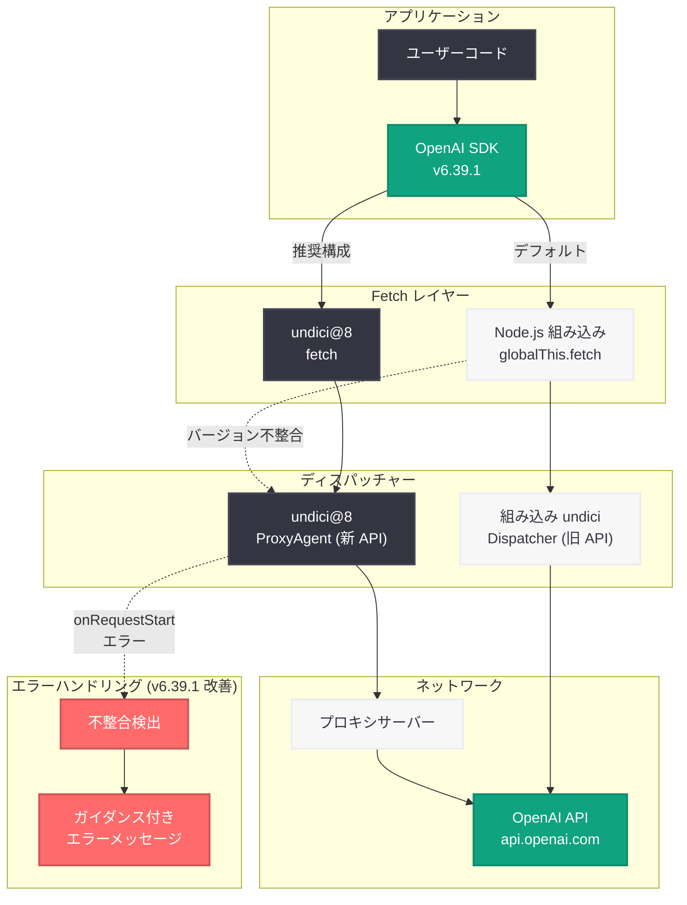

# OpenAI Node SDK v6.39.1 パッチリリース: undici ディスパッチャー不整合ガイダンス改善とバイナリアップロード修正

## メタデータ

| 項目 | 内容 |
|------|------|
| 発表日 | 2026-05-28 |
| ソース | OpenAI API Changelog / GitHub Release |
| カテゴリ | SDK Update / Developer Tools |
| 公式リンク | [GitHub Release](https://github.com/openai/openai-node/releases/tag/v6.39.1) |

## 概要

OpenAI は 2026 年 5 月 27 日に Node.js SDK のパッチリリース v6.39.1 を公開した。本リリースでは、Node.js HTTP クライアントである undici のディスパッチャーバージョン不整合時のエラーガイダンスを改善し、`text/plain` コンテンツタイプでバイナリフォーマット指定されたファイルのアップロード処理を修正している。

v6.39.0 (2026 年 5 月 21 日リリース) からの差分であり、機能追加はなくバグ修正のみのマイナーパッチである。特に undici ディスパッチャーの問題は、プロキシ環境で OpenAI API を利用する開発者に直接影響する重要な修正であり、エラーメッセージの改善によりデバッグ時間が大幅に短縮される。

## 主な内容

### undici ディスパッチャー不整合ガイダンスの改善

Node.js 環境でプロキシ経由で OpenAI API にアクセスする際、`undici@8` の `ProxyAgent` を `fetchOptions.dispatcher` に指定しつつ、カスタム `fetch` を提供しないケースで発生する問題に対する診断ガイダンスが改善された。

**問題の根本原因**: Node.js の組み込み `globalThis.fetch` は、Node にバンドルされた古いバージョンの undici を使用している。外部からインストールした `undici@8` の `ProxyAgent` は新しいディスパッチャーハンドラーライフサイクルを期待するため、バージョン不整合が発生する。

**エラーチェーン**:

1. `undici@8` がハンドラーを拒否: `UND_ERR_INVALID_ARG: invalid onRequestStart method`
2. fetch がラップ: `TypeError: fetch failed`
3. SDK がラップ: `APIConnectionError`

**改善内容**:

- `APIConnectionError` のメッセージに、`onRequestStart` エラーが原因チェーンに含まれる場合の具体的なガイダンスを追加
- 元の fetch エラーを `cause` プロパティとして保持し、プログラムによる検査を可能に
- 回帰テストの追加による将来的な品質保証

### text/plain バイナリフォーマットアップロードの修正

`text/plain` コンテンツタイプを持つファイルが `format: binary` で指定された場合に、SDK がテキストとして処理してしまう問題が修正された。本修正により、当該ケースではファイルがそのままバイナリデータ (raw upload) として扱われるようになった。

**影響を受けるシナリオ**:

- テキスト形式のデータファイル (.csv、.tsv、ログファイルなど) をバイナリモードでアップロードする場合
- MIME タイプが `text/plain` だが実質的にバイナリとして転送すべきファイルの処理
- API がバイナリ形式でのアップロードを明示的に要求する場合

### 内部コード生成の更新

自動コード生成 (codegen) に関連する内部的な更新が含まれている。これはエンドユーザーの API 利用に直接的な影響を与えるものではないが、SDK の型定義やインターフェースの正確性を維持するための継続的なメンテナンスの一環である。

## 技術的な詳細

### undici ディスパッチャー問題の技術背景

Node.js 18 以降、`globalThis.fetch` は内部的に undici を使用している。しかし、Node.js にバンドルされた undici のバージョンと、npm からインストールする最新の `undici@8` ではディスパッチャーハンドラーの API が異なる。

| 環境 | undici バージョン | ハンドラー API |
|------|-----------------|---------------|
| Node.js 20 組み込み | ~5.x 相当 | 旧ライフサイクル |
| Node.js 22 組み込み | ~6.x 相当 | 旧ライフサイクル |
| npm `undici@8` | 8.x | 新ライフサイクル (`onRequestStart`) |

### 修正前後の比較

**修正前 (v6.39.0)**: プロキシ設定時に不明瞭なエラーが発生

```javascript
import OpenAI from 'openai';
import { ProxyAgent } from 'undici';

// この設定はエラーになるが、原因が分かりにくい
const client = new OpenAI({
  fetchOptions: {
    dispatcher: new ProxyAgent('http://proxy.example.com:8080'),
  },
});

// 発生するエラー:
// APIConnectionError: Connection error.
// (原因の特定が困難)
```

**修正後 (v6.39.1)**: 具体的なガイダンスを含むエラーメッセージ

```javascript
import OpenAI from 'openai';
import { ProxyAgent } from 'undici';

// 同じ設定でもエラーメッセージが改善される
const client = new OpenAI({
  fetchOptions: {
    dispatcher: new ProxyAgent('http://proxy.example.com:8080'),
  },
});

// 改善されたエラー:
// APIConnectionError: Connection error.
// It looks like you're using a undici dispatcher from a different version
// than the built-in fetch. Pass the matching `fetch` from `undici` to
// resolve this.
// Cause: TypeError: fetch failed
//   [cause]: UND_ERR_INVALID_ARG: invalid onRequestStart method
```

### 正しいプロキシ設定パターン

```javascript
import OpenAI from 'openai';
import { fetch, ProxyAgent } from 'undici';

// undici の fetch と ProxyAgent を同じパッケージから使用する
const client = new OpenAI({
  fetch,  // undici@8 の fetch を明示的に渡す
  fetchOptions: {
    dispatcher: new ProxyAgent('http://proxy.example.com:8080'),
  },
});

// これでバージョン不整合が解消される
const response = await client.chat.completions.create({
  model: 'gpt-4o',
  messages: [{ role: 'user', content: 'Hello!' }],
});
```

### バイナリアップロード修正の詳細

```javascript
import OpenAI from 'openai';
import fs from 'fs';

const client = new OpenAI();

// 修正前: text/plain + binary format の場合、
// テキストとして処理されエンコーディング問題が発生

// 修正後: format: binary が指定されていれば
// content-type に関係なく raw バイナリとして転送
const file = await client.files.create({
  file: fs.createReadStream('data.csv'),
  purpose: 'assistants',
});
```

## アーキテクチャ

以下の図は、OpenAI Node SDK v6.39.1 における HTTP リクエストフローと、undici ディスパッチャーの関係を示している。



## 開発者への影響

- **プロキシ環境利用者**: undici ディスパッチャー不整合のデバッグが容易になり、エラーメッセージに具体的な解決策が示されるようになった。企業のプロキシ環境で OpenAI API を利用する開発者に直接的な恩恵がある

- **ファイルアップロード利用者**: `text/plain` コンテンツタイプのファイルをバイナリモードでアップロードする際のエッジケースが解消され、Assistants API やファイル API でのデータアップロードの信頼性が向上した

- **アップグレード推奨度**: プロキシ環境で不明瞭な接続エラーを経験している開発者は即時アップグレードを推奨。それ以外の開発者も、通常のパッチ更新として適用を推奨する

- **破壊的変更なし**: パッチリリースのため API の互換性は完全に維持されている。`npm update openai` または `yarn upgrade openai` で安全にアップグレード可能

- **依存関係の確認**: プロキシを利用する場合は `undici` パッケージの `fetch` と `ProxyAgent` を同一パッケージからインポートすることが公式に推奨される設計方針として確立された

## 関連リンク

- [OpenAI Node SDK v6.39.1 リリースノート](https://github.com/openai/openai-node/releases/tag/v6.39.1)
- [完全な変更履歴 (v6.39.0 との差分)](https://github.com/openai/openai-node/compare/v6.39.0...v6.39.1)
- [PR #1898: undici ディスパッチャー不整合ガイダンスの改善](https://github.com/openai/openai-node/issues/1898)
- [OpenAI Node SDK GitHub リポジトリ](https://github.com/openai/openai-node)
- [OpenAI API Changelog](https://platform.openai.com/docs/changelog)
- [undici 公式ドキュメント](https://undici.nodejs.org/)
- [npm: openai パッケージ](https://www.npmjs.com/package/openai)

## まとめ

OpenAI Node SDK v6.39.1 は、プロキシ環境での利用とファイルアップロードに関する 2 つの重要なバグ修正を含むパッチリリースである。undici ディスパッチャーのバージョン不整合問題に対しては、互換性レイヤーの実装ではなく、明確な診断ガイダンスとエラーメッセージの改善というアプローチが採用された。これは「実装固有の fetch オプションを使用する場合は、対応する fetch 実装も提供する」という設計原則を明確化するものであり、SDK の fetch 抽象化レイヤーの設計思想を反映している。`text/plain` バイナリアップロードの修正と合わせ、エッジケースでの SDK の堅牢性が向上した。プロキシ環境で接続エラーを経験している開発者は速やかなアップグレードを推奨する。
