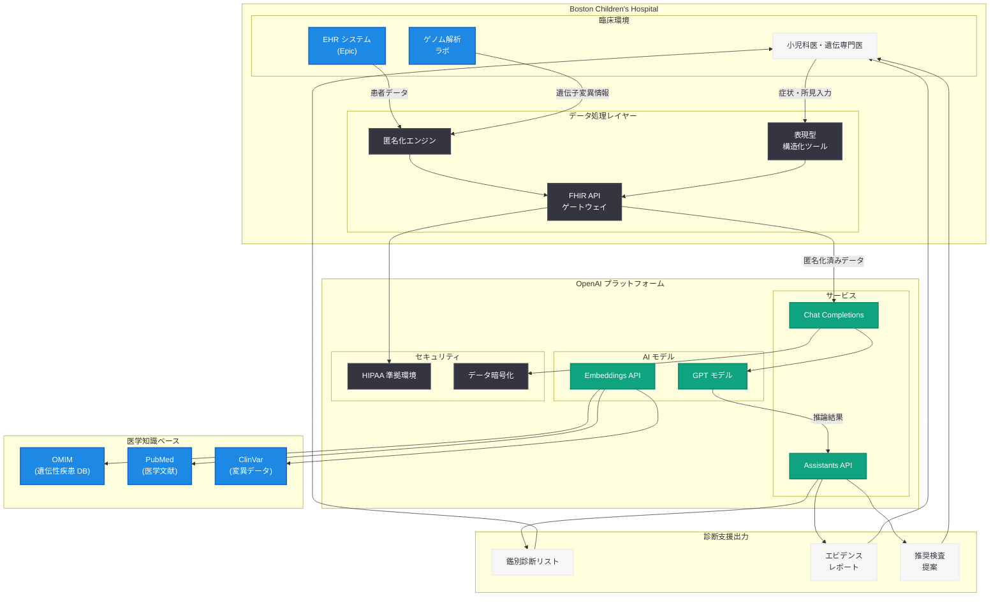

# Boston Children's Hospital が AI を活用し希少疾患の新たな診断を実現

## メタデータ

| 項目 | 内容 |
|------|------|
| 発表日 | 2026-05-29 |
| ソース | OpenAI News/Blog |
| カテゴリ | カスタマーストーリー |
| 公式リンク | [openai.com/index/boston-childrens-hospital](https://openai.com/index/boston-childrens-hospital) |

## 概要

Boston Children's Hospital は、OpenAI の技術を活用して希少疾患の診断能力を大幅に強化し、従来の手法では発見が困難だった 40 件以上の希少疾患症例を新たに診断することに成功した。この取り組みは、AI が臨床現場において診断支援ツールとして実用的な価値を発揮できることを示す画期的な事例である。

Boston Children's Hospital は、米国ボストンに位置する世界有数の小児専門病院であり、小児医療の研究と実践において国際的に高い評価を受けている。同院が OpenAI の技術を導入したことは、医療 AI が研究段階から実臨床での活用段階へ移行していることを象徴する重要な出来事であり、特に希少疾患という診断が極めて困難な領域での成果は注目に値する。

## 主な内容

### 希少疾患診断における AI の役割

希少疾患は、患者数が少ないために医療従事者の経験が限られ、診断までに平均 5 - 7 年を要するとされる。Boston Children's Hospital では、OpenAI の大規模言語モデル (LLM) を活用することで、以下のアプローチにより診断プロセスを革新した。

- **症状パターンの包括的分析:** 患者の臨床症状、検査結果、家族歴を統合的に分析し、希少疾患の可能性を網羅的に検討
- **医学文献の大規模探索:** 数十万件の医学論文やケースレポートから関連情報を瞬時に抽出
- **鑑別診断の支援:** 類似症状を示す疾患群の中から、最も可能性の高い希少疾患候補をリストアップ
- **遺伝子変異の解釈支援:** ゲノムデータと臨床症状を照合し、病因となる遺伝子変異の特定を支援

### 40 件以上の希少疾患症例を診断

Boston Children's Hospital が OpenAI の技術を導入して以降、40 件以上の希少疾患症例が新たに診断された。これらの症例の多くは、従来の診断アプローチでは発見が困難であったものである。

| 成果指標 | 内容 |
|----------|------|
| 新規診断数 | 40 件以上の希少疾患 |
| 対象 | 従来手法で未診断の患者群 |
| 診断期間短縮 | 従来の数年から数週間 - 数か月へ |
| カバー疾患領域 | 遺伝性疾患、代謝異常、神経発達障害など |

これらの診断成功により、患者は適切な治療やケアプランを早期に受けることが可能になり、患者家族の精神的負担の軽減にもつながっている。

### ChatGPT / GPT モデルの活用方法

Boston Children's Hospital では、OpenAI の技術を以下の形で臨床ワークフローに組み込んでいる。

#### 臨床推論支援

医師が患者の症状や検査結果を入力すると、GPT モデルが医学知識ベースに基づいて鑑別診断リストを生成する。特に希少疾患においては、一般的な疾患を除外した後の「診断の行き詰まり」を打破する手段として活用されている。

#### 医学文献レビューの自動化

GPT モデルは、PubMed や OMIM (Online Mendelian Inheritance in Man) などの医学データベースの情報を参照し、特定の症状の組み合わせに関連する希少疾患を特定する。従来は専門医が数日かけて行っていた文献レビューを、数分で完了できるようになった。

#### 遺伝子解析結果の解釈

全エクソーム解析や全ゲノム解析の結果について、検出された遺伝子変異の臨床的意義を GPT モデルが解釈支援する。ClinVar や HGMD (Human Gene Mutation Database) などのデータベースとの照合を通じて、VUS (Variants of Uncertain Significance: 意義不明変異) の再分類を支援する。

### 医療 AI が患者ケアに与える影響

Boston Children's Hospital の事例は、医療 AI の影響が単なる効率化にとどまらないことを示している。

- **診断の民主化:** 希少疾患の専門医がいない地域でも、AI 支援により高度な診断が可能になる
- **早期介入の実現:** 早期診断により、疾患の進行を抑制する治療を早期に開始できる
- **患者家族への支援:** 「原因不明」という状態が解消されることで、家族の不安が軽減される
- **治療研究の加速:** 正確な診断が治療法開発のための臨床試験への参加を可能にする

## 技術的な詳細

### システム統合アーキテクチャ

Boston Children's Hospital における OpenAI 技術の統合は、以下の技術要素で構成されていると考えられる。

- **基盤モデル:** OpenAI GPT モデル (Chat Completions API / Assistants API)
- **EHR 連携:** Epic システムとの FHIR ベースの統合
- **データパイプライン:** 患者データの匿名化・構造化処理
- **セキュリティ基盤:** HIPAA 準拠のデータ保護環境

### プライバシーとセキュリティへの配慮

医療 AI においては、患者データのプライバシー保護が最重要課題である。Boston Children's Hospital のシステムでは、以下のセキュリティ対策が講じられている。

| セキュリティ要件 | 実装方法 |
|------------------|----------|
| HIPAA 準拠 | BAA (Business Associate Agreement) の締結 |
| データ匿名化 | PHI (Protected Health Information) の除去・仮名化処理 |
| アクセス制御 | ロールベースアクセス制御 (RBAC) による権限管理 |
| データ暗号化 | AES-256 による保存時暗号化、TLS 1.3 による転送時暗号化 |
| 監査ログ | 全 API リクエストの記録と追跡可能性の確保 |
| データレジデンシー | 患者データの米国内保存要件の遵守 |
| モデルトレーニング除外 | 患者データが OpenAI のモデルトレーニングに使用されない保証 |

### 想定される API 活用パターン

```python
from openai import OpenAI

client = OpenAI()

# 希少疾患の鑑別診断支援の例
response = client.chat.completions.create(
    model="gpt-4o",
    messages=[
        {
            "role": "system",
            "content": (
                "You are a clinical decision support system specialized in "
                "rare diseases. Given patient symptoms, lab results, and "
                "genetic data, provide a differential diagnosis list ranked "
                "by likelihood. Cite relevant medical literature for each "
                "suggested diagnosis. Flag any critical findings that require "
                "immediate attention."
            )
        },
        {
            "role": "user",
            "content": (
                "Patient: 4-year-old male\n"
                "Presenting symptoms: progressive motor weakness, "
                "elevated CK levels (5000 U/L), calf pseudohypertrophy\n"
                "Family history: maternal uncle with similar symptoms\n"
                "Genetic testing: VUS in DMD gene (c.1234A>G)\n\n"
                "Please provide differential diagnosis and assessment "
                "of the genetic variant significance."
            )
        }
    ],
    temperature=0.1,  # 低い temperature で一貫性のある医学的分析を生成
    response_format={"type": "json_object"}
)
```

### エージェントワークフローの実装例

```python
from openai import OpenAI

client = OpenAI()


def rare_disease_diagnostic_pipeline(patient_data: dict) -> dict:
    """希少疾患診断パイプライン"""

    # Step 1: 症状の構造化と標準化
    structured_symptoms = standardize_symptoms(patient_data)

    # Step 2: 既知の一般疾患の除外
    common_exclusions = exclude_common_diseases(structured_symptoms)

    # Step 3: 希少疾患候補の生成
    rare_disease_candidates = generate_candidates(
        structured_symptoms, common_exclusions
    )

    # Step 4: 遺伝子データとの照合
    genetic_correlation = correlate_genetics(
        rare_disease_candidates, patient_data.get("genetic_data")
    )

    # Step 5: エビデンスベースのランキング
    ranked_diagnoses = rank_diagnoses(genetic_correlation)

    return ranked_diagnoses


def generate_candidates(symptoms: dict, exclusions: list) -> list:
    """GPT モデルを活用した希少疾患候補の生成"""
    response = client.chat.completions.create(
        model="gpt-4o",
        messages=[
            {
                "role": "system",
                "content": (
                    "Based on the structured symptoms and excluded common "
                    "diseases, generate a comprehensive list of rare disease "
                    "candidates. For each candidate, provide: disease name, "
                    "OMIM number, inheritance pattern, key diagnostic criteria, "
                    "and recommended confirmatory tests."
                )
            },
            {
                "role": "user",
                "content": f"Symptoms: {symptoms}\nExcluded: {exclusions}"
            }
        ],
        temperature=0.1,
        response_format={"type": "json_object"}
    )
    return response.choices[0].message.content
```

## アーキテクチャ



## 開発者への影響

Boston Children's Hospital の事例は、医療 AI アプリケーションを開発する際の重要な示唆を提供している。

- **希少疾患 AI 市場の成長:** 希少疾患は約 7,000 種類存在し、世界で約 3 億人が罹患しているとされる。AI による診断支援ツールの需要は今後さらに拡大する見込みである

- **医学知識ベースとの統合が鍵:** LLM 単体ではなく、OMIM、ClinVar、PubMed などの専門データベースとの連携が診断精度向上に不可欠である。RAG (Retrieval-Augmented Generation) パターンの医療応用が重要な技術課題となる

- **HIPAA 準拠開発のベストプラクティス:** 医療 AI 開発においては、データの匿名化、暗号化、アクセス制御、監査ログの実装が必須であり、OpenAI の Enterprise / Healthcare 向け機能を活用した開発パターンが標準化されつつある

- **表現型の標準化:** HPO (Human Phenotype Ontology) などの医学用語標準を活用した症状の構造化が、AI モデルの診断精度を大きく左右する。開発者は医学オントロジーへの理解が求められる

- **マルチモーダル AI の可能性:** 画像 (病理画像、MRI)、テキスト (臨床記録)、数値データ (検査値) を統合的に分析するマルチモーダルアプローチが次世代の医療 AI の方向性として注目される

- **説明可能性の要件:** 医療現場では AI の判断根拠が明示される必要があり、Chain-of-Thought 推論や引用機能を活用した説明可能な AI システムの構築が求められる

- **規制対応:** FDA の SaMD (Software as a Medical Device) 規制への対応や、EU の MDR (Medical Device Regulation) など、各国の医療機器規制に準拠した開発プロセスの確立が必要である

## 関連リンク

- [Boston Children's Hospital - AI for Rare Disease Diagnosis](https://openai.com/index/boston-childrens-hospital)
- [OpenAI for Healthcare](https://openai.com/healthcare)
- [OpenAI Enterprise](https://openai.com/enterprise)
- [OpenAI API ドキュメント](https://platform.openai.com/docs)
- [OMIM - Online Mendelian Inheritance in Man](https://www.omim.org/)
- [ClinVar - NCBI](https://www.ncbi.nlm.nih.gov/clinvar/)
- [Human Phenotype Ontology](https://hpo.jax.org/)

## まとめ

Boston Children's Hospital が OpenAI の技術を活用して 40 件以上の希少疾患を新たに診断したことは、医療 AI の実用的な価値を明確に示す画期的な成果である。希少疾患は診断が極めて困難であり、患者は長年にわたり「診断の旅 (diagnostic odyssey)」を続けることを余儀なくされてきた。AI による診断支援は、この課題に対する有力な解決策となりうる。

本事例の成功要因は、単に LLM を導入するだけでなく、医学知識ベースとの統合、厳格なプライバシー保護、臨床ワークフローへのシームレスな組み込みを実現した点にある。医療 AI の開発者にとっては、技術的な精度だけでなく、セキュリティ、規制対応、医療現場のニーズに即したユーザー体験設計が成功の鍵であることを示唆している。

今後、同様のアプローチが他の小児病院や専門医療機関にも展開されることで、世界中の希少疾患患者が適切な診断と治療を早期に受けられる未来が期待される。
