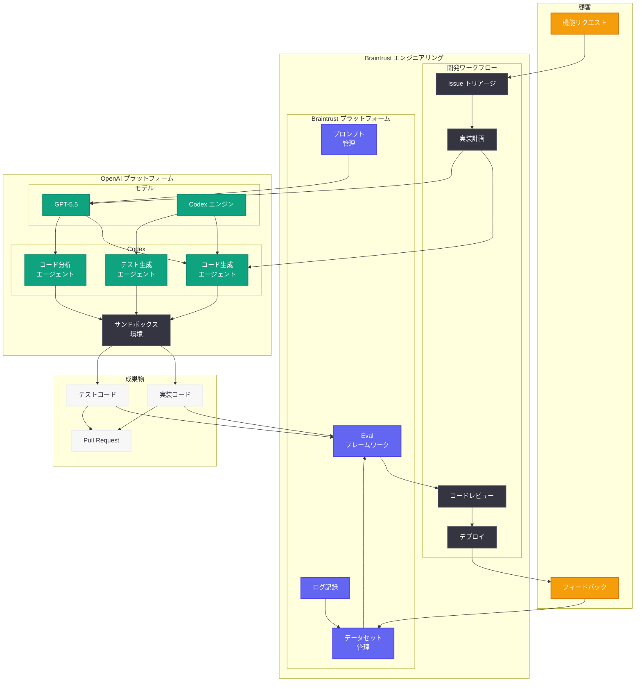

# Braintrust が Codex で顧客リクエストをコードに変換する方法

## メタデータ

| 項目 | 内容 |
|------|------|
| 発表日 | 2026-05-29 |
| ソース | OpenAI News/Blog |
| カテゴリ | カスタマーストーリー |
| 公式リンク | [openai.com/index/braintrust](https://openai.com/index/braintrust) |

> **注:** 本レポートは OpenAI ブログの公開情報に基づいて作成しています。記事本文へのアクセスは Cloudflare の保護により制限されたため、タイトル、URL、および公開情報から内容を構成しています。正確な詳細については公式記事を参照してください。

## 概要

OpenAI は 2026 年 5 月 29 日、AI 評価・オブザーバビリティプラットフォームを提供する Braintrust が Codex と GPT-5.5 を活用して、顧客からの機能リクエストを迅速にコードへ変換するワークフローを構築した事例を公開した。

Braintrust は、LLM アプリケーションの評価 (Evaluation)、プロンプト管理、ログ記録、データセット管理を提供するプラットフォームであり、開発者が AI アプリケーションの品質を継続的に改善するためのツールを提供している。同社のエンジニアリングチームは、Codex のエージェンティックなコード生成能力と GPT-5.5 の高度な推論能力を組み合わせることで、顧客の要望を素早く実装に反映させ、実験サイクルを大幅に加速している。

## 主な内容

### 顧客リクエストからコードへの変換ワークフロー

Braintrust のエンジニアリングチームは、顧客からの機能リクエストを受け取った際に、Codex を活用して以下のワークフローでコードに変換している。

| ステップ | 内容 | 担当 |
|----------|------|------|
| 1. リクエスト受領 | 顧客からの機能要望を自然言語で受け取る | カスタマーサクセス |
| 2. 要件分析 | リクエストを技術的な要件に分解 | Codex + エンジニア |
| 3. 実装計画 | コードベースの該当箇所を特定し、実装方針を策定 | Codex |
| 4. コード生成 | 要件に基づいたコードの自動生成 | Codex + GPT-5.5 |
| 5. テスト・検証 | 生成されたコードの品質を評価プラットフォームで検証 | Braintrust Eval |
| 6. レビュー・デプロイ | エンジニアによるレビューと本番デプロイ | エンジニア |

このワークフローにより、従来は数日を要していた機能実装が数時間レベルに短縮され、顧客への迅速なフィードバックループが確立されている。

### GPT-5.5 による実験の加速

Braintrust のエンジニアは GPT-5.5 を活用して、以下の分野で実験を加速している。

- **プロンプトエンジニアリングの最適化:** GPT-5.5 の高度な推論能力を活用し、評価プラットフォームのプロンプトテンプレートを迅速にイテレーション
- **新機能のプロトタイピング:** 複雑なアルゴリズムやデータ処理パイプラインの初期実装を GPT-5.5 で高速に生成
- **コードの品質向上:** 既存コードのリファクタリング案を GPT-5.5 に提案させ、最適な実装パターンを探索
- **ドキュメント生成:** API ドキュメントや内部技術文書の自動生成と更新

GPT-5.5 は従来のモデルと比較して、コードの文脈理解力とマルチファイルにまたがる変更の一貫性が大幅に向上しており、Braintrust のような複雑なプラットフォーム開発に特に適している。

### AI 評価プラットフォームとしてのドッグフーディング

Braintrust の独自性は、自社が AI 評価プラットフォームを提供しているという点にある。Codex で生成されたコードの品質を、自社の評価ツールで検証する「ドッグフーディング」アプローチを採用している。

| 評価項目 | 手法 | 目標 |
|----------|------|------|
| コード品質 | 静的解析 + AI レビュー | バグの早期検出 |
| 機能正確性 | 自動テスト + Eval スコアリング | 顧客要件との一致度 |
| パフォーマンス | ベンチマーク実行 | レスポンスタイム基準達成 |
| セキュリティ | セキュリティスキャン | 脆弱性ゼロ |
| 回帰テスト | 既存テストスイート実行 | 全テスト通過 |

### エンジニアリングワークフローへの統合

Braintrust のエンジニアリングチームは、日常的な開発作業において以下の形で Codex を統合している。

1. **Issue トリアージ:** 顧客リクエストが Issue として登録されると、Codex が自動的に技術的な分析を実施
2. **実装提案:** Codex がコードベースを分析し、最適な実装方法を提案
3. **コード生成:** 承認された提案に基づいてコードを自動生成
4. **自動評価:** 生成されたコードを Braintrust の評価パイプラインで自動検証
5. **Pull Request 作成:** 品質基準をクリアしたコードを自動的に PR として提出

## 技術的な詳細

### Braintrust 評価プラットフォームと Codex の統合

Braintrust は Codex で生成されたコードの品質を、自社の Eval フレームワークを使用して継続的に評価している。以下は、顧客リクエストから生成されたコードを評価するパイプラインの例である。

### コードサンプル

```python
import braintrust
from openai import OpenAI

client = OpenAI()

# Braintrust の評価プロジェクトを初期化
project = braintrust.init(project="codex-generated-features")


def generate_feature_code(customer_request: str, codebase_context: str) -> str:
    """
    顧客リクエストに基づいて Codex でコードを生成する。
    GPT-5.5 を活用した実装提案を含む。
    """
    # Step 1: GPT-5.5 で要件を分析し、実装計画を策定
    planning_response = client.chat.completions.create(
        model="gpt-5.5",
        messages=[
            {
                "role": "system",
                "content": (
                    "あなたは AI 評価プラットフォームの"
                    "シニアエンジニアです。"
                    "顧客リクエストを技術的な実装計画に変換してください。"
                ),
            },
            {
                "role": "user",
                "content": f"""
                顧客リクエスト: {customer_request}

                コードベースの関連箇所:
                {codebase_context}

                以下を出力してください:
                1. 変更が必要なファイルの一覧
                2. 各ファイルの変更内容
                3. 新規作成が必要なファイル
                4. テストケースの概要
                """,
            },
        ],
    )

    implementation_plan = planning_response.choices[0].message.content

    # Step 2: Codex でコードを生成
    codex_response = client.responses.create(
        model="codex-1",
        input=f"""
        以下の実装計画に基づいてコードを生成してください:

        {implementation_plan}

        要件:
        - 既存のコードスタイルに準拠すること
        - 型アノテーションを含めること
        - エラーハンドリングを適切に実装すること
        - ユニットテストも生成すること
        """,
        tools=[
            {"type": "code_interpreter"},
            {"type": "file_search"},
        ],
    )

    return codex_response.output_text


def evaluate_generated_code(
    customer_request: str, generated_code: str, expected_behavior: str
) -> dict:
    """
    Braintrust Eval を使用して生成されたコードの品質を評価する。
    """

    @braintrust.traced
    def code_quality_scorer(output: str) -> float:
        """コード品質をスコアリングする。"""
        response = client.chat.completions.create(
            model="gpt-5.5",
            messages=[
                {
                    "role": "system",
                    "content": (
                        "コードの品質を 0.0 から 1.0 のスコアで評価してください。"
                        "評価基準: 可読性、保守性、エラーハンドリング、"
                        "テストカバレッジ、パフォーマンス"
                    ),
                },
                {
                    "role": "user",
                    "content": f"以下のコードを評価してください:\n\n{output}",
                },
            ],
        )
        score_text = response.choices[0].message.content
        try:
            return float(score_text.strip())
        except ValueError:
            return 0.5

    @braintrust.traced
    def requirement_match_scorer(
        output: str, expected: str
    ) -> float:
        """顧客要件との一致度を評価する。"""
        response = client.chat.completions.create(
            model="gpt-5.5",
            messages=[
                {
                    "role": "system",
                    "content": (
                        "生成されたコードが顧客要件を満たしているか "
                        "0.0 から 1.0 で評価してください。"
                    ),
                },
                {
                    "role": "user",
                    "content": (
                        f"顧客要件: {expected}\n\n"
                        f"生成されたコード:\n{output}"
                    ),
                },
            ],
        )
        score_text = response.choices[0].message.content
        try:
            return float(score_text.strip())
        except ValueError:
            return 0.5

    # Braintrust で評価を実行
    eval_result = braintrust.Eval(
        project="codex-generated-features",
        data=[
            {
                "input": customer_request,
                "expected": expected_behavior,
            }
        ],
        task=lambda input: generate_feature_code(input, ""),
        scores=[code_quality_scorer, requirement_match_scorer],
    )

    return {
        "quality_score": eval_result.summary().metrics["code_quality_scorer"],
        "requirement_match": eval_result.summary().metrics[
            "requirement_match_scorer"
        ],
        "passed": all(
            score > 0.8
            for score in eval_result.summary().metrics.values()
        ),
    }


# 実行例: 顧客リクエストをコードに変換して評価
if __name__ == "__main__":
    customer_request = (
        "評価結果をCSVでエクスポートする機能を追加してほしい"
    )
    expected_behavior = (
        "Eval の結果を CSV 形式でダウンロードできる "
        "API エンドポイントとUI ボタンが追加される"
    )

    # コード生成
    generated_code = generate_feature_code(
        customer_request=customer_request,
        codebase_context="# exports/ ディレクトリに既存のエクスポート機能あり",
    )

    # 評価実行
    result = evaluate_generated_code(
        customer_request=customer_request,
        generated_code=generated_code,
        expected_behavior=expected_behavior,
    )

    print(f"品質スコア: {result['quality_score']:.2f}")
    print(f"要件一致度: {result['requirement_match']:.2f}")
    print(f"合否判定: {'合格' if result['passed'] else '不合格'}")
```

### Codex タスク管理と並列実行

```python
from openai import OpenAI

client = OpenAI()


def batch_feature_implementation(feature_requests: list[dict]) -> list[dict]:
    """
    複数の顧客リクエストを並列に Codex で処理する。
    Braintrust のバッチ評価と組み合わせて使用。
    """
    results = []

    for request in feature_requests:
        # Codex タスクを作成
        response = client.responses.create(
            model="codex-1",
            input=f"""
            以下の顧客リクエストを実装してください:

            リクエスト: {request['description']}
            優先度: {request['priority']}
            関連コンポーネント: {request['component']}

            実装要件:
            - TypeScript / Python で実装
            - 既存の API パターンに準拠
            - テストコードを含める
            - エラーハンドリングを実装
            """,
            tools=[
                {"type": "code_interpreter"},
                {"type": "file_search"},
            ],
        )

        results.append(
            {
                "request_id": request["id"],
                "implementation": response.output_text,
                "status": "completed",
            }
        )

    return results


# 顧客リクエストのバッチ処理例
feature_requests = [
    {
        "id": "FR-001",
        "description": "評価スコアのトレンドグラフを追加",
        "priority": "high",
        "component": "dashboard",
    },
    {
        "id": "FR-002",
        "description": "Webhook 通知で評価失敗を通知",
        "priority": "medium",
        "component": "notifications",
    },
    {
        "id": "FR-003",
        "description": "データセットのバージョニング機能",
        "priority": "high",
        "component": "datasets",
    },
]
```

### CI/CD パイプラインでの Codex 統合

```yaml
# Braintrust における Codex 統合 CI/CD パイプラインの例
name: codex-feature-implementation
on:
  issues:
    types: [opened, labeled]

jobs:
  analyze-and-implement:
    if: contains(github.event.issue.labels.*.name, 'customer-request')
    runs-on: ubuntu-latest
    steps:
      - name: Checkout
        uses: actions/checkout@v4

      - name: Analyze Customer Request with GPT-5.5
        env:
          OPENAI_API_KEY: ${{ secrets.OPENAI_API_KEY }}
        run: |
          python scripts/analyze_request.py \
            --issue-id ${{ github.event.issue.number }} \
            --model gpt-5.5

      - name: Generate Implementation with Codex
        env:
          OPENAI_API_KEY: ${{ secrets.OPENAI_API_KEY }}
        run: |
          python scripts/codex_implement.py \
            --issue-id ${{ github.event.issue.number }} \
            --run-tests

      - name: Evaluate with Braintrust
        env:
          BRAINTRUST_API_KEY: ${{ secrets.BRAINTRUST_API_KEY }}
        run: |
          python scripts/run_eval.py \
            --project codex-generated-features \
            --threshold 0.8

      - name: Create Pull Request
        if: success()
        uses: peter-evans/create-pull-request@v5
        with:
          title: "feat: Implement customer request #${{ github.event.issue.number }}"
          body: |
            Automated implementation generated by Codex + GPT-5.5.
            Related issue: #${{ github.event.issue.number }}
            Braintrust Eval: Passed (score > 0.8)
```

## アーキテクチャ



## 開発者への影響

- **顧客フィードバックの即座な実装:** Codex と GPT-5.5 の組み合わせにより、顧客リクエストからコード実装までのリードタイムが大幅に短縮される。これにより、プロダクトチームは顧客の声を素早くプロダクトに反映できるようになる

- **AI 評価プラットフォームとの深い統合:** Braintrust の事例は、Codex で生成されたコードの品質を AI 評価ツールで自動検証するパターンを示している。他の開発チームも同様のアプローチで AI 生成コードの品質保証を自動化できる

- **GPT-5.5 による実験速度の向上:** GPT-5.5 の高度な推論能力により、複雑な設計判断やアーキテクチャの検討を高速に行うことが可能になる。特に AI アプリケーション開発においては、プロンプトの最適化やモデル選定の実験サイクルが加速する

- **ドッグフーディングによる品質保証のモデルケース:** AI プロダクトを開発する企業が、自社ツールを使って AI 生成コードの品質を検証するアプローチは、他の AI ツール企業にとっても参考となるベストプラクティスである

- **バッチ処理による並列開発の実現:** 複数の顧客リクエストを Codex で並列に処理するパターンは、少人数のエンジニアリングチームが多くの顧客ニーズに応えるためのスケーラブルなアプローチを提供する

- **エンジニアの役割の変化:** エンジニアはコードを一から書く作業からシフトし、Codex が生成したコードのレビュー、アーキテクチャ設計、顧客要件の精緻化に集中できるようになる

## 関連リンク

- [How Braintrust turns customer requests into code with Codex (公式)](https://openai.com/index/braintrust)
- [Braintrust - AI Evaluation Platform](https://www.braintrust.dev/)
- [OpenAI Codex](https://openai.com/codex)
- [GPT-5.5 モデル情報](https://platform.openai.com/docs/models)
- [OpenAI Platform Documentation](https://platform.openai.com/docs)
- [Braintrust SDK (GitHub)](https://github.com/braintrustdata/braintrust-sdk)
- [Building Self-Improving Tax Agents with Codex](https://openai.com/index/building-self-improving-tax-agents-with-codex/)
- [Cisco and OpenAI redefine enterprise engineering with Codex](https://openai.com/index/cisco)

## まとめ

Braintrust の事例は、AI 評価プラットフォーム企業が自社開発プロセスにおいて Codex と GPT-5.5 を深く統合し、顧客リクエストからコード実装までのワークフローを劇的に効率化した成功例である。

特筆すべきは 3 つのポイントである。第一に、Codex のエージェンティックなコード生成により、顧客の自然言語でのリクエストが直接的に実装コードへ変換される点。第二に、GPT-5.5 の高度な推論能力を活用して実験サイクルを加速し、プロダクトの進化速度を向上させている点。第三に、自社の AI 評価プラットフォームを使ったドッグフーディングにより、AI 生成コードの品質を体系的に保証している点である。

この事例は、特に AI ツールを開発する企業や、顧客フィードバックを素早くプロダクトに反映させたい開発チームにとって、Codex 活用の優れたリファレンスとなる。エンジニアリングチームの生産性を最大化しながら、コード品質を維持するためのバランスの取れたアプローチが示されている。
