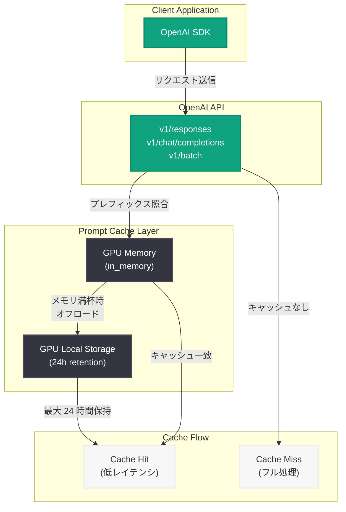

# プロンプトキャッシュ保持期間のデフォルト値が 24 時間に変更

## メタデータ

| 項目 | 内容 |
|------|------|
| 発表日 | 2026-05-29 |
| ソース | OpenAI API Changelog |
| カテゴリ | API 更新 |
| 公式リンク | https://developers.openai.com/api/docs/changelog |

## 概要

OpenAI は `prompt_cache_retention` パラメータのデフォルト値を `in_memory` から `24h` に変更した。この変更により、ZDR (Zero Data Retention) を有効にしていない組織では、明示的なパラメータ設定なしでキャッシュされたプロンプトプレフィックスが最大 24 時間保持されるようになる。

これは 2025 年 11 月に導入された拡張プロンプトキャッシュ機能の延長であり、メモリが満杯になった際に key/value テンソルを GPU ローカルストレージにオフロードする仕組みを活用している。開発者はパラメータを明示的に設定せずとも、繰り返し利用するプロンプトプレフィックスのコスト削減とレイテンシ短縮の恩恵を自動的に受けられる。

## 主な内容

### デフォルト値の変更

| 項目 | 変更前 | 変更後 |
|------|--------|--------|
| `prompt_cache_retention` デフォルト値 | `in_memory` | `24h` |
| キャッシュ保持の特性 | 揮発性 (メモリ上のみ) | 最大 24 時間持続 |
| 明示的設定の要否 | `24h` を使うには明示的に設定が必要 | 設定不要で自動適用 |

### 影響を受ける API エンドポイント

以下の 3 つのエンドポイントが今回の変更の対象となる.

- `v1/responses`: Responses API
- `v1/chat/completions`: Chat Completions API
- `v1/batch`: Batch API

### ZDR 組織への影響

ZDR (Zero Data Retention) を有効にしている組織はこの変更の影響を受けない。ZDR 組織では引き続きデータがリクエスト処理後に即座に削除される。

## 技術的な詳細

### キャッシュ保持メカニズム

2025 年 11 月に導入された拡張プロンプトキャッシュは、以下の仕組みで動作する.

1. **インメモリキャッシュ**: リクエスト処理時にプロンプトプレフィックスの key/value テンソルを GPU メモリにキャッシュ
2. **GPU ローカルストレージへのオフロード**: メモリが満杯になると、テンソルを GPU ローカルストレージに退避
3. **24 時間保持**: オフロードされたキャッシュは最大 24 時間アクティブな状態を維持

従来の `in_memory` デフォルトでは、GPU メモリからの退避が発生するとキャッシュが失われていたが、`24h` デフォルトにより自動的にストレージへのオフロードが有効になる。

### コードサンプル

```python
from openai import OpenAI

client = OpenAI()

# 新しいデフォルト (24h) - 明示的な指定は不要
# prompt_cache_retention パラメータを省略しても 24h が適用される
response = client.chat.completions.create(
    model="gpt-4o",
    messages=[
        {
            "role": "system",
            "content": "あなたは金融アナリストです。常に最新の市場データに基づいて回答してください。"
        },
        {
            "role": "user",
            "content": "本日の市場動向を教えてください。"
        }
    ]
)
print(response.choices[0].message.content)

# 明示的にキャッシュ保持期間を指定する場合
response_explicit = client.chat.completions.create(
    model="gpt-4o",
    messages=[
        {
            "role": "system",
            "content": "あなたは金融アナリストです。常に最新の市場データに基づいて回答してください。"
        },
        {
            "role": "user",
            "content": "ポートフォリオの最適化提案をお願いします。"
        }
    ],
    prompt_cache_retention="24h"  # 明示的に指定 (新デフォルトと同じ)
)
print(response_explicit.choices[0].message.content)

# ZDR 組織の場合や、キャッシュを無効にしたい場合
response_no_cache = client.chat.completions.create(
    model="gpt-4o",
    messages=[
        {
            "role": "user",
            "content": "機密情報を含むリクエスト"
        }
    ],
    prompt_cache_retention="in_memory"  # 従来の揮発性キャッシュに戻す
)
print(response_no_cache.choices[0].message.content)
```

## アーキテクチャ



## 開発者への影響

- **コスト削減**: キャッシュヒット率の向上により、繰り返し使用するシステムプロンプトやプレフィックスの処理コストが自動的に削減される
- **レイテンシ改善**: キャッシュされたプレフィックスの再計算が不要となり、レスポンス時間が短縮される
- **コード変更不要**: 既存のコードを変更せずにキャッシュの恩恵を受けられる (非 ZDR 組織)
- **セキュリティ考慮**: データ保持ポリシーに厳格な要件がある場合は、明示的に `in_memory` を指定する必要がある
- **Batch API への恩恵**: 大量のバッチリクエストで共通プレフィックスを使用する場合、特にコスト効果が高い

## 関連リンク

- [OpenAI API Changelog](https://developers.openai.com/api/docs/changelog)
- [OpenAI Prompt Caching ドキュメント](https://platform.openai.com/docs/guides/prompt-caching)
- [OpenAI API リファレンス - Chat Completions](https://platform.openai.com/docs/api-reference/chat)
- [OpenAI API リファレンス - Batch](https://platform.openai.com/docs/api-reference/batch)

## まとめ

今回の変更は、2025 年 11 月に導入された拡張プロンプトキャッシュ機能のデフォルト有効化という位置づけである。`prompt_cache_retention` のデフォルト値が `in_memory` から `24h` に変更されたことで、非 ZDR 組織の開発者は追加の設定なしにキャッシュの長期保持による恩恵を自動的に受けられるようになった。特に、同じシステムプロンプトを繰り返し使用するアプリケーションでは、コスト削減とレイテンシ改善の効果が顕著に現れると期待される。
