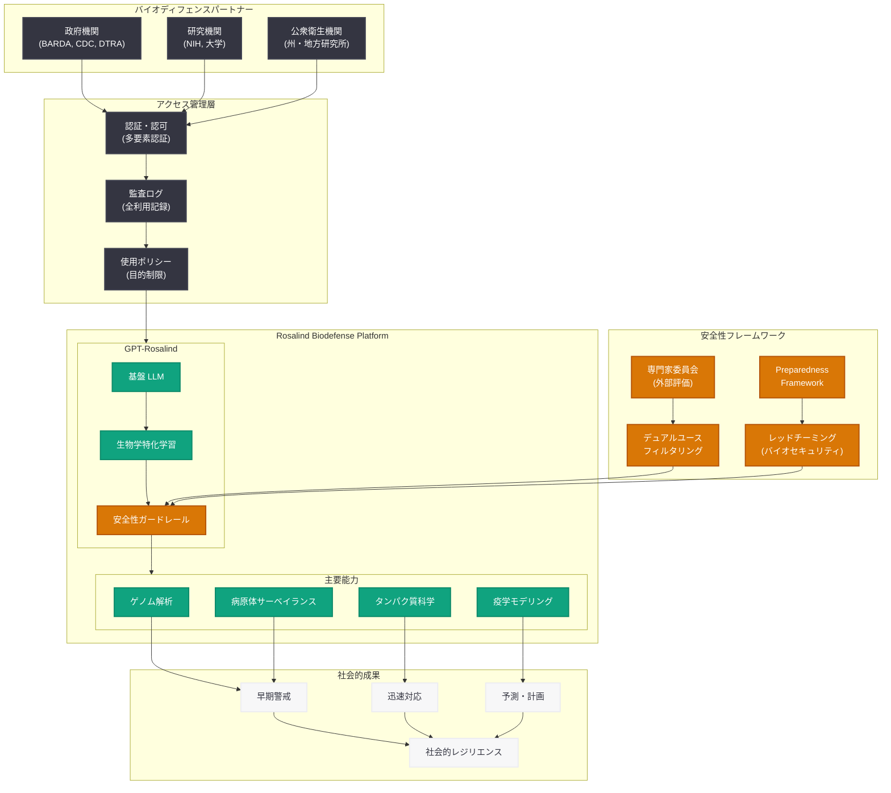

# OpenAI、Rosalind Biodefense を発表 — GPT-Rosalind によるバイオディフェンスとパンデミック対策の強化

## メタデータ

| 項目 | 内容 |
|------|------|
| 発表日 | 2026-05-29 |
| ソース | OpenAI Research / News |
| カテゴリ | 安全性・セキュリティ |
| 公式リンク | [openai.com/index/strengthening-societal-resilience-with-rosalind-biodefense](https://openai.com/index/strengthening-societal-resilience-with-rosalind-biodefense) |

## 概要

OpenAI は 2026 年 5 月 29 日、「Rosalind Biodefense」プログラムを正式に発表した。本プログラムは、OpenAI が開発した生物学・ライフサイエンス特化型モデル「GPT-Rosalind」へのアクセスを、バイオディフェンス (生物防衛) およびパンデミック対策に取り組むパートナー機関に拡大する取り組みである。

GPT-Rosalind は、DNA/RNA 解析、タンパク質構造予測、疫学モデリング、病原体ゲノミクスなどの生物学的タスクに特化して訓練された専門モデルであり、Rosalind Biodefense プログラムを通じて、政府機関、研究機関、公衆衛生機関がこのモデルの能力を活用し、社会のレジリエンス (回復力) を強化することを目指す。本プログラムの名称は、DNA 構造の解明に貢献した結晶学者 Rosalind Franklin に敬意を表して命名されている。

## 主な内容

### Rosalind Biodefense プログラムとは

Rosalind Biodefense は、OpenAI の社会的レジリエンス強化イニシアティブの一環として設立されたプログラムである。以下の目的を持つ。

- **早期警戒能力の強化:** 新興感染症や生物学的脅威の早期検出を AI で支援
- **パンデミック対策の加速:** ワクチン開発、治療薬候補の同定、疫学的予測の高速化
- **バイオセキュリティの向上:** 意図的な生物学的脅威 (バイオテロリズム) に対する防御能力の強化
- **グローバルヘルスセキュリティ:** 国際的な公衆衛生危機への対応能力の構築

プログラムは招待制で運営され、審査を通過した適格なパートナー機関にのみ GPT-Rosalind へのアクセスが付与される。

### GPT-Rosalind: 生物学・ライフサイエンス特化型モデル

GPT-Rosalind は、OpenAI の基盤モデル技術をベースに、生物学およびライフサイエンス分野のデータで追加学習を行った専門モデルである。

**主要な能力:**

| 能力領域 | 説明 |
|---------|------|
| ゲノム解析 | DNA/RNA 配列の解析、変異検出、系統発生学的分類 |
| タンパク質科学 | タンパク質構造予測、機能アノテーション、相互作用解析 |
| 疫学モデリング | 感染症の拡散予測、介入効果シミュレーション |
| 病原体サーベイランス | 新興病原体の検出、抗菌薬耐性遺伝子の同定 |
| 創薬支援 | 薬剤標的の同定、候補化合物のスクリーニング支援 |
| 文献解析 | 生物医学文献の大規模解析、知見の統合 |

**モデルの特徴:**

- 生物学的データ (ゲノム配列、タンパク質構造データ、臨床試験データ) での事後学習
- PubMed、GenBank、UniProt、PDB などの権威あるデータベースからの知識統合
- マルチモーダル入力対応 (配列データ、構造データ、テキスト)
- 生物学的コンテキストを理解した推論能力

### バイオディフェンスパートナー

Rosalind Biodefense プログラムのパートナーとして、以下のカテゴリの機関が参加している (あるいは参加が想定される)。

**政府機関:**
- 米国保健福祉省 (HHS) / 生物医学先端研究開発局 (BARDA)
- 米国疾病予防管理センター (CDC)
- 米国国防総省 (DoD) / 国防脅威削減局 (DTRA)
- 国際的な公衆衛生機関

**研究機関:**
- 主要大学のバイオセキュリティ研究センター
- 国立衛生研究所 (NIH) / 国立アレルギー感染症研究所 (NIAID)
- ゲノミクス・疫学研究コンソーシアム

**公衆衛生機関:**
- 州・地方レベルの公衆衛生研究所
- グローバルヘルスセキュリティアジェンダ (GHSA) 参加国の機関
- 世界保健機関 (WHO) との連携パートナー

### パンデミック対策のユースケース

GPT-Rosalind がパンデミック対策において提供する具体的なユースケースは以下の通りである。

**1. 早期検出と警戒:**
- ゲノムサーベイランスデータのリアルタイム解析
- 異常な病原体変異パターンの自動検出
- 人獣共通感染症のスピルオーバーリスク評価
- 下水疫学 (Wastewater epidemiology) データの解析支援

**2. 迅速な対応:**
- 新規病原体のゲノム特性解析の高速化
- ワクチン候補抗原の迅速同定
- 治療薬候補のインシリコスクリーニング
- 診断検査法の設計支援

**3. 予測と計画:**
- 感染拡大シミュレーションの実行
- 医療資源需要の予測
- 非薬物的介入 (NPI) の効果予測
- サプライチェーンの脆弱性分析

**4. ナレッジマネジメント:**
- 膨大な研究文献からのインサイト抽出
- 研究者間のナレッジギャップの特定
- 過去のパンデミック対応からの教訓の構造化

### デュアルユース研究に対する安全性ガードレール

生物学 AI モデルにとって最も重要な課題の一つが、デュアルユース (軍民両用) 研究への悪用防止である。OpenAI は GPT-Rosalind に対して、多層的な安全性ガードレールを実装している。

**モデルレベルのガードレール:**

| ガードレール | 説明 |
|------------|------|
| 危険知識のフィルタリング | 生物兵器の合成手順、機能獲得研究の詳細な手法など、危険な知識へのアクセスを制限 |
| コンテキスト認識型制御 | クエリの意図を推定し、悪意のある使用パターンを検出 |
| 出力監視 | 生成された応答が危険な情報を含まないかリアルタイムで検証 |
| 段階的アクセス制御 | ユーザーの資格・用途に応じたアクセスレベルの設定 |

**システムレベルのガードレール:**

- **アクセス管理:** 厳格な認証・認可プロセス、多要素認証の必須化
- **監査ログ:** 全ての利用を記録し、異常な使用パターンを検出
- **使用目的の制限:** 承認された研究目的以外での使用を禁止
- **定期的レビュー:** パートナーの使用状況を定期的に審査
- **専門家委員会:** バイオセキュリティの専門家による継続的な評価

**Preparedness Framework との連携:**

OpenAI の Preparedness Framework における CBRN (化学・生物・放射線・核) カテゴリのリスク評価が、GPT-Rosalind の安全性設計に直接反映されている。具体的には以下の対策が講じられている。

- 生物兵器関連の機能獲得情報の生成を防止するアライメント調整
- レッドチーミングによるバイオセキュリティ脆弱性の継続的評価
- 外部バイオセキュリティ専門家による独立したリスク評価
- インシデント発生時の即座のアクセス停止メカニズム

## 技術的な詳細

### GPT-Rosalind のアーキテクチャ概要

GPT-Rosalind は、OpenAI の大規模言語モデル技術を基盤としつつ、生物学的データの理解と推論に特化した拡張を施したモデルである。

**学習データ:**
- 査読済み生物医学文献 (PubMed / PMC)
- ゲノム配列データベース (GenBank、EMBL、DDBJ)
- タンパク質データベース (UniProt、PDB、AlphaFold DB)
- 疫学データ (WHO、CDC、ECDC 公開データ)
- 臨床試験データ (ClinicalTrials.gov)

**技術的な特徴:**
- バイオインフォマティクスツール出力の解釈能力
- FASTA、FASTQ、VCF 等の標準的な生物学データ形式への対応
- 系統樹解析、多重配列アライメント結果の解釈
- 構造生物学データ (PDB 形式) の理解

### コードサンプル

GPT-Rosalind API の利用例 (パートナー向けアクセスが前提):

```python
from openai import OpenAI

client = OpenAI()

# ゲノム配列の変異解析リクエスト
response = client.chat.completions.create(
    model="gpt-rosalind",
    messages=[
        {
            "role": "system",
            "content": (
                "You are a genomics analysis assistant specialized in "
                "pathogen surveillance. Analyze mutations and assess "
                "their potential impact on transmissibility and immune evasion."
            )
        },
        {
            "role": "user",
            "content": (
                "Analyze the following spike protein mutations detected "
                "in a novel SARS-CoV-2 variant: K417N, E484A, N501Y, "
                "P681H. Assess potential impact on ACE2 binding affinity "
                "and antibody escape."
            )
        }
    ],
    temperature=0.2,
    max_tokens=2000
)

print(response.choices[0].message.content)
```

```python
# 疫学モデリング支援の例
response = client.chat.completions.create(
    model="gpt-rosalind",
    messages=[
        {
            "role": "system",
            "content": (
                "You are an epidemiological modeling assistant. "
                "Help design and interpret compartmental models "
                "for infectious disease spread."
            )
        },
        {
            "role": "user",
            "content": (
                "Given the following parameters for a novel respiratory "
                "pathogen: R0=3.2, serial interval=5.1 days, "
                "IFR=0.8%, incubation period=4.2 days. "
                "Suggest an appropriate compartmental model structure "
                "and estimate the expected doubling time."
            )
        }
    ],
    temperature=0.1,
    max_tokens=3000
)
```

```python
# バイオサーベイランスアラートの自動分析
response = client.chat.completions.create(
    model="gpt-rosalind",
    messages=[
        {
            "role": "system",
            "content": (
                "You are a biosurveillance analyst. Evaluate genomic "
                "surveillance alerts and provide risk assessments "
                "for emerging biological threats."
            )
        },
        {
            "role": "user",
            "content": (
                "A wastewater surveillance system has detected an "
                "unusual concentration of H5N1 influenza RNA fragments "
                "in three metropolitan areas over the past 14 days. "
                "No corresponding increase in clinical cases has been "
                "reported. Provide a risk assessment and recommended "
                "next steps for public health response."
            )
        }
    ],
    temperature=0.2,
    max_tokens=2500
)
```

### API アクセスモデル

GPT-Rosalind へのアクセスは、標準の OpenAI API とは異なる管理モデルを採用している。

| 項目 | 内容 |
|------|------|
| アクセス方式 | 招待制、Rosalind Biodefense プログラムへの参加が必須 |
| 認証 | 専用 API キー + 機関認証 + 多要素認証 |
| モデル名 | `gpt-rosalind` (推定) |
| レート制限 | パートナーの契約レベルに応じた専用割り当て |
| データ保持 | パートナーデータは学習に使用しない (Zero Data Retention オプション) |
| 利用規約 | 標準利用規約に加え、バイオセキュリティ固有の追加条項 |

## アーキテクチャ



## 開発者への影響

- **新しい専門モデルカテゴリの登場:** GPT-Rosalind は、OpenAI が汎用モデル (GPT-4o、GPT-5) に加えて、特定ドメインに特化した専門モデルを開発・提供する戦略を示す。今後、他の科学分野 (材料科学、気候科学等) でも同様の専門モデルが登場する可能性がある

- **限定的アクセスモデルの前例:** Rosalind Biodefense の招待制アクセスモデルは、高リスクな能力を持つ AI モデルの配布方法として新たな前例を作る。デュアルユースリスクが高い分野では、オープンアクセスではなく、審査済みパートナーへの段階的アクセス提供が標準になる可能性がある

- **バイオインフォマティクスワークフローへの統合:** バイオインフォマティクス分野の開発者にとって、GPT-Rosalind は既存のパイプライン (NextFlow、Snakemake 等) に AI 支援を統合する新たな選択肢を提供する。ゲノム解析結果の解釈、異常検出、レポート生成の自動化が可能になる

- **安全性ガードレールの設計パターン:** GPT-Rosalind に実装された多層的安全性ガードレールは、他の高リスクドメイン (サイバーセキュリティ、化学合成等) で AI アプリケーションを構築する開発者にとって参考となる設計パターンを提供する

- **API 互換性:** GPT-Rosalind は標準の Chat Completions API と互換性のあるインターフェースを提供すると推察され、既存の OpenAI SDK を活用した開発が可能である。ただし、アクセス資格の取得とバイオセキュリティ固有の利用規約への同意が必要となる

## 関連リンク

- [Rosalind Biodefense (公式)](https://openai.com/index/strengthening-societal-resilience-with-rosalind-biodefense)
- [OpenAI Safety](https://openai.com/safety)
- [OpenAI Preparedness Framework](https://openai.com/safety/preparedness)
- [OpenAI Research](https://openai.com/research)
- [OpenAI Usage Policies](https://openai.com/policies/usage-policies)
- [CDC - Biosurveillance](https://www.cdc.gov/biosurveillance/)
- [BARDA - Biomedical Advanced Research](https://www.medicalcountermeasures.gov/)
- [Global Health Security Agenda](https://ghsagenda.org/)

## まとめ

OpenAI の Rosalind Biodefense プログラムは、AI 技術をバイオディフェンスとパンデミック対策に活用する画期的な取り組みである。GPT-Rosalind モデルは、ゲノム解析、疫学モデリング、タンパク質科学、病原体サーベイランスといった生物学的タスクに特化した能力を持ち、社会のレジリエンス強化に直接貢献する。

特筆すべきは、デュアルユース研究のリスクに対する多層的な安全性ガードレールの実装である。招待制のアクセスモデル、厳格な認証・監査体制、専門家委員会による継続的評価、Preparedness Framework に基づくリスク管理により、モデルの悪用リスクを最小化しつつ、正当な防衛・研究目的での活用を促進する。

本プログラムは、高リスクな AI 能力の社会実装における新たなモデルケースとして、AI ガバナンスの議論においても重要な位置づけとなる。バイオセキュリティ分野の研究者・開発者にとっては、AI 支援によるパンデミック対策の新時代の幕開けを意味し、今後のプログラム拡大と成果に注目が集まる。
