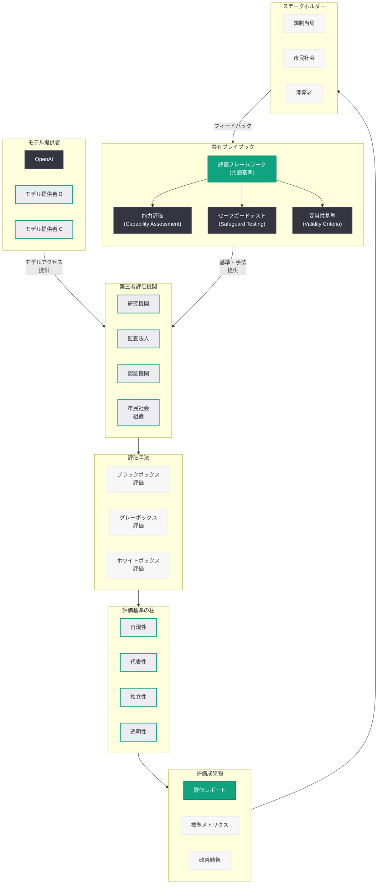

# 信頼性の高い第三者評価のための共有プレイブック: AI モデル評価の標準フレームワーク

## メタデータ

| 項目 | 内容 |
|------|------|
| 発表日 | 2026-05-29 |
| ソース | OpenAI News |
| カテゴリ | 安全性・ガバナンス |
| 公式リンク | [A shared playbook for trustworthy third party evaluations](https://openai.com/index/trustworthy-third-party-evaluations-foundations) |

## 概要

OpenAI は 2026 年 5 月 29 日、AI モデルの第三者評価に関する包括的なガイダンス「A shared playbook for trustworthy third party evaluations」を公開した。本ガイダンスは、外部組織が AI モデルを評価する際の共通フレームワークを確立することを目的としており、モデルの能力評価、セーフガードテスト、評価の妥当性 (validity) の 3 つの柱を中心に構成されている。

AI システムの社会実装が加速する中、モデル開発者による自己評価だけでは透明性と信頼性の確保に限界がある。独立した第三者機関による客観的な評価は、AI の安全性を社会に対して実証するための重要な手段である。本プレイブックは、評価者、モデル提供者、規制当局、そしてより広い社会の間で共通の評価基盤を構築するための実践的な指針を提供するものである。

## 主な内容

### 第三者評価の重要性と背景

AI モデルの能力が急速に向上する中、モデルの安全性と信頼性を客観的に検証する仕組みの整備が国際的な課題となっている。従来、AI モデルの評価は主に開発者自身が実施しており、以下のような構造的な課題が存在していた。

- **利益相反:** モデル開発者が自社モデルを評価する場合、商業的なインセンティブと安全性の客観的評価との間に利益相反が生じる可能性がある
- **方法論の不統一:** 各開発者が独自の評価手法を用いているため、モデル間の比較が困難であり、評価結果の再現性も保証されない
- **透明性の欠如:** 評価のプロセスや基準が公開されていない場合、外部のステークホルダーが評価結果を検証することができない
- **規制対応の困難さ:** 統一された評価基準がないため、規制当局が AI モデルの安全性を一貫した基準で判断することが難しい

本プレイブックは、これらの課題に対処するために、モデル提供者と評価者の双方が参照できる共通の評価フレームワークを提供する。

### プレイブックの構成要素

本プレイブックは、第三者評価の信頼性を確保するために、以下の 3 つの主要な構成要素を定義している。

#### 1. モデル能力評価 (Capability Assessment)

モデルが持つ能力を体系的に評価するためのフレームワークである。評価対象には以下が含まれる。

- **一般的な知識と推論能力:** 幅広い領域における知識の正確性と論理的推論の能力
- **専門分野における能力:** 科学、医療、法律、プログラミングなど特定領域での専門的な能力
- **危険な能力の評価:** サイバー攻撃、生物兵器設計、社会操作など、悪用された場合に深刻な被害をもたらし得る能力の有無と程度
- **創発的能力:** トレーニング時には意図されていなかった予期しない能力の出現

能力評価においては、単にベンチマークスコアを測定するだけでなく、実世界のシナリオにおけるモデルの振る舞いを包括的に検証することが求められる。

#### 2. セーフガードテスト (Safeguard Testing)

モデルに実装された安全対策の有効性を検証するためのフレームワークである。

- **入力フィルタリングの有効性:** 有害な入力を適切に検出・ブロックできるか
- **出力制御の堅牢性:** 有害なコンテンツの生成を防止する仕組みが機能しているか
- **ジェイルブレイク耐性:** プロンプトインジェクションや脱獄攻撃に対する耐性
- **レッドチーミングの結果:** 専門的な攻撃者による意図的な攻撃に対する防御力
- **エッジケースへの対応:** 通常の使用パターンから外れた入力に対する安全な振る舞い

セーフガードテストでは、攻撃者の視点からモデルの安全対策を検証することが特に重要であり、評価者には AI セキュリティに関する専門知識が求められる。

#### 3. 妥当性基準 (Validity Criteria)

評価自体の信頼性を確保するための基準である。評価が科学的に妥当であり、その結果が信頼に足るものであることを保証するために、以下の基準が定められている。

- **再現性 (Reproducibility):** 同一の評価手法を異なる評価者が実施した場合に、一貫した結果が得られること
- **代表性 (Representativeness):** 評価に使用するテストケースが、実世界の使用パターンを適切に反映していること
- **網羅性 (Comprehensiveness):** 評価が対象とする能力やリスクの範囲が十分に広く、重要な側面を見落としていないこと
- **独立性 (Independence):** 評価者がモデル提供者から独立しており、評価結果に対する不当な影響を受けていないこと
- **透明性 (Transparency):** 評価の方法論、使用したデータ、結果の解釈が公開され、外部から検証可能であること
- **適時性 (Timeliness):** 評価がモデルのリリースサイクルに対して適切なタイミングで実施されること

### 評価プロセスの設計原則

本プレイブックは、評価プロセス全体を通じて遵守すべき設計原則を定めている。

- **リスクベースアプローチ:** モデルの能力レベルと想定される使用環境に応じて、評価の深度と範囲を調整する
- **段階的評価:** モデルの開発段階 (研究、プレリリース、一般公開) に応じて、異なるレベルの評価を実施する
- **継続的モニタリング:** 一度の評価で完了とせず、モデルの更新やユースケースの変化に応じて継続的な再評価を行う
- **マルチステークホルダー参加:** 技術者だけでなく、倫理学者、法律専門家、市民社会の代表など多様な視点を評価プロセスに組み込む

### 組織・開発者の参加方法

本プレイブックは、さまざまな立場の組織や個人が第三者評価エコシステムに参加するための道筋を示している。

- **評価機関としての参加:** AI 安全性の専門知識を持つ研究機関、監査法人、認証機関が、独立した評価者として活動するための要件と手順
- **モデル提供者としての協力:** AI モデルを開発する企業が、第三者評価を円滑に受けるために必要な情報開示と協力体制の整備
- **ツール・インフラの提供:** 評価に必要な技術基盤 (テスト環境、評価ツール、データセット) を提供する組織の役割
- **基準策定への参加:** 評価基準の改善と進化に貢献するためのフィードバックメカニズムとガバナンス構造

## 技術的な詳細

### 評価手法の分類

本プレイブックでは、AI モデルの第三者評価に使用される手法を以下のように体系化している。

#### ブラックボックス評価

モデルの内部構造にアクセスせず、入出力のみを観察して評価を行う手法である。

- **プロンプトベースのテスト:** 事前に設計されたプロンプトセットを使用してモデルの応答を評価する
- **シナリオベースのテスト:** 実世界の使用シナリオを模擬した対話シーケンスによる評価
- **レッドチーミング:** 専門家が攻撃者の視点からモデルの安全対策の突破を試みる
- **A/B テスト:** 異なるモデルバージョンの応答を比較評価する

#### グレーボックス評価

モデルの一部の内部情報 (アーキテクチャ、トレーニングデータの概要など) にアクセスした上で評価を行う手法である。

- **モデルカード分析:** モデル提供者が公開するモデルカードの情報に基づく評価
- **ファインチューニング後の評価:** 特定のタスクに対するファインチューニング後の振る舞い変化の検証
- **確信度分析:** モデルの出力確信度を参照した信頼性評価

#### ホワイトボックス評価

モデルの内部構造 (重み、活性化値、注意パターンなど) に完全にアクセスして評価を行う手法である。

- **解釈可能性分析:** モデルの内部表現を分析し、判断プロセスの透明性を検証する
- **トレーニングデータ監査:** トレーニングに使用されたデータの品質とバイアスを検証する
- **アラインメント検証:** モデルの内部表現が意図した価値観と整合しているかを検証する

### 評価メトリクスの標準化

本プレイブックは、評価結果の比較可能性を確保するために、標準的なメトリクスの使用を推奨している。

| 評価領域 | 推奨メトリクス | 目的 |
|----------|---------------|------|
| 能力評価 | タスク成功率、正答率 | モデルの基本的な能力を定量化 |
| 安全性 | 有害出力率、ジェイルブレイク成功率 | 安全対策の有効性を測定 |
| 信頼性 | 幻覚率、一貫性スコア | 出力の信頼性を評価 |
| 公平性 | バイアスメトリクス、人口統計的パリティ | 出力の公平性を検証 |
| 堅牢性 | 敵対的攻撃成功率、分布外入力への対応 | 攻撃耐性を測定 |

### 評価インフラストラクチャの要件

信頼性の高い第三者評価を実施するために、以下の技術インフラストラクチャが必要とされる。

- **隔離されたテスト環境:** 評価対象モデルを安全に実行できるサンドボックス環境
- **標準化されたテストスイート:** 再現性のある評価を可能にする共通のテストデータセット
- **バージョン管理:** 評価対象モデルのバージョンと評価ツールのバージョンを追跡する仕組み
- **結果の暗号学的検証:** 評価結果の改ざんを防止するための署名メカニズム
- **監査ログ:** 評価プロセス全体を記録し、後から検証可能にするためのログシステム

## アーキテクチャ

## 開発者への影響

本プレイブックの公開は、AI 開発者および AI を活用するシステムの設計者に以下のような影響をもたらす。

- **評価への準備:** AI モデルを開発する組織は、第三者評価を円滑に受けるための準備が求められる。モデルのドキュメンテーション整備、テスト環境の提供、評価者との情報共有プロセスの確立などが必要となる

- **セーフガード設計の指針:** プレイブックが定めるセーフガードテストの基準は、開発者がモデルの安全対策を設計する際の重要な参照点となる。どのような攻撃に対して耐性を持つべきか、どのレベルの堅牢性が求められるかについて明確な指針が提供される

- **規制対応の準備:** EU AI Act をはじめとする各国の AI 規制は、第三者評価の実施を義務付ける方向に進んでいる。本プレイブックに沿った評価体制を早期に整備することで、将来の規制要件への対応コストを低減できる

- **市場での信頼獲得:** 独立した第三者評価を受けることは、AI プロダクトの信頼性を顧客に対して実証する有効な手段である。本プレイブックに準拠した評価を受けることで、市場での競争優位性を確保できる

- **評価エコシステムへの参加機会:** 開発者は、評価ツールの提供、テストデータセットの構築、評価手法の改善など、第三者評価エコシステムの発展に貢献する多様な機会を得られる

- **継続的な品質改善:** 第三者評価の結果から得られるフィードバックは、モデルの安全性と能力を継続的に改善するための貴重な情報源となる。定期的な再評価のサイクルを通じて、モデルの品質向上が促進される

## 規制要件との関係

本プレイブックは、世界各国で進む AI 規制の動向と密接に関連している。

### EU AI Act との整合性

EU AI Act は、高リスク AI システムに対して第三者による適合性評価を義務付けている。本プレイブックが定める評価フレームワークは、EU AI Act の適合性評価要件と整合するように設計されており、欧州市場で AI システムを提供する組織にとって実践的な準備ガイドとなる。

### 米国の AI 規制動向

米国においても、AI Safety Institute (AISI) による評価フレームワークの策定や、行政命令に基づく AI システムの安全性評価要件が進められている。本プレイブックは、これらの米国における規制イニシアチブと補完的な関係にある。

### 国際的な相互運用性

本プレイブックは、各国の規制要件が相互に運用可能であることを目指しており、評価結果の国際的な相互認証を促進するための基盤を提供する。AI モデルの評価が各国で個別に重複して実施されることを避け、評価の効率性と一貫性を確保することを目指している。

## 関連リンク

- [A shared playbook for trustworthy third party evaluations - OpenAI](https://openai.com/index/trustworthy-third-party-evaluations-foundations)
- [OpenAI Safety](https://openai.com/safety)
- [OpenAI Research](https://openai.com/research)
- [OpenAI Model Spec](https://model-spec.openai.com/)
- [OpenAI News](https://openai.com/news)
- [OpenAI 公式ドキュメント](https://platform.openai.com/docs)

## まとめ

OpenAI が公開した「A shared playbook for trustworthy third party evaluations」は、AI モデルの第三者評価に関する包括的なガイダンスであり、AI 安全性の分野における重要なマイルストーンである。本プレイブックは、モデル能力評価、セーフガードテスト、妥当性基準の 3 つの柱を中心に構成されており、評価の再現性、代表性、独立性、透明性を確保するための具体的な基準と手法を定めている。

AI モデルの社会的影響が拡大し、各国で AI 規制が強化される中、独立した第三者による客観的な評価の重要性はますます高まっている。本プレイブックは、モデル提供者、評価機関、規制当局、市民社会の間で共通の評価基盤を構築するための実践的な指針を提供するものであり、AI エコシステム全体の信頼性向上に貢献するものである。開発者にとっては、将来の規制要件への準備、セーフガード設計の指針、そして市場での信頼獲得のための重要なリソースとなる。第三者評価の標準化は、AI 技術が社会に安全かつ責任ある形で統合されるための不可欠な基盤であり、本プレイブックの公開はその実現に向けた具体的かつ実践的な一歩である。
