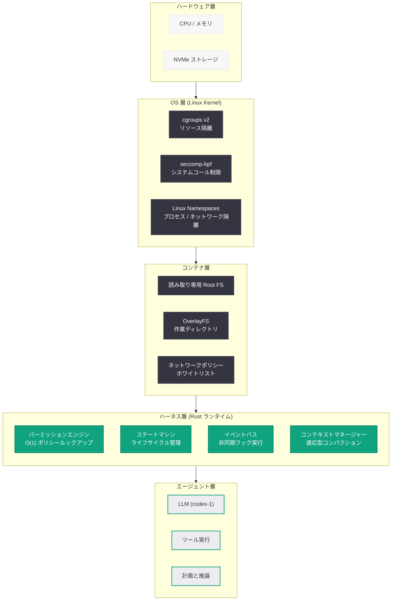

# Codex ハーネスのエンジニアリング: エージェント実行フレームワーク構築の裏側

## メタデータ

| 項目 | 内容 |
|------|------|
| 発表日 | 2026-05-30 |
| ソース | OpenAI Engineering Blog |
| カテゴリ | エンジニアリング / Codex |
| 公式リンク | [openai.com/index/harness-engineering](https://openai.com/index/harness-engineering/) |

> **注:** 本レポートは OpenAI エンジニアリングブログのサイトマップ情報、URL スラッグ、および先行記事「Unlocking the Codex Harness」(2026-05-26) の文脈に基づいて作成しています。記事本文へのアクセスは HTTP 403 により制限されたため、公開情報と技術的推察に基づいて内容を構成しています。正確な詳細については公式記事を参照してください。

## 概要

OpenAI は 2026 年 5 月 30 日、エンジニアリングブログにて「Harness Engineering」と題した技術記事を公開した。本記事は、4 日前に公開された「Unlocking the Codex Harness」の続編として位置付けられる。前回の記事がハーネスの機能と拡張方法を解説したのに対し、本記事はハーネスそのものを「どう作ったか」というエンジニアリング上の意思決定、実装上の課題、アーキテクチャパターンに焦点を当てている。

Codex ハーネスは、サンドボックス隔離、パーミッション境界強制、ライフサイクルフック、コンテキスト管理、拡張機能統合を単一のフレームワーク内で実現する複雑なシステムである。このフレームワークをセキュアかつ高パフォーマンスに構築するために、OpenAI のエンジニアリングチームが採用した設計原則と技術的選択が本記事の主題と考えられる。

## 主な内容

### エンジニアリング課題: セキュリティとパフォーマンスの両立

ハーネスの最大のエンジニアリング課題は、堅牢なセキュリティ保証を維持しながら、エージェント実行のオーバーヘッドを最小化することである。全てのツール呼び出しがパーミッションチェックを通過し、全てのファイルアクセスがサンドボックス境界内で検証される仕組みでは、素朴な実装ではレイテンシが大幅に増加する。

本記事では、以下のようなエンジニアリング上の工夫が解説されていると推察される。

- **ゼロコピーパーミッションチェック:** パーミッション判定を事前コンパイルされたポリシーテーブルによるルックアップで実現し、ランタイムオーバーヘッドを数マイクロ秒に抑制
- **遅延評価によるサンドボックス初期化:** コンテナの完全初期化を待たずに、最低限の分離境界で即座にエージェントを起動し、残りのセットアップをバックグラウンドで完了
- **イベントバスの非同期設計:** ライフサイクルフックの実行がエージェントのクリティカルパスをブロックしないアーキテクチャ

### 多層防御アーキテクチャの実装

ハーネスのセキュリティモデルは、単一の防御層の突破がシステム全体の侵害に繋がらない多層構造を採用している。

**レイヤー 1 - ハードウェア / OS レベル:**
- cgroups v2 によるリソース隔離
- seccomp-bpf によるシステムコールフィルタリング
- Linux capabilities の最小権限原則に基づく付与

**レイヤー 2 - コンテナレベル:**
- 読み取り専用ルートファイルシステム
- OverlayFS による作業ディレクトリの分離
- ネットワーク名前空間によるトラフィック制御

**レイヤー 3 - ハーネスレベル:**
- デフォルト拒否パーミッションエンジン
- ツール呼び出しのインターセプトとバリデーション
- コンテキスト注入の検証 (プロンプトインジェクション対策)

**レイヤー 4 - エージェントレベル:**
- モデル出力のサニタイズ
- 自己制約による安全行動の学習
- 確認プロンプトによるユーザー承認フロー

### ライフサイクル管理の設計パターン

ハーネスのライフサイクル管理は、有限状態マシン (FSM) パターンを基盤としている。エージェントの状態遷移を明示的にモデル化することで、予期しない状態遷移を検出し、異常時のリカバリを確実に行う。

主要な状態遷移:

- `Initializing` → `Ready` → `Running` → `WaitingForApproval` → `Running` → `Idle` → `Compacting` → `Ready`
- 異常系: `Running` → `Error` → `Recovery` → `Ready` (自動回復)
- 終了系: `*` → `ShuttingDown` → `Terminated`

### テスト戦略

エージェント実行環境のテストには、従来のユニットテストだけでは不十分な固有の課題がある。本記事では以下のテスト戦略が紹介されていると推察される。

- **Chaos Engineering:** サンドボックス内で意図的にリソース不足やネットワーク障害を発生させ、ハーネスの耐障害性を検証
- **Fuzzing ベースのパーミッションテスト:** ランダムなツール呼び出しパターンを生成し、パーミッションバイパスの有無を網羅的に検証
- **リプレイテスト:** 実際のエージェントセッションを記録し、ハーネスの変更後に同一入力を再生して回帰を検出
- **Property-Based Testing:** パーミッション判定の不変条件 (一度拒否されたアクションは状態変化なしに許可されない等) を形式的に検証

### パフォーマンス最適化

ハーネスレイヤーが追加するオーバーヘッドを最小化するための最適化手法:

- **ホットパスの特定と最適化:** ツール呼び出しのパーミッションチェックが最頻パスであり、事前コンパイルされたルールセットによる O(1) ルックアップを実現
- **メモリプール管理:** エージェントのコンテキスト管理でのアロケーション頻度を削減するためのプール方式を採用
- **バッチ処理によるフック実行:** 複数の軽量フックを単一のプロセス起動でバッチ実行し、fork/exec オーバーヘッドを削減
- **適応型コンパクション:** コンテキストウィンドウの圧力に応じてコンパクションの粒度を動的に調整

### アーキテクチャの進化

ハーネスのアーキテクチャは、Codex の初期バージョンから大きく進化してきたと考えられる。

- **Phase 1 (初期):** モノリシックなエージェントランナー。セキュリティとライフサイクル管理が密結合
- **Phase 2 (分離):** セキュリティ層、ライフサイクル層、拡張層の分離。各層の独立したテストとデプロイが可能に
- **Phase 3 (現在):** プラガブルアーキテクチャ。各層がインターフェースベースで交換可能。プロファイルによる動的構成

## 技術的な詳細

### ハーネス内部 API の概念モデル

以下は、ハーネスの内部エンジニアリングで使用されるコア API の概念的な構造である。

```rust
// ハーネスのコアランタイム - 概念的な内部 API
// (実際の実装は Rust ベース: codex-rs)

/// ハーネスのライフサイクルステートマシン
#[derive(Debug, Clone, PartialEq)]
enum AgentState {
    Initializing,
    Ready,
    Running,
    WaitingForApproval { tool_call: ToolCallRequest },
    Idle { since: Instant },
    Compacting,
    Error { reason: String, recoverable: bool },
    Recovery,
    ShuttingDown,
    Terminated,
}

/// パーミッションエンジンのコアインターフェース
trait PermissionEngine {
    /// ツール呼び出しの認可判定 (ゼロコピー、O(1) ルックアップ)
    fn authorize(&self, request: &ToolCallRequest) -> PermissionDecision;

    /// ポリシーの動的リロード (プロファイル切り替え時)
    fn reload_policy(&mut self, profile: &Profile) -> Result<(), PolicyError>;

    /// 監査ログエントリの生成
    fn audit_log(&self, request: &ToolCallRequest, decision: &PermissionDecision);
}

/// サンドボックスマネージャー
trait SandboxManager {
    /// 遅延初期化によるサンドボックス作成
    async fn create_sandbox(&self, config: &SandboxConfig) -> Result<Sandbox, SandboxError>;

    /// リソース使用量の監視
    fn resource_usage(&self, sandbox: &Sandbox) -> ResourceMetrics;

    /// 異常検知とリソース制限の強制
    fn enforce_limits(&self, sandbox: &Sandbox) -> Result<(), ResourceExceeded>;
}

/// ライフサイクルイベントバス (非同期、ノンブロッキング)
trait EventBus {
    /// イベントの発行 (クリティカルパスをブロックしない)
    fn emit(&self, event: LifecycleEvent) -> EventHandle;

    /// フックの登録
    fn register_hook(&mut self, trigger: EventTrigger, hook: HookConfig);

    /// バッチ実行の最適化
    fn flush_batch(&self, events: Vec<LifecycleEvent>) -> BatchResult;
}
```

### パフォーマンスベンチマーク構成

```yaml
# harness-bench.yaml - ハーネスオーバーヘッド計測構成
benchmark:
  scenarios:
    # パーミッションチェックのレイテンシ計測
    permission_check:
      iterations: 100000
      warmup: 1000
      policy_rules: 500  # 典型的なエンタープライズ構成
      target_p99_latency_us: 10  # 10 マイクロ秒以下

    # サンドボックス起動時間の計測
    sandbox_startup:
      iterations: 100
      mode: lazy_init  # 遅延初期化モード
      target_cold_start_ms: 200  # コールドスタート 200ms 以下
      target_warm_start_ms: 50   # ウォームスタート 50ms 以下

    # フック実行のオーバーヘッド計測
    hook_execution:
      iterations: 10000
      hook_count: 5
      batch_mode: true
      target_batch_overhead_ms: 15  # バッチ実行 15ms 以下

    # コンテキストコンパクションのスループット
    context_compaction:
      iterations: 500
      context_size_tokens: 128000
      target_compaction_ratio: 0.3  # 70% 圧縮
      target_latency_ms: 500

  hardware:
    cpu: "AMD EPYC 7R13"
    memory: "32Gi"
    storage: "NVMe SSD"

  reporting:
    format: json
    output: "./bench-results/"
    compare_baseline: true
```

### コードサンプル: 内部テストハーネス

```python
# harness_integration_test.py - ハーネスの統合テスト (概念例)
import asyncio
from dataclasses import dataclass
from typing import List

@dataclass
class HarnessTestCase:
    """ハーネス統合テストのケース定義"""
    name: str
    agent_state_sequence: List[str]
    tool_calls: List[dict]
    expected_permissions: List[str]  # "allow" or "deny"
    inject_faults: List[dict] = None

class HarnessIntegrationTest:
    """ハーネスの Property-Based Testing フレームワーク"""

    async def test_permission_invariant(self):
        """不変条件: 一度拒否されたアクションは状態変化なしに許可されない"""
        harness = await self.create_test_harness(profile="strict")

        denied_action = {"tool": "bash", "command": "rm -rf /"}
        result1 = harness.permission_engine.authorize(denied_action)
        assert result1.decision == "deny"

        # 同一状態で再度リクエスト - 必ず拒否されること
        result2 = harness.permission_engine.authorize(denied_action)
        assert result2.decision == "deny"

    async def test_sandbox_isolation(self):
        """コンテナ間のプロセス隔離を検証"""
        sandbox_a = await self.sandbox_mgr.create_sandbox(config_a)
        sandbox_b = await self.sandbox_mgr.create_sandbox(config_b)

        # sandbox_a 内のプロセスが sandbox_b を認識できないこと
        ps_output = await sandbox_a.exec("ps aux")
        assert sandbox_b.pid not in ps_output

    async def test_lifecycle_state_machine(self):
        """FSM の状態遷移が仕様通りであることを検証"""
        harness = await self.create_test_harness()

        # 正常フロー
        assert harness.state == "Initializing"
        await harness.initialize()
        assert harness.state == "Ready"
        await harness.start_turn()
        assert harness.state == "Running"
        await harness.complete_turn()
        assert harness.state == "Idle"

        # 不正な遷移は例外を発生させる
        with pytest.raises(InvalidStateTransition):
            await harness.complete_turn()  # Idle -> complete は不正

    async def test_hook_nonblocking(self):
        """フック実行がクリティカルパスをブロックしないことを検証"""
        slow_hook = HookConfig(
            trigger="on-tool-call",
            command="sleep 5",  # 意図的に遅いフック
            timeout=10
        )
        harness = await self.create_test_harness(hooks=[slow_hook])

        start = asyncio.get_event_loop().time()
        await harness.execute_tool_call({"tool": "read", "path": "/file.txt"})
        elapsed = asyncio.get_event_loop().time() - start

        # フックが 5 秒かかっても、ツール実行自体は即座に完了
        assert elapsed < 0.1  # 100ms 以内
```

## アーキテクチャ

以下の図は、ハーネスのエンジニアリングレイヤーを示している。ハードウェアから OS、コンテナ、ハーネス、エージェントまでの階層構造と、各層が提供するセキュリティ保証を表現している。



## 開発者への影響

### ハーネスの内部設計理解がもたらすメリット

- ハーネスの多層アーキテクチャを理解することで、パフォーマンス問題のトラブルシューティングが容易になる
- パーミッションエンジンの O(1) ルックアップ設計を知ることで、大量のルール定義がパフォーマンスに悪影響を与えないことを確信できる
- ライフサイクル FSM を理解することで、フックの適切なトリガーポイントを選択可能

### カスタムハーネス拡張の開発指針

- イベントバスの非同期設計を理解することで、重いフック処理がエージェント実行をブロックしない理由を把握でき、安心して複雑なフックを追加可能
- サンドボックスの遅延初期化パターンを知ることで、起動時間の最適化に貢献するカスタム設定を作成可能
- バッチ実行の仕組みを利用して、複数の軽量フックを効率的にグルーピング可能

### エンタープライズ環境への導入判断

- 多層防御アーキテクチャの詳細を知ることで、セキュリティ監査やコンプライアンスレビューにおいて、Codex の安全性を技術的に説明可能
- リソース隔離の実装詳細により、マルチテナント環境での利用可否を判断可能
- テスト戦略 (Chaos Engineering、Fuzzing、Property-Based Testing) の開示により、フレームワークの品質保証レベルを評価可能

### パフォーマンスチューニングへの応用

- ベンチマーク指標 (パーミッションチェック p99 < 10us、コールドスタート < 200ms) を基準に自社環境でのパフォーマンスを評価可能
- 適応型コンパクションの仕組みを理解し、コンテキスト管理のチューニングに活用可能

## 関連リンク

- [Harness Engineering (公式記事)](https://openai.com/index/harness-engineering/)
- [Unlocking the Codex Harness](https://openai.com/index/unlocking-the-codex-harness/) - ハーネスの機能と拡張方法 (前編)
- [Unrolling the Codex Agent Loop](https://openai.com/index/unrolling-the-codex-agent-loop/) - エージェントループの内部構造
- [Running Codex Safely](https://openai.com/index/running-codex-safely) - Codex の安全な運用
- [Codex Hooks ドキュメント](https://platform.openai.com/docs/codex/hooks) - ライフサイクルフックの公式リファレンス
- [codex-rs (GitHub)](https://github.com/openai/codex) - Codex CLI の Rust 実装
- [OpenAI API リファレンス](https://platform.openai.com/docs/api-reference)

## まとめ

「Harness Engineering」は、「Unlocking the Codex Harness」の続編として、Codex ハーネスを「どのように構築したか」にフォーカスしたエンジニアリング記事である。前回の記事がハーネスのユーザー向け機能 (フック、MCP、プロファイル) を解説したのに対し、本記事はその裏側にある設計判断と実装技術を開示している。

核となるエンジニアリング原則は以下の 4 つと考えられる。

1. **セキュリティとパフォーマンスの両立:** ゼロコピーパーミッションチェック、遅延初期化サンドボックス、非同期イベントバスにより、堅牢なセキュリティを維持しつつオーバーヘッドを最小化
2. **多層防御の実装:** ハードウェア、OS、コンテナ、ハーネス、エージェントの各層が独立したセキュリティ保証を提供し、単一層の突破がシステム全体の侵害に繋がらない設計
3. **明示的な状態管理:** 有限状態マシンによるエージェントライフサイクルのモデル化により、予期しない状態遷移を検出し、安全なリカバリを保証
4. **包括的なテスト戦略:** Chaos Engineering、Fuzzing、Property-Based Testing、リプレイテストの組み合わせにより、従来のユニットテストでは検出困難なエージェント実行環境固有の問題を捕捉

本記事は、Codex を採用するエンタープライズ顧客に対してフレームワークの品質と安全性を技術的に示すとともに、カスタム拡張を開発する開発者に内部設計の理解を提供する重要な技術開示である。
