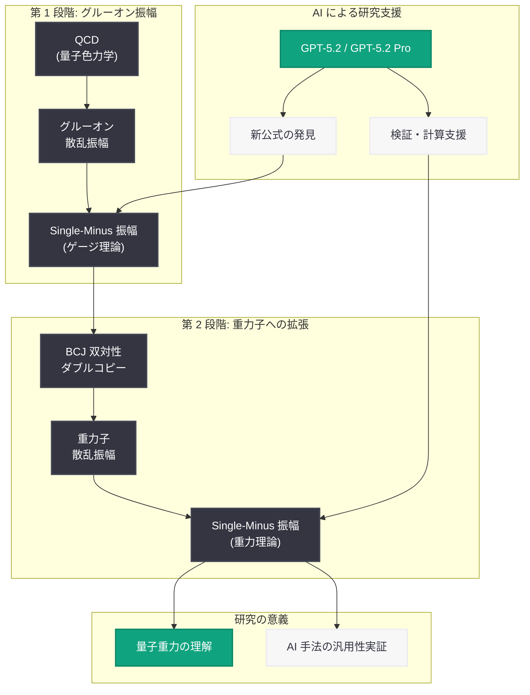

# Single-Minus 振幅の重力子への拡張 -- AI による量子重力散乱振幅研究の正式公開

## メタデータ

| 項目 | 内容 |
|------|------|
| 発表日 | 2026-06-01 |
| ソース | OpenAI Research |
| カテゴリ | 研究成果 / 理論物理学 |
| 公式リンク | [Extending Single-Minus Amplitudes to Gravitons](https://openai.com/index/extending-single-minus-amplitudes-to-gravitons/) |

> **注:** 本レポートは OpenAI サイトマップ情報 (公開日: 2026-06-01T19:22:07.875Z、カテゴリ: Research/Publication)、URL スラッグ、および関連する先行研究 (GPT-5.2 によるグルーオン振幅の新公式導出) の文脈に基づいて作成しています。記事本文へのアクセスは Cloudflare の保護により制限されたため、研究の正確な詳細については公式リンクを参照してください。

## 概要

OpenAI は 2026 年 6 月 1 日、single-minus 振幅 (単一マイナスヘリシティ振幅) を重力子 (graviton) に拡張する研究成果を正式に公開した。本研究は、量子場理論において外部粒子のうちちょうど 1 つが負のヘリシティを持つ散乱振幅を、ゲージ理論 (グルーオン) から重力理論 (重力子) へ拡張するものであり、量子重力の理解に向けた重要な一歩である。

本成果は、2026 年 5 月に発表された GPT-5.2 によるグルーオン散乱振幅の新公式導出の延長線上にあり、AI が理論物理学における「発見者」として機能できることを示した一連の研究の最新成果である。ゲージ理論の結果を重力理論に拡張することは、BCJ 双対性 (ダブルコピー関係式) を通じた量子重力の理解に不可欠であり、AI を活用したアプローチの汎用性が検証されたことになる。

## 主な内容

### Single-Minus 振幅の物理的意義

Single-minus 振幅は、散乱振幅の分類において特異な位置を占める。ツリーレベル (最低次の近似) ではゼロになるが、ループレベル (量子補正を含む計算) では非ゼロの値を持つ最初のクラスの振幅である。この性質により、量子効果の構造を直接的に探ることができる重要なプローブとなる。

- **ツリーレベルでの消滅:** ゲージ理論における single-minus 振幅は超対称性のワード恒等式により禁止される
- **ループレベルでの出現:** 1 ループ以上の量子補正において非ゼロとなり、理論の量子構造を反映する
- **重力理論での特殊性:** 重力理論では状況がより複雑であり、本研究がその構造の解明に貢献する

### グルーオンから重力子への拡張

本研究の核心は、ゲージ理論 (強い力を媒介するグルーオン) における single-minus 振幅の知見を、重力理論 (重力を媒介する重力子) に拡張したことにある。この拡張は以下の理由から物理学的に極めて重要である。

- **重力振幅の計算困難性:** 重力子の散乱振幅は、ゲージ理論の振幅と比較して桁違いに複雑であり、従来の手法では計算が困難であった
- **ダブルコピー構造の活用:** BCJ 双対性 (Bern-Carrasco-Johansson duality) により、ゲージ理論の振幅を「二重にコピー」することで重力振幅を構成できる可能性がある
- **量子重力への展望:** 重力子振幅の解析的理解は、量子重力理論の構築に向けた基礎的な知見を提供する

### AI 研究手法の汎用性の実証

2026 年 5 月のグルーオン振幅研究で確立された AI を活用した手法が、重力子振幅にも適用可能であることが示された。これは、AI による理論物理学研究のアプローチが特定の問題に限定されない汎用的なものであることを意味する。

## 技術的な詳細

### BCJ 双対性とダブルコピー関係式

BCJ 双対性は、ゲージ理論の散乱振幅と重力理論の散乱振幅を結ぶ深い数学的関係である。

- **カラー-キネマティクス双対性:** ゲージ理論の振幅における色因子 (color factor) と運動学的因子 (kinematic numerator) が同じ代数的関係を満たす
- **ダブルコピー構成:** ゲージ理論の振幅で色因子を運動学的因子に置き換えることで、重力理論の振幅を得ることができる
- **KLT 関係式:** Kawai-Lewellen-Tye 関係式として知られる弦理論由来の関係が、場の理論レベルでの対応を与える

### スピノールヘリシティ形式

質量ゼロ粒子の散乱振幅を記述する基本的な枠組みであり、本研究の計算で中心的な役割を果たす。

- **角度ブラケットとスクエアブラケット:** 粒子の運動量を 2 成分スピノールで表現し、ローレンツ不変な内積を定義
- **ヘリシティ分類:** 外部粒子のヘリシティ配置により振幅を分類 (MHV、NMHV、single-minus など)
- **簡潔な表現:** Parke-Taylor 公式に代表されるように、複雑な振幅が驚くほど簡潔に表現される場合がある

### 研究の時系列的進展

| 時期 | 研究内容 | AI の役割 |
|------|---------|----------|
| 2026 年 3 月 | 重力子振幅研究 (初期発表) | GPT-5.2 Pro が計算支援・検証を担当 |
| 2026 年 5 月 | グルーオン振幅の新公式導出 | GPT-5.2 が独自に新公式を提案 |
| 2026 年 6 月 | 重力子への拡張 (正式公開) | AI 手法の汎用性を実証 |

## アーキテクチャ

## 開発者への影響

- **AI による基礎科学研究の加速:** 理論物理学の最前線において AI が繰り返し成果を出していることで、科学研究向け AI ツールの開発・投資が加速する見込みである
- **数学的推論能力の進化:** グルーオンから重力子への拡張が示すように、AI モデルの数学的推論能力は特定の問題を超えた汎用性を獲得しつつある
- **分野間の橋渡し:** BCJ 双対性のような異なる物理理論を結ぶ関係式の発見・活用において、AI が人間の直観を補完する新たなパラダイムが形成されている
- **検証ワークフローの標準化:** AI が提案し人間が検証するという協働パターンが確立されつつあり、このワークフローを支援するツール開発の需要が見込まれる
- **OpenAI API の科学応用:** 高度な推論タスクにおける OpenAI モデルの能力が実証されたことで、研究支援アプリケーションの新たなユースケースが開拓される

## 関連リンク

- [Extending Single-Minus Amplitudes to Gravitons](https://openai.com/index/extending-single-minus-amplitudes-to-gravitons/) - 公式発表
- [GPT-5.2 がグルーオン振幅の新公式を導出 (2026-05-24)](./2026-05-24-gpt-5-2-theoretical-physics-result.md) - 関連する先行研究レポート
- [Single-Minus 振幅の重力子への拡張 -- 初期発表 (2026-03-04)](./2026-03-04-graviton-amplitudes-research.md) - 初期発表時のレポート
- [OpenAI Research](https://openai.com/research) - OpenAI 研究ページ

## まとめ

本研究は、OpenAI が 2026 年を通じて推進してきた AI による理論物理学研究の一連の成果における重要なマイルストーンである。Single-minus 振幅をグルーオン (強い力) から重力子 (重力) に拡張するという本成果は、以下の 3 つの観点から意義深い。第一に、重力振幅はゲージ理論振幅よりも遥かに計算が困難であり、この拡張自体が理論物理学の重要な進展である。第二に、BCJ 双対性 (ダブルコピー関係式) を通じてゲージ理論と重力理論を結ぶ数学的構造の理解が深まり、量子重力への知見が得られる。第三に、AI を活用した研究手法が特定の問題に限定されない汎用性を持つことが実証され、AI が理論物理学の「発見者」として機能するパラダイムの確立に貢献している。
