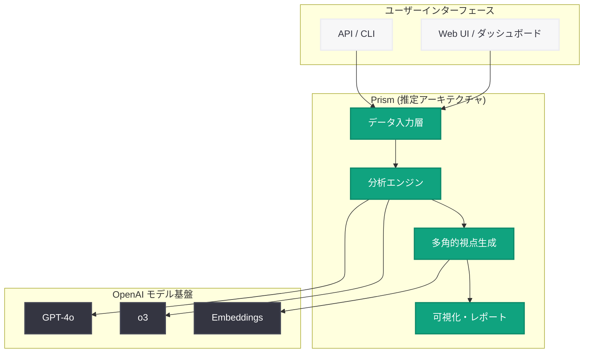

# Introducing Prism: OpenAI の新プロダクト発表

## メタデータ

| 項目 | 内容 |
|------|------|
| 発表日 | 2026-06-01 |
| ソース | OpenAI News (Product) |
| カテゴリ | 新機能 / プロダクト |
| 公式リンク | [openai.com/index/introducing-prism](https://openai.com/index/introducing-prism/) |

> **注:** 本レポートは OpenAI ブログのサイトマップ情報 (公開日: 2026-06-01T20:42:52.762Z、カテゴリ: Product)、URL スラッグに基づいて作成しています。記事本文へのアクセスは Cloudflare の保護により制限されたため、製品の正確な詳細については公式リンクを参照してください。

## 概要

OpenAI は 2026 年 6 月 1 日、「Introducing Prism」と題した新プロダクトを公式ブログにて発表した。「Prism」(プリズム) という名称は、光を複数のスペクトルに分解する光学素子に由来すると考えられ、複雑な情報やデータを複数の視点・形式に分解・変換する機能を示唆している。

本プロダクトは OpenAI のサイトマップにおいて「Product」カテゴリに分類されており、研究論文やエンジニアリングブログではなく、ユーザー向けの製品機能として位置付けられている。同時期に発表された AWS Bedrock 対応や Codex の強化と並ぶ、2026 年 6 月の主要プロダクトリリースの一つである。

## 主な内容

### プロダクト名「Prism」の示唆する機能

「Prism」という名称から推察される製品コンセプトは以下の通りである。

- **多角的なデータ分析・可視化:** プリズムが光を分解するように、データや情報を複数の切り口で分解・分析するツール
- **モデル評価・比較プラットフォーム:** 複数のモデルやアプローチの出力を並列に比較・評価する機能
- **統合ダッシュボード:** API 利用状況、モデルパフォーマンス、コスト分析を多面的に可視化するプラットフォーム

### 2026 年 6 月の OpenAI プロダクト戦略における位置付け

Prism の発表は、OpenAI が 2026 年 5 月 - 6 月にかけて進めているプロダクト拡充の一環と考えられる。

- **Codex エージェント基盤の強化:** Codex ハーネス、エージェントループの公開 (5 月下旬)
- **エンタープライズ展開の加速:** AWS Bedrock 対応による既存クラウド環境との統合
- **開発者体験の向上:** Responses API の改善、SDK アップデート
- **新プロダクトの投入:** Prism (本発表)

### 想定されるユースケース

公開情報が限定的であるため、以下は OpenAI の最近のプロダクト方向性から推察されるユースケースである。

**仮説 1: モデル評価・観測プラットフォーム**
- プロンプトのバリエーション評価
- モデル出力の品質スコアリング
- A/B テスト結果の分析

**仮説 2: データ分析・インサイトツール**
- 構造化データの多角的分析
- 自然言語によるデータクエリ
- インタラクティブな可視化

**仮説 3: マルチモーダル変換プラットフォーム**
- 入力データの複数形式への変換
- テキスト、画像、コードなど異なるモダリティ間の変換
- ワークフローの自動構成

## 技術的な詳細

記事本文へのアクセスが制限されているため、技術的な詳細は現時点で不明である。OpenAI の最近の技術スタックから推察される技術基盤は以下の通りである。

### 推定される技術基盤

- **API 基盤:** Responses API または専用エンドポイント
- **モデル:** GPT-4o、o3、codex-1 など最新モデルとの連携
- **インフラ:** Azure ベースのスケーラブルなバックエンド
- **フロントエンド:** ChatGPT プラットフォーム内または独立した Web UI

### API 連携の可能性

```python
from openai import OpenAI

client = OpenAI()

# Prism API の利用例 (推定)
# 正確な API 仕様は公式ドキュメント公開後に確認が必要
response = client.prism.analyze(
    input="分析対象のデータまたはプロンプト",
    perspectives=["accuracy", "creativity", "safety"],
    model="gpt-4o"
)
```

> **注意:** 上記のコードサンプルは推定に基づく概念例であり、実際の API 仕様とは異なる可能性がある。正確な実装方法については公式ドキュメントの公開を待つこと。

## アーキテクチャ



> **注意:** 上記のアーキテクチャ図は URL スラッグおよびプロダクトカテゴリから推定した概念図である。実際のアーキテクチャとは異なる可能性がある。

## 開発者への影響

### 確認すべき事項

記事本文が確認できないため、開発者は以下の点について公式発表を確認することを推奨する。

- **新しい API エンドポイント:** Prism 専用の API が追加される場合、既存の SDK アップデートが必要になる可能性
- **料金体系:** 新プロダクトの価格設定と既存プランへの影響
- **利用可能なリージョンとティア:** エンタープライズ向けか、全ユーザー向けかの確認
- **既存ワークフローとの統合:** 現在利用中の API や機能との互換性

### 想定される影響

- 新しい開発パラダイムへの対応が必要になる可能性
- 既存のモデル評価・分析ワークフローを Prism に統合することで効率化が期待される
- SDK のアップデートにより新機能へのアクセスが可能になると見込まれる

## 関連リンク

- [Introducing Prism (公式記事)](https://openai.com/index/introducing-prism/)
- [OpenAI News](https://openai.com/news)
- [OpenAI Platform ドキュメント](https://platform.openai.com/docs)
- [OpenAI API リファレンス](https://platform.openai.com/docs/api-reference)
- [OpenAI on AWS Bedrock](https://openai.com/index/openai-on-aws-bedrock/) - 同時期の関連発表

## まとめ

OpenAI は 2026 年 6 月 1 日に「Prism」と名付けられた新プロダクトを発表した。サイトマップ上の Product カテゴリへの分類から、ユーザーが直接利用可能な製品機能であることが示唆されている。

本レポートで確認できた事実は以下の通りである。

1. **発表日時:** 2026-06-01T20:42:52.762Z (サイトマップ lastmod)
2. **カテゴリ:** Product (製品カテゴリ)
3. **URL スラッグ:** `introducing-prism` (新規プロダクト発表を示す "introducing" プレフィックス)

「Prism」という名称と "introducing" の接頭辞は、既存機能の改善ではなく完全に新しいプロダクトまたはプラットフォーム機能の導入を示唆している。OpenAI の 2026 年上半期のプロダクト戦略 (エージェント基盤の強化、エンタープライズ展開、開発者体験の向上) における位置付けを踏まえると、開発者とエンタープライズユーザーの両方に影響を与える重要な発表である可能性が高い。

詳細な機能説明、技術仕様、料金体系については、Cloudflare の保護が解除された後に公式記事を直接確認することを強く推奨する。
